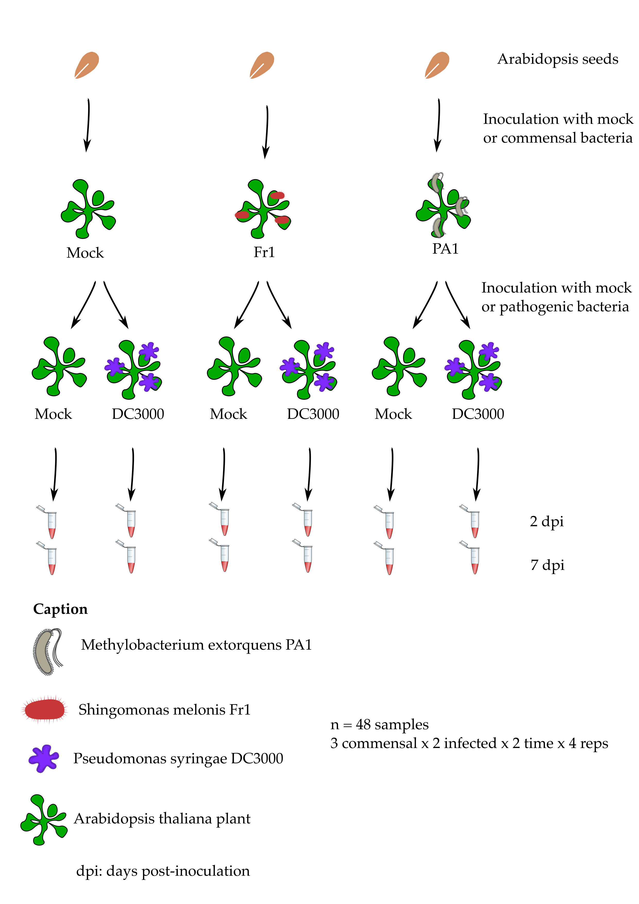

# Table of contents

<!-- MarkdownTOC autolink="True" -->

- [What you will learn in this lesson](#what-you-will-learn-in-this-lesson)
- [Dataset used](#dataset-used)
- [Credits](#credits)
    - [Dataset](#dataset)
    - [Teaching materials](#teaching-materials)

<!-- /MarkdownTOC -->

# What you will learn in this lesson

1. **What are the important things to know before doing an RNA-Seq experiment** 
    - When should you perform a RNA-Seq experiment?  
    - RNA-Seq experiments have to comply with good experimental design practices just like any experiment.
    - What are biological replicates and why are they important?
2. **How to assess the quality of my RNA-Seq experiment at the sample-level**
    - Using `FastQC` to perform quality checks on each sample `fastq` sequencing file.
    - What are some count normalization methods? Why are RPKM, FPKM and TPM _not_ adequate methods.
    - Calculating `DESeq2` size factors with R to compare potential bias between samples sequencing depth, etc. Understand why we need to normalise counts for sample-level QC.  
    - Plot a scree plot from a PCA analysis to verify that the first principal components explain most of the total observed variation.
    - Creating a PCA plot to visualise the grouping of samples in relation to the experimental factors being investigated.
3. **How to perform a differential expression analysis on RNA-Seq results using R**
    - Raw counts are used for differential expression _not_ scaled counts. 
    - Creating a `DESeq2` object requires 3 items: the raw gene counts, the sample to condition correspondence and a formula for testing.   
    - How does the DESeq method works? What are the outputs obtained using `DESeq2`? 
4. **What are the typical outputs that one can obtain from  a differential gene expression analysis?**
    - A table of genes being differentially regulated between two conditions. 
    - A volcano plot shows the relationship between $$log_{2}$$ fold change and the adjusted p-value for each gene.
5. **How to go beyond a list of differential genes and interpret its biological meaning**
    - By performing an over-representation analysis (ORA), one can find pathways or categories where differential genes are significantly more abundant. 
    - By performing a gene set enrichment analysis (GSEA), one first ranks differentially expressed genes before comparing enrichment scores for whole pathways. 
6. **How to perform transcriptomic and metabolomic data integration**
    - Perform gene identifier conversion to retrieve common metabolic identifiers such as Uniprot IDs or KEGG IDs.
    - Overlay genes on a metabolic map with iPath 3. 
    - Search for enriched metabolic KEGG pathways and modules.   

# Dataset used 

We will make use of a published experimental dataset from a study made on the small model plant _Arabidopsis thaliana_ by [Vogel et al. (2016)](https://doi.org/10.1111/nph.14036). This study compares the response of 4 weeks old plantlets to different bacteria that live on the leaves of different plant species:
- A known foliar pathogen called _Pseudomonas syringae_ strain DC3000. 
- A commensal ("neutral") bacteria called _Methylobacterium extorquens_ strain PA1.
- A commensal ("neutral") bacteria called _Sphingomonas melonis_ strain Fr1. 

The original sequencing files can be found on the [Array Express database of the European Bioinformatic Institute](https://www.ebi.ac.uk/arrayexpress) by searching for the dataset accession number __E‐MTAB‐4683__.

# Credits

## Dataset
The original RNA-Seq dataset used comes from Vogel et al. 2016:  https://doi.org/10.1111/nph.14036.  

## Teaching materials
This lesson has been formatted according to the [Carpentries Foundation](https://carpentries.org/) lesson template and following their recommendations on how to teach researchers good practices in programming and data analysis.   

This material builds from a lot of fantastic materials developed by others in the open data science community. Most of the content derives from the [Harvard Chan Bioinformatics Core](https://github.com/hbctraining) which are greatly acknowledge for the quality of their teaching materials.


