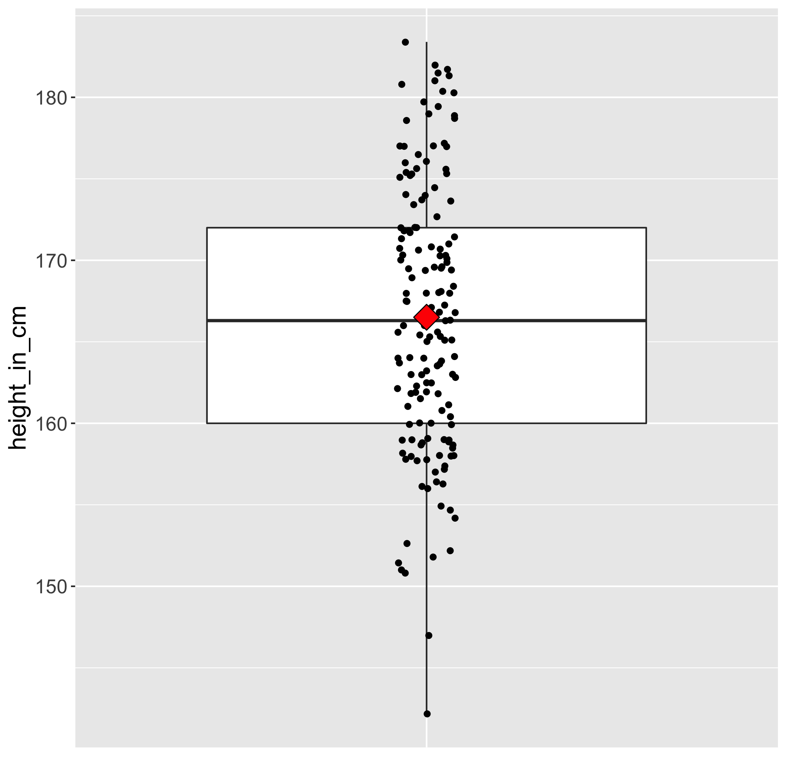
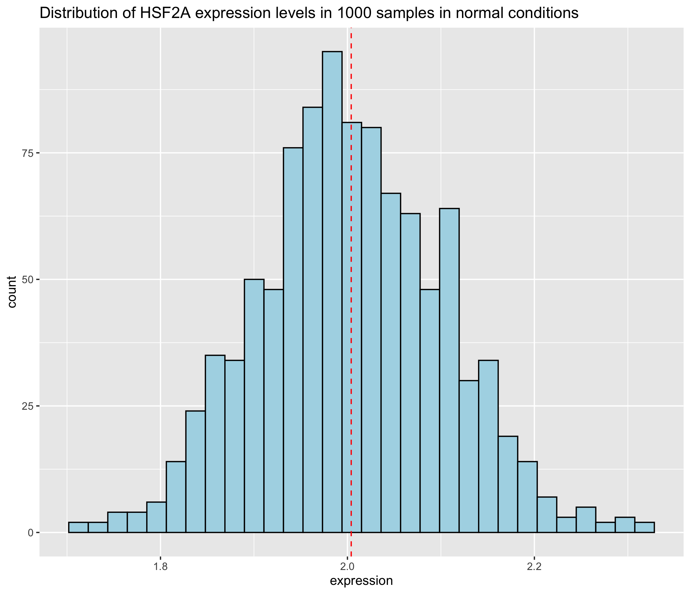
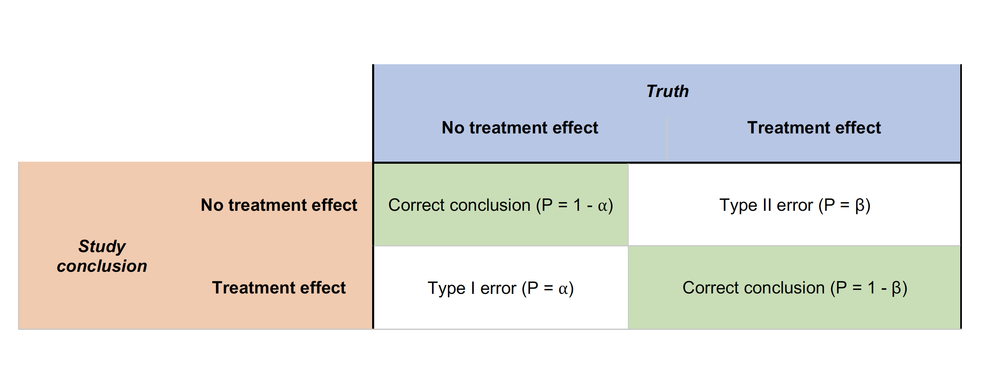

# Table of Contents
- [Introduction](#introduction)
- [Replicates](#replicates)
- [Confounding](#confounding)
- [Batch effects](#batch-effects)
  - [How to know whether you have batches?](#how-to-know-whether-you-have-batches)
  - [Best practices regarding batches:](#best-practices-regarding-batches)

# Introduction
While most scientists would rapidly dive into RNA-seq sample preparation and searching for a sequencing provider, it is crucial to spend enough time to refresh one's statistical knowledge and embrace good experimental design practices. After all, a typical RNA-seq experiment is also an experiment like any other. We will nethertheless see some specificities of RNA-seq experiments at the end of this episode.

Statistics are often overlooked (at best) or avoided (very often) by wet-lab biologists since it is often thought of being both complex and boring. Yet, this episode will hopefully prove that is can be simply explained and that a few pragmatic considerations will usually save a considerable amount of time and money.  

# 1. Statistical refresher
First, let's have a quick look at important notions useful to understand the rest of this episode. 
These concepts will be important to understand experimental design applied to RNA-seq. 

### 1.1 Population and sample 

The first question you need to ask yourself is "what is the population that I am considering in my experiment from which I will gather measurements?". If you are working on wild-type tomato plants from the cultivar Moneymaker for instance, then your population of interest would be _all_ plants from the Moneymaker cultivar on which you measure a particular phenotype. 

If you are working on the height of the population from the Netherlands, then your population would be "all people in the Netherlands". A sample is a subset of that population that must be _representative_ of that population. It therefore has to be selected randomly from the whole population. 

Related to this, one has to be able to make the distinction between __descriptive statistics__ and __inferential statistics__. 

> ## Discussion
> Let's imagine that we study the height of people in the Netherlands. We take a representative sample of 1000 people. Could you give examples of descriptive statistics on that sample?
{: .discussion}

On the one hand, descriptive statistics would for instance calculate the average height based on the 1000 people sampled. But it would make no assumption on the general population in the Netherlands.   
On the other hand, inferential statistics would try to impute the Netherlands population height based on this representative 1000 people sample. 

## 1.2 Central tendency and spread

Here is a boxplot made from the world's population heights (one point is the average height in one country).

 

In particular, the __measures of central tendency and spread__ are of interest to us because they will also have important consequences for RNA-seq. __One example of a measure of central tendency is the mean__ for instance. The mean is displayed on the boxplot as a red diamond.

> ## Exercise: central tendency
> Take another look at the boxplot above. Can you name a measure of the central tendency other than the mean?
>
> > ## Solution
> > The median is another measure of central tendency. The median is the value separating the higher half from the lower half of a data sample or a population (source Wikipedia).
> {: .solution}
{: .challenge}

If you look at the boxplot, you will see that points are dispersed along the boxplot suggesting that some countries might have an "extreme" height compared to the majority. This measure of heterogeneity in data distribution is called the __spread__ or [statistical dispersion](https://en.wikipedia.org/wiki/Statistical_dispersion) and can be estimated with measures such as the __standard deviation__. 

> ## Exercise: spread
> Can you name a measure of the spread other than the standard deviation?
>
> > ## Solution
> > The variance (square of the standard deviation) is another measure of the spread. 
> {: .solution}
{: .challenge}

### 1.3 Hypothesis test

These notions of central tendency and spread are vital to the rest of this episode. In your RNA-seq journey, you will work with thousands of genes. But before you do so, it is important to understand how statistical tests and the infamous p-values are computed  by working with one gene. 

Say you are studying a plant gene called ["heat stress transcription factor A-2" (HSFA2)](https://www.uniprot.org/uniprot/O80982) whose expression could be increased by heat stress...Well the gene name is definitely giving a clue! :blush: You therefore measure this gene transcript level in two conditions: normal and heat stressed.

Then, you make a hypothesis saying: 
> "The average HSFA2 gene expression _is the same_ in normal conditions than under heat stress in my Arabidopsis seedlings". 

This is called the __H0 hypothesis or the null hypothesis__. 

 

The alternative hypothesis would be:
> "The average HSFA2 gene expression _is different_ under heat stress compared to normal conditions in my Arabidopsis seedlings". 

This is called the __H1 hypothesis or alternative hypothesis__. 

Imagine you would be the best scientist ever and you would be capable of sampling 1000 Arabidopsis plantlets in normal conditions. 
:seedling: :seedling: :seedling: :seedling: :seedling: 
~~~
xp_normal_conditions <- tibble(
  expression = rnorm(             # randomly sample numbers from a normal distribution
    n = 1000,                     # number of drawings
    mean = 2,                     # mean of the normal distribution
    sd = 0.1),                    # standard deviation of the normal distribution
  condition = "normal"            # used later on for data frame row binding with heat stress
  )

head(xp_normal_conditions)
~~~
{: .language-r}

~~~
# A tibble: 6 x 2
  expression condition
       <dbl> <chr>    
1       1.98 normal   
2       2.04 normal   
3       1.99 normal   
4       2.03 normal   
5       2.03 normal   
6       2.03 normal  
~~~
{: .output}

If you plot the HSF2A gene expression distribution, you get a nice schoolbook guaussian curve.

Ok but you're not so fantastic, just a fantastic scientist. So you sample 5 Arabidopsis plantlets per condition :seedling:

### 1.3 Type I and type II errors 

Type I errors occur when the __H0 (null) hypothesis__ is rejected wrongly (e.g., the two treatment means are equal) in favor of an alternative hypothesis (e.g., that the two means are different). Type I errors are probably most familiar to researchers and much effort is expended to ensure that Type I errors are minimized. 

Type II errors also are common in hypothesis testing. These errors result from accepting the null hypothesis when in fact a treatment effect exists.  

 
 

| Type I error (false positive): "You're pregnant!" | Type II error (false negative): "Sorry you're not pregnant" |
|-----------------------------------|---------------|-------------------------------------------------------------|
|  |  |

These two types of errors are related to one another. 

## 1.4 Putting it all together
These parameters are crucial in your experimental design and will influence one another:
- **Type I error:** controlled by the $$\alpha$$ value. Often set to 0.01 (1%) or 0.001 (0.1%) in RNA-seq experiments. 
- **Type II error:** controlled by the $$\beta$$ value. 1 - $$\beta$$ will give Should be set to 70 or 80% but the number of biological replicates is hard to reach in practice.   
- **Effect size:** this is a parameter you will set. For instance, if you want to investigate genes that differ between treatments with a difference of their mean of 2 then the effect siwe  

 This probability is conditioned on an effect size, a threshold probability for Type I error (α level), and sample size

# 2. Best practices for experimental design

## 2.1 Sources of variability

In a typical biological experiment, you will encounter various sources of variation that you are either desirable (because they are part of your experimental factors) or undesirable (unwanted).

For instance, 

# 3. Challenges relevant to RNA-seq

## 3.1 Sequencing
barcodes
multiplexing
flow cell 
lanes

## 3.2 Low power

RNA-seq experiments often suffer from a low statistical power. 

A low statistical power reflects type II error: 
- You are missing "true effects" and there are many false negatives: genes that you should have been called differential but are not. - It also affects the _positive predictive value_ (PVV) of your findings which is the probability that a differential gene (p < 0.01) is a real true finding. 
Power is therefore linked to the ability to claim "true findings". 

A series of recent publications have emphasized that low power can lead to a lack of reproducibility of the research findings. For instance, in their publication entitled ["Power failure: why small sample size undermines the reliability of neuroscience"](https://www.nature.com/articles/nrn3475), Button and coauthors state that:
> Research that produces novel results, statistically significant results (that is, typically p < 0.05) and seemingly 'clean' results is more likely to be published. As a consequence, researchers have strong incentives to engage in research practices that make their findings publishable quickly, even if those practices reduce the likelihood that the findings reflect a true (that is, non-null) effect. Such practices include using **flexible study designs** and flexible statistical analyses and **running small studies with low statistical power**.
  

The number of replicates is one of the critical parameter related to the power of an analysis. But first, let's discuss what you understand by "replicates". 

> ## Discussion
> What sort of replicates can you name?
{: .discussion}

Two types of experimental replicates coexist: **technical replicates** or **biological replicates**. 

*Image credit: [Klaus B., EMBO J (2015) **34**: 2727-2730](https://dx.doi.org/10.15252%2Fembj.201592958)*

- **Technical replicates:** use the same biological sample to repeat the technical or experimental steps in order to accurately measure technical variation and remove it during analysis. 

- **Biological replicates** use different biological samples of the same condition to measure the biological variation between samples.

In the days of microarrays, technical replicates were considered a necessity; however, with the current RNA-Seq technologies, technical variation is much lower than biological variation and **technical replicates are unneccessary**.

In contrast, **biological replicates are absolutely essential** for differential expression analysis. For mice or rats, this might be easy to determine what constitutes a different biological sample, but it's a bit **more difficult to determine for cell lines**. [This article](http://paasp.net/accurate-design-of-in-vitro-experiments-why-does-it-matter/) gives some great recommendations for cell line replicates.

For differential expression analysis, the more biological replicates, the better the estimates of biological variation and the more precise our estimates of the mean expression levels. This leads to more accurate modeling of our data and identification of more differentially expressed genes.

*Image credit: [Liu, Y., et al., Bioinformatics (2014) **30**(3): 301–304](https://doi.org/10.1093/bioinformatics/btt688)*

As the figure above illustrates, **biological replicates are of greater importance than sequencing depth**, which is the total number of reads sequenced per sample. The figure shows the relationship between sequencing depth and number of replicates on the number of differentially expressed genes identified [[1](https://academic.oup.com/bioinformatics/article/30/3/301/228651/RNA-seq-differential-expression-studies-more)]. Note that an **increase in the number of replicates tends to return more DE genes than increasing the sequencing depth**. Therefore, generally more replicates are better than higher sequencing depth, with the caveat that higher depth is required for detection of lowly expressed DE genes and for performing isoform-level differential expression. 

> **Sample pooling:** Try to avoid pooling of individuals/experiments, if possible; however, if absolutely necessary, then each pooled set of samples would count as a **single replicate**. To ensure similar amounts of variation between replicates, you would want to pool the **same number of individuals** for each pooled set of samples. 
>
> *For example, if you need at least 3 individuals to get enough material for your `control` replicate and at least 5 individuals to get enough material for your `treatment` replicate, you would pool 5 individuals for the `control` and 5 individuals for the `treatment` conditions. You would also make sure that the individuals that are pooled in both conditions are similar in sex, age, etc.*

Replicates are almost always preferred to greater sequencing depth for bulk RNA-Seq. However, **guidelines depend on the experiment performed and the desired analysis**. Below we list some general guidelines for replicates and sequencing depth to help with experimental planning:

- **General gene-level differential expression:**

  - ENCODE guidelines suggest 30 million SE reads per sample (stranded).
  
  - 15 million reads per sample is often sufficient, if there are a good number of replicates (>3). 

  - Spend money on more biological replicates, if possible.
  
  - Generally recommended to have read length >= 50 bp

- **Gene-level differential expression with detection of lowly-expressed genes:**
  
  - Similarly benefits from replicates more than sequencing depth.

  - Sequence deeper with at least 30-60 million reads depending on level of expression (start with 30 million with a good number of replicates). 
  
  - Generally recommended to have read length >= 50 bp
  
- **Isoform-level differential expression:**

  - Of known isoforms, suggested to have a depth of at least 30 million reads per sample and paired-end reads.

  - Of novel isoforms should have more depth (> 60 million reads per sample).

  - Choose biological replicates over paired/deeper sequencing.
  
  - Generally recommended to have read length >= 50 bp, but longer is better as the reads will be more likely to cross exon junctions

  - Perform careful QC of RNA quality. Be careful to use high quality preparation methods and restrict analysis to high quality RIN # samples.  
  
- **Other types of RNA analyses (intron retention, small RNA-Seq, etc.):** 
  
  - Different recommendations depending on the analysis.
  
  - Almost always more biological replicates are better!
  
> **NOTE:** The factor used to estimate the depth of sequencing for genomes is "coverage" - how many times do the number nucleotides sequenced "cover" the genome. This metric is not exact for genomes, but it works okay. It **does not work for transcriptomes** because expression of the genes depend on the condition being studied.
  

## 3.3 Pooling of samples

Yes if absolutely necessary. For instance, you are collecting roots from very young seedlings and you won't have enough material to isolate RNA. 

:warning: One reason not to pool is that you cannot identify potential outliers. Think about one seedling that would be stressed (for some unknown reason) and that might be mixed with several unstressed seedlings. This would potentially affect the level of stress-related genes in your pooled sample. Unfortunately, you would not be able to spot this outlier seedling and isolate it _in silico_. 

# Exploration of the raw counts

Raw counts is a quick and dirty way to refer to "RNA-seq count results that have not been normalised (scaled)". This is the raw material you will obtain after the bioinformatic part of this lesson. This dataset will be used for differential expression. 

## Distribution of counts
Half of the genes have count values lower than ...

The max value is ... while the ...

## CV of genes
What are 

~~~
library(tidyverse)

# read the raw counts (df stands for dataframe)
df <- read.delim("counts.txt", header = T, stringsAsFactors = F)

# calculate the coefficient of variation for each gene
cv_from_counts <- pivot_longer(counts, 
                               cols = - Geneid, 
                               names_to = "sample", 
                               values_to = "counts") %>% 
  group_by(Geneid) %>% 
  summarise(coef_var_counts = sd(counts) / mean(counts))

# create a distribution histogram of the different cv 
ggplot(cv_from_counts, aes(x = coef_var_counts)) + 
  geom_histogram()
~~~
{: .language-r}

On this plot, you can see that most of the genes have a coefficient of variation 

~~~
summary(cv_from_counts$coef_var_counts)
~~~
{: .language-r}

   Min. 1st Qu.  Median    Mean 3rd Qu.    Max.    NA's 
 0.1839  0.2565  0.3465  1.1658  1.2622  6.9282    2354 

## 

## Rarefaction curve

## Some simulations

# References

- [Scotty, a web-tool for power calculation](http://scotty.genetics.utah.edu/help.html)

## Confounding
  
A confounded RNA-Seq experiment is one where you **cannot distinguish the separate effects of two different sources of variation** in the data. 

For example, we know that sex has large effects on gene expression, and if all of our *control* mice were female and all of the *treatment* mice were male, then our treatment effect would be confounded by sex. **We could not differentiate the effect of treatment from the effect of sex.**

  

**To AVOID confounding:**

- Ensure animals in each condition are all the **same sex, age, litter, and batch**, if possible.

- If not possible, then ensure to split the animals equally between conditions

  

## Batch effects

Batch effects are a significant issue for RNA-Seq analyses, since you can see significant differences in expression due solely to the batch effect. 

*Image credit: [Hicks SC, et al., bioRxiv (2015)](https://www.biorxiv.org/content/early/2015/08/25/025528)*

To explore the issues generated by poor batch study design, they are highlighted nicely in [this paper](https://f1000research.com/articles/4-121/v1).

### How to know whether you have batches?

- Were all RNA isolations performed on the same day?

- Were all library preparations performed on the same day?

- Did the same person perform the RNA isolation/library preparation for all samples?

- Did you use the same reagents for all samples?

- Did you perform the RNA isolation/library preparation in the same location?

If *any* of the answers is **‘No’**, then you have batches.

### Best practices regarding batches:

- Design the experiment in a way to **avoid batches**, if possible.

- If unable to avoid batches:

  - **Do NOT confound** your experiment by batch:

    
    
    *Image credit: [Hicks SC, et al., bioRxiv (2015)](https://www.biorxiv.org/content/early/2015/08/25/025528)*
  
  - **DO** split replicates of the different sample groups across batches. The more replicates the better (definitely more than 2).
  
    

    *Image credit: [Hicks SC, et al., bioRxiv (2015)](https://www.biorxiv.org/content/early/2015/08/25/025528)*
    
  - **DO** include batch information in your **experimental metadata**. During the analysis, we can regress out the variation due to batch if not confounded so it doesn’t affect our results if we have that information.

    
    
 > **NOTE:** *The sample preparation of cell line "biological" replicates "should be performed as independently as possible" (as batches), "meaning that cell culture media should be prepared freshly for each experiment, different frozen cell stocks and growth factor batches, etc. should be used [[2](http://paasp.net/accurate-design-of-in-vitro-experiments-why-does-it-matter/)]." However, preparation across all conditions should be performed at the same time.*

# References 
- [The power analysis section of the RNA-seq blog](https://www.rna-seqblog.com/tag/power-analysis/)
- [The Scotty power analysis webtool](http://scotty.genetics.utah.edu/)

## Credits

<a style="background-color:black;color:white;text-decoration:none;padding:4px 6px;font-family:-apple-system, BlinkMacSystemFont, &quot;San Francisco&quot;, &quot;Helvetica Neue&quot;, Helvetica, Ubuntu, Roboto, Noto, &quot;Segoe UI&quot;, Arial, sans-serif;font-size:12px;font-weight:bold;line-height:1.2;display:inline-block;border-radius:3px" href="https://unsplash.com/@ayahya09?utm_medium=referral&amp;utm_campaign=photographer-credit&amp;utm_content=creditBadge" target="_blank" rel="noopener noreferrer" title="Download free do whatever you want high-resolution photos from Ali Yahya"><svg xmlns="http://www.w3.org/2000/svg" style="height:12px;width:auto;position:relative;vertical-align:middle;top:-2px;fill:white" viewBox="0 0 32 32"><title>unsplash-logo</title><path d="M10 9V0h12v9H10zm12 5h10v18H0V14h10v9h12v-9z"></path></svg>Ali Yahya</a>

