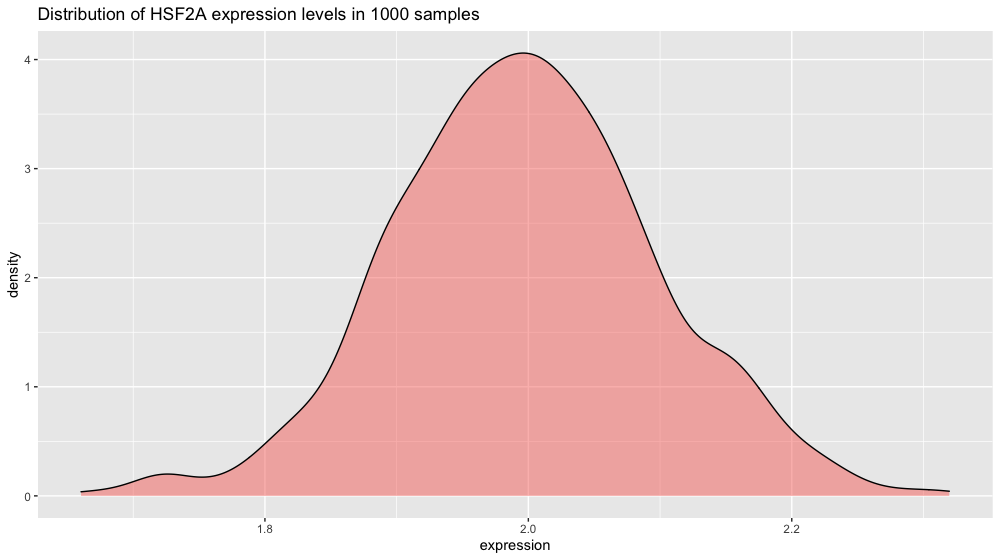
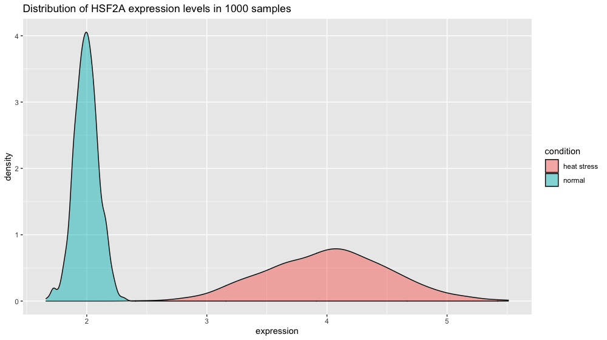

# Table of Contents
<!-- MarkdownTOC autolink="True" levels="1,2,3" -->

- [1. Introduction](#1-introduction)
- [1. Statistical refresher](#1-statistical-refresher)
  - [1.1 Population and sample](#11-population-and-sample)
  - [1.2 Central tendency and spread](#12-central-tendency-and-spread)
  - [1.3 Hypothesis test](#13-hypothesis-test)
  - [1.4 Type I and type II errors](#14-type-i-and-type-ii-errors)
  - [1.5 Effect size](#15-effect-size)
  - [1.6 Power analysis: how many samples do I need?](#16-power-analysis-how-many-samples-do-i-need)
  - [1.7 Power analysis for RNA-seq](#17-power-analysis-for-rna-seq)
- [2. Best practices for experimental design](#2-best-practices-for-experimental-design)
  - [2.1 A case study](#21-a-case-study)
  - [2.2 Design number 1](#22-design-number-1)
  - [2.3 Design number 2: completely randomized design](#23-design-number-2-completely-randomized-design)
  - [2.3 Design number 3: completely randomized block design](#23-design-number-3-completely-randomized-block-design)
    - [2.3.1 Scary formulas](#231-scary-formulas)
    - [2.3.2 Conclusion](#232-conclusion)
  - [2.4 Other examples of suboptimal design](#24-other-examples-of-suboptimal-design)
    - [2.4.1 Sex confounded with treatment](#241-sex-confounded-with-treatment)
    - [2.4.2 RNA isolation batch effects](#242-rna-isolation-batch-effects)
  - [2.5 The three principles of a good experimental design](#25-the-three-principles-of-a-good-experimental-design)
- [3. Other points relevant to RNA-seq](#3-other-points-relevant-to-rna-seq)
  - [3.1 Sequencing depth](#31-sequencing-depth)
  - [3.2 Pooling of samples](#32-pooling-of-samples)
- [References](#references)
- [Photo credits](#photo-credits)

<!-- /MarkdownTOC -->


# 1. Introduction

While most scientists would rapidly dive into RNA-seq sample preparation and searching for a sequencing provider, it is crucial to spend enough time to refresh one's statistical knowledge and embrace good experimental design practices. After all, a typical RNA-seq experiment is also an experiment like any other. We will nethertheless see some specificities of RNA-seq experiments at the end of this episode.

Statistics are often overlooked (at best) or avoided (very often) by wet-lab biologists since it is often thought of being both complex and boring. Yet, this episode will hopefully prove that is can be simply explained and that a few pragmatic considerations will usually save a considerable amount of time and money.  


# 1. Statistical refresher
First, let's have a quick look at important notions useful to understand the rest of this episode. 
These concepts will be important to understand experimental design applied to RNA-seq. 


## 1.1 Population and sample 


The first question you need to ask yourself is "what is the population that I am considering in my experiment from which I will gather measurements?". If you are working on wild-type tomato plants from the cultivar Moneymaker for instance, then your population of interest would be _all_ plants from the Moneymaker cultivar on which you measure a particular phenotype. 

Data collection consists of measuring the values of one or several variables for each member of the population. For instance, you could measure the height and weight of people. 

If you are working on the height of the population from the Netherlands, then your population would be "all people in the Netherlands" and your variable would be "height". A sample is a subset of that population that must be _representative_ of that population. It therefore has to be selected randomly from the whole population. 


> ## Discussion
> Let's imagine that we study the height of people in the Netherlands. We take a representative sample of 1000 people. Could you give examples of descriptive statistics on that sample?
{: .discussion}


> ## Distinction between __descriptive statistics__ and __inferential statistics__
> On the one hand, descriptive statistics would for instance calculate the average height based on the 1000 people sampled. But it would make no assumption on the general population in the Netherlands.   
On the other hand, inferential statistics would try to impute the Netherlands population height based on this representative 1000 people sample. 
{: .callout}

## 1.2 Central tendency and spread

Here is a boxplot made from the world's population heights (one point is the average height in one country).

 

In particular, the __measures of central tendency and spread__ are of interest to us because they will also have important consequences for RNA-seq. __One example of a measure of central tendency is the mean__ for instance. The mean is displayed on the boxplot as a red diamond.

> ## Exercise: central tendency
> Take another look at the boxplot above. Can you name a measure of the central tendency other than the mean?
>
> > ## Solution
> > The median is another measure of central tendency. The median is the value separating the higher half from the lower half of a data sample or a population (source Wikipedia).
> {: .solution}
{: .challenge}

If you look at the boxplot, you will see that points are dispersed along the boxplot suggesting that some countries might have an "extreme" height compared to the majority. This measure of heterogeneity in data distribution is called the __spread__ or [statistical dispersion](https://en.wikipedia.org/wiki/Statistical_dispersion) and can be estimated with measures such as the __standard deviation__. 

> ## Exercise: spread
> Can you name a measure of the spread other than the standard deviation?
>
> > ## Solution
> > The variance (square of the standard deviation) is another measure of the spread. 
> {: .solution}
{: .challenge}


## 1.3 Hypothesis test 

These notions of central tendency and spread are vital to the rest of this episode. In your RNA-seq journey, you will work with thousands of genes. But before you do so, it is important to understand how statistical tests and the infamous p-values are computed  by working with one gene. 

Say you are studying a plant gene called ["heat stress transcription factor A-2" (HSFA2)](https://www.uniprot.org/uniprot/O80982) whose expression could be increased by heat stress...Well the gene name is definitely giving a clue! :blush: You therefore measure this gene transcript level in two conditions: normal and heat stressed.

Then, you make a hypothesis saying: 
> "The average HSFA2 gene expression _is the same_ in normal conditions than under heat stress in my Arabidopsis seedlings". 

This is called the __H<sub>0</sub> hypothesis or the null hypothesis__. 

<br>

The alternative hypothesis would be:
> "The average HSFA2 gene expression _is different_ under heat stress compared to normal conditions in my Arabidopsis seedlings". 

This is called the __H<sub>1</sub> hypothesis or alternative hypothesis__. 


Imagine you would be the best scientist ever and you would be capable of sampling 1000 Arabidopsis plantlets in normal conditions. 
:seedling: x 1000
~~~
library(tidyverse)

xp_normal_conditions <- tibble(
  expression = rnorm(             # randomly sample numbers from a normal distribution
    n = 1000,                     # number of drawings
    mean = 2,                     # mean of the normal distribution
    sd = 0.1),                    # standard deviation of the normal distribution
  condition = "normal"            # used later on for data frame row binding with heat stress
  )

head(xp_normal_conditions)
~~~
{: .language-r}

~~~
# A tibble: 6 x 2
  expression condition
       <dbl> <chr>    
1       1.98 normal   
2       2.04 normal   
3       1.99 normal   
4       2.03 normal   
5       2.03 normal   
6       2.03 normal  
~~~
{: .output}

If you plot the HSF2A gene expression distribution, you get a nice schoolbook guaussian curve.

~~~
p2 <- ggplot(xp_normal_conditions, aes(x = expression, fill = condition)) +
  ggtitle("Distribution of HSF2A expression levels in 1000 samples") +
  theme(legend.position = "none") +
  geom_density(color = "black", alpha = 0.5) 
p2
~~~
{: .language-r}



Note: we are using ggplot's geom_density() function here to plot the distribution. The area under the curve adds up to 1 (which corresponds to 100% of your data). To make the plot display percentage on the y axis instead add this line in ```+ scale_y_continuous(labels = percent_format())```.

Let's now create the data for another gene. 
~~~
xp_heat_stress <- tibble(expression = rnorm(n = 1000, mean = 4, sd = 0.5),
                         condition = "heat stress")

xp = bind_rows(xp_normal_conditions, xp_heat_stress) # get a peek with head(xp) and tail(xp)

p3 <- ggplot(xp, aes(x = expression, fill = condition)) +
  ggtitle("Distribution of HSF2A expression levels in 1000 samples") +
  geom_density(color = "black", alpha = 0.5) 
p3
~~~
{: .language-r}



> ## Challenge
> Can you figure out how to perform a Student t-test to test the __null hypothesis H<sub>0</sub>__ (no difference between normal and heat stress means) using the `xp_normal_conditions` and the `xp_heat_stress` dataframes?
> > ## Solution
> > 
> > ~~~
> > t.test(x = xp_normal_conditions$expression, 
> >        y = xp_heat_stress$expression, 
> >        alternative = "two.sided" ,      
> >        var.equal = FALSE,             # important as the variance do not seem equal
> >        conf.level = 0.95)             # corresponds to alpha = 0.05 
> > ~~~
> > {: .language-r}
> {: .solution}
{: .challenge}

The output of the Student t test yields:

~~~
Welch Two Sample t-test

data:  xp_normal_conditions$expression and xp_heat_stress$expression

t = -124.62, df = 1079.5, p-value < 2.2e-16

alternative hypothesis: true difference in means is not equal to 0.95 percent confidence interval: -2.019466 -1.956859

sample estimates:
mean of x mean of y 
 2.004045  3.992208 
~~~
{: .output}


If the spread in normal conditions increases to 0.5 the two distributions start to overlap. But given our number of measurements, the t-test is still very significant since we can estimate variability very finely. 

~~~
# increasing the spread of the normal conditions to sd = 0.5
xp_normal_conditions_more_spread <- tibble(expression = rnorm(n = 1000, mean = 2, sd = 0.5),
                                           condition = "normal")

xp2 = bind_rows(xp_normal_conditions_more_spread, xp_heat_stress) # heat stress values are kept unchanged

p4 <- ggplot(xp2, aes(x = expression, fill = condition)) +
  ggtitle("Distribution of HSF2A expression levels in 1000 samples") +
  geom_histogram(color = "black", bins = 30) + 
  scale_x_continuous(limits = c(1,6))
p4


t.test(x = xp_normal_conditions_more_spread$expression, 
       y = xp_heat_stress$expression, 
       alternative = "two.sided",
       var.equal = FALSE, 
       conf.level = 0.95)
~~~
{: .language-r}


## 1.4 Type I and type II errors 

Type I errors occur when the __H<sub>0</sub> (null) hypothesis__ is rejected wrongly (e.g., the two treatment means are equal) in favor of an alternative hypothesis (e.g., that the two means are different). Type I errors are probably most familiar to researchers and much effort is expended to ensure that Type I errors are minimized. 

Type II errors also are common in hypothesis testing. These errors result from accepting the null hypothesis when in fact a treatment effect exists.  

<br>
<br>


| Type I error (false positive): "You're pregnant!" | Type II error (false negative): "Sorry you're not pregnant" |
|-----------------------------------|---------------|-------------------------------------------------------------|
|  |  |

These two types of errors are related to one another. 


## 1.5 Effect size
__Standardized effect size following Cohen's _d_ formula__

$$d = {X_{1}- X_{2} \over s}$$

Where $$X_{1}$$ is the mean of the first group (e.g. treatment) and $$X_{2}$$ is the mean of the second group. $$s$$ is the standard variation of one of the two population if they are comparable or the pooled standard deviation. 

The pooled standard deviation is the square root of the average of the two standard deviations. 


__Student t test formula__

$$t = {X_{1} - X_{2} \over SE}$$

The widely used Student t-test rely on the value of the $$t$$ statistics which is related to this effect size since the Standard Error (SE) is equal to $$SE = {SD \over \sqrt{N}}$$ with $$N$$ the number of measurements and $$SD$$ the standard deviation.   

This brings us to the infamous question..."how many samples do I need?".

## 1.6 Power analysis: how many samples do I need?

You will need to know these parameters in your experiment to be able to calculate the number of samples that you need:
- **Type I error:** controlled by the $$\alpha$$ value. Often set to 0.01 (1%) or 0.001 (0.1%) in RNA-seq experiments. 
- **Type II error:** controlled by the $$\beta$$ value. $$(1 - \beta)$$ will give you the power of your analysis. Should be set to 70 or 80% to detect 70 or 80% of the differentially expressed genes. The number of biological replicates might be hard to reach in practice for RNA-seq experiments.   
- **Effect size:** this is a parameter you will set. For instance, if you want to investigate genes that differ between treatments with a difference of their mean of 2 then the effect size is equal to 2. 
- **Sample size**: the quantity you want to calculate. 

We are now going to see how to calculate the number of samples to achieve a power of 70 or 80% given a certain effect size $$d$$, a level of $$\alpha$$ and $$\beta$$. 

Let's say we want:
- Type I error of 5%. $$\alpha = 0.05$$
- Type II error of 0.2. $$Power =  1 - \beta = 0.8$$
- Effect size of 2. $$d = 2$$ 
 
How many samples do we need to achieve this? We are going to make use of the `pwr` package from R ([usage example here](https://cran.r-project.org/web/packages/pwr/vignettes/pwr-vignette.html)).
~~~
library("pwr")

pwr.t.test(d = 2,
           power = .8,
           sig.level = .05,
           type = "two.sample",
           alternative = "two.sided")
~~~
{: .language-r} 

~~~
     Two-sample t test power calculation 

              n = 5.089995
              d = 2
      sig.level = 0.05
          power = 0.8
    alternative = two.sided

NOTE: n is number in *each* group
~~~
{: .output}

To see a more subtle difference where $$d = 1$$ we would need:
~~~
pwr.t.test(d = 1,
           power = .8,
           sig.level = .05,
           type = "two.sample",
           alternative = "two.sided")
~~~
{: .language-r}

~~~
     Two-sample t test power calculation 

              n = 16.71472
              d = 1
      sig.level = 0.05
          power = 0.8
    alternative = two.sided

NOTE: n is number in *each* group
~~~
{: .output}

We would need 16 samples in each group as compared to 5 when $$d = 2$$.

## 1.7 Power analysis for RNA-seq

RNA-seq experiments often suffer from a low statistical power. A low statistical power reflects type II error.
From [Button et al. (2013) "Power failure: why small sample size undermines the reliability of neuroscience"](https://www.nature.com/articles/nrn3475): 
> [low power entails that] you are missing "true effects" and there are many false negatives: genes that you should have been called differential but are not.   
It also affects the _positive predictive value_ (PVV) of your findings which is the probability that a differential gene (p < 0.01) is a real true finding. 
Power is therefore linked to the ability to claim "true findings". 


A series of recent publications have emphasized that low power can lead to a lack of reproducibility of the research findings. Again, in their publication, Button and coauthors state that:
> Research that produces novel results, statistically significant results (that is, typically p < 0.05) and seemingly 'clean' results is more likely to be published. As a consequence, researchers have strong incentives to engage in research practices that make their findings publishable quickly, even if those practices reduce the likelihood that the findings reflect a true (that is, non-null) effect. Such practices include using **flexible study designs** and flexible statistical analyses and **running small studies with low statistical power**.

The number of replicates is one of the critical parameter related to the power of an analysis. But first, let's discuss what you understand by "replicates". 

> ## Discussion
> What sort of replicates can you name in a typical RNA-seq experiment?
{: .discussion}

Two types of experimental replicates coexist: **technical replicates** or **biological replicates**. 


*Image credit: [Klaus B., EMBO J (2015) **34**: 2727-2730](https://dx.doi.org/10.15252%2Fembj.201592958)*

- **Technical replicates:** use the same biological sample to repeat the technical or experimental steps in order to accurately measure technical variation and remove it during analysis. 

- **Biological replicates** use different biological samples of the same condition to measure the biological variation between samples.

In the days of microarrays, technical replicates were considered a necessity; however, with the current RNA-Seq technologies, technical variation is much lower than biological variation and **technical replicates are unneccessary**.

In contrast, **biological replicates are absolutely essential** for differential expression analysis. For mice or rats, this might be easy to determine what constitutes a different biological sample, but it's a bit **more difficult to determine for cell lines**. [This article](http://paasp.net/accurate-design-of-in-vitro-experiments-why-does-it-matter/) gives some great recommendations for cell line replicates.

For differential expression analysis, the more biological replicates, the better the estimates of biological variation and the more precise our estimates of the mean expression levels. This leads to more accurate modeling of our data and identification of more differentially expressed genes. This is also reflected for statistical power. More reads marginally affect your ability to differential genes while increasing the number of biological replicates has a strong effect.


| Number of differentially expressed genes | Statistical power |
|-----------------------------------|---------------|----------------------------------------------------------------|
|  |   |

*Image credits: [Liu, Y., et al., Bioinformatics (2014) **30**(3): 301–304](https://doi.org/10.1093/bioinformatics/btt688)*

As the two figures above illustrates, **biological replicates are of greater importance than sequencing depth**, which is the total number of reads sequenced per sample. The figure shows the relationship between sequencing depth and number of replicates on the number of differentially expressed genes identified [[1](https://academic.oup.com/bioinformatics/article/30/3/301/228651/RNA-seq-differential-expression-studies-more)]. Note that an **increase in the number of replicates tends to return more DE genes than increasing the sequencing depth**. Therefore, generally more replicates are better than higher sequencing depth, with the caveat that higher depth is required for detection of lowly expressed DE genes and for performing isoform-level differential expression. 

Replicates are almost always preferred to greater sequencing depth for bulk RNA-Seq. However, **guidelines depend on the experiment performed and the desired analysis**. Below we list some general guidelines for replicates and sequencing depth to help with experimental planning:

- **General gene-level differential expression:**
  - ENCODE guidelines suggest 30 million SE reads per sample (stranded).
  - 15 million reads per sample is often sufficient, if there are a good number of replicates (>3). 
  - Spend money on more biological replicates, if possible.
  - Generally recommended to have read length >= 50 bp  

- **Gene-level differential expression with detection of lowly-expressed genes:**
  - Similarly benefits from replicates more than sequencing depth.
  - Sequence deeper with at least 30-60 million reads depending on level of expression (start with 30 million with a good number of replicates). 
  - Generally recommended to have read length >= 50 bp  

- **Isoform-level differential expression:**
  - Of known isoforms, suggested to have a depth of at least 30 million reads per sample and paired-end reads.
  - Of novel isoforms should have more depth (> 60 million reads per sample).
  - Choose biological replicates over paired/deeper sequencing.
  - Generally recommended to have read length >= 50 bp, but longer is better as the reads will be more likely to cross exon junctions
  - Perform careful QC of RNA quality. Be careful to use high quality preparation methods and restrict analysis to high quality RIN # samples.    

- **Other types of RNA analyses (intron retention, small RNA-Seq, etc.):**   
  - Different recommendations depending on the analysis.
  - Almost always more biological replicates are better!  
  
<br>

# 2. Best practices for experimental design

In a typical biological experiment, you will encounter various sources of variation that are either:
- __desirable__ because they are part of your experimental factors. These are typically the one you first think of when you design your experiment. 
- __undesirable__ (unwanted) because you are not interested in them. Although you might not list them, they will still affect the outcome of your experiment. 

We are going to identify these through a case study.

## 2.1 A case study
A scientist is hired as the new experimental design expert in a company and its first task is to design a disease assay experiment. 

The scientist has to measure the effect of a plant pathogen called "_Designus malatesta_" on two plant genotypes: one resistant to the pathogen (labelled "_R_" for resistant) and one susceptible (labelled "_S_"). You measure the quantity of the pathogen (CFU.g<sup>-1</sup>) in the plant tissue after a week. 

The scientist disposes of a total of 24 individual plants that are placed on two tables in a greenhouse compartment. Each table can accomodate 12 plants.
The greenhouse upper right side is pointing north, close to the location of the entrance door. Finally, there is an electrical board to power lamps and other high voltage installation at the lower left side opposite of the door. Here is a scheme of the basic setup.

 

> ## Question
> How many experimental factors controlled by the scientist can you readily identify?
> > ## Solution
> > There are two easily identifiable factors: 
> >   1. The __genotype factor__ with two levels: _R_ and _S_
> >   2. The __infection factor__ also with two levels: uninfected (control) and infected.  
> {: .solution}
{: .challenge}

Apart from experimental factors set up by the scientist, there are practical matters that may also affect the outcome of your experiment. 

> ## Question
>  Can you identify another potential source of unwanted variation due to the practical setup of the experiment?
> > ## Solution
> > The greenhouse compartment door is on the North-East side so potentially a source of cold air. 
> > On the contrary, there is an electrical board on the lower South-West side of the compartment, a potential source of warm air.
> > Therefore, there might be an heterogeneity in the local temperature that plants are experiencing on table 1 and 2. 
> > Another experimental factor that is undesirable can be called "temperature" and will cause table 1 and table 2 to be different.   
> {: .solution}
{: .challenge}


We are now going to evaluate several experimental design that the scientist came up with and identify potential issues and remedies with each of them.

## 2.2 Design number 1
In the first design, plants from the _S_ genotypes are placed on table 1 and plants from the _R_ genotype are placed on table 2. 

The upper half on each table is infected with _D. malatesta_ while the lower half is sprayed with water (control). 

 

> ## Question
> Can you identify one major issue with this design?
> > ## Solution
> > The major issue is that it is not possible to distinguish the "table effect" (undesirable) from the "genotype" effect since all _S_ genotypes are on table 1 while all _R_ genotypes are on the table 2. 
> > The "table effect" can be assimilated to a temperature effect since plants and pathogen on table 1 might experience a warmer temperature than plants and pathogen on table 2. 
> {: .solution}
{: .challenge}

## 2.3 Design number 2: completely randomized design

In this new design, we have used a completely randomized design for the plant genotypes. To do so, we have randomized the positions of the plant genotypes on the two tables. It turns out that 8 plants from genotype _S_ are on table 1 while the remaining 4 are on table 2.  


> ## Question
> Can you identify one major issue with this design?
> > ## Solution
> > The major issue with this design is that we might end up with an unbalanced number of genotypes from the _S_ or _R_ class on each table. It would be preferable to have the same number on each genotype.  
> > The fact that the infection will also happen for plants located on "half tables", a yet unidentified source of variation might not be taken into account. 
> {: .solution}
{: .challenge}

## 2.3 Design number 3: completely randomized block design

In this design, each table will accomodate a complete experimental setup. This means that each table will exhibit:
- Plant genotypes _S_ and _R_ in equal numbers.
- Infection or mock (water) conditions in equal numbers. 
Both plant genotypes and treatment positions will also be randomized on each table. 


So why is this a better design? It is a better design since, for each measurement, you would record the genotype of your plant, the infection treatment and the table on which your plant was located. In this way, you can _separate_ and estimate the _undesirable_ effect of the temperature (table) on your measurement.  

### 2.3.1 Scary formulas
 
**Design number 2 (complete randomized block design)**  
Fitting a multiple linear regression for the design number 2, your end-formula would look like this:

$$Y = \beta_{0} + \beta_{1}.X_{1} + \beta_{2}.X_{2} + \beta_{3}.X_{3} + \epsilon_{1}$$

With:
- $$Y$$ is your "response variable" or end-measurement. Here it is the quantity of the pathogen (CFU.g<sup>-1</sup>) in the plant tissue) after a week.
- $$\beta_{0}$$ the intercept of your model (value of Y when $$X_{1} = 0$$ and $$X_{2} = 0$$). Here it should correspond to plants of the _S_ genotype that are mock inoculated. Then Y should be equal to 0 and so our $$\beta_{0}$$ should be equal to zero. 
- $$\beta_{1}$$ the coefficient for the genotype effect (one coefficient for _R_ and one for _S_) 
- $$\beta_{2}$$ the coefficient for the treatment effect (one coefficient for _mock_ and one for _inoculated with D. malatesta_).
- $$\beta_{3}$$ is an interaction term between the genotype and the infection factors.   
- $$\epsilon_{1}$$ is the residual error that your model fail to explain. 

**Design number 3 (complete randomized block design)**  

$$Y = \beta_{0} + \beta_{1}.X_{1} + \beta_{2}.X_{2} + \beta_{3}.X_{3} + \beta_{4}.X_{4} + \epsilon_{2}$$  

The different coefficients have the same meaning as for design 2. In addition:    
- **$$\beta_{4}$$ is the coefficient for the table (possible temperature) effect.** 
- $$\epsilon_{2}$$ is the residual error. 

And with $$\epsilon_{1}$$ > $$\epsilon_{2}$$ 

### 2.3.2 Conclusion
If you record and control both _desirable_ and _undesirable_ source of variation, you are then able to include them into your statistical model and account for them. This in turns allow you to "sort the wheat from the chaff" and separate _undesirable_ (e.g. temperature) sources of variation from _desirable_ sources (e.g. treatments, genotypes, etc.)  

## 2.4 Other examples of suboptimal design

### 2.4.1 Sex confounded with treatment
  
A confounded RNA-Seq experiment is one where you **cannot distinguish the separate effects of two different sources of variation** in the data. 

For example, we know that sex has large effects on gene expression, and if all of our *control* mice were female and all of the *treatment* mice were male, then our treatment effect would be confounded by sex. **We could not differentiate the effect of treatment from the effect of sex.**

  

**To AVOID confounding:**

- Ensure animals in each condition are all the **same sex, age, litter, and batch**, if possible.

- If not possible, then ensure to split the animals equally between conditions

  

### 2.4.2 RNA isolation batch effects

Batch effects are a significant issue for RNA-Seq analyses, since you can see significant differences in expression due solely to the batch effect. 


*Image credit: [Hicks SC, et al., bioRxiv (2015)](https://www.biorxiv.org/content/early/2015/08/25/025528)*

To explore the issues generated by poor batch study design, they are highlighted nicely in [this paper](https://f1000research.com/articles/4-121/v1).

**How to know whether you have batches?**

- Were all RNA isolations performed on the same day?

- Were all library preparations performed on the same day?

- Did the same person perform the RNA isolation/library preparation for all samples?

- Did you use the same reagents for all samples?

- Did you perform the RNA isolation/library preparation in the same location?

If *any* of the answers is **‘No’**, then you have batches.

**Best practices regarding batches:**

- Design the experiment in a way to **avoid batches**, if possible.

- If unable to avoid batches:

  - **Do NOT confound** your experiment by batch:

    
    
    *Image credit: [Hicks SC, et al., bioRxiv (2015)](https://www.biorxiv.org/content/early/2015/08/25/025528)*
  
  - **DO** split replicates of the different sample groups across batches. The more replicates the better (definitely more than 2).
  
    

    *Image credit: [Hicks SC, et al., bioRxiv (2015)](https://www.biorxiv.org/content/early/2015/08/25/025528)*
    
  - **DO** include batch information in your **experimental metadata**. During the analysis, we can regress out the variation due to batch if not confounded so it doesn’t affect our results if we have that information.

    
    
 > **NOTE:** *The sample preparation of cell line "biological" replicates "should be performed as independently as possible" (as batches), "meaning that cell culture media should be prepared freshly for each experiment, different frozen cell stocks and growth factor batches, etc. should be used [[2](http://paasp.net/accurate-design-of-in-vitro-experiments-why-does-it-matter/)]." However, preparation across all conditions should be performed at the same time.*


## 2.5 The three principles of a good experimental design 

1. **Randomization**: when you assign treatments to experimental units (e.g. a single plant). This should remove undesired and sometimes unknown bias coming from an unidentified source of variation (e.g. different temperatures in the same greehouse).
2. **Replication**: by repeating the same minimal experiment more than once, you can estimate the error due to the experimenter manipulation, increase the precision by which you estimate the variable of interest and therefore better estimate your treatment effect.
3. **Blocking** can help to reduce variability unexplained in one's model. If your group consist of male and female individual, there is a chance that they will not respond in the same way to a given treatment. Therefore, "sex" should be a blocking factor in this case. In our case study, "table" was a blocking factor necessary to account for variability in temperature.  


> ## A useful quote (source [Wikipedia](https://en.wikipedia.org/wiki/Blocking_(statistics)#Block_a_few_of_the_most_important_nuisance_factors))
> “Block what you can; randomize what you cannot.”
{: .callout}

<br>

# 3. Other points relevant to RNA-seq

## 3.1 Sequencing depth
Often, one will ask "how many reads per sample do I need?". As we have seen earlier in this episode, the most important aspect is to maximise the number of biological replicates ([see the related section "Power analysis for RNA-seq](#17-power-analysis-for-rna-seq).

In a study on the impact of sequencing depth on the number of genes detected, [Lei et al. (2014)](https://doi.org/10.1016/j.gene.2014.12.013) have shown the increasing sequencing depth (number of reads) does not greatly improve 
the number of detected genes. This has to do that highly expressed genes are easily detected and quantified with the first million of reads (rapid increase of the detection curve) and that subsequent increase in read number will go to low expressed genes. For instancem half of the transcriptome can be detected with as few as 5 million reads. Therefore, for most species and Arabidopsis in particular, a number around 15M single reads should be enough.  

  

## 3.2 Pooling of samples

Yes if absolutely necessary. For instance, you are collecting roots from very young seedlings and you won't have enough material to isolate RNA. 

:warning: One reason not to pool is that you cannot identify potential outliers. Think about one seedling that would be stressed (for some unknown reason) and that might be mixed with several unstressed seedlings. This would potentially affect the level of stress-related genes in your pooled sample. Unfortunately, you would not be able to spot this outlier seedling and isolate it _in silico_. 

> **Sample pooling:** Try to avoid pooling of individuals/experiments, if possible; however, if absolutely necessary, then each pooled set of samples would count as a **single replicate**. To ensure similar amounts of variation between replicates, you would want to pool the **same number of individuals** for each pooled set of samples. 
>
> *For example, if you need at least 3 individuals to get enough material for your `control` replicate and at least 5 individuals to get enough material for your `treatment` replicate, you would pool 5 individuals for the `control` and 5 individuals for the `treatment` conditions. You would also make sure that the individuals that are pooled in both conditions are similar in sex, age, etc.*


# References 
- [The power analysis section of the RNA-seq blog](https://www.rna-seqblog.com/tag/power-analysis/)
- [`pwr` R package vignette](https://cran.r-project.org/web/packages/pwr/vignettes/pwr-vignette.html)
- [The Scotty power analysis webtool](http://scotty.genetics.utah.edu/)
- [UCLA Stat consulting on power analysis](https://stats.idre.ucla.edu/r/dae/power-analysis-for-two-group-independent-sample-t-test/)
-  [Lei et al. (2015) Diminishing returns in next-generation sequencing (NGS) transcriptome data. _Gene_ 557(1):82-87](https://doi.org/10.1016/j.gene.2014.12.013)

# Photo credits

<a style="background-color:black;color:white;text-decoration:none;padding:4px 6px;font-family:-apple-system, BlinkMacSystemFont, &quot;San Francisco&quot;, &quot;Helvetica Neue&quot;, Helvetica, Ubuntu, Roboto, Noto, &quot;Segoe UI&quot;, Arial, sans-serif;font-size:12px;font-weight:bold;line-height:1.2;display:inline-block;border-radius:3px" href="https://unsplash.com/@ayahya09?utm_medium=referral&amp;utm_campaign=photographer-credit&amp;utm_content=creditBadge" target="_blank" rel="noopener noreferrer" title="Download free do whatever you want high-resolution photos from Ali Yahya"><span style="display:inline-block;padding:2px 3px"><svg xmlns="http://www.w3.org/2000/svg" style="height:12px;width:auto;position:relative;vertical-align:middle;top:-2px;fill:white" viewBox="0 0 32 32"><title>unsplash-logo</title><path d="M10 9V0h12v9H10zm12 5h10v18H0V14h10v9h12v-9z"></path></svg></span><span style="display:inline-block;padding:2px 3px">Ali Yahya</span></a>

