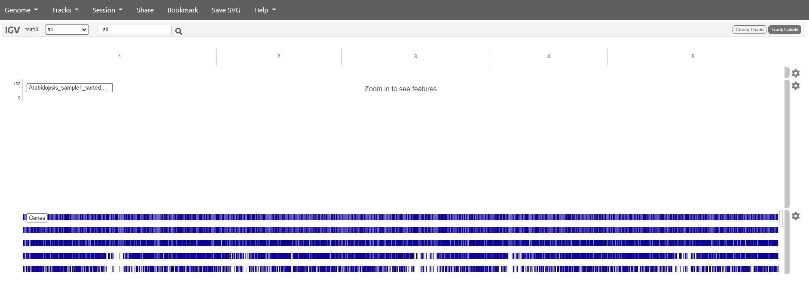
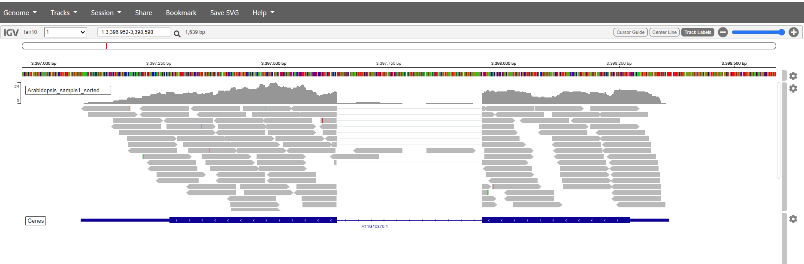
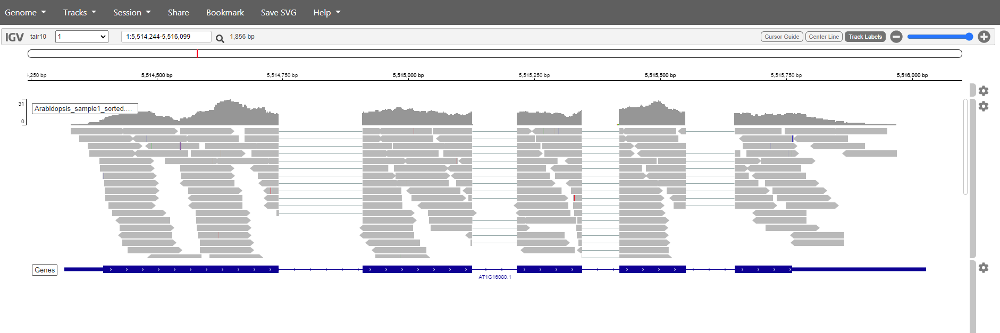

# 1. Table of Contents
<!-- TOC -->

- [1. Table of Contents](#1-table-of-contents)
- [2. The SAM/BAM format](#2-the-sambam-format)
    - [2.1 What's in a SAM/BAM file](#21-whats-in-a-sambam-file)
- [3. Visualazation of a bam file](#3-visualazation-of-a-bam-file)
    - [3.1. Preparation of the Bam file for IGV](#31-preparation-of-the-bam-file-for-igv)
        - [Sorting](#sorting)
        - [Indexing](#indexing)
    - [3.2. IGV](#32-igv)
- [6. Creating the counts file](#6-creating-the-counts-file)

<!-- /TOC -->

# 2. The SAM/BAM format
The [SAM file](https://github.com/adamfreedman/knowyourdata-genomics/blob/gh-pages/lessons/01-know_your_data.md#aligned-reads-sam),
is a tab-delimited text file that contains information for each individual read and its alignment to the genome. While we do not
have time to go in detail of the features of the SAM format, the paper by
[Heng Li et al.](http://bioinformatics.oxfordjournals.org/content/25/16/2078.full) provides a lot more detail on the specification.

**The compressed binary version of SAM is called a BAM file.** We use this version to reduce size and to allow for *indexing*, which enables efficient random access of the data contained within the file.

## 2.1 What's in a SAM/BAM file
The file begins with a **header**, which is optional. The header is used to describe source of data, reference sequence, method of
alignment, etc., this will change depending on the aligner being used. Following the header is the **alignment section**. Each line
that follows corresponds to alignment information for a single read. Each alignment line has **11 mandatory fields** for essential
mapping information and a variable number of other fields for aligner specific information. An example entry from a SAM file is
displayed below with the different fields highlighted.

# 3. Visualazation of a bam file

A BAM file can be visualized using a genome viewer like IGV.
We can't just upload the files in the viewer. We first need the files to be sorted and indexed.
To do this we make use of samtools. This is a tool specificaly designed to work with BAM and SAM files.

## 3.1. Preparation of the Bam file for IGV

To start of we'll have a look at how to use samtools to have a peak at the the contents of the bam files. 

As these file are binary you can not simply use:

~~~
$ head arabidopsis1.bam
~~~

This will give an unreadable result.
samtools view helps to make the content readable

~~~
$ samtools view arabidopsis1.bam | head
~~~

Samtools will make the data readeble, this data is then piped through head to show the first 5 lines of the file

### Sorting

Samtools can also be used to sort the read alignments. The aliments will reordered starting from the beginning of chromosome 1 to the end of the last chromosome.

~~~
$ samtools sort -o arabidopsis1_sorted.bam arabidopsis1.bam
~~~

where -o defines the name of the output file (also a bam).

### Indexing

stuff on indexing the BAM file

## 3.2. IGV

For this exercise we'll be making use of an online version of [IGV](https://igv.org/app/). 
The arabidopsis genome that we used for the mapping is available in this web app. It can be found under genome -> A. thaliana (TAIR 10). The bam files can be added as a track. Choose tracks -> local file.
select both the bam file and the accompanying bai. 
You should get something like this

Mapping has in this case only been done against chromosome 1. So if we want to see are reads choose chromosome 1. Zoom in to see the reads.

It is also posible to search for genes. just pop the name in the search box and click the magnificationsglass. Try with the genes: AT1G16080, AT10370

# 6. Creating the counts file

For downstream application for each of the samples the number of reads that maps within a gene has to be determined.
Featurecounts from the subread package can do this.

FeatureCounts can count the number of reads that map within a feature. In case of the arabidopsis annotation there are three different features to choose from. Depending on the downstream applications the choice is gene, transcript or exon. In this study we are just looking for differientially expressed genes.

~~~
$ cd /home/

$ gunzip ath_annotation.gff3.gz

$ featureCounts -O -t gene -g ID -a ath_annotation.gff3 -o counts.txt mapped/*.bam
~~~

-a <string>         Name of an annotation file. GTF/GFF format by default.
-o <string>         Name of the output file including read counts.
-O                  Assign reads to all their overlapping meta-features.
-t <string>         Specify feature type in GTF annotation
-g <string>         Specify attribute type in GTF annotation. Determines the name of the features.

The output file produced by `featureCounts` is a tab-delimited file, can be opened in a program like excel.