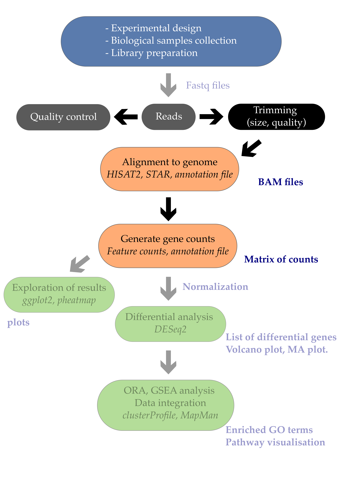

# 1. Table of contents
<!-- TOC -->

- [1. Table of contents](#1-table-of-contents)
- [2. Introduction](#2-introduction)
    - [2.1. The fastq format](#21-the-fastq-format)
- [3. Quality control of FASTQ files](#3-quality-control-of-fastq-files)
    - [3.1. Running FastQC](#31-running-fastqc)
    - [3.2. Viewing the FastQC results](#32-viewing-the-fastqc-results)
        - [3.2.1. Decoding the FastQC outputs](#321-decoding-the-fastqc-outputs)
        - [3.2.2. Sequencing error profiles](#322-sequencing-error-profiles)
        - [3.2.3. Expected Errors](#323-expected-errors)
        - [3.2.4. Worrisome](#324-worrisome)
        - [3.2.5. Quality assessment](#325-quality-assessment)
        - [3.2.6. Per sequence quality scores](#326-per-sequence-quality-scores)
        - [3.2.7. Per base sequence content](#327-per-base-sequence-content)
        - [3.2.8. Per sequence GC content](#328-per-sequence-gc-content)
        - [3.2.9. Sequence duplication level](#329-sequence-duplication-level)
        - [3.2.10. Overrepresented sequences](#3210-overrepresented-sequences)
    - [3.3. Working with the FastQC text output](#33-working-with-the-fastqc-text-output)
    - [3.4. Documenting our work](#34-documenting-our-work)
- [4. Trimming and filtering](#4-trimming-and-filtering)
- [5. Alignment to a reference genome](#5-alignment-to-a-reference-genome)
    - [5.1. Index the reference genome](#51-index-the-reference-genome)
    - [5.2. Align reads to reference genome](#52-align-reads-to-reference-genome)
    - [5.3. Align reads to reference genome using hisat2](#53-align-reads-to-reference-genome-using-hisat2)

<!-- /TOC -->

# 2. Introduction

## 2.1. The fastq format

Check the Wikipedia page for now: https://en.wikipedia.org/wiki/FASTQ_format

The first step in the RNA-Seq workflow is to take the FASTQ files received from the sequencing facility and assess the quality of the sequencing reads. 

The [FASTQ](https://en.wikipedia.org/wiki/FASTQ_format) file format is the defacto file format for sequence reads generated from next-generation sequencing technologies. This file format evolved from FASTA in that it contains sequence data, but also contains quality information. Similar to FASTA, the FASTQ file begins with a header line. The difference is that the FASTQ header is denoted by a `@` character. For a single record (sequence read) there are four lines, each of which are described below:

|Line|Description|
|----|-----------|
|1|Always begins with '@' and then information about the read|
|2|The actual DNA sequence|
|3|Always begins with a '+' and sometimes the same info in line 1|
|4|Has a string of characters which represent the quality scores; must have same number of characters as line 2|

## 2.2 Creating the workspace folder

Please make sure you have completed the [Setup section](../setup.html) ideally with the Docker option. 

You should be outside of the Docker container for now, pick your favorite folder on your machine and create a `workspace/` where the work will take place. 

~~~
$ mkdir workspace/
~~~
{: .bash}

Finally, move to the workspace folder:

~~~
$ cd workspace/ 
~~~
{: .bash}

## 2.3 Getting familiar with the Docker container

Now we will (i) download the required Docker image and (ii) start the Docker container that we will call `bioinfo` and that contains all tutorial softwares and datasets. 

Docker does this in one single-step with the `docker run` command. 

~~~
$ docker run -v $PWD:/workspace/ --name fastq -it mgalland/docker-for-teaching:fastq-2022
~~~
{: .bash}

Some explanation here:
* `--name`: our container is named `fastq` so you can use this when performing actions on your container.  
* `-it`: starts an interactive bash session inside your container upon start up.
* `-v $PWD:/workspace/`: this has linked your current working directory (called `tutorial/`) to a new directory inside the container called `workspace/`. We use different names to know where we are.  
* `mgalland/docker-for-teaching:fastq-2022`: this downloads a specific Docker image from an online resource called DockerHub. 

Everything that happens inside the container in the `workspace/` folder of your Docker container will be mirrored outside in the `workspace/` folder of your local machine.  

Let's try this by creating a file in the Docker container inside `workspace/`

~~~
$ touch testfile.txt
~~~
{: .bash}

Now exit the container: 

~~~
$ exit
~~~
{: .bash}

You can re-enter the container with:
~~~
$ docker start -a -i fastq
~~~
{: .bash}

> ## Exercise
> Try to exit and re-enter the container at least two times. Create and delete a test file and verify that the file exists in `workspace/`
{: .challenge}

## 2.4 A first peek at our FASTQ files

Several sequencing files are available in the `/datasets/` folder as it contains 4 fastq files. The files are generaly quite big (they usualy contain up to 40 milion reads), so it's a smart thing to keep them zipped as they are.  

Let's move to the directory that contains the sequencing files (.fastq.gz) and other needed files e.g. genome reference sequence.  
~~~
cd /datasets/
ls
~~~
{: .bash}

You should see a list of files:
~~~
Arabidopsis_sample1.fq.gz  Arabidopsis_sample3.fq.gz  AtChromosome1.fa.gz  ath_annotation.gff3.gz
Arabidopsis_sample2.fq.gz  Arabidopsis_sample4.fq.gz  adapters.fasta
~~~
{: .output}

`zcat` is a simular function as `cat` but works on zipped files. With the use of this function we can have a look at the files without having to unzip them. 

~~~
$ zcat Arabidopsis_sample2.fq.gz | head -n 20
~~~
{: .bash}
This will show the first 20 lines of the file, containing 5 reads.

~~~
@ERR1406259.27450842
CATCGCTGAAGATCTGTGAACCAGCCTTGAACCAAACTGCCTCTCCAAACTTGACTCCGTTCCTGGCCAAAAGCTCAGGGAAGACGCAGCCTAGGGCTCCG
+
?ABEEEDCBFEDGHFJFJIHFEFCC=>BEC>FJ@GHCHBHCGFJHG;:F<AI;90F=E44:8FA>@8C;;33237-?84(>*$A#$#/B.5)->0%/8D=;
@ERR1406259.27450849
GTTTTTTTCACTTGATAAATTTGCATTTTAAAACACACTTCATGGATAAAACGGATCATTTCTTGCCACTCTTCTTAAGTCCAGAACCTCCAAAGGATCCC
+
@@?DFCBEEHCDFIFJEGEFGHEDIC>DHFFEF@FH>FG@FA;C9B=B>FHE09C<DE>;H:EH4C/D341;-B,<>:67+--,0;32@8'D)<B@>'&4!
@ERR1406259.27450850
GTAACTAACCCTGTCTCGAGCCGTTGTCATGAACAAGAACGCTGCGTGGCCTAACCCTGCTAGCTTCGTGGACAGAACCATGTCATAGTACCTTCCTTTGA
+
@>=BEBCEFEBHHFEJHDCJHFDFGBFGEIE=IF?DDAJ?A@=8FI<@:C7B;:43G77434;*64<9=63+,:3/4/A0';(6B3=%45/>#)<#$=2,-
@ERR1406259.27450851
TTTGGCTTGGCAACAGTCTTCCTCATTGTCACACGGCCGCTTCCAAGGACTTCTGAAGCCGCAGGGGAAAGGTTCACAGCCTTTCCGGCGAAAGCAGGGGA
+
9<<B>:D<?.CC@8C=C/7@1:+8%>+,&!!!4)!'%&75/A;.7B3!!!!#!!!!!!#!#!!!#!!!!!#!#!!!!!#!!!!!!"!!!!!!!!!!!!!!!
@ERR1406259.27450856
GAGAAGGCAAAGGAGAATGATAAAGAACCGAGAATCAGCTGCAAGGTCCCGGGCCAGGAAACAGATATTCACGGCAGACCAAACAATATACTGGAATGTAA
+
<?CEF>>AEDFFBDCAFCCFDHCDD<D;=;GBFA@A<;<;89;8<4:7>;E5<B=9/@=F@:<;:A@/481*<6&-?,9744**71:-43333.,##!,08
~~~
{: .output}

Let's have a close look at the first read of this sample:

~~~
@ERR1406259.27450842
CATCGCTGAAGATCTGTGAACCAGCCTTGAACCAAACTGCCTCTCCAAACTTGACTCCGTTCCTGGCCAAAAGCTCAGGGAAGACGCAGCCTAGGGCTCCG
+
?ABEEEDCBFEDGHFJFJIHFEFCC=>BEC>FJ@GHCHBHCGFJHG;:F<AI;90F=E44:8FA>@8C;;33237-?84(>*$A#$#/B.5)->0%/8D=;
~~~
{: .output}

As mentioned previously, line 4 has characters encoding the quality of each nucleotide in the read. The legend below provides the mapping of quality scores (Phred-33) to the quality encoding characters. **Different quality encoding scales exist (differing by offset in the ASCII table), but note the most commonly used one is fastqsanger**

~~~
 Quality encoding: !"#$%&'()*+,-./0123456789:;<=>?@ABCDEFGHI
                   |         |         |         |         |
    Quality score: 0........10........20........30........40                                
~~~
{: .output}
 
Using the quality encoding character legend, the first nucelotide in the read (C) is called with a quality score of 30. The second base (A) has a quality of 32, etc.

Each quality score represents the probability that the corresponding nucleotide call is incorrect. This quality score is logarithmically based and is calculated as:

$$Q = -10 \times log_{10}(P)$$     

where $$P$$ is the probability that a base call is erroneous.

These probability values are the results from the base calling algorithm and dependent on how much signal was captured for the base incorporation. The score values can be interpreted as follows:

|Phred Quality Score |Probability of incorrect base call |Base call accuracy|
|:-------------------|:---------------------------------:|-----------------:|
|10	|1 in 10 |	90%|
|20	|1 in 100|	99%|
|30	|1 in 1000|	99.9%|
|40	|1 in 10,000|	99.99%|

Therefore, for the first nucleotide in the read (C), there is a 1 in 1000 chance that the base was called incorrectly. Also you can see that the second half of the read contains a lot of bases that have a more then 10% probabaility that the base is called incorrectly.

> ## Question
> How many reads do these samples contain? 
> > ## Solution
> >  To get the number of reads, get the number of lines and divide by 4. `zcat Arabidopsis_sample2.fq.gz | wc -l` gives 1,000,000 lines -> 250,000 reads. 
> {: .solution}
{: .challenge}

  

# 3. Quality control of FASTQ files

## 3.1. Running FastQC  

We will now create the quality reports of the reads that we downloaded.  

First, we need to make an output directory for the fastqc results to be stored. This we want to do in the 'home' directory that contains all the needed files.

~~~
# activating conda environment to access the fastqc command-line tool
$ conda activate fastq
$ cd /workspace/

$ mkdir fastqc
~~~
{: .bash}

Next we need to get to the directory that actually contains the the fastq files.

~~~
$ cd /datasets/
~~~
{: .bash}

Running fastqc uses the following command

~~~
fastqc -o /workspace/fastqc /datasets/Arabidopsis_sample1.fq.gz
~~~
{: .bash}

Of course we don't want to do this for all the samples seperately so we can loop through the list of samples and run them all sequentially.
Using  `echo`, you can start off with a "dry run":  
~~~
$ for filename in  /datasets/*.fq.gz
  do
    echo fastqc -o fastqc $filename
  done
~~~
{: .bash}

The echo command only prints the commands to the screen, and doesn't really run it.

~~~
fastqc -o fastqc Arabidopsis_sample1.fq.gz
fastqc -o fastqc Arabidopsis_sample2.fq.gz
fastqc -o fastqc Arabidopsis_sample3.fq.gz
fastqc -o fastqc Arabidopsis_sample4.fq.gz
~~~
{: .output}

If it looks good remove the echo and go for it.

~~~
$ for filename in *.fq.gz
  do
    fastqc -o fastqc $filename
  done
~~~
{: .bash}

You will see an automatically updating output message telling you the
progress of the analysis. It should look something like this:

~~~
Started analysis of Arabidopsis_sample1.fq.gz
Approx 5% complete for Arabidopsis_sample1.fq.gz
Approx 10% complete for Arabidopsis_sample1.fq.gz
Approx 15% complete for Arabidopsis_sample1.fq.gz
Approx 20% complete for Arabidopsis_sample1.fq.gz
…
Approx 85% complete for Arabidopsis_sample4.fq.gz
Approx 90% complete for Arabidopsis_sample4.fq.gz
Approx 95% complete for Arabidopsis_sample4.fq.gz
Approx 100% complete for Arabidopsis_sample4.fq.gz
Analysis complete for Arabidopsis_sample4.fq.gz
~~~
{: .output}

In total, it should take about five minutes for FastQC to run on all
four of our zipped FASTQ files.

If the command doesn't run or you want more information on fastqc, run the following to get the help page.

~~~
$ fastqc -h
~~~
{: .bash}

But if all went right, the FastQC program will have created several new files within our
`/home/fastqc` directory.

~~~
$  ls fastqc/
~~~
{: .bash}

~~~
Arabidopsis_sample1_fastqc.html  Arabidopsis_sample2_fastqc.zip   Arabidopsis_sample4_fastqc.html
Arabidopsis_sample1_fastqc.zip	 Arabidopsis_sample3_fastqc.html  Arabidopsis_sample4_fastqc.zip
Arabidopsis_sample2_fastqc.html  Arabidopsis_sample3_fastqc.zip
~~~
{: .output}

## 3.2. Viewing the FastQC results

For each of the samples there are two files. a .html and a .zip 

If we were working on our local computer, outside of the container, we'd be able to display each of these
HTML files as a webpage:

~~~
$ cd fastqc/
$ open Arabidopsis_sample1_fastqc.html
~~~
{: .bash}

However, if you try this in the docker container we're working in, you'll get an error:

~~~
bash: open: command not found
~~~
{: .output}

This is because the container were working in doesn't have any web
browsers installed on it, so the remote computer doesn't know how to
open the file. We want to look at the webpage summary reports, so
let's transfer them to our local computers (i.e. your laptop).

If you're also working on a remote computer you will first have to copy 
the files outside of the container using `docker cp` and next from the 
remote computer to your local computer with the help of `scp`.

First we need to exit the container and next we can transfer our HTML 
files to our local computer.

On your local computer, open a new Shell and type:
~~~
$ mkdir  ~/Desktop/fastqc
$ cd ~/Desktop/fastqc
~~~
{: .bash}

Inside the `Desktop/fastqc/` folder, on your local computer, make use of the following command to download the files to your local computer. 

~~~
$ scp -r root@[your machine IP address]:/workspace/fastqc/*.html ~/Desktop/fastqc/
~~~
{: .bash}

As a reminder, the first part of the command `root@[your machine IP address]` is
the address for your remote computer. Make sure you replace everything
after `root@` with your instance number (the one you used to log in).

The second part starts with a `:` and then gives the absolute path
of the files you want to transfer from your remote computer. Don't
forget the `:`. We used a wildcard (`*.html`) to indicate that we want all of
the HTML files.

The third part of the command gives the absolute path of the location
you want to put the files. This is on your local computer and is the
directory we just created `~/Desktop/fastqc/`.

The `-r` option is used to tell scp to recursively copy the source directory and its contents.

You should see a status output like this:

~~~
Arabidopsis_sample1_fastqc.html                      100%  249KB 152.3KB/s   00:01    
Arabidopsis_sample2_fastqc.html                      100%  254KB 219.8KB/s   00:01      
~~~
{: .output}

Now we can go to our new directory and open the HTML files.

~~~
$ cd ~/Desktop/fastqc/
$ open *.html
~~~
{: .bash}

Your computer will open each of the HTML files in your default web browser. Depending on your settings, this might be as six separate
tabs in a single window or six separate browser windows.

 
### 3.2.1. Decoding the FastQC outputs
Upon opening the file Below we have provided a brief overview of interpretations for each of these plots. It's important to keep in mind
Now that we have run FASTQC and downloaded the report, we can take a look at the metrics and assess the quality of our sequencing data!

+ **Per tile sequence quality**: the machines that perform sequencing are divided into tiles. This plot displays patterns in base quality along these tiles. Consistently low scores are often found around the edges, but hot spots can also occur in the middle if an air bubble was introduced at some point during the run.
+ **Per sequence quality scores**: a density plot of quality for all reads at all positions. This plot shows what quality scores are most common.
+ **Per base sequence content**: plots the proportion of each base position over all of the reads. Typically, we expect to see each base roughly 25% of the time at each position, but this often fails at the beginning or end of the read due to quality or adapter content.
+ **Per sequence GC content**: a density plot of average GC content in each of the reads.  
+ **Per base N content**: the percent of times that 'N' occurs at a position in all reads. If there is an increase at a particular position, this might indicate that something went wrong during sequencing.  
+ **Sequence Length Distribution**: the distribution of sequence lengths of all reads in the file. If the data is raw, there is often on sharp peak, however if the reads have been trimmed, there may be a distribution of shorter lengths.
+ **Sequence Duplication Levels**: A distribution of duplicated sequences. In sequencing, we expect most reads to only occur once. If some sequences are occurring more than once, it might indicate enrichment bias (e.g. from PCR). If the samples are high coverage (or RNA-seq or amplicon), this might not be true.  
+ **Overrepresented sequences**: A list of sequences that occur more frequently than would be expected by chance.
+ **Adapter Content**: a graph indicating where adapater sequences occur in the reads.

FastQC has a really well documented [manual page](http://www.bioinformatics.babraham.ac.uk/projects/fastqc/) with [detailed explanations](http://www.bioinformatics.babraham.ac.uk/projects/fastqc/Help/) about every plot in the report. 

Within our report, a summary of all of the modules is given on the left-hand side of the report. Don't take the **yellow "WARNING"s** and **red "FAIL"s** too seriously; they should be interpreted as flags for modules to check out. 

The first module gives the basic statistics for the sample. Generally it is a good idea to keep track of the total number of reads sequenced for each sample and to make sure the read length and %GC content is as expected.

One of the most important analysis modules is the **"Per base sequence quality"** plot. This plot provides the distribution of quality scores at each position in the read across all reads. This plot can alert us to whether there were any problems occuring during sequencing and whether we might need to contact the sequencing facility.

The y-axis gives the quality scores, while the x-axis represents the position in the read. The color coding of the plot denotes what are considered high, medium and low quality scores. 

For example, the box plot at nucleotide 1 shows the distribution of quality scores for **the first nucleotide of all reads** in the `Mov10_oe_1` sample. The yellow box represents the 25th and 75th percentiles, with the red line as the median. The whiskers are the 10th and 90th percentiles. The blue line represents the average quality score for the nucleotide. Based on these metrics, the quality scores for the first nucleotide are quite high, with nearly all reads having scores above 28.

The quality scores appear to drop going from the beginning toward the end of the reads. For reads generated by Illumina sequencing, this is not unexpected, and there are known causes for this drop in quality. To better interpret this plot it is helpful to understand the different sequencing error profiles.

### 3.2.2. Sequencing error profiles

For Illumina sequencing, the quality of the nucleotide base calls are related to the **signal intensity and purity of the fluorescent signal**. Low intensity fluorescence or the presence of multiple different fluorescent signals can lead to a drop in the quality score assigned to the nucleotide. Due to the nature of sequencing-by-synthesis there are some drops in quality that can be expected, but other quality issues can be indicative of a problem at the sequencing facility.

We will now explore different quality issues arising from the sequencing-by-synthesis used by Illumina, both expected and unexpected.

### 3.2.3. Expected Errors

As sequencing progresses from the first cycle to the last cycle we often anticipate a drop in the quality of the base calls. This is often due to signal decay and phasing as the sequencing run progresses. 

- **Signal decay:** As sequencing proceeds, the fluorescent signal intensity decays with each cycle, yielding decreasing quality scores at the **3' end** of the read. This is due to:
   1. Degrading fluorophores
   2. A proportion of the strands in the cluster not being elongated
   
   Therefore, the proportion of signal being emitted continues to decrease with each cycle.

   
   
- **Phasing:** As the number of cycles increases, the signal starts to blur as the cluster loses synchronicity, also yielding a decrease in quality scores at the **3' end** of the read. As the cycles progress, some strands get random failure of nucleotides to incorporate due to:
   1. Incomplete removal of the 3' terminators and fluorophores
   2. Incorporation of nucleotides without effective 3' terminators

   
   
### 3.2.4. Worrisome

- **Overclustering:** Sequencing facilities can overcluster the flow cells, which results in small distances between clusters and an overlap in the signals. The two clusters can be interpreted as a single cluster with mixed fluorescent signals being detected, decreasing signal purity, generating lower quality scores across the **entire read**.

   
   
- **Instrumentation breakdown:** Sequencing facilities can occasionally have issues with the sequencing instruments during a run. **Any sudden drop in quality or a large percentage of low quality reads across the read could indicate a problem at the facility.** Examples of such issues are shown below, including a manifold burst, cycles lost, and read 2 failure. For such data, the sequencing facility should be contacted for resolution, if possible.

   
   
   
   
   

### 3.2.5. Quality assessment

Now if we return back to our plot, we can see a drop in quality towards the ends of the reads, which could be explained by signal decay or phasing. No other worrisome signs are present, so the sequencing data from the facility is of good quality. 

The other modules in the FastQC report can also help interpret the quality of the data. 

### 3.2.6. Per sequence quality scores

The **"Per sequence quality scores"** plot gives you the average quality score on the x-axis and the number of sequences with that average on the y-axis. We hope the majority of our reads have a high average quality score with no large bumps at the lower quality values.

  
This data has a small bump at a mean quality of 12. Since it doesn't represent a large proportion of the data, it isn't extremely worrisome, but it might be worth a quick check of the reads resulting in the poor quality scores.

### 3.2.7. Per base sequence content
The next plot gives the **"Per base sequence content"**, which always gives a FAIL for RNA-seq data. This is because the first 10-12 bases result from the 'random' hexamer priming that occurs during RNA-seq library preparation. This priming is not as random as we might hope giving an enrichment in particular bases for these intial nucleotides. 

### 3.2.8. Per sequence GC content

The **"Per sequence GC content"** plot gives the GC distribution over all sequences. Generally is a good idea to note whether the GC content of the central peak corresponds to the [expected % GC for the organism](https://www.ncbi.nlm.nih.gov/pmc/articles/PMC2909565/). Also, the distribution should be normal unless over-represented sequences (sharp peaks on a normal distribution) or contamination with another organism (broad peak).

This plot would indicate some type of over-represented sequence with the sharp peaks, indicating either contamination or a highly over-expressed gene.

### 3.2.9. Sequence duplication level

The next module explores **numbers of duplicated sequences** in the library. This plot can help identify a low complexity library, which could result from too many cycles of PCR amplification or too little starting material. For RNA-seq we don't normally do anything to address this in the analysis, but if this were a pilot experiment, we might adjust the number of PCR cycles, amount of input, or amount of sequencing for future libraries. In this analysis we seem to have a large number of duplicated sequences, but this is can be expected due to the multiple copies of mRNA being duplicates. 

### 3.2.10. Overrepresented sequences

The **"Overrepresented sequences"** table is another important module as it displays the sequences (at least 20 bp) that occur in more than 0.1% of the total number of sequences. This table aids in identifying contamination, such as vector or adapter sequences. If the %GC content was off in the above module, this table can help identify the source. If not listed as a known adapter or vector, it can help to BLAST the sequence to determine the identity.

As our report only represents a subset of reads (chromosome 1) for `Mov10_oe_1.subset.fq`, which can skew the QC results. We encourage you to look at the [full set of reads](../fastqc/Mov10oe_1-fastqc_report.html) and note how the QC results differ when using the entire dataset.

After exploring the quality of the data, we determine from which gene or transcript the reads originated from using mapping tools. The quality of the data is important when determining where it aligns to on the genome or transcriptome, but the mapping tools we use (salmon and STAR) are able to account for adapter contamination, vector contamination and low-quality bases at the ends of reads. Therefore, after noting any QC issues, we can use our raw reads for the alignment or mapping to the reference genome or transcriptome.

## 3.3. Working with the FastQC text output

Now that we've looked at our HTML reports to get a feel for the data,
let's look more closely at the other output files. 

Go back to the tab in your Shell and get back inside your container. 

~~~
$ docker start -a -i bioinfo
~~~
{: .bash}

~~~
$ cd /workspace/fastqc/
$ ls
~~~
{: .bash}

~~~
Arabidopsis_sample1_fastqc.html  Arabidopsis_sample2_fastqc.zip   Arabidopsis_sample4_fastqc.html
Arabidopsis_sample1_fastqc.zip	 Arabidopsis_sample3_fastqc.html  Arabidopsis_sample4_fastqc.zip
Arabidopsis_sample2_fastqc.html  Arabidopsis_sample3_fastqc.zip
~~~
{: .output}

Our `.zip` files are compressed files. They each contain multiple
different types of output files for a single input FASTQ file. To
view the contents of a `.zip` file, we can use the program `unzip`
to decompress these files. Let's try doing them all at once using a
wildcard.

~~~
$ conda install -c conda-forge unzip
$ unzip *.zip
~~~
{: .bash}

~~~
Archive:  Arabidopsis_sample1_fastqc.zip
caution: filename not matched:  Arabidopsis_sample2_fastqc.zip
caution: filename not matched:  Arabidopsis_sample3_fastqc.zip
caution: filename not matched:  Arabidopsis_sample4_fastqc.zip
~~~
{: .output}

This didn't work. We unzipped the first file and then got a warning
message for each of the other `.zip` files. This is because `unzip`
expects to get only one zip file as input. We could go through and
unzip each file one at a time, but this is very time consuming and
error-prone. Someday you may have 500 files to unzip!

A more efficient way is to use a `for` loop like we learned in the Shell Genomics lesson to iterate through all of
our `.zip` files. Let's see what that looks like and then we'll
discuss what we're doing with each line of our loop.

~~~
$ for filename in *.zip
> do
>  unzip $filename
> done
~~~
{: .bash}

In this example, the input is four filenames (one filename for each of our `.zip` files).
Each time the loop iterates, it will assign a file name to the variable `filename`
and run the `unzip` command.
The first time through the loop,
`$filename` is `Arabidopsis_sample1_fastqc.zip`.
The interpreter runs the command `unzip` on `Arabidopsis_sample1_fastqc.zip`.
For the second iteration, `$filename` becomes
`Arabidopsis_sample2_fastqc.zip`. This time, the shell runs `unzip` on `Arabidopsis_sample2_fastqc.zip`.
It then repeats this process for the four other `.zip` files in our directory.

When we run our `for` loop, you will see output that starts like this:

~~~
Archive:  fastqc/Arabidopsis_sample2_fastqc.zip
   creating: Arabidopsis_sample2_fastqc/
   creating: Arabidopsis_sample2_fastqc/Icons/
   creating: Arabidopsis_sample2_fastqc/Images/
  inflating: Arabidopsis_sample2_fastqc/Icons/fastqc_icon.png  
  ...
  inflating: Arabidopsis_sample4_fastqc/Images/duplication_levels.png  
  inflating: Arabidopsis_sample4_fastqc/Images/adapter_content.png  
  inflating: Arabidopsis_sample4_fastqc/fastqc_report.html  
  inflating: Arabidopsis_sample4_fastqc/fastqc_data.txt  
  inflating: Arabidopsis_sample4_fastqc/fastqc.fo 
~~~
{: .output}

The `unzip` program is decompressing the `.zip` files and creating
a new directory (with subdirectories) for each of our samples, to
store all of the different output that is produced by FastQC. There
are a lot of files here. The one we're going to focus on is the
`summary.txt` file.

If you list the files in our directory now you will see:

~~~
Arabidopsis_sample1_fastqc     	 Arabidopsis_sample2_fastqc.html  Arabidopsis_sample3_fastqc.zip
Arabidopsis_sample1_fastqc.html  Arabidopsis_sample2_fastqc.zip   Arabidopsis_sample4_fastqc
Arabidopsis_sample1_fastqc.zip	 Arabidopsis_sample3_fastqc	  Arabidopsis_sample4_fastqc.html
Arabidopsis_sample2_fastqc	 Arabidopsis_sample3_fastqc.html  Arabidopsis_sample4_fastqc.zip
~~~
{: .output}

The `.html` files and the uncompressed `.zip` files are still present,
but now we also have a new directory for each of our samples. We can
see for sure that it's a directory if we use the `-F` flag for `ls`.

~~~
$ ls -F
~~~
{: .bash}

~~~
Arabidopsis_sample1_fastqc/	 Arabidopsis_sample2_fastqc.html  Arabidopsis_sample3_fastqc.zip   
Arabidopsis_sample1_fastqc.html  Arabidopsis_sample2_fastqc.zip   Arabidopsis_sample4_fastqc/
Arabidopsis_sample1_fastqc.zip	 Arabidopsis_sample3_fastqc/	  Arabidopsis_sample4_fastqc.html
Arabidopsis_sample2_fastqc/	 Arabidopsis_sample3_fastqc.html  Arabidopsis_sample4_fastqc.zip
~~~
{: .output}

Let's see what files are present within one of these output directories.

~~~
$ ls -F Arabidopsis_sample1_fastqc/
~~~
{: .bash}

~~~
fastqc_data.txt  fastqc.fo  fastqc_report.html	Icons/	Images/  summary.txt
~~~
{: .output}

Use `less` to preview the `summary.txt` file for this sample.

~~~
$ less Arabidopsis_sample1_fastqc/summary.txt
~~~
{: .bash}

~~~
PASS    Basic Statistics        Arabidopsis_sample1.fq.gz
PASS    Per base sequence quality       Arabidopsis_sample1.fq.gz
PASS    Per sequence quality scores     Arabidopsis_sample1.fq.gz
FAIL    Per base sequence content       Arabidopsis_sample1.fq.gz
PASS    Per sequence GC content Arabidopsis_sample1.fq.gz
PASS    Per base N content      Arabidopsis_sample1.fq.gz
PASS    Sequence Length Distribution    Arabidopsis_sample1.fq.gz
WARN    Sequence Duplication Levels     Arabidopsis_sample1.fq.gz
WARN    Overrepresented sequences       Arabidopsis_sample1.fq.gz
PASS    Adapter Content Arabidopsis_sample1.fq.gz
~~~
{: .output}

The summary file gives us a list of tests that FastQC ran, and tells
us whether this sample passed, failed, or is borderline (`WARN`). Remember to quit from `less` you enter `q`.

## 3.4. Documenting our work

We can make a record of the results we obtained for all our samples
by concatenating all of our `summary.txt` files into a single file
using the `cat` command. We'll call this `full_report.txt` and move
it to `~/dc_workshop/docs`.

~~~
$ cat */summary.txt > fastqc_summaries.txt
~~~
{: .bash}

# 4. Trimming and filtering

Before we will do the alignment we need to remove sequences of low quality and sequences that are to short (below 25 bases).
Also in this case we will trim down long sequences to 100 bases, quality of the Ion-torrent reads drops the further it gets.
When making use of illumina reads this is not as much of a problem and 3'-trimming would then be a waste of data.

To start off make a directory trimmed for the output and then back to the rawReads directory.

~~~
$ cd /workspace/
$ mkdir trimmed
$ cd datasets/
~~~
{: .bash}

The trimming and quality filtering will be done with **trimmomatic**.
In the programm the following arguments can be used.

| step   | meaning |
| ------- | ---------- |
| `SE` or `PE` | Reads are single end or paired end. |
| `ILLUMINACLIP` | Perform adapter removal |
| `SLIDINGWINDOW` | Perform sliding window trimming, cutting once the average quality within the window falls below a threshold. |
| `LEADING`  | Cut bases off the start of a read, if below a threshold quality.  |
|  `TRAILING` |  Cut bases off the end of a read, if below a threshold quality. |
| `CROP`  |  Cut the read to a specified length. |
|  `HEADCROP` |  Cut the specified number of bases from the start of the read. |
| `MINLEN`  |  Drop an entire read if it is below a specified length. |
|  `TOPHRED33` | Convert quality scores to Phred-33.  |
|  `TOPHRED64` |  Convert quality scores to Phred-64. |

To run this on a single sample it looks something like this
~~~
$ trimmomatic SE -phred33 -threads 1 Arabidopsis_sample1.fq.gz /workspace/trimmed/Arabidopsis_sample1_qc.fq ILLUMINACLIP:adapters.fasta:2:30:10 LEADING:3 TRAILING:3 SLIDINGWINDOW:4:15 MINLEN:25
~~~
{: .bash}

Of course, we don't want to do this for all the reads seperately so lets create a loop through all the fastq files.

When doing the fastqc only input files needed to be specified. In this case both the input and a matching output filenames need to be given.
this can be done with the help of 'basename'

~~~
$ for infile in *.fq.gz
do
 echo inputfile $infile
 outfile="$(basename $infile .fq.gz)"_qc.fq
 echo outputfile $outfile
 echo
done
~~~
{: .bash}

This be be producing the following list

~~~
inputfile Arabidopsis_sample1.fq.gz
outputfile Arabidopsis_sample1_qc.fq

inputfile Arabidopsis_sample2.fq.gz
outputfile Arabidopsis_sample2_qc.fq

inputfile Arabidopsis_sample3.fq.gz
outputfile Arabidopsis_sample3_qc.fq

inputfile Arabidopsis_sample4.fq.gz
outputfile Arabidopsis_sample4_qc.fq
~~~
{: .output}

Next we can start writing the trimmomatic loop.
Again starting with a dry run with echo.

~~~
$ for infile in *.fq.gz
do
  outfile="$(basename $infile .fq.gz)"_qc.fq
  echo "trimmomatic SE -phred33 -threads 2 $infile /workspace/trimmed/$outfile ILLUMINACLIP:adapters.fasta:2:30:10 LEADING:3 TRAILING:3 SLIDINGWINDOW:4:15 MINLEN:25"
done
~~~
{: .bash}

should be producing something like this

~~~
trimmomatic SE -phred33 -threads 2 Arabidopsis_sample1.fq.gz trimmed/Arabidopsis_sample1.fq.gz_qc.fq ILLUMINACLIP:adapters.fasta:2:30:10 LEADING:3 TRAILING:3 SLIDINGWINDOW:4:15 MINLEN:25
trimmomatic SE -phred33 -threads 2 Arabidopsis_sample2.fq.gz trimmed/Arabidopsis_sample2.fq.gz_qc.fq ILLUMINACLIP:adapters.fasta:2:30:10 LEADING:3 TRAILING:3 SLIDINGWINDOW:4:15 MINLEN:25
trimmomatic SE -phred33 -threads 2 Arabidopsis_sample3.fq.gz trimmed/Arabidopsis_sample3.fq.gz_qc.fq ILLUMINACLIP:adapters.fasta:2:30:10 LEADING:3 TRAILING:3 SLIDINGWINDOW:4:15 MINLEN:25
trimmomatic SE -phred33 -threads 2 Arabidopsis_sample4.fq.gz trimmed/Arabidopsis_sample4.fq.gz_qc.fq ILLUMINACLIP:adapters.fasta:2:30:10 LEADING:3 TRAILING:3 SLIDINGWINDOW:4:15 MINLEN:25
~~~
{: .output}

If it all looks ok, rerun with out `echo`

~~~
$ for infile in *.fq.gz
do
  outfile="$(basename $infile .fq.gz)"_qc.fq
  trimmomatic SE -phred33 -threads 2 $infile /workspace/trimmed/$outfile ILLUMINACLIP:adapters.fasta:2:30:10 LEADING:3 TRAILING:3 SLIDINGWINDOW:4:15 MINLEN:25
done
~~~
{: .bash}

The following should appear:

~~~
TrimmomaticSE: Started with arguments:
 -phred33 -threads 2 Arabidopsis_sample1.fq.gz trimmed/Arabidopsis_sample1.fq.gz_qc.fq ILLUMINACLIP:adapters.fasta:2:30:10 LEADING:3 TRAILING:3 SLIDINGWINDOW:4:15 MINLEN:25
Using Long Clipping Sequence: 'GATCGGAAGAGCACACGTCTGAACTCCAGTCACTGACCAATCTCGTATGCCGTCTTCTGCTTG'
Using Long Clipping Sequence: 'CAAGCAGAAGACGGCATACGAGCTCTTCCGATCT'
…
Skipping duplicate Clipping Sequence: 'ACACTCTTTCCCTACACGACGCTCTTCCGATCT'
ILLUMINACLIP: Using 0 prefix pairs, 31 forward/reverse sequences, 0 forward only sequences, 0 reverse only sequences
Input Reads: 250000 Surviving: 248320 (99.33%) Dropped: 1680 (0.67%)
TrimmomaticSE: Completed successfully
~~~
{: .output}

It's possible to scroll up to check if the percentage of surviving & dropped is within the same range in all of the samples.

# 5. Alignment to a reference genome

We perform read alignment or mapping to determine where in the genome our reads originated from. There are a number of tools to
choose from and, while there is no gold standard, there are some tools that are better suited for particular NGS analyses. In this tutorial we will be using [STAR](https://physiology.med.cornell.edu/faculty/skrabanek/lab/angsd/lecture_notes/STARmanual.pdf) but also 
a tool like [hisat2](http://ccb.jhu.edu/software/hisat2/index.shtml) does the job.

**STAR Alignment Strategy**

STAR is shown to have high accuracy and outperforms other aligners by more than a factor of 50 in mapping speed, but it is memory intensive. The algorithm achieves this highly efficient mapping by performing a two-step process:

Seed searching
Clustering, stitching, and scoring
Seed searching

For every read that STAR aligns, STAR will search for the longest sequence that exactly matches one or more locations on the reference genome. These longest matching sequences are called the Maximal Mappable Prefixes (MMPs):

The different parts of the read that are mapped separately are called ‘seeds’. So the first MMP that is mapped to the genome is called seed1.

STAR will then search again for only the unmapped portion of the read to find the next longest sequence that exactly matches the reference genome, or the next MMP, which will be seed2.

This sequential searching of only the unmapped portions of reads underlies the efficiency of the STAR algorithm. STAR uses an uncompressed suffix array (SA) to efficiently search for the MMPs, this allows for quick searching against even the largest reference genomes. Other slower aligners use algorithms that often search for the entire read sequence before splitting reads and performing iterative rounds of mapping.

If STAR does not find an exact matching sequence for each part of the read due to mismatches or indels, the previous MMPs will be extended.

**If extension does not give a good alignment**, then the poor quality or adapter sequence (or other contaminating sequence) will be soft clipped.

**Clustering, stitching, and scoring**

The separate seeds are stitched together to create a complete read by first clustering the seeds together based on proximity to a set of ‘anchor’ seeds, or seeds that are not multi-mapping.

Then the seeds are stitched together based on the best alignment for the read (scoring based on mismatches, indels, gaps, etc.).

**The alignment process consists of two steps:**

1. Indexing the reference genome
2. Aligning the reads to the reference genome

**Setting up**

## 5.1. Index the reference genome
Our first step is to index the reference genome for use by STAR. Indexing allows the aligner to quickly find potential alignment sites for query sequences in a genome, which saves time during alignment. Indexing the reference only has to be run once. The only reason you would want to create a new index is if you are working with a different reference genome or you are using a different tool for alignment (index files are not exchangeable between tools).

Take note that depending on the genome size these index files produced by STAR can be pretty big. Make sure there's enough disk space available.

~~~
$ cd /home/

$ mkdir genomeIndex

$ gunzip AtChromosome1.fa.gz

$ STAR --runMode genomeGenerate --genomeDir genomeIndex --genomeFastaFiles AtChromosome1.fa --runThreadN 2
~~~
{: .bash}

While the index is created, you will see output something like this:

~~~
Apr 29 16:55:14 ..... Started STAR run
Apr 29 16:55:14 ... Starting to generate Genome files
Apr 29 16:55:16 ... starting to sort  Suffix Array. This may take a long time...
Apr 29 16:55:16 ... sorting Suffix Array chunks and saving them to disk...
Apr 29 16:56:13 ... loading chunks from disk, packing SA...
Apr 29 16:56:26 ... writing Suffix Array to disk ...
Apr 29 16:56:27 ... Finished generating suffix array
Apr 29 16:56:27 ... starting to generate Suffix Array index...
Apr 29 16:56:48 ... writing SAindex to disk
Apr 29 16:57:00 ..... Finished successfully

~~~
{: .output}

The indexing should have produced 8 star index files. Use the following command to see if they're really there. 

~~~
$ ls -l genomeIndex/
~~~
{: .bash}

result should be:
~~~
-rw-r--r-- 1 tbliek genseq-local          9 Apr 29 16:55 chrLength.txt
-rw-r--r-- 1 tbliek genseq-local         14 Apr 29 16:55 chrNameLength.txt
-rw-r--r-- 1 tbliek genseq-local          5 Apr 29 16:55 chrName.txt
-rw-r--r-- 1 tbliek genseq-local         11 Apr 29 16:55 chrStart.txt
-rw-r--r-- 1 tbliek genseq-local   30670848 Apr 29 16:55 Genome
-rw-r--r-- 1 tbliek genseq-local        290 Apr 29 16:55 genomeParameters.txt
-rw-r--r-- 1 tbliek genseq-local  249672325 Apr 29 16:56 SA
-rw-r--r-- 1 tbliek genseq-local 1565873616 Apr 29 16:56 SAindex
~~~
{: .output}

## 5.2. Align reads to reference genome

In some tools like hisat2 creating the sequence alignment files (bam-files) is done in two steps. first the aligning it self. After that the alignment file will be filtered for instance to only contain the reads that actualy map to the genome. This is done with [sam flags](https://broadinstitute.github.io/picard/explain-flags.html) in samtools view (with the '-F 4' all the unmapped reads will be removed). STAR on the other hand has a build in filter and also a sort function. So the output is ready to use for downstream tools.  

First of course we will need to create a directory to output the alignment files

~~~
$ cd /home/

$ mkdir mapped
~~~
{: .bash}

Running STAR to align ( or map ) the reads and optionaly filter and sort them.

In contrast to most tools, STAR does not have a help function.
running STAR -h or STAR --help will result in an error. For information on what arguments to use you can 
use have a look at the 
[STAR manual.](https://physiology.med.cornell.edu/faculty/skrabanek/lab/angsd/lecture_notes/STARmanual.pdf).

Here are some examples of common used arguments.

| argument   | meaning |
| ------- | ---------- |
| `--runThreads` | number of threads |
| `--genomeDir` | /path/to/genomeDir |
| `--readFilesIn` | /path/to/read1 [/path/to/read2] |
| `--readFilesCommand zcat` | when making use of gzipped fastq files |
| `--outFileNamePrefix` | /path/to/output file name |
| `--outSAMtype` | BAM/SAM or None  [optional: SortedByCoordinate] |
| `--outReadsUnmapped` | [default: None] Fastx ; output in separate fasta/fastq file |
| `--outFilterMultimapNmax` | [default: 10] max number of alignments accepted |
| `--outFilterMismatchNmax` | [default: 10] max number of mismatches accepted |
| `--outFilterMismatchNoverLmax`  | [default: 0.3] max fraction of mismatches mapped length |
| `--outFilterMismatchNoverReadLmax` | [default: 1.0] max fraction of mismatches read length |
| `--alignEndsType` | EndToEnd force end-to-end alignment, don't soft-clip |

For now we will be using STAR with the following arguments
~~~
$  STAR --genomeDir genomeIndex --runThreadN 2 --readFilesIn trimmed/Arabidopsis_sample1_qc.fq --outFileNamePrefix mapped/Arabidopsis_sample1_qc --outSAMtype BAM SortedByCoordinate --outSAMunmapped None --outFilterMismatchNmax 3 --outFilterMultimapNmax 1 --outSAMattributes All
~~~
{: .bash}

Next we want to make a loop to do all the files

It's good again to first start with a 'dry' run with the use of echo

~~~
$ for infile in trimmed/*.fq
 do
   outfile="$(basename $infile .fq)"_
   echo "STAR --genomeDir genomeIndex --runThreadN 2 --readFilesIn trimmed/$infile --outFileNamePrefix mapped/$outfile --outSAMtype BAM SortedByCoordinate --outSAMunmapped None --outFilterMismatchNmax 3 --outFilterMultimapNmax 1 --outSAMattributes All"
 done
~~~
{: .bash}

If the commands look good, rerun but this time without the echo.

~~~
$for infile in trimmed/*.fq
 do
   outfile="$(basename $infile .fq)"_
   STAR --genomeDir genomeIndex --runThreadN 2 --readFilesIn trimmed/$infile --outFileNamePrefix mapped/$outfile --outSAMtype BAM SortedByCoordinate --outSAMunmapped None --outFilterMismatchNmax 3 --outFilterMultimapNmax 1 --outSAMattributes All
 done
~~~
{: .bash}

When running the STAR command, you will see output something like this:

~~~
May 04 12:51:55 ..... Started STAR run
May 04 12:52:47 ..... Started mapping
May 04 12:55:06 ..... Started sorting BAM
May 04 12:55:59 ..... Finished successfully
~~~
{: .output}

The final.out file contains all the characteristics of the alignment.

~~~
$ less mapped/Arabidopsis_sample1_qc.final.out
~~~
{: .bash}

resulting in table containing all the alignment values.

~~~
                                 Started job on |       May 04 12:51:55
                             Started mapping on |       May 04 12:52:47
                                    Finished on |       May 04 12:55:59
       Mapping speed, Million of reads per hour |       156.56

                          Number of input reads |       8349970
                      Average input read length |       101
                                    UNIQUE READS:
                   Uniquely mapped reads number |       8047613
                        Uniquely mapped reads % |       96.38%
                          Average mapped length |       100.60
                       Number of splices: Total |       2243517
            Number of splices: Annotated (sjdb) |       0
                       Number of splices: GT/AG |       2223720
                       Number of splices: GC/AG |       16101
                       Number of splices: AT/AC |       479
               Number of splices: Non-canonical |       3217
                      Mismatch rate per base, % |       0.24%
                         Deletion rate per base |       0.00%
                        Deletion average length |       1.30
                        Insertion rate per base |       0.01%
                       Insertion average length |       1.11
                             MULTI-MAPPING READS:
        Number of reads mapped to multiple loci |       300104
             % of reads mapped to multiple loci |       3.59%
        Number of reads mapped to too many loci |       385
             % of reads mapped to too many loci |       0.00%
                                  UNMAPPED READS:
       % of reads unmapped: too many mismatches |       0.00%
                 % of reads unmapped: too short |       0.02%
                     % of reads unmapped: other |       0.00%
Arabidopsis_sample1_qcLog.final.out (END) 
~~~
{: .output}

## 5.3. Align reads to reference genome using hisat2
 
Alternatively it is possible to map the reads using hisat2. This tools works simular to star and gives a simular output. The commands are just a bit different.
 
 
To start off we need to install the tools as it is not inclded in the fastq environment.
~~~
$ conda install -c biobuilds hisat2
~~~
{: .bash}
 
Just like with star the genome needs to be unzipped and indexed.
~~~
$ gunzip AtChromosome1.fa.gz

$ hisat2-build -p 2 AtChromosome1.fa AtChromosome1
~~~
{: .bash}

 
Create a directory to store the alignment files and go into the directory trimmed where the trimmed files are located.

~~~
$ cd /workspace/

$ mkdir mapped

$ cd trimmed
~~~
{: .bash}
 
Mapping is done in two steps. Hisat2 produces the alignments, samtools is used to compress them and write them to a file. More on how samtools works and what it does in the next lesson. For now this will do.

~~~
$ hisat2  -p 2 -x ../AtChromosome1 -U Arabidopsis_sample1_qc.fq | samtools view -Sb -o ../mapped/Arabidopsis_sample1.bam
~~~
{: .bash}
~~~
249425 reads; of these:
  249425 (100.00%) were unpaired; of these:
    515 (0.21%) aligned 0 times
    240224 (96.31%) aligned exactly 1 time
    8686 (3.48%) aligned >1 times
99.79% overall alignment rate
~~~
{: .output}
 

A loop to go through all the files
~~~
$ for fastq in *.fq
> do
> bam="$(basename $fastq _qc.fq)".bam
> hisat2  -p 2 -x ../AtChromosome1 -U $fastq | samtools view -Sb -o ../mapped/$bam
> done
~~~
{: .bash}
~~~
249425 reads; of these:
  249425 (100.00%) were unpaired; of these:
    515 (0.21%) aligned 0 times
    240224 (96.31%) aligned exactly 1 time
    8686 (3.48%) aligned >1 times
99.79% overall alignment rate
242755 reads; of these:
  242755 (100.00%) were unpaired; of these:
    2354 (0.97%) aligned 0 times
    230616 (95.00%) aligned exactly 1 time
    9785 (4.03%) aligned >1 times
99.03% overall alignment rate
249517 reads; of these:
  249517 (100.00%) were unpaired; of these:
    553 (0.22%) aligned 0 times
    239951 (96.17%) aligned exactly 1 time
    9013 (3.61%) aligned >1 times
99.78% overall alignment rate
248320 reads; of these:
  248320 (100.00%) were unpaired; of these:
    1146 (0.46%) aligned 0 times
    238745 (96.14%) aligned exactly 1 time
    8429 (3.39%) aligned >1 times
99.54% overall alignment rate
~~~
{: .output}
 
In the next lesson will have an in depth look at the alignment files.
