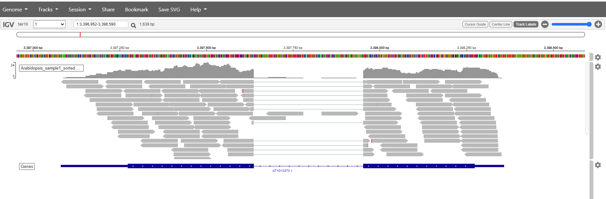
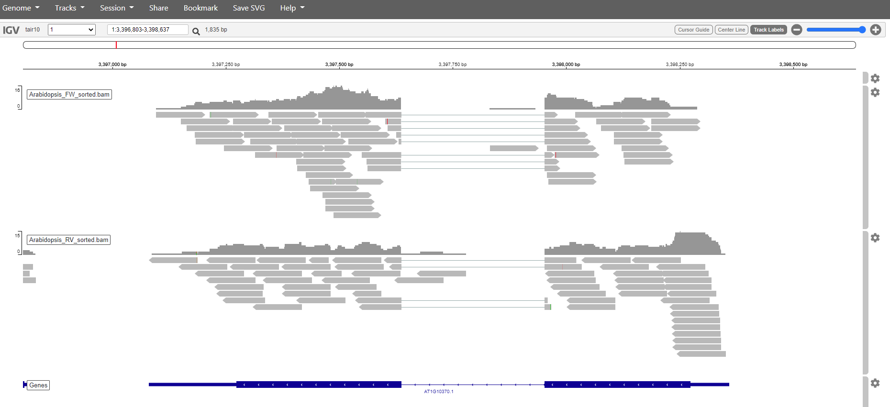

# Table of contents
<!-- MarkdownTOC autolink="true" -->

- [1. The SAM/BAM format](#1-the-sambam-format)
  - [1.1 What's in a SAM/BAM file](#11-whats-in-a-sambam-file)
  - [1.2 SAMtools](#12-samtools)
  - [1.3 SAMtools commands](#13-samtools-commands)
  - [2.4 Counting and sorting](#24-counting-and-sorting)
- [3. Visualization of a BAM file](#3-visualization-of-a-bam-file)
  - [3.1. Preparation of the BAM file for IGV](#31-preparation-of-the-bam-file-for-igv)
    - [Sorting](#sorting)
    - [Indexing](#indexing)
    - [Transfer the files to your local computer](#transfer-the-files-to-your-local-computer)
  - [3.2. IGV](#32-igv)
- [4. Creating the counts file](#4-creating-the-counts-file)

<!-- /MarkdownTOC -->

# 1. The SAM/BAM format
[SAM files](https://github.com/adamfreedman/knowyourdata-genomics/blob/gh-pages/lessons/01-know_your_data.md#aligned-reads-sam),
are tab-delimited text files that contain information for each individual read and its alignment to the genome. While we do not
have time to go in detail of the features of the SAM format, the paper by
[Heng Li et al.](http://bioinformatics.oxfordjournals.org/content/25/16/2078.full) provides a lot more detail on the specification.

**The compressed binary version of SAM is called a BAM file.** We use this version to reduce size and to allow for *indexing*, which enables efficient random access of the data contained within the file.

## 1.1 What's in a SAM/BAM file
The file begins with a **header**, which is optional. The header is used to describe source of data, reference sequence, method of
alignment, etc., this will change depending on the aligner being used. Following the header is the **alignment section**. Each line
that follows corresponds to alignment information for a single read. Each alignment line has **11 mandatory fields** for essential
mapping information and a variable number of other fields for aligner specific information. An example entry from a SAM file is
displayed below with the different fields highlighted.

 
 
Additionally tags (or attribute) can be aded to each of of the lines. These tags give some aditional information on the alignment. The number and type of tags varies between different alinment tools and the settings within these tools.
Here a list of tags that are commonly used.
 

|Tag:Type|Meaning|
|----|----|-------|
|NM:i |Edit distance|
|MD:i |Mismatching positions/bases|
|AS:i |Alignment score|
|BC:z |Barcode sequence|
|X0:i |Number of best hits|
|X1:i |Number of suboptimal hits found by BWA|
|XN:i |Number of ambiguous bases in the reference|
|XM:i |Number of mismatches in the alignment|
|XO:i |Number of gap opens|
|XG:i |Number of gap extentions|
|XT |Type: Unique/Repeat/N/Mate-sw|
|XA:z |Alternative hits; format: (chr,pos,CIGAR,NM;)|
|XS:i |Suboptimal alignment score|
|XF:i |Support from forward/reverse alignment|
|XE:i |Number of supporting seeds|

 
To start of we'll have a look at how to use samtools to have a peak at the the contents of the bam files. 

As these file are binary you can not simply use:
~~~
$ head Arabidopsis_sample1.bam 
~~~
{: .language-bash}

~~~
?BC?mRK??0t
=8?W???F?????BlӔ?^;?n
                     ?#??ٟ۟T??CA??h?????????$?|?K??
?????чa??z?9|M???4??~WH??5??7???ǻ?Ԇr?~wE?Bd"???}q????.??c?K^?}?GM?s???@(}??ql&R??=RF?H??I???9?????Q:5eM?M?4?ጃ3??=??7?^?+x????sp
??
8??$???0?g?V?Xy?!???hm?#?P2?qX?`<t???	-?<???????
?@?81??
       ? ???+?
c:??G?!       H
       ???v*???І?Pv???c?x????y?a)?/??S?8[??ޒ?y!?P:,??-5??????֫$I^ǽ???ͧ_?ߗ??<??BChc?\k?eYU????a???kw?}????}??????8?:???!?
3(
  QD??(?T??p?C??
?D?"?ф  0?? F???? ?0h&d?o?}έ?==u?F?tUݺU???k?????o??F???q????v????U????A????p{????ޕg?^p?ht?n?zj4j?W{L?mٕ??
!M)J???n:?3M??*5???U?>P???!???ٍi?$I?eY?-
                                       c???0
                                            ?H?????	=?R?}WG/~>??????ޫ????s??/l?^r?/z??????x^u???'?'U?x@???N`o??G#?m??P?)ӕ?S??U?H?5?ѕ?\xJy???NH??????
?f?>?R?I
~~~
{: .output}

This will give an unreadable result. SAMtools can help us to make the content readable.

## 1.2 SAMtools

SAMtools provide various utilities for manipulating alignments in the SAM format, including sorting, merging, indexing and generating alignments in a per-position format.  

Like many Unix commands, `samtools` commands follow a stream model, where data runs through each command as if carried on a conveyor belt. This allows combining multiple commands into a data processing pipeline. Although the final output can be very complex, only a limited number of simple commands are needed to produce it. If not specified, the standard streams (stdin, stdout, and stderr) are assumed. Data sent to stdout are printed to the screen by default but are easily redirected to another file using the normal Unix redirectors (`>` and `>>`), or to another command via a pipe (`|`).

## 1.3 SAMtools commands

SAMtools provides the following commands, each invoked as "samtools some_command".

- **view**  
The view command filters SAM or BAM formatted data. Using options and arguments it understands what data to select (possibly all of it) and passes only that data through. Input is usually a sam or bam file specified as an argument, but could be sam or bam data piped from any other command. Possible uses include extracting a subset of data into a new file, converting between BAM and SAM formats, and just looking at the raw file contents. The order of extracted reads is preserved.
- **sort**  
The sort command sorts a BAM file based on its position in the reference, as determined by its alignment. The element + coordinate in the reference that the first matched base in the read aligns to is used as the key to order it by. [TODO: verify]. The sorted output is dumped to a new file by default, although it can be directed to stdout (using the -o option). As sorting is memory intensive and BAM files can be large, this command supports a sectioning mode (with the -m options) to use at most a given amount of memory and generate multiple output file. These files can then be merged to produce a complete sorted BAM file [TODO - investigate the details of this more carefully].
- **index**  
The index command creates a new index file that allows fast look-up of data in a (sorted) SAM or BAM. Like an index on a database, the generated *.sam.sai or *.bam.bai file allows programs that can read it to more efficiently work with the data in the associated files.
- **tview**  
The tview command starts an interactive ascii-based viewer that can be used to visualize how reads are aligned to specified small regions of the reference genome. Compared to a graphics based viewer like IGV,[3] it has few features. Within the view, it is possible to jumping to different positions along reference elements (using 'g') and display help information ('?').
- **mpileup**  
The mpileup command produces a pileup format (or BCF) file giving, for each genomic coordinate, the overlapping read bases and indels at that position in the input BAM files(s). This can be used for SNP calling for example.
- **flagstat**    
Counts the number of alignments for each FLAG type.  

Looking at the content of the file using samtools view:
~~~
$ samtools view Arabidopsis_sample1.bam | head
~~~
{: .language-bash}

~~~
ERR1406259.2	16	Chr1	17425094	60	85M228N16M	*	0	0	TGAGAATAAAACCATATGGGTTGGTGATTTGCATCACTGGATGGATGAGGCTTATCTTAATTCTTCTTTTGCTTCCGGCGACGAGAGAGAGATTGTTTCGG	CDEDDDDDB@4DEDDDDDDDDDDDDDDDDDDDDDCAEEDEFFFEFFHHHGHJJJIHJJJIIIGIIJIJJJJJJJFJJJIIIGJJIJJJHHHHHFFFFFCCC	AS:i:0	XN:i:0	XM:i:0	XO:i:0	XG:i:0	NM:i:0	MD:Z:101	YT:Z:UU	XS:A:+	NH:i:1
ERR1406259.5	0	Chr1	25446585	60	101M	*	0	0	AATTATTGGGCCATATCCCGACCCCTTTGGCAAACCCATCGACCGTTCCAAGAATCCCTCCGGTAATCCCTCCGGCAACCCCAATAATAAGCTTATCAAGC	CCCFFFFFHHHHGJIJJJJJJJJIJJJIIIDHJIIJJJJJGIJGIFGIGIHHHHHHFFFFDDDB?BD@CDDDBBDDDDDDDDDDDDDEEDDDDDDDDEDDC	AS:i:0	XN:i:0	XM:i:0	XO:i:0	XG:i:0	NM:i:0	MD:Z:101	YT:Z:UU	NH:i:1
ERR1406259.11	0	Chr1	22700646	60	101M	*	0	0	GCCATGTTGGGTGCAGCTGGAGCTATTGCTCCTGAGATTTTAGGAAAGGCTGGTCTGATTCCAGCAGAGACTGCTCTTCCTTGGTTCCAAACCGGTGTGAT	@@@DFDDEFDHBFHIIJJGIIJJIIJJFJFJJJJJJGIJJJJIGGHJ@FGHIE=FHIJJIGEHGJJGH=A3=CED?DEFF<CCCCCDCEDDDDBD385@DD	AS:i:0	XN:i:0	XM:i:0	XO:i:0	XG:i:0	NM:i:0	MD:Z:101	YT:Z:UU	NH:i:1
ERR1406259.10	0	Chr1	11215252	60	69M263N32M	*	0	0	CCGTTCACTATCAAGTGCGGTAAACCGTCTGACCCGCATAACAATCCGTACTTCCCGTAGTTGTCGAACCTGCGTTTGGTTTTCTCGATCTGAGCATTGAG	@@CFFFFFHHHHHJJBGIHIFFIJJGGIIIIJIGGGIIIIJIIGIIJIGIIGGJJHHHFFBDEECBA;ABCDDD289@D<?BB>@AB:>BBD>>>CCC@>C	AS:i:0	XN:i:0	XM:i:0	XO:i:0	XG:i:0	NM:i:0	MD:Z:101	YT:Z:UU	XS:A:-	NH:i:1
ERR1406259.12	16	Chr1	30360823	60	101M	*	0	0	AAGAGTGTCACAGAGCTTGAGAAGGAATATGAGATTAGGGGCTGCGGCAGAAAGGACTGGATTGATAAAAGAGGAGACTGGAGGTCTAAGGCTTATGGTTG	CDDDDDCDCCCDCCDDEEEEEEFFDDFEFFHEEC;ACGHFGGFJJIIHGF?*JJIHGGJJIJIGHBJJIJIJJIHFBIHJJJIGGGJJHHHHHFDFFF@@?	AS:i:0	XN:i:0	XM:i:0	XO:i:0	XG:i:0	NM:i:0	MD:Z:101	YT:Z:UU	NH:i:1
ERR1406259.13	0	Chr1	25048653	60	49M136N52M	*	0	0	CATCATAGTATCCGGGTGAGTTACCGTGCTCACGGTACACAAATCCGTGCTCCAACTCGAATTCAACACAAGGAATCCACTTGTTGCGGATAAGGTAGTCA	CCCFFFFFFHHHHJJJEFHJJIJJJIGIJJJJJJJGIIJJJJJJJJJJJJJJJJGIJJHHHHFFFFFFDDDEDDDCDDDDDDDDDDDDDDDDDDD@@CDED	AS:i:0	XN:i:0	XM:i:0	XO:i:0	XG:i:0	NM:i:0	MD:Z:101	YT:Z:UU	XS:A:-	NH:i:1
ERR1406259.17	16	Chr1	19517907	60	101M	*	0	0	TCCAAGCTGAGGGAAGAACTCTAGATGATCAAGAATCCTATCGGGACAAAATAATTGAGTACAAGAGTCTTGAAGATGTTGTTGAGGATAATATCAGTTTG	ADDDDDDDDEEEEEEFFDFFFHHHHHHHHJJJIIGGIJJJJJJJJJJJJJIJJJJJJJJJIJJIJIHIJJJJJJJJJJJJJJJJJJJJHHHHHFFFFFCCC	AS:i:0	XN:i:0	XM:i:0	XO:i:0	XG:i:0	NM:i:0	MD:Z:101	YT:Z:UU	NH:i:1
ERR1406259.24	16	Chr1	6804452	60	49M153N52M	*	0	0	CAGCATCGTCCACTTCCACTTGCCCTCCCGGCGGCAATAATTTGCACAACTGTGGGGCTACAAGAATGTAACCATGCGAAGCGATGTGGTTAAGAACGTCA	:4?8(0>@CCC@CC@>>4<82<@<8=?8896=7E>EC?CD@IGGC=@C7CAF@@BDB9?9FHGD>BBHDFBCIIHHBGHEHBGA<+ACBBHDFDBA;D@<@	AS:i:0	XN:i:0	XM:i:0	XO:i:0	XG:i:0	NM:i:0	MD:Z:101	YT:Z:UU	XS:A:-	NH:i:1
ERR1406259.25	0	Chr1	7738049	60	101M	*	0	0	GCTGAACGAATGGCCCGGAGAAGCGATTTTGATCAGNATTCATCAGGAGGAGCCAGTTATCCATCACACGGTGAGATNTACGAAGTTGTTCTCTACTTTGG	CCCFFFFFGFHHHJJJJJGGIJBBHIGIIIEAEDHI#0<FHEIEGIEGIICFCACE>BEFCCEDEEDCD@B?B@BCC#,8??@AB?CDDDDECCACDDEAC	AS:i:-2	XN:i:0	XM:i:2	XO:i:0	XG:i:0	NM:i:2	MD:Z:36T40G23	YT:Z:UU	NH:i:1
ERR1406259.32	16	Chr1	4393371	60	99M2S	*	0	0	TAAGAACCTTCTTGGCTCCAGCCTGAAGGTGCTTCCCAGCACCGTCTCTGTCAACAAACACTCCGGTTCCTTCGATAACTAAGTCAATGCCTAGTTCCCCC	ADCA>3BC?BDCDDDDBDDBDDDDCCCDDDDBCBDEEED?5GGHHIIJJJIGHIJHF=FCJHJJJJJIIIJJIJIJJJJIJJJIIIGJGHFFHFFFFFCC@	AS:i:-2	XN:i:0	XM:i:0	XO:i:0	XG:i:0	NM:i:0	MD:Z:99	YT:Z:UU	NH:i:1
~~~
{: .output}

SAMtools will make the data readeble, this data is then piped through head to show the first 10 lines of the file.  

## 2.4 Counting and sorting

SAMtools `view` can be used to filter the alignment based on characters like mapping quality, chromosome, orientation etc. When the `-c` option is added the filtered selection is counted.  

 
Count the total number of records:  
~~~
$ samtools view -c Arabidopsis_sample1.bam 
~~~
{: .language-bash}

~~~
$ 263657
~~~
{: .output}
 

Count with `flagstat` for additional information:
~~~
$ samtools flagstat arabidopsis1.bam
~~~
{: .language-bash}

~~~
263657 + 0 in total (QC-passed reads + QC-failed reads)
14232 + 0 secondary
0 + 0 supplementary
0 + 0 duplicates
263142 + 0 mapped (99.80% : N/A)
0 + 0 paired in sequencing
0 + 0 read1
0 + 0 read2
0 + 0 properly paired (N/A : N/A)
0 + 0 with itself and mate mapped
0 + 0 singletons (N/A : N/A)
0 + 0 with mate mapped to a different chr
0 + 0 with mate mapped to a different chr (mapQ>=5)
~~~
{: .output}
 

Count the records using the [FLAG](https://broadinstitute.github.io/picard/explain-flags.html) argument. 
Count the alignments that don't align.  
~~~
$ samtools view -f 4 -c Arabidopsis_sample1.bam
~~~
{: .language-bash}

~~~
$ 515
~~~
{: .output}

The argument `-f` includes reads that fit samflag 4, read unmapped.  

Count the reads that do align:  
~~~
$ samtools view -F 4 -c Arabidopsis_sample1.bam
~~~
{: .bash}

~~~
$ 263657
~~~
{: .output}

Here `-F` is used to exclude reads that fit samflag 4, read unmapped. Everything else is included.  

> ## Question
> Sometimes you will see that this number of alignments is higher then the number of sequences in your fastq file. How can this be? 
> > ## Solution
> >  When a read multimaps (aligned to multiple positions in the genome), each of these positions is included as a separate alignment. 
> {: .solution}
{: .challenge}
 

Write your selection to a new file:
~~~
samtools view -Sb -F 4 -o Arabidopsis_sample1_mapped.bam Arabidopsis_sample1.bam
~~~
{: .language-bash}

In this command `-Sb` is needed to keep the file binairy(compressed), and `-o` specifies the output filename (a bam file again).  
 

Count the reads that align to the forward strand:
~~~
$ samtools view -F 20 -c Arabidopsis_sample1.bam
~~~
{: .language-bash}

~~~
$ 131631
~~~
{: .output}

Use `-F 20` to exclude "read reverse strand" and "read unmapped".  

Count the reads that align to the reverse strand:
~~~
$ samtools view -f 16 -c Arabidopsis_sample1.bam 
~~~
{: .language-bash}

~~~
$ 131511
~~~
{: .output}

With `-f 16` you select for "read reverse strand".
 

With SAMtools it is also posible to select for alignments with a minimal mapping quality.  
Alignments with a maximal score (60 for `hisat2` output files and 255 for `STAR` output files) are truly unique:  
~~~
$ samtools view -q 60 -c Arabidopsis_sample1.bam
~~~
{: .language-bash}

~~~
$ 240224
~~~
{: .output}

This number can never be bigger then the number of reads in the fastq file, as all reads in the output give a single alignment.

> ## Question
> BAM files usually contain a tag or attribute that gives the number of mismatches between the read and the reference genome. With SAMtools it is unfortunately not possible to filter on these values. Could you think of an other way to select for alignments that align without any mismatches?  
> Hint: make use of `grep "XM:i:0"` among others.
> > ## Solution
> > ~~~
> > samtools view Arabidopsis_sample1.bam | grep "XM:i:0" | wc -l
> > ~~~
> > {: .language-bash}
> {: .solution}
{: .challenge}

 

# 3. Visualization of a BAM file

A BAM file can be visualized using a genome viewer like IGV.  
We can't just upload the files in the viewer. We first need the files to be sorted and indexed.
This can be done making use of SAMtools `sort` and `index` commands.

## 3.1. Preparation of the BAM file for IGV

### Sorting

Samtools can also be used to sort the read alignments. The aliments will be sorted based on the position ofv the alignment on the reference genome, starting from the beginning of chromosome 1 to the end of the last chromosome.

~~~
$ samtools sort -o arabidopsis1_sorted.bam arabidopsis1.bam
~~~
{: .language-bash}

where `-o` defines the name of the output file (also a BAM file).  
The default for samtools sort is sorting by position. There are more sorting posibilities to be found with `samtools sort --help`.  

### Indexing
An index file is needed to get access rapidly to different alignment regions in the BAM alignment file.    
~~~
samtools index arabidopsis1_sorted.bam
~~~
{: .language-bash}

Only the input file name needs to be specified, based on this name a `.bai` (BAM index) is produced.

### Transfer the files to your local computer

Next the files need to be downloaded to your local computer.   
First, we need to exit the container (ctrl/cmd + d) and next create a folder on your VM outside the container:

~~~
$ mkdir IGVfiles
~~~
{: .language-bash}

 
Copy the files (both the `.bam` and the `.bai`), or just the whole content of the directory mapped:
~~~
$ docker cp bioinfo:/home/mapped/ ~/IGVfiles/
~~~
{: .language-bash}

 

Go to your local computer, create a directory and download the files from the VM:
~~~
$ mkdir IGV
~~~
{: .language-bash}
 
Download the sorted `.sorted.bam` files:
~~~
$  scp -r root@178.128.240.207:~/home/tutorial/IGVfiles/mapped/*sorted.bam ~/Desktop/IGV
~~~
{: .language-bash}
 
And the index (`.bai`) files:
~~~
scp -r root@178.128.240.207:~/home/tutorial/IGVfiles/mapped/*.bai ~/Desktop/IGV
~~~
{: .language-bash}

## 3.2. IGV

For this exercise we'll be making use of an online version of [IGV](https://igv.org/app/). 
The Arabidopsis genome that we used for the mapping is available in this web app.   
It can be found under "Genome -> A. thaliana (TAIR 10)".   

The BAM files can be added as a track. Choose "Tracks -> local file". Select both the `.bam` file and the accompanying `.bai`.

You should get something like this:  

  
Mapping has in this case only been done against chromosome 1. So if we want to see are reads choose chromosome 1. Zoom in to see the reads.

 

It is also posible to search for genes. Just write the name in the search box and click the magnification glass. Try with the genes: 
- AT1G16080,
- AT1G10370

 

 

> ## Question
> Pick a sample and visualize the forward and reverse alignments separately in IGV.
> > ## Solution
> >  Select and sort forward reads in one go. `samtools view -Sb -F 20 Arabidopsis_sample1.bam | samtools sort -o Arabidopsis_FW_sorted.bam` Index the forward reads. `samtools index Arabidopsis_FW_sorted.bam` Select and sort the reverse reads. `samtools view -Sb -f 16 Arabidopsis_sample1.bam | samtools sort -o Arabidopsis_RV_sorted.bam` Index the reverse reads. `samtools index Arabidopsis_RV_sorted.bam` From the Desktop of your local computer create directory and download the files. `mkdir IGV` `scp -r root@178.128.240.207:~/home/tutorial/IGVfiles/mapped/*sorted.bam* ~/Desktop/IGV`  Upload the files in IGV and you should get something like this.
> {: .solution}
{: .challenge}

 

# 4. Creating the counts file

For downstream applications e.g. differential expression analysis, the number of reads that maps within a gene has to be determined for each sample.  

The `featureCounts` program from the [Subread](http://subread.sourceforge.net/) package can do this. The complete user guide is available [here](http://bioinf.wehi.edu.au/subread-package/SubreadUsersGuide.pdf) and `featureCounts` is in section 6.2. 

`featureCounts` can...count (!) the number of reads that map within a feature. The Arabidopsis genome annotation in the GFF3 format contain three different features to choose from.  

Depending on the downstream applications the choice is `gene`, `transcript` or `exon`. In this study we are just looking for differentially expressed genes so our feature of interest specified by the `-t` will be `gene`.  
~~~
$ cd /home/

$ gunzip ath_annotation.gff3.gz

$ featureCounts -O -t gene -g ID -a ath_annotation.gff3 -o counts.txt mapped/*.bam
~~~
{: .bash}

Here is an explanation of the different arguments used:  
* `-a <string>`: Name of an annotation file. GTF/GFF format by default.
* `-o <string>`: Name of the output file including read counts.
* `-O`: Assign reads to all their overlapping meta-features.
* `-t <string>`: Specify feature type in the GTF/GFF annotation to summarise the counts. 
* `-g <string>`: Specify attribute type in GTF/GFF annotation. This GTF/GFF determines the name of the features.  

The output file produced by `featureCounts` is a tab-delimited file that can be opened in a spreadsheet program like Excel.
