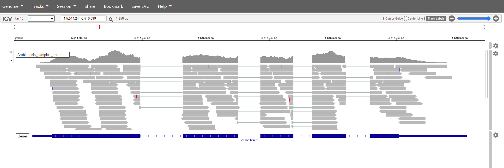

# 1. Table of Contents
<!-- TOC -->

- [1. Table of Contents](#1-table-of-contents)
- [2. The SAM/BAM format](#2-the-sambam-format)
    - [2.1 What's in a SAM/BAM file](#21-whats-in-a-sambam-file)
    - [2.2 Samtools](#22-samtools)
    - [2.3 SAMtools commands](#23-samtools-commands)
    - [2.4 counting and sorting](#24-counting-and-sorting)
- [3. Visualazation of a bam file](#3-visualazation-of-a-bam-file)
    - [3.1. Preparation of the Bam file for IGV](#31-preparation-of-the-bam-file-for-igv)
        - [Sorting](#sorting)
        - [Indexing](#indexing)
    - [3.2. IGV](#32-igv)
- [6. Creating the counts file](#6-creating-the-counts-file)

<!-- /TOC -->

# 2. The SAM/BAM format
The [SAM file](https://github.com/adamfreedman/knowyourdata-genomics/blob/gh-pages/lessons/01-know_your_data.md#aligned-reads-sam),
is a tab-delimited text file that contains information for each individual read and its alignment to the genome. While we do not
have time to go in detail of the features of the SAM format, the paper by
[Heng Li et al.](http://bioinformatics.oxfordjournals.org/content/25/16/2078.full) provides a lot more detail on the specification.

**The compressed binary version of SAM is called a BAM file.** We use this version to reduce size and to allow for *indexing*, which enables efficient random access of the data contained within the file.

## 2.1 What's in a SAM/BAM file
The file begins with a **header**, which is optional. The header is used to describe source of data, reference sequence, method of
alignment, etc., this will change depending on the aligner being used. Following the header is the **alignment section**. Each line
that follows corresponds to alignment information for a single read. Each alignment line has **11 mandatory fields** for essential
mapping information and a variable number of other fields for aligner specific information. An example entry from a SAM file is
displayed below with the different fields highlighted.

   
To start of we'll have a look at how to use samtools to have a peak at the the contents of the bam files. 

As these file are binary you can not simply use:
~~~
$ head arabidopsis1.bam
~~~
This will give an unreadable result.
samtools can help us to make the content readable 
## 2.2 Samtools
SAM Tools provide various utilities for manipulating alignments in the SAM format, including sorting, merging, indexing and generating alignments in a per-position format.
  
Like many Unix commands, SAMtool commands follow a stream model, where data runs through each command as if carried on a conveyor belt. This allows combining multiple commands into a data processing pipeline. Although the final output can be very complex, only a limited number of simple commands are needed to produce it. If not specified, the standard streams (stdin, stdout, and stderr) are assumed. Data sent to stdout are printed to the screen by default but are easily redirected to another file using the normal Unix redirectors (> and >>), or to another command via a pipe (|).

## 2.3 SAMtools commands

SAMtools provides the following commands, each invoked as "samtools some_command".

- **view** 
The view command filters SAM or BAM formatted data. Using options and arguments it understands what data to select (possibly all of it) and passes only that data through. Input is usually a sam or bam file specified as an argument, but could be sam or bam data piped from any other command. Possible uses include extracting a subset of data into a new file, converting between BAM and SAM formats, and just looking at the raw file contents. The order of extracted reads is preserved.
- **sort** 
The sort command sorts a BAM file based on its position in the reference, as determined by its alignment. The element + coordinate in the reference that the first matched base in the read aligns to is used as the key to order it by. [TODO: verify]. The sorted output is dumped to a new file by default, although it can be directed to stdout (using the -o option). As sorting is memory intensive and BAM files can be large, this command supports a sectioning mode (with the -m options) to use at most a given amount of memory and generate multiple output file. These files can then be merged to produce a complete sorted BAM file [TODO - investigate the details of this more carefully].
- **index** 
The index command creates a new index file that allows fast look-up of data in a (sorted) SAM or BAM. Like an index on a database, the generated *.sam.sai or *.bam.bai file allows programs that can read it to more efficiently work with the data in the associated files.
- **tview** 
The tview command starts an interactive ascii-based viewer that can be used to visualize how reads are aligned to specified small regions of the reference genome. Compared to a graphics based viewer like IGV,[3] it has few features. Within the view, it is possible to jumping to different positions along reference elements (using 'g') and display help information ('?').
- **mpileup** 
The mpileup command produces a pileup format (or BCF) file giving, for each genomic coordinate, the overlapping read bases and indels at that position in the input BAM files(s). This can be used for SNP calling for example.
- **flagstat**   

Looking at the content of the file using samtools view:
~~~
$ samtools view arabidopsis1.bam | head
~~~
Samtools will make the data readeble, this data is then piped through head to show the first 5 lines of the file 
## 2.4 counting and sorting

samtools view can be used to filter the alignment based on characters like mapping quality, chromosome, orientation etc. When the -c option is added the filtered selection is counted.  

Count the total number of records:

~~~
$ samtools view -c arabidopsis1.bam
~~~
 
Count with flagstat for additional information:
~~~
$ samtools flagstat arabidopsis1.bam
~~~
 
Count the records that align (reads mapping to multiple locations are counted multiple times):
~~~
$ samtools view -F 4 -c arabidopsis1.bam
~~~
here filtering is based on the [samflags](https://broadinstitute.github.io/picard/explain-flags.html). -f include alignments the fit the value, -F exclude alignments that fit the value
  
Count the reads that map the forward strand
~~~
$ samtools view -F 20 -c arabidopsis1.bam
~~~
 
Count the reads that map the reverse strand
~~~
$ samtools view -f 10 -c arabidopsis1.bam
~~~
 
Select alignments with no mismatches and write to a new file
~~~
$ samtools filter -tag XM:0 -in arabidopsis1.bam -out arabidopsis1_noMismatch.bam
~~~
 
Alternativly this can be done using samtools view and pipe it through grep
~~~
$ samtools view arabidopsis1.bam | grep "XM:0" | wc -l
~~~
 
 
# 3. Visualazation of a bam file

A BAM file can be visualized using a genome viewer like IGV.
We can't just upload the files in the viewer. We first need the files to be sorted and indexed.
To do this we make use of samtools. This is a tool specificaly designed to work with BAM and SAM files.

## 3.1. Preparation of the Bam file for IGV

### Sorting

Samtools can also be used to sort the read alignments. The aliments will reordered starting from the beginning of chromosome 1 to the end of the last chromosome.

~~~
$ samtools sort -o arabidopsis1_sorted.bam arabidopsis1.bam
~~~

where -o defines the name of the output file (also a bam).
The default for samtools sort is sorting by position. There are more sorting posibilities to be found with samtools sort --help

### Indexing

~~~
$ samtools index arabidopsis1_sorted.bam
~~~
Only the input file name needs to be specified, based on this name a .bai (bam index) is produced.

## 3.2. IGV

For this exercise we'll be making use of an online version of [IGV](https://igv.org/app/). 
The arabidopsis genome that we used for the mapping is available in this web app. It can be found under genome -> A. thaliana (TAIR 10). The bam files can be added as a track. Choose tracks -> local file.
select both the bam file and the accompanying bai. 
You should get something like this

  
Mapping has in this case only been done against chromosome 1. So if we want to see are reads choose chromosome 1. Zoom in to see the reads.

  
It is also posible to search for genes. just pop the name in the search box and click the magnificationsglass. Try with the genes: AT1G16080, AT10370

  

# 6. Creating the counts file

For downstream application for each of the samples the number of reads that maps within a gene has to be determined.
Featurecounts from the subread package can do this.

FeatureCounts can count the number of reads that map within a feature. In case of the arabidopsis annotation there are three different features to choose from. Depending on the downstream applications the choice is gene, transcript or exon. In this study we are just looking for differientially expressed genes.

~~~
$ cd /home/

$ gunzip ath_annotation.gff3.gz

$ featureCounts -O -t gene -g ID -a ath_annotation.gff3 -o counts.txt mapped/*.bam
~~~

-a <string>         Name of an annotation file. GTF/GFF format by default.
-o <string>         Name of the output file including read counts.
-O                  Assign reads to all their overlapping meta-features.
-t <string>         Specify feature type in GTF annotation
-g <string>         Specify attribute type in GTF annotation. Determines the name of the features.

The output file produced by `featureCounts` is a tab-delimited file, can be opened in a program like excel.