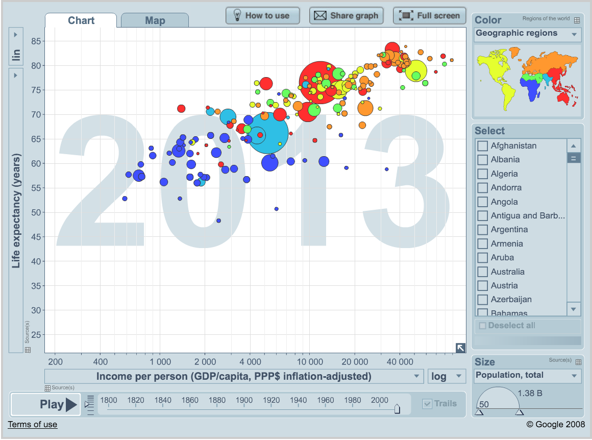
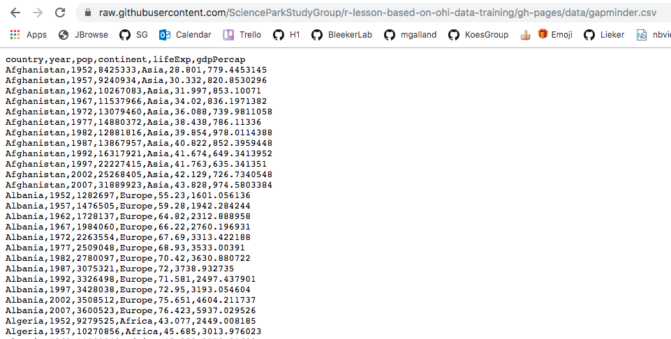
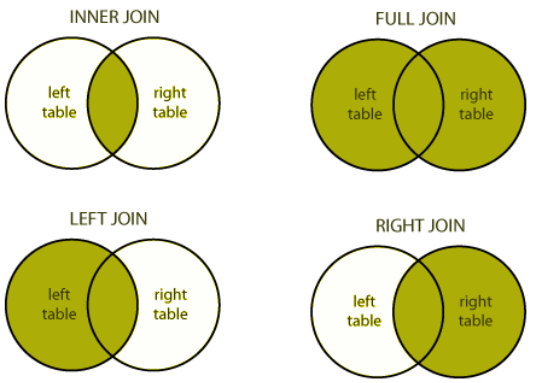

## Table of contents
1. [Introduction](#introduction)
2. [Gapminder dataset](#gapminder-dataset)
3. [Tidy data](#tidy-data)
4. [Explore the gapminder dataframe](#explore-gapminder-dataframe)
5. [`dplyr` basics](#dplyr-basics)
6. [`filter()` observations](#filter-observations)
7. [`select()` variables](#select-variables)
8. [Use `select()` and `filter()` together: the awesome pipe](#use-select-and-filter-together-the-awesome-pipe)
9. [`mutate()` adds new variables](#mutate-adds-new-variables)
10. [`group_by` makes group that can be`summarize()`](#group_by-makes-group-that-can-be-summarize)
11. [`arrange()` orders columns](#arrange-orders-columns)
12. [All together now](#all-together-now)
13. [Joining datasets](#joining-datasets)

## Introduction
Why should we care about data transformation?   
> Data scientists, according to interviews and expert estimates, spend from __50 percent to 80 percent__ of their time mired in the mundane labor of collecting and preparing data, before it can be explored for useful information. - [NYTimes (2014)](http://www.nytimes.com/2014/08/18/technology/for-big-data-scientists-hurdle-to-insights-is-janitor-work.html)

What are some common things you like to do with your data? Maybe remove rows or columns, do calculations and maybe add new columns? This is called **data wrangling** (or more simply data transformation). It's not data management or data manipulation: you **keep the raw data raw** and do these things programatically in R with the tidyverse.

We are going to introduce you to data wrangling in R first with the `tidyverse`. The `tidyverse` is a new suite of packages that match a philosophy of data science developed by Hadley Wickham and the RStudio team. I find it to be a more straight-forward way to learn R. We will also show you by comparison what code will look like in _base-R_, which means, in R without any additional packages (like the `tidyverse` package)  installed. I like David Robinson's blog post on the topic of [teaching the tidyverse first](http://varianceexplained.org/r/teach-hard-way).

For some things, _base-R_ is more straightforward, and we'll show you that too. Whenever we use a function that is from the `tidyverse`, we will prefix it so you'll know for sure. 

### Resources

Today's materials are again borrowing from some excellent sources, including:

- Jenny Bryan's lectures from STAT545 at UBC: [Introduction to dplyr](http://stat545.com/block009_dplyr-intro.html)
- Hadley Wickham and Garrett Grolemund's [R for Data Science](http://r4ds.had.co.nz/)
- Software Carpentry's R for reproducible scientific analysis materials: [Dataframe manipulation with dplyr](http://swcarpentry.github.io/r-novice-gapminder/13-dplyr.html)
- First developed for [Software Carpentry at UCSB](http://remi-daigle.github.io/2016-04-15-UCSB/dplyr/)
- [RStudio's data wrangling cheatsheet](http://www.rstudio.com/wp-content/uploads/2015/02/data-wrangling-cheatsheet.pdf) 
- [RStudio's data wrangling webinar](https://www.rstudio.com/resources/webinars/data-wrangling-with-r-and-rstudio/) 

## Gapminder dataset

**Gapminder data**

We'll be using [Gapminder data](http://www.gapminder.org/world), which represents the health and wealth of nations. It was pioneered by [Hans Rosling](https://www.ted.com/speakers/hans_rosling), who is famous for describing the prosperity of nations over time through famines, wars and other historic events with this beautiful data visualization in his [2006 TED Talk: The best stats you've ever seen](https://www.ted.com/talks/hans_rosling_shows_the_best_stats_you_ve_ever_seen): 

We'll use the package `dplyr`, which is bundled within the `tidyverse` package. Please load the `tidyverse` if not already done. : 

~~~
library("tidyverse")
~~~
{:.language-r}

## Tidy Data

Let's start off discussing tidy Data. Hadley Wickham, RStudio's Chief Scientist, and his team have been building R packages for data wrangling and visualization based on the idea of **tidy data**. 

Tidy data has a simple convention: put variables in the columns and observations in the rows.

The national parks dataset we were working with this morning was an example of tidy data. When data are tidy, you are set up to work with it for your analyses, plots, etc. 

 

Right now we are going to use `dplyr` to wrangle this tidy-ish data set (the transform part of the cycle), and then come back to tidying messy data using `tidyr` once we've had some fun wrangling. These are both part of the `tidyverse` package that we've already installed:

 

Conceptually, making data tidy first is really critical. Instead of building your analyses around whatever (likely weird) format your data are in, take deliberate steps to make your data tidy. When your data are tidy, you can use a growing assortment of powerful analytical and visualization tools instead of inventing home-grown ways to accommodate your data. This will save you time since you aren't reinventing the wheel, and will make your work more clear and understandable to your collaborators (most importantly, you in 6 months aka your future self). 

And actually, Hadley Wickham and RStudio have created a ton of packages that help you at every step of the way here. This is from one of Hadley's presentations: 

### Setup

We'll do this in a new RMarkdown file. 

**Here's what to do:**

1. Clear your workspace (Session > Restart R)
2. New File > R Markdown...
3. Save as `gapminder-wrangle.Rmd`
4. Delete the irrelevant text and write a little note to yourself about this section. 

### Load `tidyverse` (which has `dplyr` inside)

In your R Markdown file, let's make sure we've got our libraries loaded and ensure that you have the following code in a code chunk:

~~~
library(tidyverse)   
~~~
{:.language-r}

This is becoming standard practice for how to load a library in a file, and if you get an error that the library doesn't exist, you can install the package easily by running the code within the comment (highlight `install.packages("tidyverse")` and run it).

## Explore the gapminder dataframe

Previously, we explored the national parks data.frame visually. Today, we'll explore a dataset by the numbers.
We will work with some of the data from the [Gapminder project](http://www.gapminder.org).   

The data are on GitHub. Navigate to: `https://github.com/ScienceParkStudyGroup/r-lesson-based-on-ohi-data-training/blob/gh-pages/data/gapminder_wide.csv`

This is data-view mode: so we can have a quick look at the data. It's a .csv file, which you've probably encountered before, but GitHub has formatted it nicely so it's easy to look at. You can see that for every country and year, there are several columns with data in them. 

### Read data with `readr::read_csv()`

We can read this data into R directly from GitHub, without downloading it. But we can't read this data in view-mode. We have to click on the **Raw button** on the top-right of the data. This displays it as the raw csv file, without formatting. 

Copy the url for raw data: `https://raw.githubusercontent.com/ScienceParkStudyGroup/r-lesson-based-on-ohi-data-training/gh-pages/data/
gapminder.csv`

Now, let's go back to RStudio. In our R Markdown, let's read this csv file and name the variable "gapminder". We will use the `read_csv()` function from the `readr` package (part of the `tidyverse`, so it's already installed!). 

~~~
## read gapminder csv. Note the readr:: prefix identifies which package it's in
gapminder <- readr::read_csv('https://raw.githubusercontent.com/ScienceParkStudyGroup/r-lesson-based-on-ohi-data-training/gh-pages/data/gapminder.csv') 
~~~
{:.language-r}

Note: `read_csv` works with local filepaths as well, you could use one from your computer.

Let's inspect: 
~~~
## explore the gapminder dataset
gapminder # this is super long! Let's inspect in different ways
~~~
{:.language-r}

Let's use `head` and `tail`: 
~~~
head(gapminder) # shows first 6
tail(gapminder) # shows last 6

head(gapminder, 10) # shows first X that you indicate
tail(gapminder, 12) # guess what this does!
~~~
{:.language-r}

`str()` will provide a sensible description of almost anything: when in doubt, inspect using `str()` on some of the recently created objects to get some ideas about what to do next.
~~~
str(gapminder) # ?str - displays the structure of an object
~~~
{:.language-r}

`gapminder` is a `data.frame`. We aren't going to get into the other types of data receptacles today ('arrays', 'matrices'), because working with data.frames is what you should primarily use. Why?

- data.frames package related variables neatly together, great for analysis
- most functions, including the latest and greatest packages actually __require__ that your data be in a data.frame
- data.frames can hold variables of different flavors such as
    - character data (country or continent names; "Characters (chr)") 
    - quantitative data (years, population; "Integers (int)" or "Numeric (num)")
    - categorical information (male vs. female)
  
We can also see the `gapminder` variable in RStudio's Environment pane (top right)

More ways to learn basic info on a data.frame. 
~~~
names(gapminder)
dim(gapminder)    # ?dim dimension
ncol(gapminder)   # ?ncol number of columns
nrow(gapminder)   # ?nrow number of rows
~~~
{:.language-r}

We can combine using `c()` to reverse-engineer `dim()`! It's a side-note here, but I wanted to introduce you to `c()`: we'll use it later.

~~~
c(nrow(gapminder), ncol(gapminder)) # ?c combines values into a vector or list. 
~~~
{:.language-r}

A statistical overview can be obtained with `summary()`, or with `skimr::skim()`
~~~
summary(gapminder)

library(skimr) # install.packages('skimr')
skim(gapminder)
~~~
{:.language-r}

### Look at the variables inside a data.frame

To specify a single variable from a data.frame, use the dollar sign `$`. The `$` operator is a way to extract of replace parts of an object — check out the help menu for `$`. It's a common operator you'll see in R. 

~~~
gapminder$lifeExp # very long! hard to make sense of...
head(gapminder$lifeExp) # can do the same tests we tried before
str(gapminder$lifeExp) # it is a single numeric vector
summary(gapminder$lifeExp) # same information, formatted slightly differently
~~~
{:.language-r}

## `dplyr` basics

OK, so let's start wrangling with dplyr.

There are five `dplyr` functions that you will use to do the vast majority of data manipulations:

- **`filter()`**: pick observations by their values

   
    
- **`select()`**: pick variables by their names

  
    
- **`mutate()`**: create new variables with functions of existing variables 

  
    
- **`summarise()`**: collapse many values down to a single summary 

   
  
- **`arrange()`**: reorder the rows

These can all be used in conjunction with `group_by()` which changes the scope of each function from operating on the entire dataset to operating on it group-by-group. These six functions provide the verbs for a language of data manipulation.

All verbs work similarly:

1. The first argument is a data frame.
2. The subsequent arguments describe what to do with the data frame. You can refer to columns in the data frame directly without using `$`.
3. The result is a new data frame.

Together these properties make it easy to chain together multiple simple steps to achieve a complex result.

## `filter()` observations

You will want to isolate bits of your data; maybe you want to only look at a single country or a few years. R calls this subsetting. 

`filter()` is a function in `dplyr` that takes logical expressions and returns the rows for which all are `TRUE`. 

Visually, we are doing this: 

Remember your logical expressions from this morning? We’ll use `<` and `==` here.

~~~
filter(gapminder, lifeExp < 29)
~~~
{:.language-r}

You can say this out loud: "Filter the gapminder data for life expectancy less than 29". Notice that when we do this, all the columns are returned, but only the rows that have the life expectancy less than 29. We've subsetted by row.

Let's try another: "Filter the gapminder data for the country Mexico".

~~~
filter(gapminder, country == "Mexico")
~~~
{:.language-r}

How about if we want two country names? We can't use the `==` operator here, because it can only operate on one thing at a time. We will use the `%in%` operator: 

~~~
filter(gapminder, country %in% c("Mexico", "Peru"))
~~~
{:.language-r}

How about if we want Mexico in 2002? You can pass filter different criteria:

~~~
filter(gapminder, country == "Mexico", year == 2002)
~~~
{:.language-r}

### Your turn 

> ## Exercise
>
> What is the mean life expectancy of Sweden? Hint: do this in 2 steps by assigning a variable and then using the `mean()` function.
> 
> > ## Solution
> > `x <- filter(gapminder, country == "Sweden")`  
> > `mean(x$lifeExp)`
>{: .solution}
{: .challenge}

<!---Don't use this one for now because gets off track for %>%
2. Choose a country. How much has the population changed since the earliest record? Hint: create variables for the earliest and most recent years, and subtract from each other.  
x1 <- filter(gapminder, country == "Sweden", year == 1952)
x2 <- filter(gapminder, country == "Sweden", year == 2007)
x2$pop - x1$pop
##  1906415
--->

## `select()` variables

We use `select()` to subset the data on variables or columns. 

Visually, we are doing this:

We can select multiple columns with a comma, after we specify the data frame (gapminder). 

~~~
select(gapminder, year, lifeExp) 
~~~
{:.language-r}

We can also use - to deselect columns

~~~
select(gapminder, -continent, -lifeExp) # you can use - to deselect columns
~~~
{:.language-r}

## Use `select()` and `filter()` together: the awesome pipe

Let's filter for *Cambodia* and remove the continent and *lifeExp* columns. We'll save this as a variable. Actually, as two temporary variables, which means that for the second one we need to operate on `gap_cambodia`, not `gapminder`. 

~~~
gap_cambodia  <- filter(gapminder, country == "Cambodia")
gap_cambodia2 <- select(gap_cambodia, -continent, -lifeExp) 
~~~
{:.language-r}

We also could have called them both `gap_cambodia` and overwritten the first assignment. Either way, naming them and keeping track of them gets super cumbersome, which means more time to understand what's going on and opportunities for confusion or error.

Good thing there is an awesome alternative.

### Meet the new pipe `%>%` operator

Before we go any further, we should exploit the new pipe operator that `dplyr` imports from the [`magrittr`](https://github.com/smbache/magrittr) package by Stefan Bache. **This is going to change your life**. You no longer need to enact multi-operation commands by nesting them inside each other. And we won't need to make temporary variables like we did in the Cambodia example above. This new syntax leads to code that is much easier to write and to read: it actually tells the story of your analysis.

Here's what it looks like: `%>%`. The RStudio keyboard shortcut: Ctrl + Shift + M (Windows), Cmd + Shift + M (Mac).

Let's demo then I'll explain:
~~~
gapminder %>% head()
~~~
{:.language-r}

This is equivalent to `head(gapminder)`. This pipe operator takes the thing on the left-hand-side and __pipes__ it into the function call on the right-hand-side. It literally drops it in as the first argument.

Never fear, you can still specify other arguments to this function! To see the first 3 rows of Gapminder, we could say `head(gapminder, 3)` or this:
~~~
gapminder %>% head(3)
~~~
{:.language-r}

**I've advised you to think "gets" whenever you see the assignment operator, `<-`. Similarly, you should think "and then" whenever you see the pipe operator, `%>%`.**

One of the most awesome things about this is that you START with the data before you say what you're doing to DO to it. So above: "take the gapminder data, and then give me the first three entries".

This means that instead of this:

~~~

## instead of this...
gap_cambodia  <- filter(gapminder, country == "Cambodia")
gap_cambodia2 <- select(gap_cambodia, -continent, -lifeExp) 

## ...we can do this
gap_cambodia  <- gapminder %>% filter(country == "Cambodia")
gap_cambodia2 <- gap_cambodia %>% select(-continent, -lifeExp) 
~~~
{:.language-r}

So you can see that we'll start with gapminder in the first example line, and then gap_cambodia in the second. This makes it a bit easier to see what data we are starting with and what we are doing to it.

...But, we still have those temporary variables so we're not truly that better off. But get ready to be majorly impressed:  

### Revel in the convenience

We can use the pipe to chain those two operations together:

~~~
gap_cambodia  <- gapminder %>% filter(country == "Cambodia") %>%
  select(-continent, -lifeExp) 
~~~
{:.language-r}

What's happening here? In the second line, we were able to delete `gap_cambodia2 <- gap_cambodia`, and put the pipe operator above. This is possible since we wanted to operate on the `gap_cambodia` data anyways. And we weren't truly excited about having a second variable named `gap_cambodia2` anyways, so we can get rid of it. This is huge, because most of your data wrangling will have many more than 2 steps, and we don't want a `gap_cambodia14`!

Let's write it again but using multiple lines so it's nicer to read. 

~~~
gap_cambodia  <- gapminder %>% 
  filter(country == "Cambodia") %>%
  select(-continent, -lifeExp) 
~~~
{:.language-r}
Amazing. I can actually read this like a story and there aren't temporary variables that get super confusing. In my head: 

>start with the `gapminder` data, and then  
filter for Cambodia, and then  
deselect the variables continent and lifeExp.

Being able to read a story out of code like this is really game-changing. We'll continue using this syntax as we learn the other dplyr verbs. 

## `mutate()` adds new variables

Alright, let's keep going. 

Let's say we needed to add an index column so we know which order these data came in. Let's not make a new variable, let's add a column to our gapminder data frame. How do we do that? With the `mutate()` function. 

Visually, we are doing this: 

We will name our new column index. We will name the new column 'index'; and we assign it with a single `=`. Notice that we can use the `nrow` function *within* our mutate call:

~~~
gapminder %>% 
  mutate(index = 1:nrow(gapminder))
~~~
{:.language-r}

OK, let's do another example. Imagine we wanted to recover each country's GDP. After all, the Gapminder data has a variable for population and GDP per capita. 

~~~
gapminder %>%
  mutate(gdp = pop * gdpPercap)
~~~
{:.language-r}

### Your turn 

> ## Exercise
> 
> Find the maximum gdpPercap of Egypt and the maximum gdpPercap of Vietnam. Create a new column with `mutate()`. Hint: use `max()`.
>
> > ## Solution
> > **Egypt:**  
> > `gapminder %>%`  
> >  `select(-continent, -lifeExp) %>%` (not super necessary but to simplify)  
> >  `filter(country == "Egypt") %>%`   
> >  `mutate(gdp = pop * gdpPercap) %>%`    
> >  `mutate(max_gdp = max(gdp))`  
> > 
> >  **Vietnam:**  
> > `gapminder %>%`  
> > `select(-continent, -lifeExp) %>%`  (not super necessary but to simplify)  
> > `filter(country == "Vietnam") %>%`  
> > `mutate(gdp = pop * gdpPercap, max_gdp = max(gdp))` (multiple variables created)
> {: .solution}
{: .challenge}

With the things we know so far, the answers you have are maybe a bit limiting. First, we had to act on Egypt and Vietnam separately, and repeat the same code. Copy-pasting like this is also super error prone. 

And second, this `max_gdpPercap` column is pretty redundant, because it's a repeated value a ton of times. Sometimes this is exactly what you want! You are now set up nicely to maybe take a proportion of gdpPercap/max_gdpPercap for each year or something. But maybe you only wanted that `max_gdpPercap` for something else. Let's keep going...

## `group_by` makes group that can be `summarize()`

### `group_by` operates on groups

Let's tackle that first issue first. So how do we less painfully calculate the max gdpPercap for all countries? 

Visually, we are doing this:

~~~
gapminder %>%
  group_by(country) %>%
  mutate(gdp = pop * gdpPercap, max_gdp = max(gdp)) %>%
  ungroup() # if you use group_by, also use ungroup() to save heartache later
~~~
{:.language-r}

So instead of filtering for a specific country, we've grouped by country, and then done the same operations. It's hard to see; let's look at a bunch at the tail:

~~~
gapminder %>%
  group_by(country) %>%
  mutate(gdp = pop * gdpPercap, max_gdp = max(gdp)) %>%
  ungroup() %>% 
  tail(30)
~~~
{:.language-r}

OK, this is great. But what if this what we needed, a max_gdp value for each country. We don't need that kind of repeated value for each of the max_gdp values. Here's the next function: 

### `summarize()` compiles values for each group

We want to operate on a group, but actually collapse or distill the output from that group. The `summarize()` function will do that for us.

Visually, we are doing this:

Here we go:

~~~
gapminder %>%
  group_by(country) %>%
  mutate(gdp = pop * gdpPercap) %>%
  summarize(max_gdp = max(gdp)) %>%
  ungroup()
~~~
{:.language-r}

How cool is that! `summarize()` will actually only keep the columns that are grouped_by or summarized. So if we wanted to keep other columns, we'd have to do have a few more steps. 

## `arrange()` orders columns

This is ordered alphabetically, which is cool. But let's say we wanted to order it in ascending order for `max_gdp`. The dplyr function is `arrange()`. 

~~~
gapminder %>%
  group_by(country) %>%
  mutate(gdp = pop * gdpPercap) %>%
  summarize(max_gdp = max(gdp)) %>%
  ungroup() %>%
  arrange(max_gdp)
~~~
{:.language-r}

### Your turn

> ## Exercise
> 
> 1. Arrange your data frame in descending order (opposite of what we've done). Expect that this is possible: `?arrange`
> 2. Save your data frame as a variable
> 3. Find the maximum life expectancy for countries in Asia. What is the earliest year you encounter? The latest? Hint: you can use either `base::max` or `dplyr::arrange()`...
>
> > ## Solution
> > 3) `gapminder %>%` 
> > `filter(continent == 'Asia') %>%` 
> > `group_by(country) %>%` 
> > `filter(lifeExp == max(lifeExp)) %>%` 
> > `arrange(year)` 
> {: .solution}
{: .challenge}

## All together now

We have done a pretty incredible amount of work in a few lines. Our whole analysis is this. Imagine the possibilities from here. It's very readable: you see the data as the first thing, it's not nested. Then, you can read the verbs. This is the whole thing, with explicit package calls from `readr::` and `dplyr::`   

### With `dplyr`
~~~
## gapminder-wrangle.R
## J. Lowndes lowndes@nceas.ucsb.edu

## load libraries
library(tidyverse) ## install.packages('tidyverse')

## read in data
gapminder <- readr::read_csv('https://raw.githubusercontent.com/ScienceParkStudyGroup/r-lesson-based-on-ohi-data-training/gh-pages/data/gapminder.csv') 

## summarize
gap_max_gdp <- gapminder %>% 
  dplyr::select(-continent, -lifeExp) %>% # or select(country, year, pop, gdpPercap)
  dplyr::group_by(country) %>%
  dplyr::mutate(gdp = pop * gdpPercap) %>%
  dplyr::summarize(max_gdp = max(gdp)) %>%
  dplyr::ungroup() 
~~~
{:.language-r}

I actually am borrowing this "All together now" from Tony Fischetti's blog post [How dplyr replaced my most common R idioms](http://www.statsblogs.com/2014/02/10/how-dplyr-replaced-my-most-common-r-idioms/). With that as inspiration, this is how what we have done would look like in Base R.

### With `base` R

Let's compare with some base R code to accomplish the same things. Base R requires subsetting with the `[rows, columns]` notation. This notation is something you'll see a lot in base R. the brackets `[ ]` allow you to extract parts of an object. Within the brackets, the comma separates rows from columns. 

If we don't write anything after the comma, that means "all columns". And if we don't write anything before the comma, that means "all rows". 

Also, the `$` operator is how you access specific columns of your dataframe. You can also add new columns like we will do with `mex$gdp` below. 

Instead of calculating the max for each country like we did with `dplyr` above, here we will calculate the max for one country, Mexico. Tomorrow we will learn how to do it for all the countries, like we did with `dplyr::group_by()`.

~~~
## gapminder-wrangle.R --- baseR
## J. Lowndes lowndes@nceas.ucsb.edu

gapminder <- read.csv(''https://raw.githubusercontent.com/ScienceParkStudyGroup/r-lesson-based-on-ohi-data-training/gh-pages/data/gapminder.csv', stringsAsFactors = FALSE) 
x1  <- gapminder[ , c('country', 'year', 'pop', 'gdpPercap') ] # subset columns
mex <- x1[x1$country == "Mexico", ] # subset rows
mex$gdp <- mex$pop * mex$gdpPercap # add new columns
mex$max_gdp <- max(mex$gdp)
~~~
{:.language-r}

Note too that the chain operator `%>%` that we used with the `tidyverse` lets us get away from the temporary variable `x1`. 

## Joining datasets 

We've learned a ton in this session and we may not get to this right now. If we don't have time, we'll start here before getting into the next chapter: `tidyr`.

Most of the time you will have data coming from different places or in different files, and you want to put them together so you can analyze them. Datasets you'll be joining can be called relational data, because it has some kind of relationship between them that you'll be acting upon. In the tidyverse, combining data that has a relationship is called "joining". 

From the [RStudio cheatsheet](http://www.rstudio.com/wp-content/uploads/2015/02/data-wrangling-cheatsheet.pdf) (note: this is an earlier version of the cheatsheet but I like the graphics):

Let's have a look at this and pretend that the x1 column is a study site and x2 is the variables we've recorded (like species count) and x3 is data from an instrument (like temperature data). Notice how you may not have exactly the same observations in the two datasets: in the x1 column, observations A and B appear in both datasets, but notice how the table on the left has observation C, and the table on the right has observation D. 

If you wanted to combine these two tables, how would you do it? There are some decisions you'd have to make about what was important to you. The cheatsheet visualizes it for us:

We will only talk about this briefly here, but you can refer to this more as you have your own datasets that you want to join. This describes the figure above::

- `left_join` keeps everything from the left table and matches as much as it can from the right table. In R, the first thing that you type will be the left table (because it's on the left)
- `right_join` keeps everything from the right table and matches as much as it can from the left table
- `inner_join` only keeps the observations that are similar between the two tables
- `full_join` keeps all observations from both tables. 

I like graphical representations of complex things so here's a nice one taken from [a blog post](https://letsdobigdata.wordpress.com/2016/03/02/hive-joins/): 

You can visualise the different outputs from the different joins. 

<!---
These are all "mutating joins" because they add another column to what had been there previously. There are also "filtering joins" that do not add another column: 

- `semi_join` keeps only the observations that are in both tables
- `anti_join` keeps only the observations that are NOT in both tables.
--->

Let's play with [these](http://edgar.jrc.ec.europa.eu/news_docs/CO2_1970-2014_dataset_of_CO2_report_2015.xls) CO2 emissions data to illustrate:

~~~
## read in the data.
co2 <- read_csv("https://raw.githubusercontent.com/ScienceParkStudyGroup/r-lesson-based-on-ohi-data-training/gh-pages/data/co2.csv")

## explore
co2 %>% head()
co2 %>% dim() # 12

## create new variable that is only 2007 data
gap_2007 <- gapminder %>%
  filter(year == 2007) 
gap_2007 %>% dim() # 142  

## left_join gap_2007 to co2
lj <- left_join(gap_2007, co2, by = "country")

## explore
lj %>% dim() #142
lj %>% summary() # lots of NAs in the co2_2017 columm
lj %>% View() 

## right_join gap_2007 and co2
rj <- right_join(gap_2007, co2, by = "country")

## explore
rj %>% dim() # 12
rj %>% summary()
rj %>% View() 
~~~
{: .language-r}

That's all we're going to talk about today with joining, but there are more ways to think about and join your data. Check out the [Relational Data Chapter](http://r4ds.had.co.nz/relational-data.html) in [R for Data Science](http://r4ds.had.co.nz).