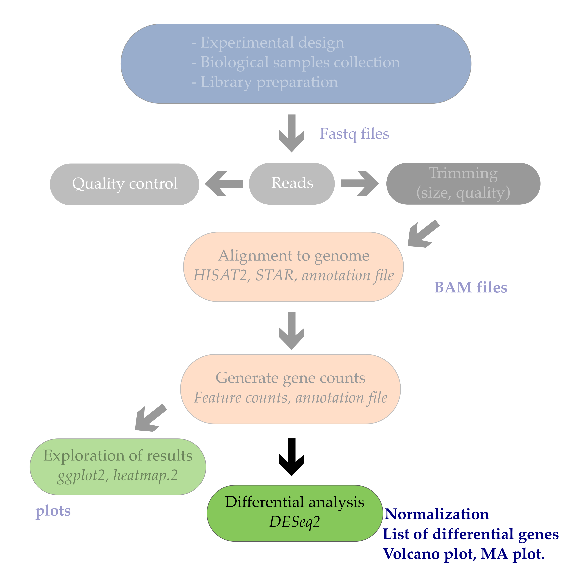
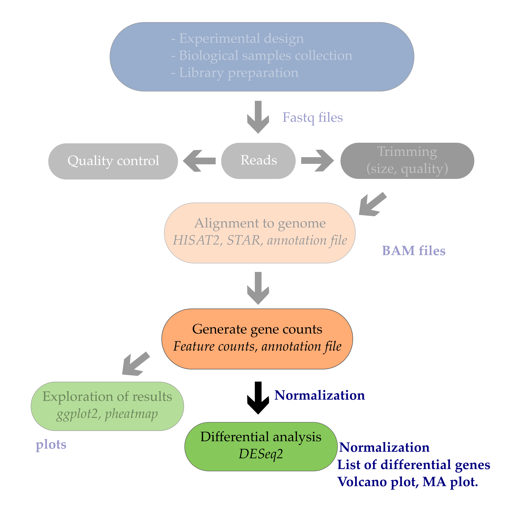
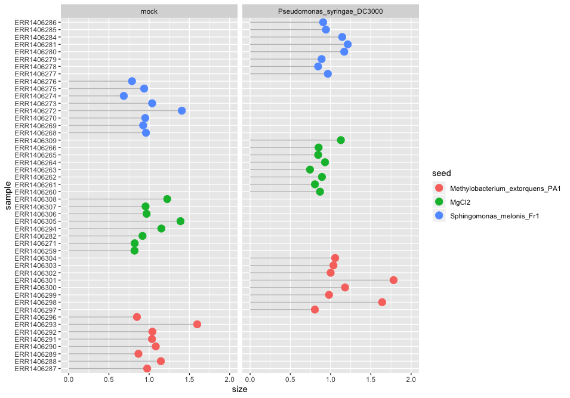
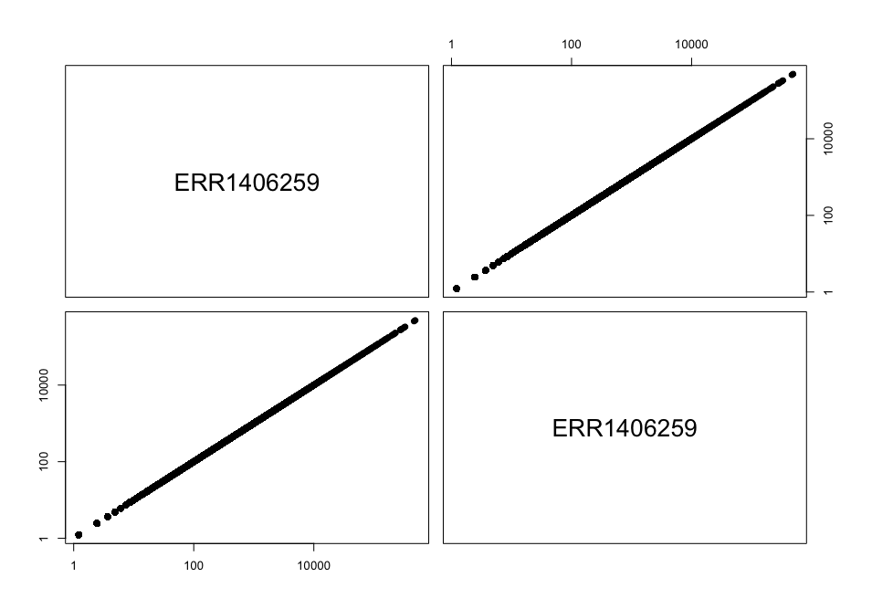
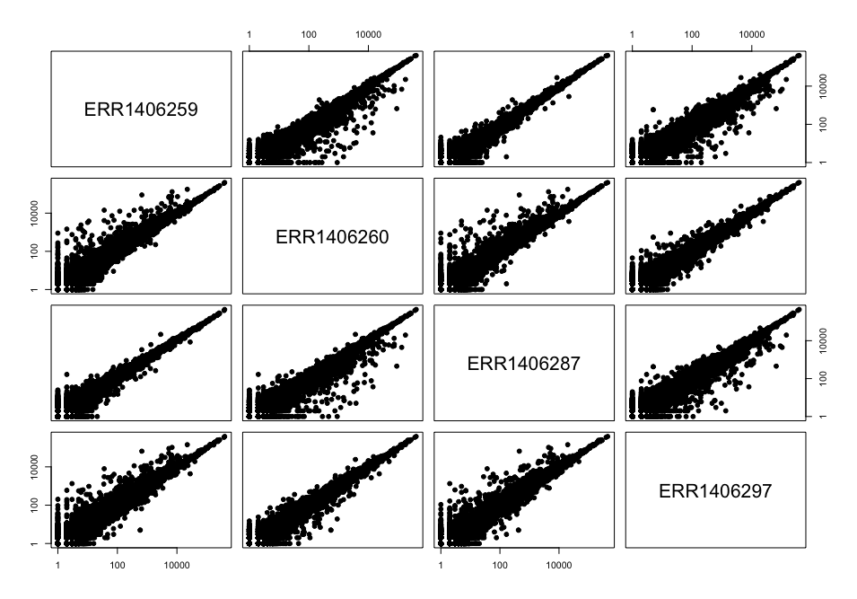
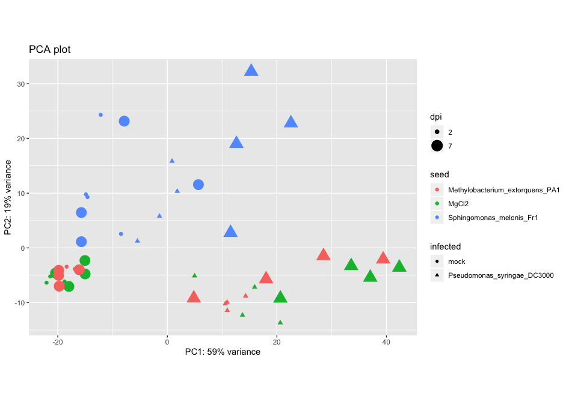

## Table of Contents
1. [Introduction](#introduction)
2. [Normalization](#normalization)
3. [DESeq2 count normalization](#deseq2-count-normalization)
4. [Sample correlations](#sample-correlations)
5. [Principal Component Analysis](#principal-component-analysis)


## Introduction
The ultimate goal of most RNA-seq experiments is to accurately quantify the different transcripts present in a biological sample of interest. Yet, due to technical and biological causes, RNA-seq is prone to several biases that can affect sample / condition comparisons and therefore result interpretation:

* Sequencing depth: samples have a total number of sequencing reads that is different. Genes from one sample might have more reads on average not due to expression differences but due to a higher number of sequencing reads.  
* Gene length: not all genes have the same length and longer genes will have relatively more reads assigned to them than shorter genes.

## Normalization

The first step in the DE analysis workflow is count normalization, which is necessary to make accurate comparisons of gene expression between samples.



The counts of mapped reads for each gene is proportional to the expression of RNA ("interesting") in addition to many other factors ("uninteresting"). Normalization is the process of scaling raw count values to account for the "uninteresting" factors. In this way the expression levels are more comparable between and/or within samples.

The main factors often considered during normalization are:

 - **Sequencing depth:** Accounting for sequencing depth is necessary for comparison of gene expression between samples. In the example below, each gene appears to have doubled in expression in *Sample A* relative to *Sample B*, however this is a consequence of *Sample A* having double the sequencing depth. 

    

  >***NOTE:** In the figure above, each pink and green rectangle represents a read aligned to a gene. Reads connected by dashed lines connect a read spanning an intron.*

 - **Gene length:** Accounting for gene length is necessary for comparing expression between different genes within the same sample. In the example, *Gene X* and *Gene Y* have similar levels of expression, but the number of reads mapped to *Gene X* would be many more than the number mapped to *Gene Y* because *Gene X* is longer.

    

 - **RNA composition:** A few highly differentially expressed genes between samples, differences in the number of genes expressed between samples, or presence of contamination can skew some types of normalization methods. Accounting for RNA composition is recommended for accurate comparison of expression between samples, and is particularly important when performing differential expression analyses [[1](https://genomebiology.biomedcentral.com/articles/10.1186/gb-2010-11-10-r106)]. 

  In the example, imagine the sequencing depths are similar between Sample A and Sample B, and every gene except for gene DE presents similar expression level between samples. The counts in Sample B would be greatly skewed by the DE gene, which takes up most of the counts. Other genes for Sample B would therefore appear to be less expressed than those same genes in Sample A. 


    
***While normalization is essential for differential expression analyses, it is also necessary for exploratory data analysis, visualization of data, and whenever you are exploring or comparing counts between or within samples.***

### Common normalization methods

Several common normalization methods exist to account for these differences:

| Normalization method | Description | Accounted factors | Recommendations for use |
| ---- | ---- | ---- | ---- |
| **CPM** (counts per million) | counts scaled by total number of reads | sequencing depth | gene count comparisons between replicates of the same samplegroup; **NOT for within sample comparisons or DE analysis**  |
| **TPM** (transcripts per kilobase million) | counts per length of transcript (kb) per million reads mapped | sequencing depth and gene length | gene count comparisons within a sample or between samples of the same sample group; **NOT for DE analysis** |
| **RPKM/FPKM** (reads/fragments per kilobase of exon per million reads/fragments mapped) | similar to TPM | sequencing depth and gene length | gene count comparisons between genes within a sample; **NOT for between sample comparisons or DE analysis** |
| DESeq2's **median of ratios** [[1](https://genomebiology.biomedcentral.com/articles/10.1186/gb-2010-11-10-r106)] | counts divided by sample-specific size factors determined by median ratio of gene counts relative to geometric mean per gene | sequencing depth and RNA composition | gene count comparisons between samples and for **DE analysis**; **NOT for within sample comparisons** |
| EdgeR's **trimmed mean of M values (TMM)** [[2](https://genomebiology.biomedcentral.com/articles/10.1186/gb-2010-11-3-r25)] | uses a weighted trimmed mean of the log expression ratios between samples | sequencing depth, RNA composition, and gene length | gene count comparisons between and within samples and for **DE analysis** |

### RPKM/FPKM (not recommended for between sample comparisons)

While TPM and RPKM/FPKM normalization methods both account for sequencing depth and gene length, RPKM/FPKM are not recommended. **The reason  is that the normalized count values output by the RPKM/FPKM method are not comparable between samples.** 

Using RPKM/FPKM normalization, the total number of RPKM/FPKM normalized counts for each sample will be different. Therefore, you cannot compare the normalized counts for each gene equally between samples. 

**RPKM-normalized counts table**

| gene | sampleA | sampleB |
| ----- |:-----:|:-----:|
| gene1 | 5.5 | 5.5 |
| gene2 | 73.4 | 21.8 |
| ... | ... | ... |
|Total RPKM-normalized counts | 1,000,000 | 1,500,000 |

For example, in the table above, SampleA has a greater proportion of counts associated with XCR1 (5.5/1,000,000) than does sampleB (5.5/1,500,000) even though the RPKM count values are the same. Therefore, we cannot directly compare the counts for XCR1 (or any other gene) between sampleA and sampleB because the total number of normalized counts are different between samples. 

> *NOTE:* [This video by StatQuest](http://www.rna-seqblog.com/rpkm-fpkm-and-tpm-clearly-explained/) shows in more detail why TPM should be used in place of RPKM/FPKM if needing to normalize for sequencing depth and gene length.

### DESeq2-normalized counts: Median of ratios method

Since tools for differential expression analysis are comparing the counts between sample groups for the same gene, gene length does not need to be accounted for by the tool. However, **sequencing depth** and **RNA composition** do need to be taken into account.

To normalize for sequencing depth and RNA composition, DESeq2 uses the median of ratios method. On the user-end there is only one step, but on the back-end there are multiple steps involved, as described below.

> **NOTE:**  The steps below describe in detail some of the steps performed by DESeq2 when you run a single function to get DE genes. Basically, for a typical RNA-seq analysis, **you would not run these steps individually**.

**Step 1: creates a pseudo-reference sample (row-wise geometric mean)**

For each gene, a pseudo-reference sample is created that is equal to the geometric mean across all samples.

| gene | sampleA | sampleB | pseudo-reference sample  |
| ----- |:-----:|:-----:|:-----:|
| gene1 | 1489 | 906 | sqrt(1489 * 906) = **1161.5** |
| gene2 | 22 | 13 | sqrt(22 * 13) = **17.7** |
| ... | ... | ... | ... |

**Step 2: calculates ratio of each sample to the reference**

For every gene in a sample, the ratios (sample/ref) are calculated (as shown below). This is performed for each sample in the dataset. Since the majority of genes are not differentially expressed, the majority of genes in each sample should have similar ratios within the sample.

| gene | sampleA | sampleB | pseudo-reference sample  | ratio of sampleA/ref | ratio of sampleB/ref |
| ----- |:-----:|:-----:|:-----:| :-----: | :-----: |
| gene1 | 1489 | 906 | 1161.5 | 1489/1161.5 = **1.28** | 906/1161.5 = **0.78** |
| gene2 | 22 | 13 | 16.9 | 22/16.9 = **1.30** | 13/16.9 = **0.77** |
| gene3 | 793 | 410 | 570.2 | 793/570.2 = **1.39** | 410/570.2 = **0.72**
| gene4 | 76 | 42 | 56.5 | 76/56.5 = **1.35** | 42/56.5 = **0.74**
| gene5 | 521 | 1196 | 883.7 | 521/883.7 = **0.590** | 1196/883.7 = **1.35** |
| ... | ... | ... | ... |

**Step 3: calculate the normalization factor for each sample (size factor)**

The median value (column-wise for the above table) of all ratios for a given sample is taken as the normalization factor (size factor) for that sample, as calculated below. Notice that the differentially expressed genes should not affect the median value:

`normalization_factor_sampleA <- median(c(1.28, 1.3, 1.39, 1.35, 0.59))`

`normalization_factor_sampleB <- median(c(0.78, 0.77, 0.72, 0.74, 1.35))`

The figure below illustrates the median value for the distribution of all gene ratios for a single sample (frequency is on the y-axis).


The median of ratios method makes the assumption that not ALL genes are differentially expressed; therefore, the normalization factors should account for sequencing depth and RNA composition of the sample (large outlier genes will not represent the median ratio values). **This method is robust to imbalance in up-/down-regulation and large numbers of differentially expressed genes.**

> Usually these size factors are around 1, if you see large variations between samples it is important to take note since it might indicate the presence of extreme outliers.

**Step 4: calculate the normalized count values using the normalization factor**

This is performed by dividing each raw count value in a given sample by that sample's normalization factor to generate normalized count values. This is performed for all count values (every gene in every sample). For example, if the median ratio for SampleA was 1.3 and the median ratio for SampleB was 0.77, you could calculate normalized counts as follows:

SampleA median ratio = 1.3

SampleB median ratio = 0.77

**Raw Counts**

| gene | sampleA | sampleB |
| ----- |:-----:|:-----:|
| gene1 | 1489 | 906 |
| gene2 | 22 | 13 |
| ... | ... | ... |

**Normalized Counts**

| gene | sampleA | sampleB |
| ----- |:-----:|:-----:|
| gene1 | 1489 / 1.3 = **1145.39** | 906 / 0.77 = **1176.62** |
| gene2 | 22 / 1.3 = **16.92** | 13 / 0.77 = **16.88** |
| ... | ... | ... |

> Please note that normalized count values are not whole numbers.

***

## DESeq2 count normalization 

### 1. Data import

~~~
## Data import 
counts <- read.delim("counts.txt", header = T, stringsAsFactors = F)
genes <- counts[,1]
counts <- counts[,-1]
row.names(counts) <- genes
xp_design <- read.delim("experimental_design_modified.txt", header = T, stringsAsFactors = F, colClasses = rep("character",4))

# change col names
colnames(xp_design) <- c("sample", "seed", "infected", "dpi")

# reorder counts columns according to the experimental design file
counts <- counts[, xp_design$sample]
~~~
{: .language-r}


Now that we know the theory of count normalization, we will normalize the counts using DESeq2. This requires a few steps:

1. Ensure the row names of the experimental design dataframe are present and in the same order as the column names of the counts dataframe.
2. Create a `DESeqDataSet` object.
3. Generate the normalized counts.

### 2. Match the experimental design and counts data

We should always make sure that we have sample names that match between the two files, and that the samples are in the right order. DESeq2 will output an error if this is not the case.

```r
### Check that sample names match in both files
all(colnames(counts) %in% xp_design$sample)
all(colnames(counts) == xp_design$sample)
```

If your data did not match, you could use the `match()` function to rearrange them to be matching.

### 3. Create the DESeqDataSet object

Bioconductor software packages often define and use a custom class within R for storing data (input data, intermediate data and also results). These custom data structures are similar to `lists` in that they can contain multiple different data types/structures within them. But, unlike lists they have pre-specified `data slots`, which hold specific types/classes of data. The data stored in these pre-specified slots can be accessed by using specific package-defined functions.

Let's start by creating the `DESeqDataSet` object and then we can talk a bit more about what is stored inside it. To create the object we will need the **count matrix** and the **experimental design** table as inputs. We will also need to specify a **design formula**. The design formula specifies the column(s) in the experimental design table and how they should be used in the analysis. For this tutorial, we only have one column of interest, that is `~ infected`. This column has two factor levels i.e. `mock` (not inoculated) and `Pseudomonas syringae_ DC3000` (inoculated). This column tells DESeq2 that for each gene we want to evaluate gene expression change with respect to these two different factor levels.


~~~
# Creation of the DESeqDataSet object
dds <- DESeqDataSetFromMatrix(countData = counts, 
                              colData = xp_design, 
                              design = ~ seed + infected + dpi) # the model does not matter here 
~~~
{: .language-r}

We now have a `DESeqDataSet` object that contains both count data and experimental metadata that is the relationship between samples and their combination of experimental factors. 


You can inspect this object by typing its name in your R console.
~~~
dds
~~~
{: .language-r}

~~~
class: DESeqDataSet 
dim: 33768 48 
metadata(1): version
assays(1): counts
rownames(33768): AT1G01010 AT1G01020 ... ATMG01400 ATMG01410
rowData names(0):
colnames(48): ERR1406259 ERR1406271 ... ERR1406285 ERR1406286
colData names(4): sample seed infected dpi
~~~
{: .output}

### 4. Generate normalized counts

The next step is to normalize the count data in order to be able to make fair gene comparisons between samples.



To perform the **median of ratios method** of normalization, DESeq2 has a single `estimateSizeFactors()` function that will generate size factors for us. We will use the function in the example below, but **in a typical RNA-seq analysis this step is automatically performed by the `DESeq()` function**, which we will see later. 

```r
dds <- estimateSizeFactors(dds)
```

By assigning the results back to the `dds` object we are filling in the slots of the `DESeqDataSet` object with the appropriate information. We can take a look at the normalization factor applied to each sample using:

```r
sizeFactors(dds)
```

We can plot these size factors to see how much they differ between samples. 
~~~
size_factors_df <- data.frame(sample = names(sizeFactors(dds)), 
                              size = sizeFactors(dds))

# add the experimental condition of interest for plot labelling
size_factors_df <- left_join(size_factors_df, xp_design, by = "sample")

# sort by seed condition and by infected condition
size_factors_df <- size_factors_df %>% 
  arrange(seed, infected)

size_factors_df$sample = factor(size_factors_df$sample, levels = size_factors_df$sample)

# plot
ggplot(size_factors_df, aes(x = sample, y = size, colour = seed)) + 
  geom_segment(aes(x = sample, xend = sample, y = 0, yend = size), color="grey") +
  geom_point(size = 6) + 
  coord_flip() +
  theme_grey() +
  facet_wrap(~ infected)
~~~
{:.language-r}

This plot indicates that size factors are all between \~0.70 and \~1.8 so relatively close to each other. 



You can use DESeq-specific functions to access the different slots and retrieve information, if you wish. For example, suppose we wanted the original count matrix we would use `counts()`. For instance, to retrieve the normalized counts matrix from `dds`, we use the `counts()` function and add the argument `normalized=TRUE`.
~~~
# extract the normalised counts
counts_normalised = counts(dds, normalized = TRUE)

# we reorder samples according to their conditions
counts_normalised = counts[, xp_design$sample]
~~~
{: .language-r}

As we go through the workflow we will use the relevant functions to check what information gets stored inside our object.

We can save this normalized data matrix to file for later use:

~~~
write.table(counts_normalised, file = "data/normalized_counts.txt", sep = "\t", quote = F, col.names = NA)
~~~
{: .language-r}

> **NOTE:** DESeq2 doesn't actually use normalized counts to compute differentially expressed genes. Rather, it uses the raw counts and models the normalization inside the Generalized Linear Model (GLM). These normalized counts will be useful for downstream visualization of results, but cannot be used as input to DESeq2 or any other tools that peform differential expression analysis which use the negative binomial model.

## Sample correlations
A first simple way to check the quality of the RNA-seq experiment based on the counts is to plot correlations between samples in the form of scatterplots. 

The first scatterplot consist of the gene counts of one sample against itself. In this case, the correlation coefficient _r_ will be equal to 1.
~~~
# plot the first column against the first column of the matrix
pairs(x = counts_normalised[,c(1,1)],pch = 19, log = "xy")

# actual values
cor(counts_normalised[,c(1,1)])
~~~
{: .language-r}

Trivial: if you correlate a sample with itself, it is a perfect correlation. 



Samples from the same biological conditions should be highly correlated to one another.
~~~
pairs(x = counts_normalised[,c(1:4)],pch = 19, log = "xy")
cor(counts_normalised[,c(1:4)]) # consecutive numbers
~~~
{: .language-r}


Samples from different conditions should not be highly correlated. 
~~~
# weakly correlated samples 
pairs(x = counts_normalised[,c(1,9,17,25)],pch = 19, log = "xy")
cor(counts_normalised[,c(1,9,17,25)])
~~~
{: .language-r}



# Principal Component Analysis

## Introduction to PCA
In (bio)chemical analysis the data matrices can be very large. An infrared spectrum (800 wavelengths) for 50 samples for example would give a data matrix of size 40,000 (50x800) numbers.  A genomic data (e.g. 20,000 genes) for 100 patients would lead to a huge data matrix of (100x20,000) = 2,000,000 numbers. 

These matrices are so large that we need convenient ways to extract the important information from these large data matrices. 

Using principal component analysis (PCA) 

- The data is reduced to smaller matrices so they can more easily be examined, plotted and interpreted.
- The most important factors are extracted (principal components). These factors describe the multivariate (more than one variable) interactions between the measured variables.
- The samples can be classified to identify compound spectra, determine biomarkers etc.


To have an idea of how PCA works it should be noted that if there is a mutual relationship between two or more measurements (e.g. samples) they are correlated. These correlations can be strong (e.g. mass of object and weight on earth's surface) or weak (e.g. capabilities in sport and month of birth). In the example below there is a strong linear relationship between height and age for young children (*Moore, D.S. and McCabe G.P., Introduction to the Practice of Statistics (1989)*).


To explain PCA we use the example above and **project** the cases (observations) on a new coordinate system defined by principal component 1 (PC1) and principal component 2 (PC2) .


In this new coordinate system, PC1 explains 99.77% of the total variation of the original data set while PC2 only explains 0.23%. Consequently, only variable (PC1) is sufficient to describe the whole data set which would support the conclusion that there is only 1 underlying factor, in this case age.

If the original data has more than two variables (e.g. n), which usually is the case, the projection would be in the n-dimensional space. Consequently more than two principal components can be calculated. By using an optimal projection, the principal components describe the maximum variance and are calculated in order of importance e.g.


## IRIS data set

​The ability of PCA to capture as much variance as possible in the main principal components enables us to  to visualize (and summarize) the relation between objects (and variables) from a multi-dimensional space to a two dimensional plot.  


We can use the Fisher's famous Iris flower dataset from 1936 that describes three species of Iris (_Iris setosa_, _Iris virginica_ and _Iris versicolor_). The data set consists of 50 samples from each of these three species of Iris. Four features were measured from each sample: the length and the width of the sepals and petals, in centimeters ([source Wikipedia](https://en.wikipedia.org/wiki/Iris_flower_data_set)). See some pictures below.

| _Iris setosa_                                     | _Iris versicolor_                                  | _Iris virginica_                                        |
|---------------------------------------------------|----------------------------------------------------|---------------------------------------------------------|
|  |  | |


In the example below there is clear separation of the three types of [flowers](https://en.wikipedia.org/wiki/Iris_flower_data_set) which points to shared interactions between the different variables per group. 


To load this data in R  first the appropriate dataset have to be installed and loaded.
~~~
library(datasets)
data(iris)
head(iris)
~~~
{: .language-r}

~~~
Sepal.Length Sepal.Width Petal.Length Petal.Width Species
1          5.1         3.5          1.4         0.2  setosa
2          4.9         3.0          1.4         0.2  setosa
3          4.7         3.2          1.3         0.2  setosa
4          4.6         3.1          1.5         0.2  setosa
5          5.0         3.6          1.4         0.2  setosa
6          5.4         3.9          1.7         0.4  setosa
~~~
{: .output}

The summary of the iris data set display the content of the data. In this case the data consists of 150 objects with 5 variables. The last variable Species is a factor variable that specifies the class of the object.

~~~
 Sepal.Length    Sepal.Width     Petal.Length    Petal.Width          Species  
 Min.   :4.300   Min.   :2.000   Min.   :1.000   Min.   :0.100   setosa    :50  
 1st Qu.:5.100   1st Qu.:2.800   1st Qu.:1.600   1st Qu.:0.300   versicolor:50  
 Median :5.800   Median :3.000   Median :4.350   Median :1.300   virginica :50  
 Mean   :5.843   Mean   :3.057   Mean   :3.758   Mean   :1.199                  
 3rd Qu.:6.400   3rd Qu.:3.300   3rd Qu.:5.100   3rd Qu.:1.800                  
 Max.   :7.900   Max.   :4.400   Max.   :6.900   Max.   :2.500 
~~~
{: .output}


For convenience we use a very rudimentary (own) implementation implementation of PCA. Copy-paste this code into R to load this function into your environment and use it later on.

~~~
# define a custom R function called "mypca()""
mypca <- function(x, center = TRUE, scale = TRUE){  
  
  # perform SVD
  SVD <- svd(scale(x,center = center, scale = scale))
  
  # create scores data frame
  scores <- as.data.frame(SVD$u %*% diag(SVD$d))
  rownames(scores) <- rownames(x)
  colnames(scores) <- paste0("PC", c(1:dim(scores)[2]))
  
  # create loadings data frams
  loadings <- data.frame(SVD$v)
  colnames(loadings) <- paste0("PC", c(1:dim(loadings)[2]))
  rownames(loadings) <- colnames(x)
  
  # create data frame for explained variances
  explained_var <- as.data.frame(round((SVD$d^2) / sum(SVD$d^2)*100, digits = 1))
  rownames(explained_var) <- paste0("PC", c(1:dim(loadings)[2]))
  colnames(explained_var) <- "exp_var"
  
  # return result
  return (list("scores" = scores, "loadings" = loadings, "explained_var" = explained_var))
}
~~~
{: .language-r}

Now we have everything in our R environment into place, we can actually perform the PCA analysis and create the plots.  
Since the four first principal components catch most if not all 

~~~
# perform the PCA analysis on only the first 4 variables (skip the Species variable)
pca <- mypca(iris[,1:4], scale = FALSE)
scores = as.data.frame(pca$scores[,1:2])
scores['Species'] = iris$Species
explained_var = pca$explained_var$exp_var
~~~
{: .language-r}

In order to have an idea of how effective the 'compression' or variable reduction of the PCA algorithm was on our data set, we make a so-called 'scree' plot in which the explained variance is expressed as a function of the number of principal components.

```R
# add a convenient column number for the bar plot to display
df_eXPv <- data.frame(PC = c(1,2,3,4)), explained_variance  = pca$explained_var)

# make the plot
scree_plot <- ggplot(dfev, aes(x = PC, y = explained_variance)) +
       ylab('explained variance (%)') + 
       ggtitle('explained variance per component') + 
       geom_bar(stat = "identity")

# display it
scree_plot
```


It is clear that the PCA really reduces our data to almost 1 variable (component) which explains over 90% of all the variance of the data. The second component only explains 5.3%. The third and fourth even less.

The whole idea behind the analysis is to visualize the high-dimensional data (e.g. a score plot). In R we can do that with the following lines of code

```R
# plot the scores of the first 2 components
p<- ggplot(scores) + geom_point(aes(x=PC1,y=PC2,shape=Species,col=Species)) + xlab(paste0('PC1(',explained_var[1],'%)')) + 
  ylab(paste0('PC2(',explained_var[2],'%)'))
p+ggtitle('PCA score plot')
```


From the score plot it is clear that the Setosa flowers are clearly different from the Versicolor/Virginica flowers. Versicolor and Virginica cannot be separated on PC1 and/or PC2. Looking at the PC1 vs PC3 however, the two groups can be separated better. It is very important to understand that even if a principal component explains a low amount of variance it still can contain interesting (biological) information. 


As scores are indicative of how the objects in the data set score in the new component space. The loadings indicate how the variables score in the component space. The score plots above for example show a separation on PC1 between the 3 groups. If we would like to know which variables are important for this separation we can try to interpret our data.


```R
# reformat the loading data
loadings <- melt(pca$loadings)
# rename the columns
colnames(loadings)<-c("Component","Value")
# add the 'original' variable names
loadings['Variable']=as.factor(rep(colnames(iris)[-5],4))
# plot the loading values per components
p <- ggplot(loadings,aes(x=Variable,y=Value)) +  geom_bar(stat='identity') + facet_wrap(~Component)
p
```


From the loading plot for PC1 it is clear that Petal.Length is the most important factor while Sepal.Width is the one which is least important. Because PC1 explains 92.5 % of the total variance we can conclude that Petal.Length is the most important factor that separates the three groups of flowers. There are many more things to learn on PCA (e.g. scaling, filtering) but that is out of the scope of these exercises. 


## PCA applied to RNA-seq

In the context of an RNA-seq experiment, it can be used to visualize the differences (distances) between samples and how it relates to the experimental design.

Let's plot the samples along the two first components.

This can be done with the `plotPCA()` function of the `DESeq2` package. First, we need to stabilise the variance across genes with different means using a variance stabilising transformation or `vst()` . If interested, you can check the [corresponding detailed section in the DESeq2 vignette](https://bioconductor.org/packages/release/bioc/vignettes/DESeq2/inst/doc/DESeq2.html#data-transformations-and-visualization).

First, let's load the library that we need. 
~~~
library(DESeq2, quietly = TRUE)
library(ggplot2)
library(reshape2)
~~~
{: .language-r}


~~~
# PCA using the plotPCA function
# variance-stabilizing transformation
vst_dds <- vst(dds)

# customised PCA plot
pcaData <- plotPCA(vst_dds, intgroup = c("seed", "infected", "dpi"), returnData = TRUE)

percentVar <- round(100 * attr(pcaData, "percentVar"))

ggplot(pcaData, aes(PC1, PC2, color = seed, shape = infected, size = dpi)) +
  geom_point() +
  xlab(paste0("PC1: ",percentVar[1],"% variance")) +
  ylab(paste0("PC2: ",percentVar[2],"% variance")) + 
  coord_fixed() +
  ggtitle("PCA plot")
~~~
{: .language-r}




## Estimation of the dispersion
For Master level!

## Genome browser
For Master level!


