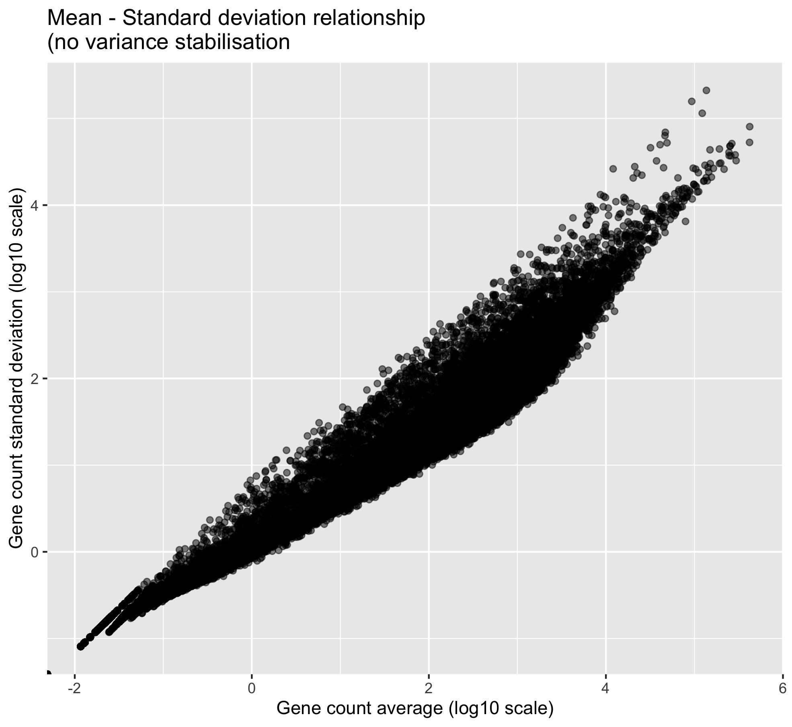
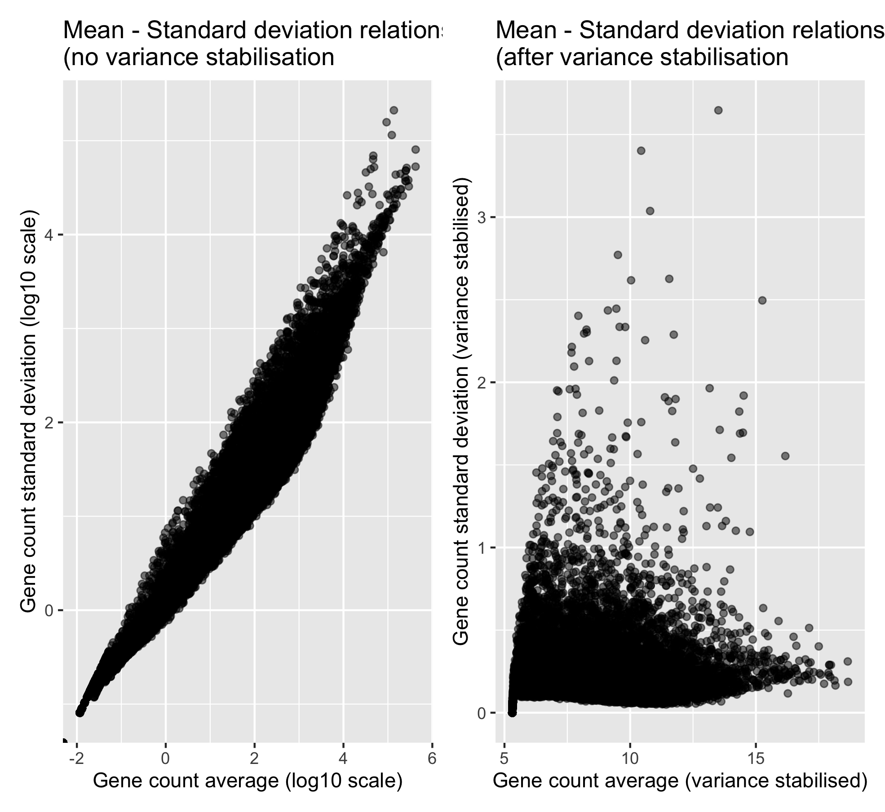
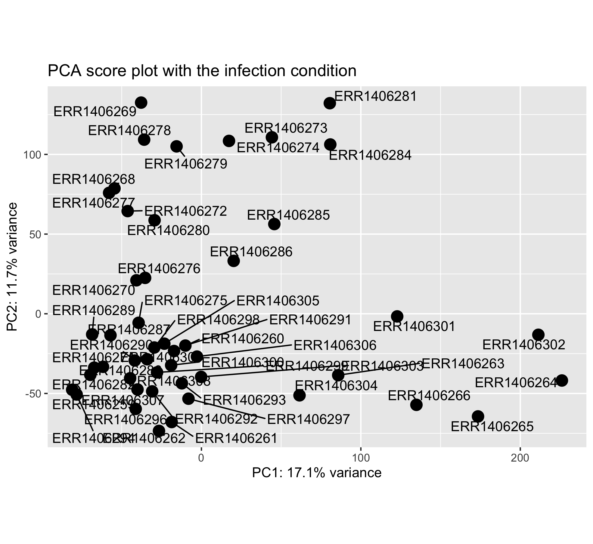
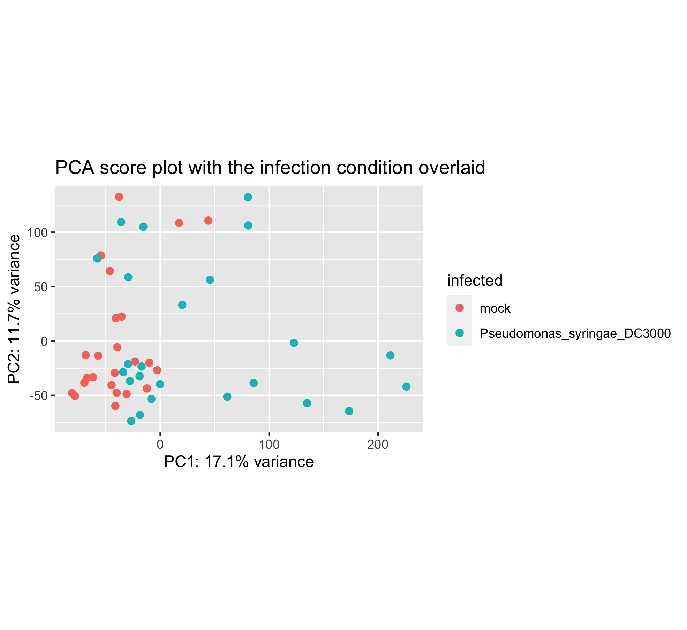
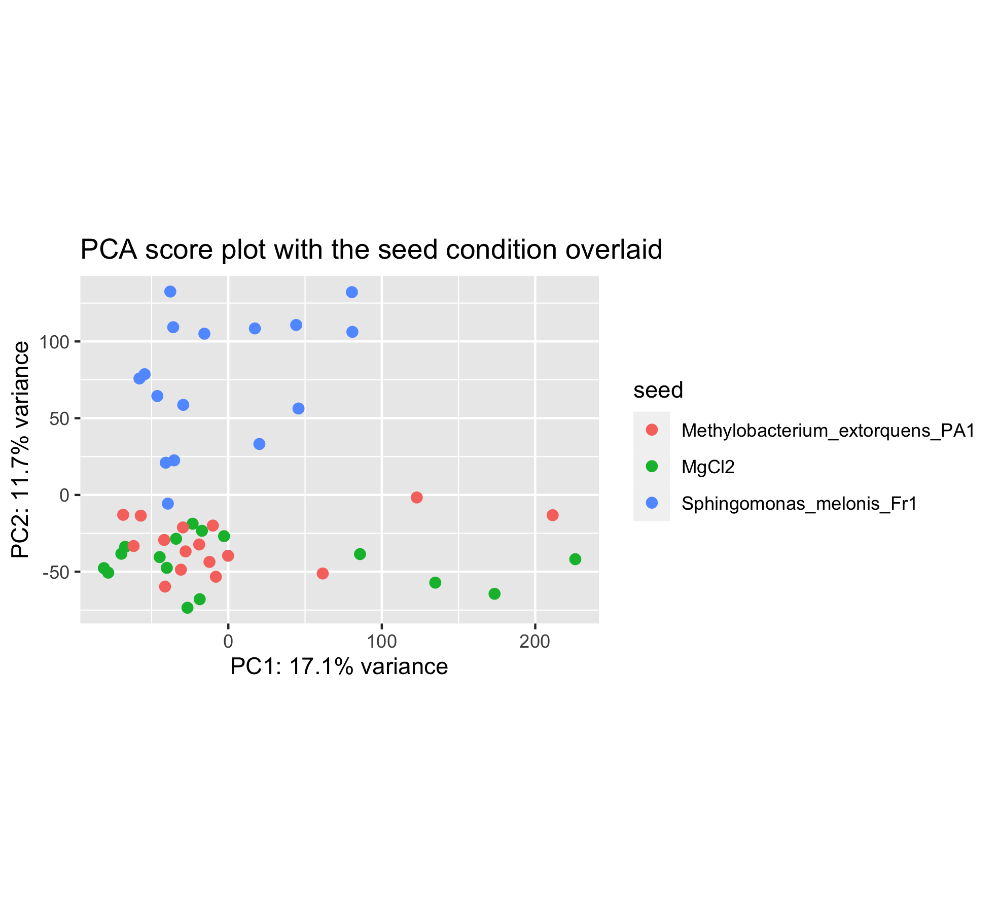
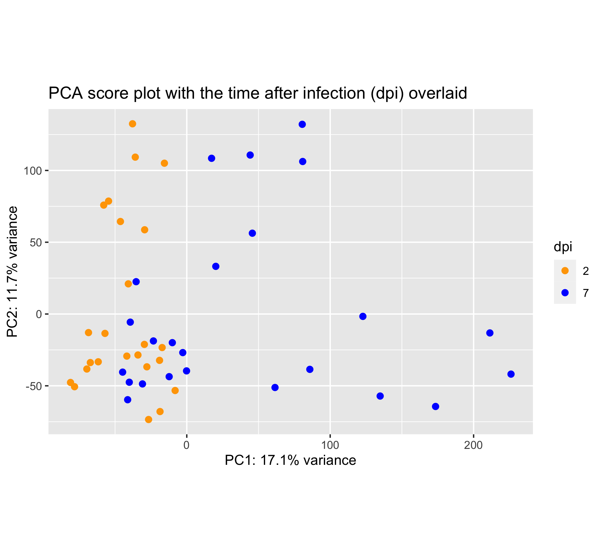
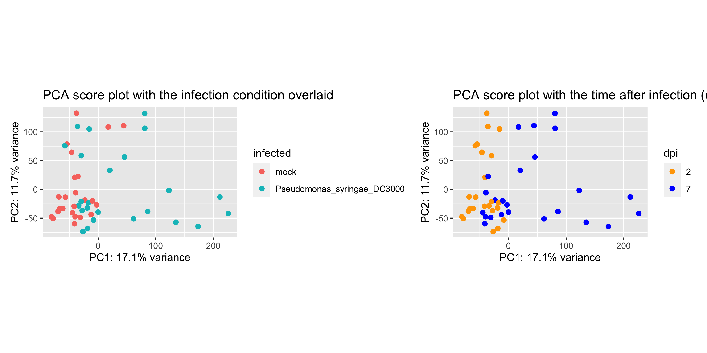

# Table of contents
<!-- MarkdownTOC autolink="True" levels="1,2,3" -->

- [1. Introduction](#1-introduction)
- [2. Principal Component Analysis](#2-principal-component-analysis)
	- [2.1 Step by step introduction to PCA \(video\)](#21-step-by-step-introduction-to-pca-video)
	- [2.2 Worked PCA example](#22-worked-pca-example)
	- [2.3 The Iris data set](#23-the-iris-data-set)
- [3. PCA applied to RNA-seq data](#3-pca-applied-to-rna-seq-data)
	- [3.1 Data import](#31-data-import)
	- [3.2 Variance stabilisation](#32-variance-stabilisation)
	- [3.3 RNA-seq scree plot](#33-rna-seq-scree-plot)
	- [3.4 Infected versus mock score plot](#34-infected-versus-mock-score-plot)
	- [3.5 Seed inoculation score plot](#35-seed-inoculation-score-plot)
	- [3.6 Time after infection score plot](#36-time-after-infection-score-plot)
- [4. Bonus: Gene count normalization theory](#4-bonus-gene-count-normalization-theory)
	- [4.1 Common normalization methods](#41-common-normalization-methods)
	- [4.2 RPKM/FPKM \(not recommended for between sample comparisons\)](#42-rpkmfpkm-not-recommended-for-between-sample-comparisons)
	- [4.3 DESeq2-normalized counts: Median of ratios method](#43-deseq2-normalized-counts-median-of-ratios-method)
- [5. Bonus: DESeq2 count normalization](#5-bonus-deseq2-count-normalization)
	- [5.1 Data import](#51-data-import)
	- [5.2 Match the experimental design and counts data](#52-match-the-experimental-design-and-counts-data)
	- [5.3 Create the DESeqDataSet object](#53-create-the-deseqdataset-object)
	- [5.4 Generate normalized counts](#54-generate-normalized-counts)
	- [5.5 Comparison of raw and normalised counts](#55-comparison-of-raw-and-normalised-counts)
	- [5.6 Home-made DESeq normalization function](#56-home-made-deseq-normalization-function)
- [6. References](#6-references)
	- [6.1 Useful links](#61-useful-links)
	- [6.2 Photo credits](#62-photo-credits)

<!-- /MarkdownTOC -->


# 1. Introduction
The ultimate goal of most RNA-seq experiments is to accurately quantify the different transcripts present in a biological sample of interest. Yet, the total variation present in the gene counts can have several sources but should eventually match your experimental design. 

In this episode, we will see how a powerful dimension reduction method called __Principal Component Analysis__ will help you to relate the _observed_ variation to the _desired_ source of variation i.e. your experimental factors. 

# 2. Principal Component Analysis

## 2.1 Step by step introduction to PCA (video)

Please watch the following video from StatQuest for a 20min-long introduction to PCA.

<iframe width="560" height="315" src="https://www.youtube-nocookie.com/embed/FgakZw6K1QQ" frameborder="0" allow="accelerometer; autoplay; clipboard-write; encrypted-media; gyroscope; picture-in-picture" allowfullscreen></iframe>

<br>

You can test your understanding by answering these few questions:

> ## Questions
> 1. What is the reason to perform a PCA analysis using 4 genes?
> 2. What does SVD stands for? 
> 3. Can a PCA analysis indicate which gene (out of the 4) is the most capable of separating sample groups?
> 4. Given a dataframe with 10 samples and 40 variables, what is the maximum number of Principal Components (PCs) that you can compute?
> 5. If you center the data, do you change the distances between the different samples? 
> 6. How would you measure the accuracy of the 2D graph with only PC1 and PC2?
> 7. How is called the graph that orders the eigenvalues or percentage of explained variance on the y-axis and the PC number on the x-axis?
> 8. How are the "gene proportions used to build PC1 and PC2" called? What is the proper term? Think about the cocktail recipe. 
> 9. (Extra hard) Can you define in simple terms the _eigenvector_ of PC1 and _eigenvalue_ of PC2?
> 10. How many times is "BAM!" pronounced by Josh Starmer during the video?
>
>> ## Answers
>> 1. PCA allows to plot information from 4 genes on a human-readable 2D plot (2 dimensions, x-axis + y-axis). It therefore help to visualise complex multivariate data in a much simpler way. 
>> 2. SVD stands for Singular Value Decomposition.
>> 3. Yes, by looking at the loading scores of the genes from each PC, it is possible to relate individual genes to the different PCs. If PC1 separates nicely the different sample groups, then the gene with the highest loading score on PC1 is the most interesting to explain that separation.
>> 4. The maximum number of PCs is the minimum of samples and variables. So here a maximum of n = 10 PCs.
>> 5. No, data centering does not change the distance between samples. It centers the cloud of data so that its center is the origin (0,0) on both PC1 and PC2.  
>> 6. The accuracy of the PC1-PC2 2-dimensional plot can be measured by summing the percentage of the variance explained by PC1 and PC2. If PC1 and PC2 collectively explain 90$$%$$ of the variance, then this 2D plot would be quite a accurate representaiton of the original data. 
>> 7. A scree plot. 
>> 8. The recipe to build PC1 and PC2 requires variable "parts" also called variable _loading scores_.  
>> 9. All right, then you should be the one building this lesson section, not doing it! More seriously, the eigenvalue is the sum of the squared distances from each sample projection on PC1. The eigenvector is the singular vector of unit one for PC1. 
>> 10. I have counted 5 BAMs including one double BAM and one little BAM.       
> {: .solution}
{: .challenge}

Sometimes, you'll only want to look at one section of the video:  
- [Worked 2D example](https://youtu.be/FgakZw6K1QQ?t=203)
- [Finding PC1](https://youtu.be/FgakZw6K1QQ?t=303)
- [Calculating the percent variation explained by each PC](https://youtu.be/FgakZw6K1QQ?t=903)
- [Worked 3D example](https://youtu.be/FgakZw6K1QQ?t=990)

## 2.2 Worked PCA example

In (bio)chemical analysis the data matrices can be very large. An infrared spectrum (800 wavelengths) for 50 samples for example would give a data matrix of size 40,000 (50x800) numbers.  A genomic data (e.g. 20,000 genes) for 100 patients would lead to a huge data matrix of (100x20,000) = 2,000,000 numbers. 

These matrices are so large that we need convenient ways to extract the important information from these large data matrices. 

Using principal component analysis (PCA) 

- The data is reduced to smaller matrices so they can more easily be examined, plotted and interpreted.
- The most important factors are extracted (principal components). These factors describe the multivariate (more than one variable) interactions between the measured variables.
- The samples can be classified to identify compound spectra, determine biomarkers etc.

To have an idea of how PCA works it should be noted that if there is a mutual relationship between two or more measurements (e.g. samples) they are correlated. These correlations can be strong (e.g. mass of object and weight on earth's surface) or weak (e.g. capabilities in sport and month of birth). In the example below there is a strong linear relationship between height and age for young children (*Moore, D.S. and McCabe G.P., Introduction to the Practice of Statistics (1989)*).


To explain PCA we use the example above and **project** the cases (observations) on a new coordinate system defined by principal component 1 (PC1) and principal component 2 (PC2) .


In this new coordinate system, PC1 explains 99.77% of the total variation of the original data set while PC2 only explains 0.23%. Consequently, only variable (PC1) is sufficient to describe the whole data set which would support the conclusion that there is only 1 underlying factor, in this case age.

If the original data has more than two variables (e.g. n), which usually is the case, the projection would be in the n-dimensional space. Consequently more than two principal components can be calculated. By using an optimal projection, the principal components describe the maximum variance and are calculated in order of importance e.g.


## 2.3 The Iris data set

The ability of PCA to capture as much variance as possible in the main principal components enables us to  to visualize (and summarize) the relation between objects (and variables) from a multi-dimensional space to a two dimensional plot.  


We can use the Fisher's famous Iris flower dataset from 1936 that describes three species of Iris (_Iris setosa_, _Iris virginica_ and _Iris versicolor_). The data set consists of __50 samples__ from each of these three species of Iris. __Four variables (features)__ were measured from each sample: the length and the width of the sepals and petals, in centimeters ([source Wikipedia](https://en.wikipedia.org/wiki/Iris_flower_data_set)). See some pictures below.

| _Iris setosa_                                     | _Iris versicolor_                                  | _Iris virginica_                                        |
|---------------------------------------------------|----------------------------------------------------|---------------------------------------------------------|
|  |  | |


In the example below there is clear separation of the three types of [flowers](https://en.wikipedia.org/wiki/Iris_flower_data_set) which points to shared interactions between the different variables per group. 


To load this data in R  first the appropriate dataset have to be installed and loaded.
~~~
library(datasets)
data(iris)
head(iris)
~~~
{: .language-r}

~~~
Sepal.Length Sepal.Width Petal.Length Petal.Width Species
1          5.1         3.5          1.4         0.2  setosa
2          4.9         3.0          1.4         0.2  setosa
3          4.7         3.2          1.3         0.2  setosa
4          4.6         3.1          1.5         0.2  setosa
5          5.0         3.6          1.4         0.2  setosa
6          5.4         3.9          1.7         0.4  setosa
~~~
{: .output}

The summary of the iris data set display the content of the data. In this case the data consists of 150 objects with 5 variables. The last variable Species is a factor variable that specifies the class of the object.

~~~
 Sepal.Length    Sepal.Width     Petal.Length    Petal.Width          Species  
 Min.   :4.300   Min.   :2.000   Min.   :1.000   Min.   :0.100   setosa    :50  
 1st Qu.:5.100   1st Qu.:2.800   1st Qu.:1.600   1st Qu.:0.300   versicolor:50  
 Median :5.800   Median :3.000   Median :4.350   Median :1.300   virginica :50  
 Mean   :5.843   Mean   :3.057   Mean   :3.758   Mean   :1.199                  
 3rd Qu.:6.400   3rd Qu.:3.300   3rd Qu.:5.100   3rd Qu.:1.800                  
 Max.   :7.900   Max.   :4.400   Max.   :6.900   Max.   :2.500 
~~~
{: .output}


For convenience we use a very rudimentary (own) implementation implementation of PCA. Source this code to load this function into your environment and use it later on.

~~~
# Load custom PCA function
source("scripts/mypca.R")
~~~
{: .language-r}

The whole function is available here in the [extra functions page](/extra_functions/index.html#1-custom-pca-function).  

Now we have everything in our R environment into place, we can actually perform the PCA analysis and create the plots.  
Since the four first principal components catch most if not all 

~~~
# perform the PCA analysis on only the first 4 variables (skip the Species variable)
pca <- mypca(iris[,1:4], scale = TRUE)
scores = as.data.frame(pca$scores[,1:2])
scores['Species'] = iris$Species
explained_var = pca$explained_var$exp_var
~~~
{: .language-r}

> ## Important note
> To have the sample scores in the `scores` R object, samples should be in rows in the matrix used for the PCA.
> In turn, this requires the variables to be in columns so that the `loadings` R object contains the loadings of the variables.
{: .callout}


In order to have an idea of how effective the 'compression' or variable reduction of the PCA algorithm was on our data set, we make a so-called 'scree' plot in which the explained variance is expressed as a function of the number of principal components.

~~~
# add a convenient column number for the bar plot to display
dfev <- data.frame(PC = c(1,2,3,4), exp_var  = pca$explained_var)

# make the plot
scree_plot <- ggplot(dfev, aes(x = PC, y = exp_var)) +
       ylab('explained variance (%)') + 
       ggtitle('explained variance per component') + 
       geom_bar(stat = "identity")

# display it
scree_plot
~~~
{: .language-r}


It is clear that the PCA really reduces our data to almost 1 variable (component) which explains over 73% of all the variance of the data. The second component explains 23% suggesting that important information is also present on PC2. The third and fourth explain very little of the total variance.

The whole idea behind the analysis is to visualize the high-dimensional data (e.g. a score plot) in a smaller dimensional space (e.g. 2D space). In R we can do that with the following lines of code

~~~
# plot the scores of the first 2 components
p <- ggplot(scores) + 
       geom_point(aes(x = PC1, y = PC2, shape = Species, col = Species)) + 
       xlab(paste0('PC1(',explained_var[1],'%)')) + 
       ylab(paste0('PC2(',explained_var[2],'%)')) + 
       ggtitle('PCA score plot')
p
~~~
{: .language-r}


From the score plot it is clear that the Setosa flowers are clearly different from the Versicolor/Virginica flowers. Versicolor and Virginica cannot be separated on PC1 and/or PC2. Looking at the PC1 vs PC3 however, the two groups can be separated better. It is very important to understand that even if a principal component explains a low amount of variance it still can contain interesting (biological) information. 

> ## Exercise
> Can you create the score plot with PC1 on the x-axis and PC3 on the y-axis?  
> __Hint:__ you will have to re-compute the pca results with `mypca(iris[,1:4], center = TRUE, scale = TRUE)` since 
> the `scores` dataframe only contains sample scores for PC1 and PC2.   
> __Question:__ can you better separate the samples on PC1 and PC3?
>
> > ## Solution
> > ~~~
> > pca <- mypca(iris[,1:4], center = TRUE, scale = TRUE)
> > scores = as.data.frame(pca$scores[,1:3])
> > scores['Species'] = iris$Species
> > iris_score_plot_pc1_pc3 <- ggplot(scores) + 
> >       geom_point(aes(x = PC1, y = PC3, shape = Species, col = Species), size = 2) + 
> > xlab(paste0('PC1(',explained_var[1],'%)')) + 
> > ylab(paste0('PC2(',explained_var[3],'%)')) + 
> > ggtitle('PCA score plot: PC1 - PC3')
> > iris_score_plot_pc1_pc3
> > ~~
> > {: .language-r}
> > 
> > Answer: no, not really. The versicolor and virginica species are still pretty much overlapping.
> {: .solution }
{: .challenge}


The scores are indicative of how the objects in the data set score in the new component space, correspondingly the loadings indicate how the variables score in the component space. The score plots above for example show a separation on PC1 between the 3 groups. If we would like to know which variables are important for this separation we can try to interpret our data.


~~~
library(reshape2) # to access the melt() function

# reformat the loading data
loadings <- melt(pca$loadings)

# rename the columns
colnames(loadings)<-c("Component","Value")

# add the 'original' variable names
loadings['Variable']=as.factor(rep(colnames(iris)[-5],4))

# plot the loading values per components
loadings_plot <- ggplot(loadings,
                        aes(x=Variable,y=Value)) +  
  geom_bar(stat='identity') + 
  facet_wrap(~Component)
loadings_plot
~~~
{: .language-r}


From the loading plot for PC1 it is clear that `Petal.Length`, `Petal.Width` and `Sepal.Length` are the most important factors while `Sepal.Width` is the least important. Because PC1 explains 73% of the total variance we can conclude that these 3 factors are the most important factors that separates the three groups of flowers.   

If we plot the values of these variables per species, we can indeed see that the _I. setosa_ species has indeed smaller `Petal.Length`, `Petal.Width` or `Sepal.Length` values than the two other species. 


There are many more things to learn on PCA (e.g. scaling, filtering) but that is out of the scope of these exercises. 

> ## Maximum number of Principal Components
> The maximum number of PC is always equal to the minimum of (_n_ samples, _p_ variables).   
> Here, the number of samples is equal to $$n = 150$$ and the number of variables to $$p = 4$$.
> Therefore, the maximum number of PCs is equal to 4.    
{: .callout}

<br> 


# 3. PCA applied to RNA-seq data

First, we need to import the **raw gene counts**, the **sample to condition correspondence (experimental design)** and create a so-called `dds` object that belongs to the `DESeqDataSet` class and offers access to several powerful methods. 

## 3.1 Data import

~~~
counts <- read.delim("00.tutorial/counts.txt", header = T, stringsAsFactors = F) %>% 
  column_to_rownames("Geneid")

xp_design <- read.delim("00.tutorial/experimental_design_modified.txt", 
                        header = T, 
                        stringsAsFactors = F, 
                        colClasses = rep("character",4))

# change col names
colnames(xp_design) <- c("sample", "seed", "infected", "dpi")

# reorder counts columns according to the experimental design file
counts <- counts[,xp_design$sample]

# first five rows and five columns
counts[1:5, 1:5]
~~~
{: .language-r}

This is how our dataframe looks like:

~~~
          ERR1406259 ERR1406260 ERR1406261 ERR1406262 ERR1406263
AT1G01010         59         81         40         51         57
AT1G01020        365        466        440        424        393
AT1G03987          8         16         13         19         13
AT1G01030        111        200        189        164        141
AT1G03993        131        179        169        157        114
~~~
{: .output}

We now have everything we need to create the `dds` object that will be used through the rest of this episode. 

Let's perform a last check before this. We should always make sure that we have sample names that match between the two files, and that the samples are in the right order. DESeq2 will output an error if this is not the case.

~~~
## Check that sample names match in both files
all(colnames(counts) %in% xp_design$sample)
all(colnames(counts) == xp_design$sample)
~~~
{: .language-r}

If all is well, then create the `dds` object. 
~~~
## Creation of the DESeqDataSet object
dds <- DESeqDataSetFromMatrix(countData = counts, 
                              colData = xp_design, 
                              design = ~ seed + infected + dpi)

~~~
{: .language-r}

## 3.2 Variance stabilisation

In the context of an RNA-seq experiment, PCA can be used to visualize the differences (distances) between samples and how it relates to the experimental design. Samples from the same experimental condition (e.g. infected with DC3000) should be grouping together if the observed variability in the data relates to the experimental design. 

In other words, genes from biological replicates (samples of the same experimental condition) should behave similarly and result in similar sample scores. Thereby, these samples should have close coordinates on the PCA score plot.   

But before we compute the PCA itself, we need to take into account one important feature of RNA-seq data: the gene variance is proportional to the gene mean. The higher the gene mean, the more variance it has. Also, genes with a low abundance (low counts) also suffer from a somehow inflated variance. 

This is easy to visualise in the following plot:
~~~
# Plot of mean - sd comparison
# Variance - mean plot for all genes
p_mean_sd_scaled <- 
  counts %>% 
  as.data.frame() %>% 
  rownames_to_column("gene") %>% 
  pivot_longer(cols = - gene, names_to = "sample", values_to = "counts") %>% 
  group_by(gene) %>% 
  summarise(gene_average = mean(counts), gene_stdev = sd(counts)) %>% 
  ungroup() %>% 
  ggplot(., aes(x = log10(gene_average), y = log10(gene_stdev))) +
  geom_point(alpha = 0.5, fill = "grey", colour = "black") +
  labs(x = "Gene count average (log10 scale)",
       y = "Gene count standard deviation (log10 scale)") +
  ggtitle("Mean - Standard deviation relationship\n(no variance stabilisation ")
p_mean_sd_scaled
~~~
{: .language-r}



One can clearly visualise the "heteroscedasticity" of these data: the mean is not independent from the variance. We need to stabilise the variance so that the mean becomes independent from the variance. 

~~~
# Variance stabilisation
dds = estimateDispersions(object = dds, 
	                      fitType = "parametric", 
	                      quiet = TRUE)

vsd = varianceStabilizingTransformation(object = dds, 
                                               blind = TRUE,           # do not take the design formula into account
                                                                       # best practice for sample-level QC
                                               fitType = "parametric")

# extract the matrix of variance stabilised counts
variance_stabilised_counts <- assay(vsd)

# create the mean-sd plot
p_mean_sd_vst <- 
  variance_stabilised_counts %>% 
  as.data.frame() %>% 
  rownames_to_column("gene") %>% 
  pivot_longer(cols = - gene, names_to = "sample", values_to = "counts") %>% 
  group_by(gene) %>% 
  summarise(gene_average = mean(counts), gene_stdev = sd(counts)) %>% 
  ungroup() %>% 
  ggplot(., aes(x = gene_average, y = gene_stdev)) +
  geom_point(alpha = 0.5, fill = "grey", colour = "black") +
  labs(x = "Gene count average (variance stabilised)", 
       y = "Gene count standard deviation (variance stabilised)") +
  ggtitle("Mean - Standard deviation relationship\n(after variance stabilisation ")
p_mean_sd_vst
~~~
{: .language-r}



Now that the variance is more independent from the mean, we can compute our PCA analysis. 

## 3.3 RNA-seq scree plot

To get an idea of how much variation can be explained by PC1, PC2, PC3, etc., a scree plot can be drawn. 

First, the PCA is computed using the `mypca()` function. This returns a list with three objects, the `scores`, `loadings` and `explained_var` dataframes. 
~~~
# transpose the data because in variance_stabilised_counts the rows are the variables and the columns correspond to the samples
t_variance_stabilised_counts <- t(variance_stabilised_counts)

# before computing the PCA, check that samples are in rows and genes in columns
pca_results <- mypca(t_variance_stabilised_counts), 
                     center = TRUE, 
                     scale = TRUE)
~~~
{: .language-r}

Then the explained variance dataframe is used to make the scree plot. 
~~~
# make the plot
ggplot(pca_results$explained_var, 
         aes(x = seq(from = 1, to = nrow(pca_results$explained_var)), 
             y = exp_var)) +
  ylab('explained variance (%)') + 
  ggtitle('Explained variance per component') + 
  geom_bar(stat = "identity") +
  labs(x = "Principal Component number") +
  scale_x_continuous(breaks = seq(
    from = 1, 
    to = nrow(pca_results$explained_var)))
~~~
{: .language-r}


> ## Question
> Using the `cumsum()` function, can you determine:
> 1. How much percentage of the total variance are "caught" by PC1 and PC2?
> 2. How many PCs are necessary to get 50% of the total variance?
> 
> > ## Solution
> > 1. `cumsum(pca_results$explained_var)[2,1]` shows you that 28.8% of the varaince are explained by PC1 and PC2.   
> > 2. You need to go up to PC7 to catch 51% of the variance.   
> > 
> > ~~~
> > cumsum(pca_results$explained_var) %>% 
> >   as.data.frame() %>% 
> >   filter(exp_var > 50) %>% 
> >   head(n = 1)
> > ~~~
> > {: .language-r}
> {: .solution}
{: .challenge}

> ## Maximum number of Principal Components
> The maximum number of PC is always equal to the minimum of (_n_ samples, _p_ variables).   
> Here, the number of samples is equal to $$n = 48$$ and the number of variables to $$p = 33,768$$.
> Therefore, the maximum number of PCs is equal to 48.    
{: .callout}


## 3.4 Infected versus mock score plot

Let's first see how our _P. syringae_ infection condition is reflected at the PCA level.

After computing the PCA itself, scores are extracted. 
	
~~~
scores <- pca_results$scores

# first 5 rows and columns
scores[1:5,1:5]
~~~
{: .language-r}

The score matrix contains the samples in rows with their new coordinates on the different PCs.   

~~~
      sample       PC1       PC2        PC3       PC4
1 ERR1406259 -81.06199 -47.68192  21.968178 -13.88833
2 ERR1406271 -67.24881 -33.81534  15.751014 -72.50003
3 ERR1406282 -69.68432 -38.30649  28.871388  24.28975
4 ERR1406294 -78.25228 -50.63736  -7.439196  15.96702
5 ERR1406305 -23.26519 -18.76106 -74.047134 -43.41103
~~~
{: .output}

Before we can create the score plot, we need to add the experimental factors of interest to this dataframe. 
We are going to do this using the `left_join` function from the `dplyr` package. 

~~~
scores_with_conditions <- 
  scores %>% 
  rownames_to_column("sample") %>% # to prepare to join on the "sample" column
  left_join(x = .,                 # this means that we are passing the 'scores' dataframe 
            y = xp_design,         # this dataframe contains the sample to condition correspondence
            by = "sample")
~~~
{: .language-r}

We now have a score dataframe that also have a "sample" column as well as the three experimental factors columns: "seed", "infected" and "dpi".

If you show the first 

~~~
# shows the first 5 rows and the last 4 columns  
scores_with_conditions[1:5, 48:52]
~~~
{: .language-r}  

Now we have the 3 experimental conditions in our score dataframe. 
~~~
       PC47         PC48  seed infected dpi
1 -0.106006 -7.40634e-13 MgCl2     mock   2
2 -1.450006 -7.40634e-13 MgCl2     mock   2
3  9.076943 -7.40634e-13 MgCl2     mock   2
4  3.491862 -7.40634e-13 MgCl2     mock   2
5  7.905262 -7.40634e-13 MgCl2     mock   7
~~~
{: .language-r}

Let's create the plot now using `ggplot2`.

If we do not overlay the "infected" experimental condition on the sample positions, we have a very bare score plot. It only shows the position of the different samples in the new PC coordinate system.



> ## Question
> Do you find this score plot informative? If yes why? If not why?
>
> > ## Solution
> > This score plot does not show how the sample scores related to the different experimental conditions of interest. 
> > One need to add the experimental condition of interest as a new layer (color, shape). 
> {: .solution}
{: .challenge}

Let's make this plot a little bit more informative. First, the explained variance per PC is pulled out from the `pca_results` R object. This will be used to label the X and Y plot axis.
~~~
# explained variance
# one % variance value per PC
explained_variance <- 
  pca_results$explained_var %>% 
  pull("exp_var")
~~~
{: .language-r}

Now it is finally plotting time!

~~~
ggplot(scores_with_conditions, 
       aes(PC1, PC2, color = infected)) +
  geom_point(size = 4) +
  xlab(paste0("PC1: ",explained_variance[1],"% variance")) +
  ylab(paste0("PC2: ",explained_variance[2],"% variance")) + 
  coord_fixed(ratio = 1) +
  ggtitle("PCA score plot with the infection condition overlaid")
~~~
{: .language-r}



It seems that the infection plays a role in PC1 but the two groups are still overlapping a lot on the left hand side. 

## 3.5 Seed inoculation score plot

Perhaps another experimental condition would better explain the sample distribution.

Have a look at this new PCA plot with the _seed_ condition superimposed.  



You can see that the sample positions have not changed on the plot. But the colors have since we wanted to color samples by their seed inoculation level ("MgCl2", "Fr1" or "PA1").

This plot seems to show that PC2 separates the Fr1 seed inoculation from the MgCl2 or PA1 seed treatment. 

> ## Challenge
> Can you create this plot?
{: .challenge}

## 3.6 Time after infection score plot

Last but not least, the time after _Pseudomonas syringae_ DC3000 infection can be overlaid too.



Wait, this score plot resembles very much to the "infection score plot" that we have obtained in section 6.3. 
Let's plot them side by side:



> ## Conclusion
> These plots are almost alike. This suggests that, perhaps, the infection by _P. syringae_ already separates the samples after 2 days. 
{: .discussion}

<br>

# 4. Bonus: Gene count normalization theory

The ultimate goal of most RNA-seq experiments is to accurately quantify the different transcripts present in a biological sample of interest. Yet, due to technical and biological causes, RNA-seq is prone to several biases that can affect sample / condition comparisons and therefore result interpretation.

In this section, we explain how to normalize (scale) the gene counts obtained upon completion of the bioinformatic workflow. 

The counts of mapped reads for each gene is proportional to the expression of RNA ("interesting") in addition to many other factors ("uninteresting"). Normalization is the process of scaling raw count values to account for the "uninteresting" factors. In this way the expression levels are more comparable between and/or within samples.

The main factors often considered during normalization are:

 - **Sequencing depth:** Accounting for sequencing depth is necessary for comparison of gene expression between samples. In the example below, each gene appears to have doubled in expression in *Sample A* relative to *Sample B*, however this is a consequence of *Sample A* having double the sequencing depth. 

    

  >***NOTE:** In the figure above, each pink and green rectangle represents a read aligned to a gene. Reads connected by dashed lines connect a read spanning an intron.*

 - **Gene length:** Accounting for gene length is necessary for comparing expression between different genes within the same sample. In the example, *Gene X* and *Gene Y* have similar levels of expression, but the number of reads mapped to *Gene X* would be many more than the number mapped to *Gene Y* because *Gene X* is longer.

    

 - **RNA composition:** A few highly differentially expressed genes between samples, differences in the number of genes expressed between samples, or presence of contamination can skew some types of normalization methods. Accounting for RNA composition is recommended for accurate comparison of expression between samples, and is particularly important when performing differential expression analyses [[1](https://genomebiology.biomedcentral.com/articles/10.1186/gb-2010-11-10-r106)]. 

  In the example, imagine the sequencing depths are similar between Sample A and Sample B, and every gene except for gene DE presents similar expression level between samples. The counts in Sample B would be greatly skewed by the DE gene, which takes up most of the counts. Other genes for Sample B would therefore appear to be less expressed than those same genes in Sample A. 


    
***While normalization is essential for differential expression analyses, it is also necessary for exploratory data analysis, visualization of data, and whenever you are exploring or comparing counts between or within samples.***

## 4.1 Common normalization methods

Several common normalization methods exist to account for these differences:

| Normalization method | Description | Accounted factors | Recommendations for use |
| ---- | ---- | ---- | ---- |
| **CPM** (counts per million) | counts scaled by total number of reads | sequencing depth | gene count comparisons between replicates of the same samplegroup; **NOT for within sample comparisons or DE analysis**  |
| **TPM** (transcripts per kilobase million) | counts per length of transcript (kb) per million reads mapped | sequencing depth and gene length | gene count comparisons within a sample or between samples of the same sample group; **NOT for DE analysis** |
| **RPKM/FPKM** (reads/fragments per kilobase of exon per million reads/fragments mapped) | similar to TPM | sequencing depth and gene length | gene count comparisons between genes within a sample; **NOT for between sample comparisons or DE analysis** |
| DESeq2's **median of ratios** [[1](https://genomebiology.biomedcentral.com/articles/10.1186/gb-2010-11-10-r106)] | counts divided by sample-specific size factors determined by median ratio of gene counts relative to geometric mean per gene | sequencing depth and RNA composition | gene count comparisons between samples and for **DE analysis**; **NOT for within sample comparisons** |
| EdgeR's **trimmed mean of M values (TMM)** [[2](https://genomebiology.biomedcentral.com/articles/10.1186/gb-2010-11-3-r25)] | uses a weighted trimmed mean of the log expression ratios between samples | sequencing depth, RNA composition, and gene length | gene count comparisons between and within samples and for **DE analysis** |

## 4.2 RPKM/FPKM (not recommended for between sample comparisons)

While TPM and RPKM/FPKM normalization methods both account for sequencing depth and gene length, RPKM/FPKM are not recommended. **The reason  is that the normalized count values output by the RPKM/FPKM method are not comparable between samples.** 

Using RPKM/FPKM normalization, the total number of RPKM/FPKM normalized counts for each sample will be different. Therefore, you cannot compare the normalized counts for each gene equally between samples. 

**RPKM-normalized counts table**

| gene   | sample_A | sample_B |
| ------ |:-----  : |:-------: |
| gene_1 | 5.5      | 5.5      |
| gene_2 | 73.4     | 21.8     |
| ...    | ...      | ...      |
|Total RPKM-normalized counts  | 1,000,000 | 1,500,000 |

For example, in the table above, Sample_A has a greater proportion of counts associated with gene_1  (5.5/1,000,000) than does sample_B (5.5/1,500,000) even though the RPKM count values are the same. Therefore, we cannot directly compare the counts for gene_1 (or any other gene) between sample_A and sample_B because the total number of normalized counts are different between samples. 

> *NOTE:* [This video by StatQuest](http://www.rna-seqblog.com/rpkm-fpkm-and-tpm-clearly-explained/) shows in more detail why TPM should be used in place of RPKM/FPKM if needing to normalize for sequencing depth and gene length.

## 4.3 DESeq2-normalized counts: Median of ratios method

Since tools for differential expression analysis are comparing the counts between sample groups for the same gene, gene length does not need to be accounted for by the tool. However, **sequencing depth** and **RNA composition** do need to be taken into account.

To normalize for sequencing depth and RNA composition, DESeq2 uses the median of ratios method. On the user-end there is only one step, but on the back-end there are multiple steps involved, as described below.

> **NOTE:**  The steps below describe in detail some of the steps performed by DESeq2 when you run a single function to get DE genes. Basically, for a typical RNA-seq analysis, **you would not run these steps individually** but rather make use of the `results()` function of `DESeq2`. 

**Step 1: creates a pseudo-reference sample (row-wise geometric mean)**

For each gene, a pseudo-reference sample is created that is equal to the geometric mean across all samples.

| gene | sample_A | sample_B | pseudo-reference sample  |
| ----- |:-----:|:-----:|:-----:|
| gene_1 | 1489 | 906 | sqrt(1489 * 906) = **1161.5** |
| gene_2 | 22 | 13 | sqrt(22 * 13) = **17.7** |
| ... | ... | ... | ... |

**Step 2: calculates ratio of each sample to the reference**

For every gene in a sample, the ratios (sample/ref) are calculated (as shown below). This is performed for each sample in the dataset. Since the majority of genes are not differentially expressed, the majority of genes in each sample should have similar ratios within the sample.

| gene | sample_A | sample_B | pseudo-reference sample  | ratio of sample_A/ref | ratio of sample_B/ref |
| ----- |:-----:|:-----:|:-----:| :-----: | :-----: |
| gene_1 | 1489 | 906 | 1161.5 | 1489/1161.5 = **1.28** | 906/1161.5 = **0.78** |
| gene_2 | 22 | 13 | 16.9 | 22/16.9 = **1.30** | 13/16.9 = **0.77** |
| gene_3 | 793 | 410 | 570.2 | 793/570.2 = **1.39** | 410/570.2 = **0.72**
| gene_4 | 76 | 42 | 56.5 | 76/56.5 = **1.35** | 42/56.5 = **0.74**
| gene_5 | 521 | 1196 | 883.7 | 521/883.7 = **0.590** | 1196/883.7 = **1.35** |
| ... | ... | ... | ... |

**Step 3: calculate the normalization factor for each sample (size factor)**

The median value (column-wise for the above table) of all ratios for a given sample is taken as the normalization factor (size factor) for that sample, as calculated below. Notice that the differentially expressed genes should not affect the median value:

`normalization_factor_sample_A <- median(c(1.28, 1.3, 1.39, 1.35, 0.59))`

`normalization_factor_sample_B <- median(c(0.78, 0.77, 0.72, 0.74, 1.35))`

The figure below illustrates the median value for the distribution of all gene ratios for a single sample (frequency is on the y-axis).


The median of ratios method makes the assumption that not ALL genes are differentially expressed; therefore, the normalization factors should account for sequencing depth and RNA composition of the sample (large outlier genes will not represent the median ratio values). **This method is robust to imbalance in up-/down-regulation and large numbers of differentially expressed genes.**

> Usually these size factors are around 1, if you see large variations between samples it is important to take note since it might indicate the presence of extreme outliers.

**Step 4: calculate the normalized count values using the normalization factor**

This is performed by dividing each raw count value in a given sample by that sample's normalization factor to generate normalized count values. This is performed for all count values (every gene in every sample). For example, if the median ratio for sample_A was 1.3 and the median ratio for sample_B was 0.77, you could calculate normalized counts as follows:

sample_A median ratio = 1.3

sample_B median ratio = 0.77

**Raw Counts**

| gene | sample_A | sample_B |
| ----- |:-----:|:-----:|
| gene_1 | 1489 | 906 |
| gene_2 | 22 | 13 |
| ... | ... | ... |

**Normalized Counts**

| gene | sample_A | sample_B |
| ----- |:-----:|:-----:|
| gene_1 | 1489 / 1.3 = **1145.39** | 906 / 0.77 = **1176.62** |
| gene_2 | 22 / 1.3 = **16.92** | 13 / 0.77 = **16.88** |
| ... | ... | ... |

> ## Important note
> Please note that normalized count values are not integers anymore but rather decimal numbers. This is a good way to rapidly check whether you are dealing with normalised/scaled data and not raw gene counts. 
{: .callout}

***

# 5. Bonus: DESeq2 count normalization 

Let's see how, in practice, we can use `DESeq2` median-of-ratios method to normalize the gene counts. 

## 5.1 Data import

~~~
# Data import 
counts <- read.delim("counts.txt", header = T, stringsAsFactors = F)
genes <- counts[,1]
counts <- counts[,-1]
row.names(counts) <- genes
xp_design <- read.delim("experimental_design_modified.txt", header = T, stringsAsFactors = F, colClasses = rep("character",4))

# change col names
colnames(xp_design) <- c("sample", "seed", "infected", "dpi")

# reorder counts columns according to the experimental design file
counts <- counts[, xp_design$sample]
~~~
{: .language-r}

This is how the first five rows/columns of the `counts` dataframe look like:
~~~
counts[1:5,1:5]
~~~
{: .language-r}

You can see that numbers in the matrix are not decimal numbers but rather integers. 
~~~
          ERR1406259 ERR1406271 ERR1406282 ERR1406294 ERR1406305
AT1G01010         59         79         61         71        123
AT1G01020        365        365        441        534        648
AT1G03987          8         14         14          4         20
AT1G01030        111        189        124        161        220
AT1G03993        131        155        183        236        250
~~~
{: .output}


Now that we know the theory of count normalization, we will normalize the counts using `DESeq2`. This requires a few steps:

1. Ensure the row names of the experimental design dataframe are present and in the same order as the column names of the counts dataframe.
2. Create a `DESeqDataSet` object.
3. Generate the normalized counts.

## 5.2 Match the experimental design and counts data

We should always make sure that we have sample names that match between the two files, and that the samples are in the right order. DESeq2 will output an error if this is not the case.

```r
## Check that sample names match in both files
all(colnames(counts) %in% xp_design$sample)
all(colnames(counts) == xp_design$sample)
```

If your data did not match, you could use the `match()` function to rearrange them to be matching.

## 5.3 Create the DESeqDataSet object

Bioconductor software packages often define and use a custom class within R for storing data (input data, intermediate data and also results). These custom data structures are similar to `lists` in that they can contain multiple different data types/structures within them. But, unlike lists they have pre-specified `data slots`, which hold specific types/classes of data. The data stored in these pre-specified slots can be accessed by using specific package-defined functions.

Let's start by creating the `DESeqDataSet` object and then we can talk a bit more about what is stored inside it. To create the object we will need the **count matrix** and the **experimental design** table as inputs. We will also need to specify a **design formula**. The design formula specifies the column(s) in the experimental design table and how they should be used in the analysis. For this tutorial, we only have one column of interest, that is `~ infected`. This column has two factor levels i.e. `mock` (not inoculated) and `Pseudomonas syringae_ DC3000` (inoculated). This column tells DESeq2 that for each gene we want to evaluate gene expression change with respect to these two different factor levels.


~~~
suppressPackageStartupMessages(library(DESeq2)) # to load DESeq2 and suppress the long startup message

# Creation of the DESeqDataSet object
dds <- DESeqDataSetFromMatrix(countData = counts, 
                              colData = xp_design, 
                              design = ~ infected) 
~~~
{: .language-r}

> ## Important note
> When creating the `dds` object, you should specify your experimental condition of interest.  
> Here we specify `design = ~ infected` since this is the condition of interest used in this lesson.  
> Scaling of the raw counts to correct for library size for instance will not take the design formula into account. 
{: .callout}


We now have a `DESeqDataSet` object that contains both count data and experimental metadata that is the relationship between samples and their combination of experimental factors. 

You can inspect this object by typing its name in your R console.
~~~
dds
~~~
{: .language-r}

~~~
class: DESeqDataSet 
dim: 33768 48 
metadata(1): version
assays(1): counts
rownames(33768): AT1G01010 AT1G01020 ... ATMG01400 ATMG01410
rowData names(0):
colnames(48): ERR1406259 ERR1406271 ... ERR1406285 ERR1406286
colData names(4): sample seed infected dpi
~~~
{: .output}

## 5.4 Generate normalized counts

The next step is to normalize the count data in order to be able to make fair gene comparisons between samples.


To perform the **median of ratios method** of normalization, DESeq2 has a single `estimateSizeFactors()` function that will generate size factors for us. We will use the function in the example below, but **in a typical RNA-seq analysis this step is automatically performed by the `DESeq()` function**, which we will see later. 

~~~
dds <- estimateSizeFactors(dds)
~~~
{: .language-r}

By assigning the results back to the `dds` object we are filling in the slots of the `DESeqDataSet` object with the appropriate information. We can take a look at the normalization factor applied to each sample using:

~~~
sizeFactors(dds)
~~~
{: .language-r}

We can plot these size factors to see how much they differ between samples. 
~~~
library(tidyverse)

# create a dplyr tibble
size_factors_df <- tibble(
  sample = names(sizeFactors(dds)), 
  correction_factor = sizeFactors(dds)
  )

# line plot to connect the different size factor values
p <- ggplot(size_factors_df, aes(x = sample, y = correction_factor, group = 1)) +
  geom_point() + 
  geom_line() +
  theme(axis.text.x = element_text(angle = 90, size = 5)) +
  scale_y_continuous(limits = c(0.5,2))

# to display the plot
p
~~~
{: .language-r}

This plot indicates that size factors are all between \~0.70 and \~1.8 so relatively close to each other. 


You can use DESeq-specific functions to access the different slots and retrieve information, if you wish. For example, suppose we wanted the original count matrix we would use `counts()`. For instance, to retrieve the normalized counts matrix from `dds`, we use the `counts()` function and add the argument `normalized=TRUE`.
~~~
# extract the normalised counts
counts_normalised = counts(dds, normalized = TRUE)
~~~
{: .language-r}

Let's take a peek at the first five rows and columns.
~~~~
counts_normalised[1:5,1:5]
~~~~
{: .language-r}


~~~
          ERR1406259 ERR1406271 ERR1406282 ERR1406294 ERR1406305
AT1G01010  72.152831   96.30085   66.47355  61.669649   88.51520
AT1G01020 446.369208  444.93431  480.57105 463.825247  466.32399
AT1G03987   9.783435   17.06597   15.25622   3.474346   14.39272
AT1G01030 135.745156  230.39064  135.12655 139.842443  158.31987
AT1G03993 160.203743  188.94471  199.42064 204.986439  179.90895
~~~
{: .output}
You now see that integers have become decimal numbers. All good!

> ## Note 
> `DESeq2` doesn't actually use normalized counts to compute differentially expressed genes. Rather, it uses the __raw counts__ and models the normalization inside the Generalized Linear Model (GLM). These normalized counts will be useful for downstream visualization of results, but _cannot_ be used as input to the `DESeq()` function 
that performs differential analysis since it relies on the negative binomial model.
{: .callout}

## 5.5 Comparison of raw and normalised counts

If you compare the raw and normalised (scaled) gene count distributions, you should see that the medians (black bars) are more comparable after scaling. 

Here, only 6 samples out of the 48 samples are shown for clarity.    


You can see that each sample gene count median (black horizontal bars) is more aligned to the other medians after scaling. 

## 5.6 Home-made DESeq normalization function

Please consult the step-by-step R code to normalize the DESeq2 way [here](../median_of_ratios_manual_normalization/index.html).


# 6. References

## 6.1 Useful links
1. [Gabriel Martos cluster analysis](https://rpubs.com/gabrielmartos/ClusterAnalysis)
2. [Bradley Boehmke](https://uc-r.github.io/hc_clustering)
3. Love et al. (2014) [Moderated estimation of fold change and dispersion for RNA-seq data with DESeq2. _Genome Biology_, 15:550](https://link.springer.com/article/10.1186/s13059-014-0550-8).
4. [Statquest](https://www.youtube.com/watch?v=UFB993xufUU)
5. [Harvard Bioinformatic Core Training program](https://hbctraining.github.io/DGE_workshop/lessons/02_DGE_count_normalization.html)

## 6.2 Photo credits
<a style="background-color:black;color:white;text-decoration:none;padding:4px 6px;font-family:-apple-system, BlinkMacSystemFont, &quot;San Francisco&quot;, &quot;Helvetica Neue&quot;, Helvetica, Ubuntu, Roboto, Noto, &quot;Segoe UI&quot;, Arial, sans-serif;font-size:12px;font-weight:bold;line-height:1.2;display:inline-block;border-radius:3px" href="https://unsplash.com/@markusspiske?utm_medium=referral&amp;utm_campaign=photographer-credit&amp;utm_content=creditBadge" target="_blank" rel="noopener noreferrer" title="Download free do whatever you want high-resolution photos from Markus Spiske"><span style="display:inline-block;padding:2px 3px"><svg xmlns="http://www.w3.org/2000/svg" style="height:12px;width:auto;position:relative;vertical-align:middle;top:-2px;fill:white" viewBox="0 0 32 32"><title>unsplash-logo</title><path d="M10 9V0h12v9H10zm12 5h10v18H0V14h10v9h12v-9z"></path></svg></span><span style="display:inline-block;padding:2px 3px">Markus Spiske</span></a>

