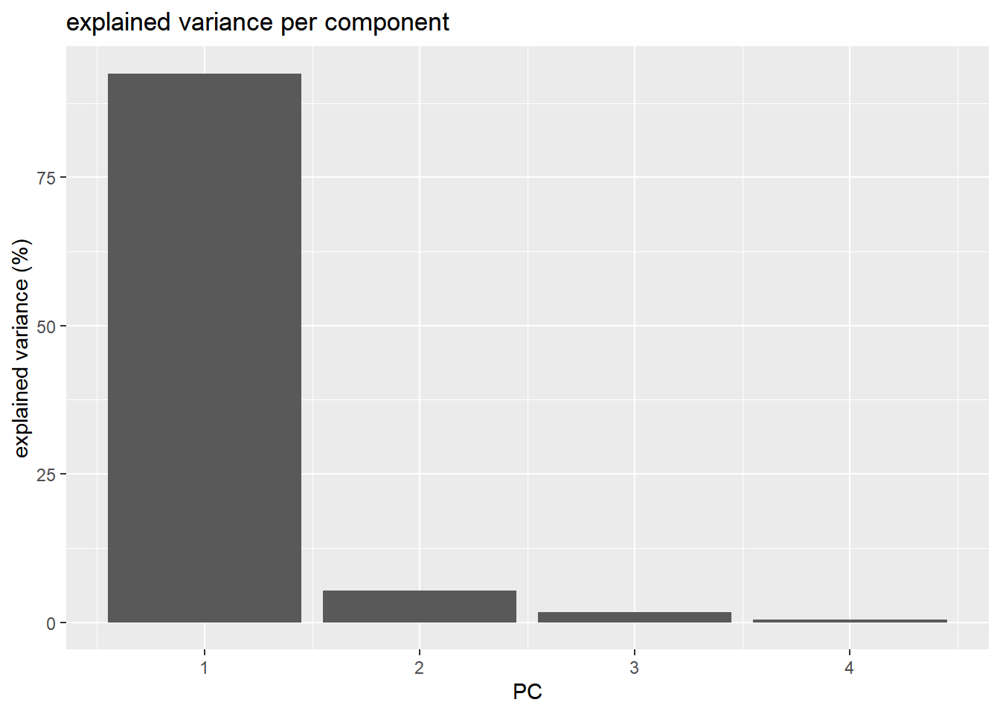
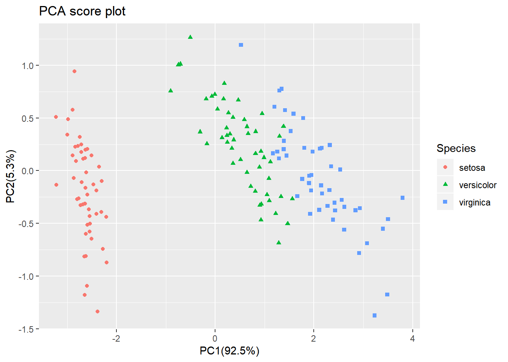
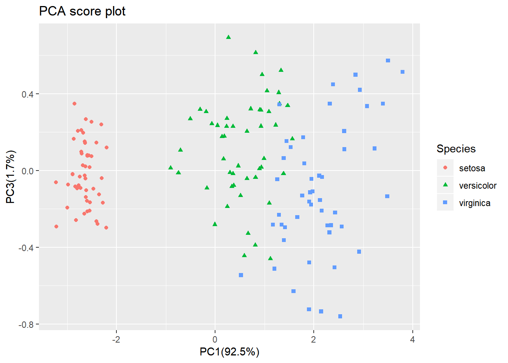
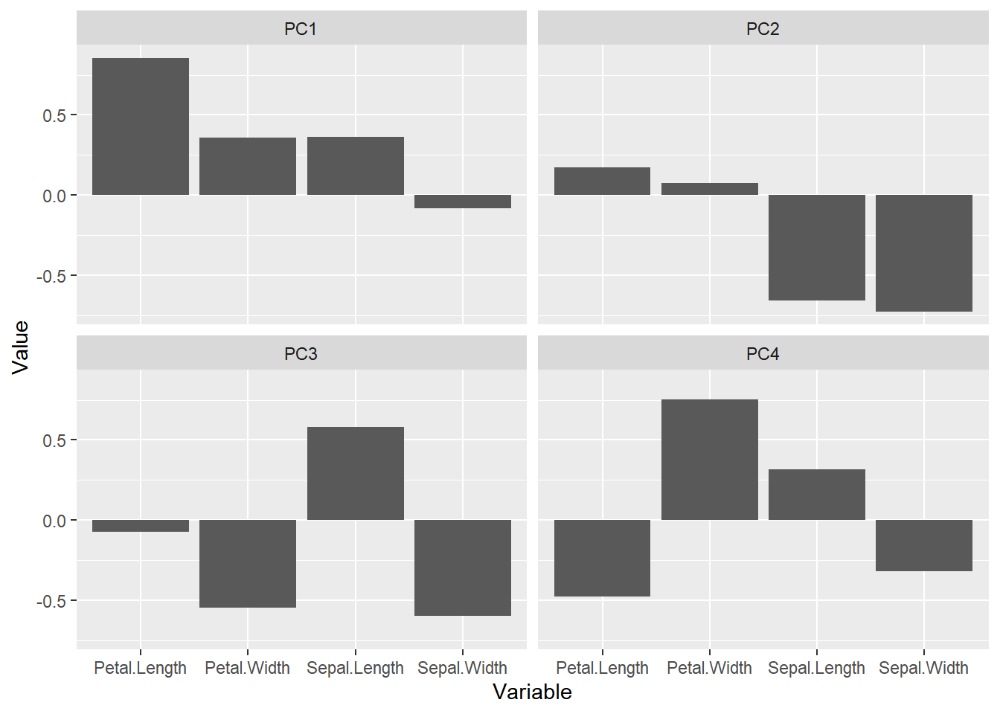

# Principal Component Analysis

In (bio)chemical analysis the data matrices can be very large. An infrared spectrum (800 wavelengths) for 50 samples for example would give a data matrix of size 40,000 (50x800) numbers.  A genomic data (e.g. 20,000 genes) for 100 patients would lead to a huge data matrix of (100x20,000) = 2,000,000 numbers. 

These matrices are so large that we need convenient ways to extract the important information from these large data matrices. 

Using principal component analysis (PCA) 

- The data is reduced to smaller matrices so they can more easily be examined, plotted and interpreted.
- The most important factors are extracted (principal components). These factors describe the multivariate (more than one variable) interactions between the measured variables.
- The samples can be classified to identify compound spectra, determine biomarkers etc.


To have an idea of how PCA works it should be noted that if there is a mutual relationship between two or more measurements (e.g. samples) they are correlated. These correlations can be strong (e.g. mass of object and weight on earth's surface) or weak (e.g. capabilities in sport and month of birth). In the example below there is a strong linear relationship between height and age for young children (*Moore, D.S. and McCabe G.P., Introduction to the Practice of Statistics (1989)*).


To explain PCA we use the example above and **project** the cases (observations) on a new coordinate system defined by principal component 1 (PC1) and principal component 2 (PC2) .


In this new coordinate system, PC1 explains 99.77% of the total variation of the original data set while PC2 only explains 0.23%. Consequently, only variable (PC1) is sufficient to describe the whole data set which would support the conclusion that there is only 1 underlying factor, in this case age.

If the original data has more than two variables (e.g. n), which usually is the case, the projection would be in the n-dimensional space. Consequently more than two principal components can be calculated. By using an optimal projection, the principal components describe the maximum variance and are calculated in order of importance e.g.


## IRIS data set

​	The ability of PCA to capture as much variance as possible in the main principal components enables us to  to visualize (and summarize) the relation between objects (and variables) from a multi-dimensional space to a two dimensional plot. In the example below there is clear separation of the three types of [flowers](https://en.wikipedia.org/wiki/Iris_flower_data_set) which points to shared interactions between the different variables per group. To load this data in R  first the appropriate dataset have to be installed and loaded.

```R
library(datasets)
library(DESeq2, quietly = TRUE)
library(ggplot2)
library(reshape2)
data(iris)
summary(iris)
```

The summary of the iris data set display the content of the data. In this case the data consists of 150 objects with 5 variables. The last variable Species is a factor variable that specifies the class of the object.

```
##   Sepal.Length    Sepal.Width     Petal.Length    Petal.Width   
##  Min.   :4.300   Min.   :2.000   Min.   :1.000   Min.   :0.100  
##  1st Qu.:5.100   1st Qu.:2.800   1st Qu.:1.600   1st Qu.:0.300  
##  Median :5.800   Median :3.000   Median :4.350   Median :1.300  
##  Mean   :5.843   Mean   :3.057   Mean   :3.758   Mean   :1.199  
##  3rd Qu.:6.400   3rd Qu.:3.300   3rd Qu.:5.100   3rd Qu.:1.800  
##  Max.   :7.900   Max.   :4.400   Max.   :6.900   Max.   :2.500  
##        Species  
##  setosa    :50  
##  versicolor:50  
##  virginica :50  
##                 
##                 
## 
```

For convenience we use a very rudimentary (own) implementation implementation of PCA.

```
mypca <- function(x, center=TRUE,scale=TRUE){  
  # perform SVD
  SVD <- svd(scale(x,center=center,scale=scale))
  # create scores data frame
  scores <- as.data.frame(SVD$u %*% diag(SVD$d))
  rownames(scores)<-rownames(x)
  colnames(scores)<-paste0("PC",c(1:dim(scores)[2]))
  # create loadings data frams
  loadings <- data.frame(SVD$v)
  colnames(loadings)<-paste0("PC",c(1:dim(loadings)[2]))
  rownames(loadings)<-colnames(x)
  # create data frame for explained variances
  explained_var <- as.data.frame(round((SVD$d^2)/sum(SVD$d^2)*100,1))
  rownames(explained_var)<-paste0("PC",c(1:dim(loadings)[2]))
  colnames(explained_var)<-"exp_var"
  # return result
  return (list("scores"=scores,"loadings"=loadings,"explained_var"=explained_var))
}
```

Now we have everything in our R environment into place we can actually perform the PCA analysis and create the plots.

```R
# perform the PCA analysis on only the first 4 variables (skip the Species variable)
pca <- mypca(iris[,1:4],scale=FALSE)
scores = as.data.frame(pca$scores[,1:2])
scores['Species']=iris$Species
explained_var = pca$explained_var$exp_var


```

In order to have an idea of how effective the 'compression' or variable reduction of the PCA algorithm was on our data set, we make a so-called 'scree' plot in which the explained variance is expressed as a function of the number of principal components.

```R
# add a convenient column number for the bar plot to display
PC <- c(1,2,3,4)
dfev <- cbind(as.data.frame(PC),pca$explained_var)
# make the plot
p <- ggplot(dfev,aes(x=PC,y=exp_var)) + ylab('explained variance (%)') 
p+ggtitle('explained variance per component') + geom_bar(stat = "identity")
```



It is clear that the PCA really reduces our data to almost 1 variable (component) which explains over 90% of all the variance of the data. The second component only explains 5.3%. The third and fourth even less.

The whole idea behind the analysis is to visualize the high-dimensional data (e.g. a score plot). In R we can do that with the following lines of code

```R
# plot the scores of the first 2 components
p<- ggplot(scores) + geom_point(aes(x=PC1,y=PC2,shape=Species,col=Species)) + xlab(paste0('PC1(',explained_var[1],'%)')) + 
  ylab(paste0('PC2(',explained_var[2],'%)'))
p+ggtitle('PCA score plot')
```



From the score plot it is clear that the Setosa flowers are clearly different from the Versicolor/Virginica flowers. Versicolor and Virginica cannot be separated on PC1 and/or PC2. Looking at the PC1 vs PC3 however, the two groups can be separated better. It is very important to understand that even if a principal component explains a low amount of variance it still can contain interesting (biological) information. 




As scores are indicative of how the objects in the data set score in the new component space. The loadings indicate how the variables score in the component space. The score plots above for example show a separation on PC1 between the 3 groups. If we would like to know which variables are important for this separation we can try to interpret our data.


```R
# reformat the loading data
loadings <- melt(pca$loadings)
# rename the columns
colnames(loadings)<-c("Component","Value")
# add the 'original' variable names
loadings['Variable']=as.factor(rep(colnames(iris)[-5],4))
# plot the loading values per components
p <- ggplot(loadings,aes(x=Variable,y=Value)) +  geom_bar(stat='identity') + facet_wrap(~Component)
p
```





From the loading plot for PC1 it is clear that Petal.Length is the most important factor while Sepal.Width is the one which is least important. Because PC1 explains 92.5 % of the total variance we can conclude that Petal.Length is the most important factor that separates the three groups of flowers. There are many more things to learn on PCA (e.g. scaling, filtering) but that is out of the scope of these exercises. 


## RNA-seq experiment

In the context of an RNA-seq experiment, the PCA can be used to visualize the differences (distances) between samples and how it relates to the experimental design.

Let's plot the samples along the two first components.

This can be done with the `plotPCA()` function of the `DESeq2` package. First, we need to stabilise the variance across genes with different means using a variance stabilising transformation or `vst()` . If interested, you can check the [corresponding detailed section in the DESeq2 vignette](https://bioconductor.org/packages/release/bioc/vignettes/DESeq2/inst/doc/DESeq2.html#data-transformations-and-visualization).

~~~
# PCA using the plotPCA function
# variance-stabilizing transformation
vst_dds <- vst(dds)

# customised PCA plot
pcaData <- plotPCA(vst_dds, intgroup = c("seed", "infected", "dpi"), returnData = TRUE)

percentVar <- round(100 * attr(pcaData, "percentVar"))

ggplot(pcaData, aes(PC1, PC2, color = seed, shape = infected, size = dpi)) +
  geom_point() +
  xlab(paste0("PC1: ",percentVar[1],"% variance")) +
  ylab(paste0("PC2: ",percentVar[2],"% variance")) + 
  coord_fixed() +
  ggtitle("PCA plot")
~~~

{: .language-r}