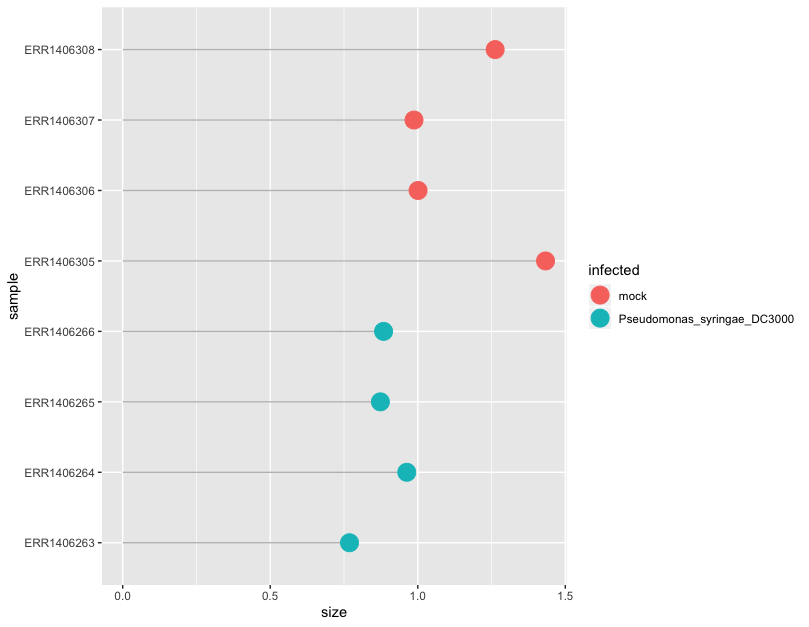

## Table of Contents
1. [Introduction](#introduction)
2. [Creating the DESeqDataSet object](#creating-the-DESeqDataSet-object)
3. [Different expression analysis](#creating-the-DESeqDataSet-object)

## Introduction

In this episode, we will see how to perform a simple one-condition experimental comparison. We will compare the transcriptome of Arabidopsis in response to infection by the leaf pathogenic bacteria _Pseudomonas syringae DC3000_ after 7 days (7 dpi). 

## Creating the DESeqDataSet object
We are first going to import the count file and the experimental design file required to build
a DESeqDataSet object from input tables. 

~~~
# import counts and experimental design 
counts <- read.delim("counts.txt", header = T, stringsAsFactors = F)
genes <- counts[,1]
counts <- counts[,-1] # to eliminate the gene columns that won't match sample names in the design file.

xp_design <- read.delim("experimental_design_modified.txt", header = T, stringsAsFactors = F, colClasses = rep("character",4))

# change col names
colnames(xp_design) <- c("sample", "growth", "infected", "dpi")
~~~
{:.language-r}

Since we do not want to work on all comparisons, we will filter out the samples and conditions that we do not need. Only the mock growth and the _P. syringae_ infected condition will remain.  

~~~
# filter design file (mock versus P. syringae at 7 dpi)
xp_design_mock_vs_infected = xp_design %>% filter(growth == "MgCl2" & dpi == "7")

# Filter count file accordingly (so the rows correspond to the columns of the filtered xp_design file)
counts_filtered = counts[, colnames(counts) %in% xp_design_mock_vs_infected$sample]

## Creation of the DESeqDataSet
dds <- DESeqDataSetFromMatrix(countData = counts_filtered, 
                              colData = xp_design_mock_vs_infected, 
                              design = ~ infected)

~~~
{:.language-r}

It is important to make sure that levels are properly ordered so we are indeed using the _mock_ group as our reference level. A positive gene fold change will for instance signify that the gene is upregulated in the _P. syringae_ condition relatively to the _mock_ condition.  

Please consult [the dedicated section of the DESeq2 vignette](http://bioconductor.org/packages/devel/bioc/vignettes/DESeq2/inst/doc/DESeq2.html#factorlevels) on factor levels. 

One way to see how levels are interpreted within the DESeqDataSet object is to display the factor levels. 
~~~
dds$infected
~~~
{:.language-r}

~~~
[1] mock  mock  mock  mock  Pseudomonas_syringae_DC3000
[6] Pseudomonas_syringae_DC3000 Pseudomonas_syringae_DC3000 Pseudomonas_syringae_DC3000
Levels: mock Pseudomonas_syringae_DC3000
~~~
{: .output}

This shows that the _mock_ level comes first before the _Pseudomonas_syringae_DC3000_ level. If this is not correct, you can change it following [the dedicated section of the DESeq2 vignette](http://bioconductor.org/packages/devel/bioc/vignettes/DESeq2/inst/doc/DESeq2.html#factorlevels) on factor levels. 

## Differential expression analysis

### Estimation of the size factors
We are first going to calculate the size factors (see previous episode) and display them in a custom plot. 
~~~
dds <- estimateSizeFactors(dds)

# create a dataframe for convenience
size_factors_df <- data.frame(sample = names(sizeFactors(dds)), 
                              size = sizeFactors(dds))

# add the experimental condition of interest for plot labelling
size_factors_df <- left_join(size_factors_df, xp_design_mock_vs_infected, by = "sample")

# plot
ggplot(size_factors_df, aes(x = sample, y = size, colour = infected)) + 
  geom_segment(aes(x = sample, xend = sample, y = 0, yend = size), color="grey") +
  geom_point(size = 6) + 
  coord_flip() +
  theme_grey()
~~~
{:.language-r}

This plot indicates that size factors are all between 0.75 and 1.5 so relatively close to each other. 

