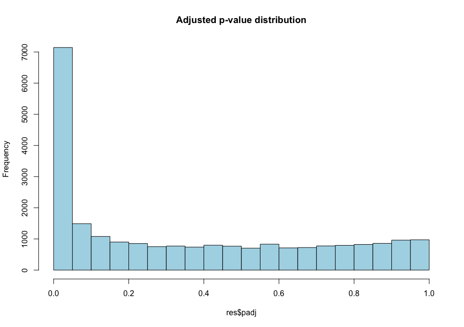
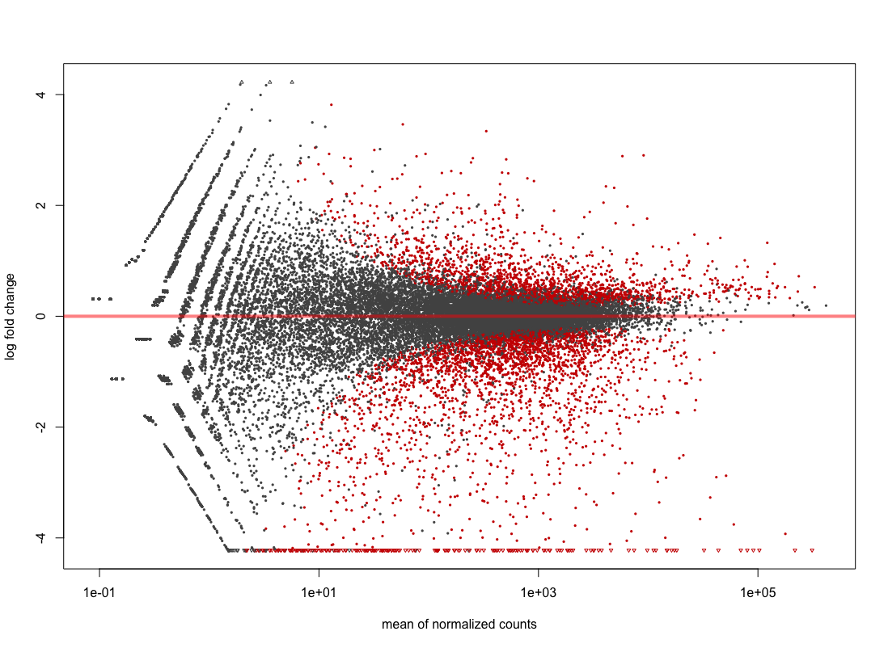
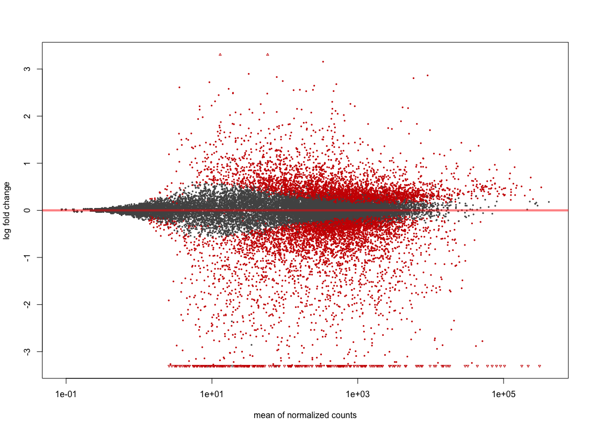
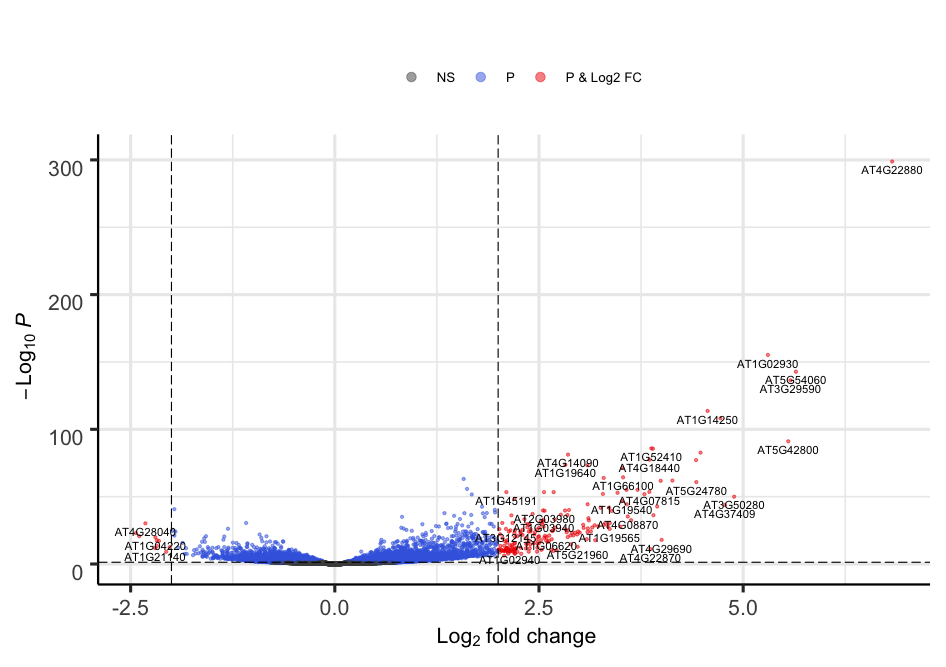
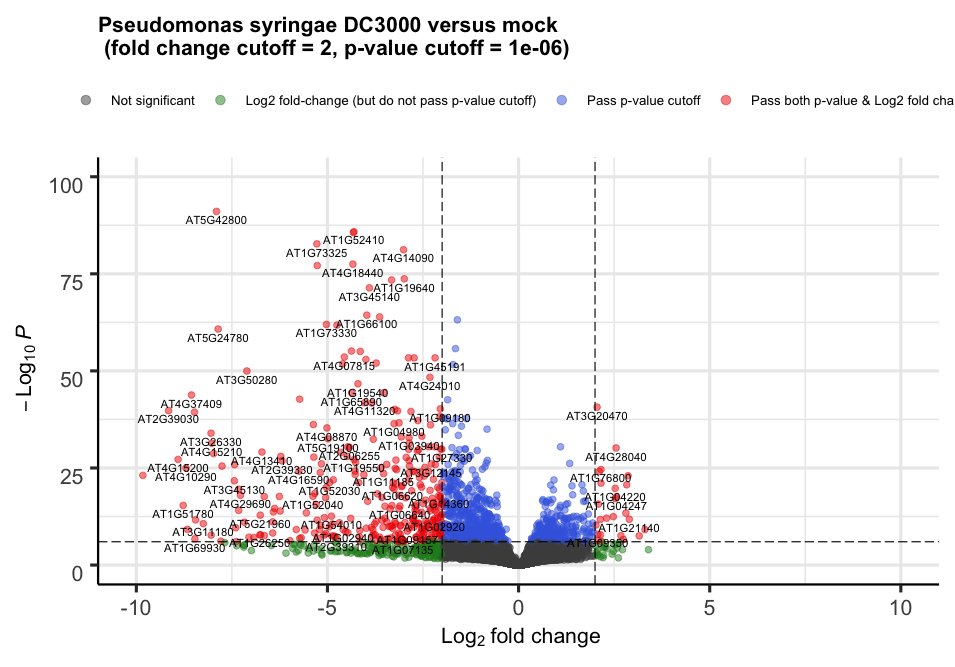
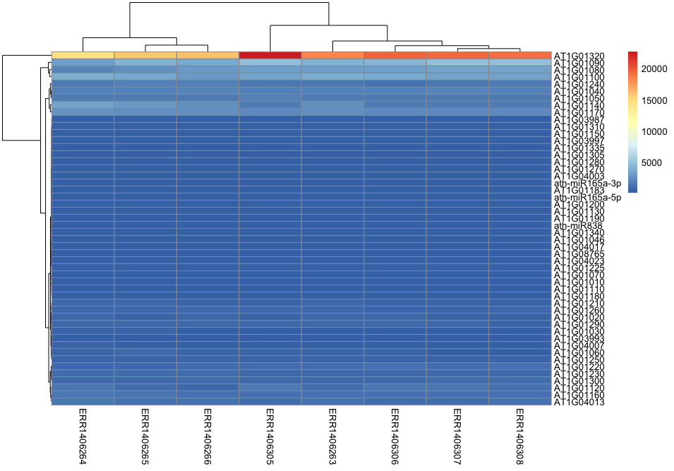
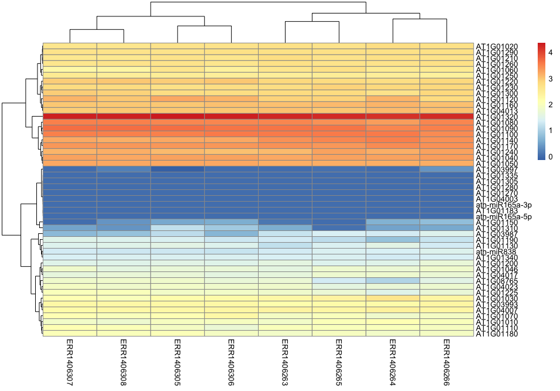

## Table of Contents
1. [Introduction](#introduction)
2. [Creating the DESeqDataSet object](#creating-the-DESeqDataSet-object)
3. [Different expression analysis](#creating-the-DESeqDataSet-object)

## Introduction

Differential expression analysis is the process of determining which of the genes are significantly affected by my experimental design. In the example study that we use, Arabidopsis plants were for instance infected or not by a pathogenic bacteria called _Pseudomonas syringae_ DC3000. One comparison of interest could be to determine which of the Arabidopsis leaf genes are transcriptionally affected by the presence of this pathogenic bacteria.

In this episode, we will see how to perform a simple one-condition experimental comparison with `DESeq2`. We will compare the transcriptome of Arabidopsis in response to infection by the leaf pathogenic bacteria _Pseudomonas syringae_ DC3000 after 7 days (7 dpi). 

This will yield a table containing genes $$log_{2}$$ fold change and their corrected p-values. We will also see how to create a few typical representations classically used to display RNA-seq results. 

## Creating the DESeqDataSet object
We are first going to import the count file and the experimental design file required to build
a DESeqDataSet object from input tables. 

~~~
# import counts and experimental design 
counts <- read.delim("counts.txt", header = T, stringsAsFactors = F)
genes <- counts[,1]
counts <- counts[,-1]
row.names(counts) <- genes
xp_design <- read.delim("experimental_design_modified.txt", header = T, stringsAsFactors = F, colClasses = rep("character",4))

# change col names
colnames(xp_design) <- c("sample", "seed", "infected", "dpi")

# reorder counts columns according to the experimental design file
counts <- counts[,xp_design$sample]
~~~
{:.language-r}

Since we do not want to work on all comparisons, we will filter out the samples and conditions that we do not need. Only the mock growth and the _P. syringae_ infected condition will remain.  

~~~
# filter design file (mock versus P. syringae at 7 dpi)
xp_design_mock_vs_infected = xp_design %>% filter(growth == "MgCl2" & dpi == "7")

# Filter count file accordingly (so the rows correspond to the columns of the filtered xp_design file)
counts_filtered = counts[, colnames(counts) %in% xp_design_mock_vs_infected$sample]

## Creation of the DESeqDataSet
dds2 <- DESeqDataSetFromMatrix(countData = counts_filtered, 
                              colData = xp_design_mock_vs_infected, 
                              design = ~ infected)

~~~
{:.language-r}

It is important to make sure that levels are properly ordered so we are indeed using the _mock_ group as our reference level. A positive gene fold change will for instance signify that the gene is upregulated in the _P. syringae_ condition relatively to the _mock_ condition.  

Please consult [the dedicated section of the DESeq2 vignette](http://bioconductor.org/packages/devel/bioc/vignettes/DESeq2/inst/doc/DESeq2.html#factorlevels) on factor levels. 

One way to see how levels are interpreted within the DESeqDataSet object is to display the factor levels. 
~~~
dds2$infected
~~~
{:.language-r}

~~~
[1] mock  mock  mock  mock  Pseudomonas_syringae_DC3000
[6] Pseudomonas_syringae_DC3000 Pseudomonas_syringae_DC3000 Pseudomonas_syringae_DC3000
Levels: mock Pseudomonas_syringae_DC3000
~~~
{: .output}

This shows that the _mock_ level comes first before the _Pseudomonas_syringae_DC3000_ level. If this is not correct, you can change it following [the dedicated section of the DESeq2 vignette](http://bioconductor.org/packages/devel/bioc/vignettes/DESeq2/inst/doc/DESeq2.html#factorlevels) on factor levels. 

## Differential expression analysis

### Running a DE analysis

Differential gene expression analysis will consist of simply two lines of code:
1. The first will call the `DESeq` function on a `DESeqDataSet` object that you've just created under the name `dds`. It will be returned under the same `R` object name `dds`.
2. Then, results are extracted using the `results` function on the `dds` object and results will be extracted as a table under the name `res` (short for results). 

~~~
dds2 <- DESeq(dds2)
res <- results(dds2)

# have a peek at the DESeqResults object 
res
~~~
{: .language-r}

The theory beyond DESeq2 differential gene expression analysis is beyond this course but nicely explained [within the DESeq2 vignette](http://bioconductor.org/packages/devel/bioc/vignettes/DESeq2/inst/doc/DESeq2.html#theory). 

> ## Beware of factor levels
> 
> If you do not supply any values to the contrast argument of the `DESeq` function, it will use the first value of the design variable from the design file.
> 
> In our case, we will perform a differential expression analysis between `mock` and `Pseudomonas_syringae_DC3000`. 
> 1. Which of these two is going to be used as the reference level?
> 2. How would you interpret a positive log2 fold change for a given gene?
>
> > ## Solution
> > 1. The `mock` condition is going to be used as the reference level since _m_ from `mock` comes before `P` from `Pseudomonas_syringae_DC3000`.
> > 2. A positive log2 fold change for a gene would mean that this gene is more abundant in `Pseudomonas_syringae_DC3000` than in the `mock` condition.
> {: .solution} 
{: .challenge}

The complete explanation comes from the [DESeq2 vignette](http://bioconductor.org/packages/devel/bioc/vignettes/DESeq2/inst/doc/DESeq2.html#differential-expression-analysis):
> Results tables are generated using the function results, which extracts a results table with log2 fold changes, p values and adjusted p values. With no additional arguments to results, the log2 fold change and Wald test p value will be for the last variable in the design formula, and if this is a factor, the comparison will be the last level of this variable over the reference level (see previous note on factor levels). However, the order of the variables of the design do not matter so long as the user specifies the comparison to build a results table for, using the name or contrast arguments of results.

A possible preferred way is to specify the comparison of interest explicitly. We are going to name this new result object `res2` and compare it with the previous one called `res`.

~~~
res2 <- results(dds2, contrast = c("infected",                       # name of the factor
                                  "Pseudomonas_syringae_DC3000",    # name of the numerator level for fold change
                                  "mock"))                          # name of the denominator level    

~~~
{: .language-r}

If we now compare the `res` and `res2` DESeqResults objects, they should be exactly the same and return a `TRUE` value.

~~~
all_equal(res, res2)
~~~
{: .language-r}

### Table results
We can now have a look at the result table that contains all information necessary to explore the results.  

Let's take a peek at the first lines.
~~~
res
~~~
{: .language-r}

~~~
log2 fold change (MLE): infected Pseudomonas_syringae_DC3000 vs mock 
Wald test p-value: infected Pseudomonas syringae DC3000 vs mock 
DataFrame with 33768 rows and 6 columns
                   baseMean     log2FoldChange             lfcSE              stat               pvalue                 padj
                  <numeric>          <numeric>         <numeric>         <numeric>            <numeric>            <numeric>
AT1G01010  87.4202637575253 -0.367280333820308 0.211701693868572 -1.73489558401135   0.0827593014886041    0.187224259459075
AT1G01020  477.153016520262 -0.266372165020665 0.107897663309171 -2.46874822726606     0.01355865776731   0.0457278114202934
AT1G03987  14.6179093243162  -1.47071320232473 0.462672694746205 -3.17873351729018   0.0014792001454695  0.00740168146185112
AT1G01030  194.095081900871 -0.916622750549647 0.276959201424051 -3.30959486392441 0.000934310992084711   0.0050664498722226
AT1G03993  175.982458997999  0.108469082280126 0.142106475509239 0.763294437438034    0.445287818744395    0.614000180781882
...                     ...                ...               ...               ...                  ...                  ...
ATMG01370  83.9769196075523 -0.825187944843753 0.216251457067068 -3.81587229993937 0.000135702676638565 0.000983812944421723
ATMG01380  57.1084095053476 -0.589800569274135 0.260988059519601 -2.25987568304764   0.0238289675115254   0.0709844754284016
ATMG01390  1085.66028395293  0.429149247175392 0.443108924164171 0.968496059935803    0.332796685814142    0.507053899330804
ATMG01400 0.254714460748876 -0.411354295725567   3.5338115409304 -0.11640527259619    0.907331356876165                   NA
ATMG01410  7.79228297186529 -0.957658947213795 0.619376215569985 -1.54616680967076    0.122064287011553      0.2498275349753
~~~
{: .output}

Some explanations about this output:
> The results table when printed will provide the information about the comparison, e.g. "log2 fold change (MAP): condition treated vs untreated", meaning that the estimates are of log2(treated / untreated), as would be returned by contrast=c("condition","treated","untreated"). 

So in our case, since we specified `contrast = c("infected", "Pseudomonas_syringae_DC3000", "mock")`, the `log2FoldChange` will return the $$log2(Pseudomonas \space syringae \space DC3000 \space / \space mock)$$.  

Additional information on the DESeqResult columns is available using the `mcols` function. 
~~~
mcols(res)
~~~
{: .language-r}

This will indicate a few useful _metadata_ information about our results:

~~~
DataFrame with 6 rows and 2 columns
                       type                                                          description
                <character>                                                          <character>
baseMean       intermediate                            mean of normalized counts for all samples
log2FoldChange      results log2 fold change (MLE): infected Pseudomonas_syringae_DC3000 vs mock
lfcSE               results         standard error: infected Pseudomonas syringae DC3000 vs mock
stat                results         Wald statistic: infected Pseudomonas syringae DC3000 vs mock
pvalue              results      Wald test p-value: infected Pseudomonas syringae DC3000 vs mock
padj                results                                                 BH adjusted p-values

~~~
{: .output}

### False discovery rates
The selected $$\alpha$$ threshold controls for type I error rate: rejecting the _null_ hypothesis ("there is no difference") while it is true. This $$\alpha$$ value is often set at 
at $$\alpha$$ = 0.05 (5%), $$\alpha$$ = 0.01 (1%) or $$\alpha$$ = 0.001 (0.1%).

When you perform thousands of statistical tests (one for each gene), you will by chance call genes differentially expressed while they are not (false positives). You can control for this by applying certain statistical procedures called _multiple hypothesis test correction_.   

We can count the number of genes that are differentially regulated at a certain $$\alpha$$ level. 
~~~
# threshold of p = 0.01
res %>% 
  as.data.frame() %>% 
  filter(padj < 0.01) %>% 
  dim()

# threshold of p = 0.001
res %>% 
  as.data.frame() %>% 
  filter(padj < 0.001) %>% 
  dim()
~~~
{: .language-r}

Histogram p-values
This [blog post](http://varianceexplained.org/statistics/interpreting-pvalue-histogram/) explains in detail what you can expect from each p-value distribution profile.
~~~
# distribution of adjusted p-values
hist(res$padj, col="lightblue", main = "Adjusted p-value distribution")
~~~
{: .language-r}

~~~
# distribution of non-adjusted p-values
hist(res$pvalue, col="grey", main = "Non-adjusted p-value distribution")
~~~
{: .language-r}

As you can see, the distribution of p-values was already quite similar suggesting that a good proportion of the tests have a significant p-value (inferior to $$\alpha$$ = 0.01 for instance). This
suggests that a good proportion of these will be true positives (genes truly differentially regulated). 

## MA plot
The MA plot originally comes from microarray studies that compared two conditions. From the DESeq2 vignette:
> In DESeq2, the function `plotMA` shows the log2 fold changes attributable to a given variable over the mean of normalized counts for all the samples in the DESeqDataSet. 
> Points will be colored red if the adjusted p value is less than 0.1. Points which fall out of the window are plotted as open triangles pointing either up or down.

~~~
plotMA(dds2, alpha = 0.01)
~~~
{: .language-r}

Shrinkage of effect size (LFC estimates) is useful for visualization and ranking of genes. It is more useful visualize the MA-plot for the shrunken log2 fold changes, which remove the noise associated with log2 fold changes from low count genes without requiring arbitrary filtering thresholds. This helps to get more meaningful log2 fold changes for all genes independently of their expression level. 
~~~
resLFC <- lfcShrink(dds = dds2, 
                  res = res,
                  type = "normal",
                  coef = 2) # corresponds to "infected_Pseudomonas_syringae_DC3000_vs_mock" comparison
~~~
{: .language-r}

~~~
plotMA(resLFC, alpha = 0.01)
~~~
{: .language-r}

You can see that genes with low counts are now shrinked. 

## Volcano plot
For each gene, this plot shows the gene fold change on the x-axis against the p-value plotted on the y-axis. 

Here, we make use of a library called _EnhancedVolcano_ which is available through [Bioconductor](http://bioconductor.org/packages/release/bioc/html/EnhancedVolcano.html) and described extensively on its [own GitHub page](https://github.com/kevinblighe/EnhancedVolcano).

We can build this plot rapidly without much customization. 
~~~
# load the library if not done yet
library("EnhancedVolcano")

# The main function is named after the package
EnhancedVolcano(toptable = resLFC,              # We use the shrunken log2 fold change as noise associated with low count genes is removed 
                x = "log2FoldChange",           # Name of the column in resLFC that contains the log2 fold changes
                y = "padj",                     # Name of the column in resLFC that contains the p-value
                lab = rownames(resLFC)
                )
~~~
{: .language-r}

Alternatively, the plot can be heavily customized to become a publication-grade figure.  
~~~
EnhancedVolcano(toptable = resLFC,
                x = "log2FoldChange",
                y = "padj",
                lab = rownames(resLFC),
                xlim = c(-10, +10),
                ylim = c(0,100),
                pCutoff = 1e-06,
                transcriptPointSize = 2.0,
                FCcutoff = 2, 
                title = "Pseudomonas syringae DC3000 versus mock \n (fold change cutoff = 2, p-value cutoff = 1e-06)",
                legend=c(
                  'Not significant',
                  'Log2 fold-change (but do not pass p-value cutoff)',
                  'Pass p-value cutoff',
                  'Pass both p-value & Log2 fold change')
                )

~~~
{: .language-r}

## Heatmap
Heatmap is a representation where gene counts are represented on a color scale. It is usually one of the classic figures part of a transcriptomic study. 
One can also cluster samples and genes to display a more organised heatmap. Enough talking, let's build one step by step. 

We are going to make use of a library called `pheatmap`. 

### Scaling 
We will first create three simple heatmaps by taking small subsets of the huge `counts_normalised` matrix. We have created this count matrix in the previous lesson episode.  

If you do not have the `counts_normalised` object in your environment, you can re-create it easily.  
~~~
# create the DESeqDataSet object
dds <- DESeqDataSetFromMatrix(countData = counts_filtered, 
                              colData = xp_design_mock_vs_infected, 
                              design = ~ infected)

# extract the normalised counts
dds <- estimateSizeFactors(dds)
counts_normalised = counts(dds, normalized = TRUE)
~~~
{: .language-r}

Let's plot a few simple heatmaps without any grouping. 
~~~
# load the library if not already done
library(pheatmap)

# we will take a slice of 50 genes 
counts_small <- counts_normalised[1:50,]

# 10 genes
pheatmap(counts_small[1:10,], cluster_rows = F, cluster_cols = F)

# 20 genes
pheatmap(counts_small[1:20,], cluster_rows = F, cluster_cols = F)

# 50 genes
pheatmap(counts_small[1:50,], cluster_rows = F, cluster_cols = F)

~~~
{: .language-r}

> ## First heatmaps
> 
> From these three different heatmaps, you can already notice one important difference between these three heatmaps. 
> 
> * What can be a possible issue related to the color scale when increasing number of genes are being displayed?
> 
>
> > ## Solution
> > * Varying amount of genes being displayed can result in uncomparable heatmaps since the color scale automatically adjust to the gene count levels.
> {: .solution} 
{: .challenge}

When creating a heatmap, it is vital to control how scaling is performed. A possible solution is to specify `scale = "row"` to perform row scaling since gene expression levels will become comparable. 

One way to quicky scale gene levels so that they become comparable is to apply a $$log$$ transformation. Here we will apply a $$log_{10}$$ transformation. 
~~~
# add an offset of 1 to be able to calculate the log10 (it will be equal to 0 once log transform)
counts_small[counts_norm_small == 0] <- 1

pheatmap(counts_small, cluster_rows = F, cluster_cols = F)
pheatmap(log10(counts_norm_small, cluster_rows = F, cluster_cols = F)
~~~
{: .language-r}

This is the native heatmap without any transformation. 

After applying the $$log_{10}$$ transformation, gene expression levels become more comparable. 

### Grouping genes by profiles
One interesting feature of the heatmap visualisation is the ability to group genes by their expression profile. Similarly to the 

### Filtering out the non-differentially expressed genes
As for now, we have worked on the gene count matrix that contains genes differentially expressed _and_ not differentially expressed. In other words, we have kept genes that
are not directly responding to our experimental treatment (here infection by _Pseudomonas syringae_ DC3000).

Clearer heatmaps can be obtained by filtering out genes that are not differentially expressed in our comparison of interest. Let's do just that!

First things first. We create a new object that only contains genes that are differentially expressed. 
~~~
genes_differential = 
  res %>%
  as.data.frame() %>%
  mutate(gene = row.names(res)) %>% 
  filter(padj < 0.01) %>% 
  select(gene)
~~~
{: .language-r} 

We now use this gene list to keep only the genes differentially expressed in the original `counts_normalised` object. 
Here we filter the `counts_normalised` matrix using its row names (the gene ids) that can be found inside the genes_differentialgene column. 
~~~
counts_normalised_only_diff = counts_normalised[row.names(counts_normalised) %in% genes_differential$gene, ]

~~~
{: .language-r} 

> ## Simple checks
> 
> Can you think of a simple way to check that your gene selection has worked? 
> 
>
> > ## Solution
> > A simple check can be performed using the `dim()` or the `nrow()` functions on the `counts_normalised_only_diff` and the original `counts_normalised` objects. 
> > While the original `counts_normalised` object has 33,768 genes, the filtered `counts_normalised_only_diff` only has 4979 genes. This indicates that our filtering step has worked. 
> {: .solution} 
{: .challenge}

## Functional enrichment
Master level!

# References
* Kamil Slowikoski blog post about heatmap: https://slowkow.com/notes/pheatmap-tutorial/
* Z-score calculation: https://www.statisticshowto.datasciencecentral.com/probability-and-statistics/z-score/
* Type I and type II error rates in gene expression studies: https://www.ncbi.nlm.nih.gov/pubmed/28637422
* p-value histograms explained: http://varianceexplained.org/statistics/interpreting-pvalue-histogram/

