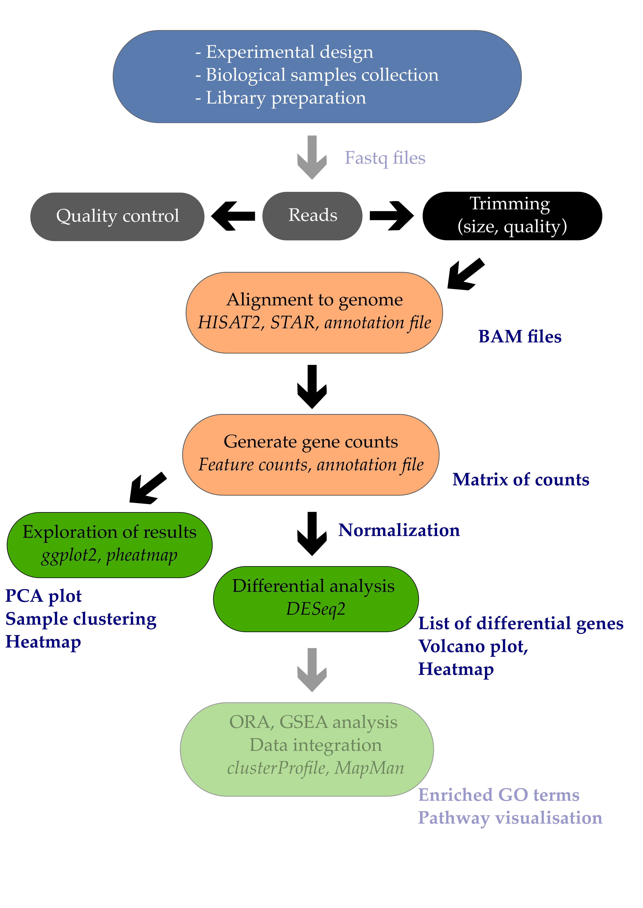
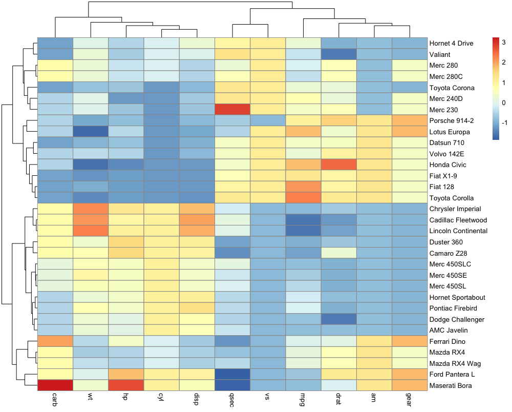
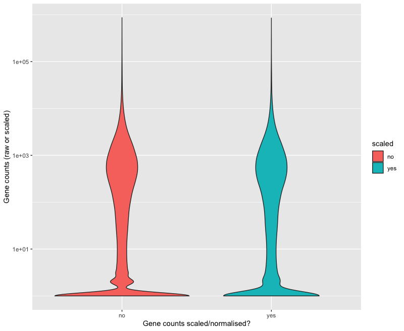
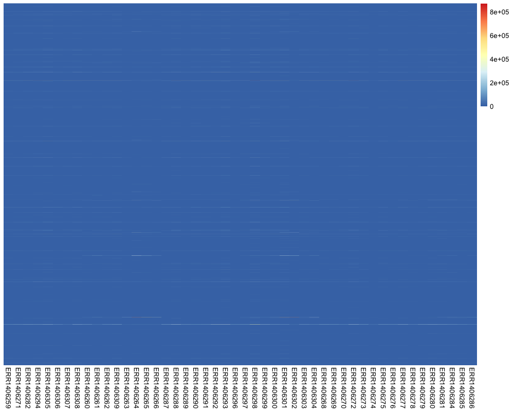
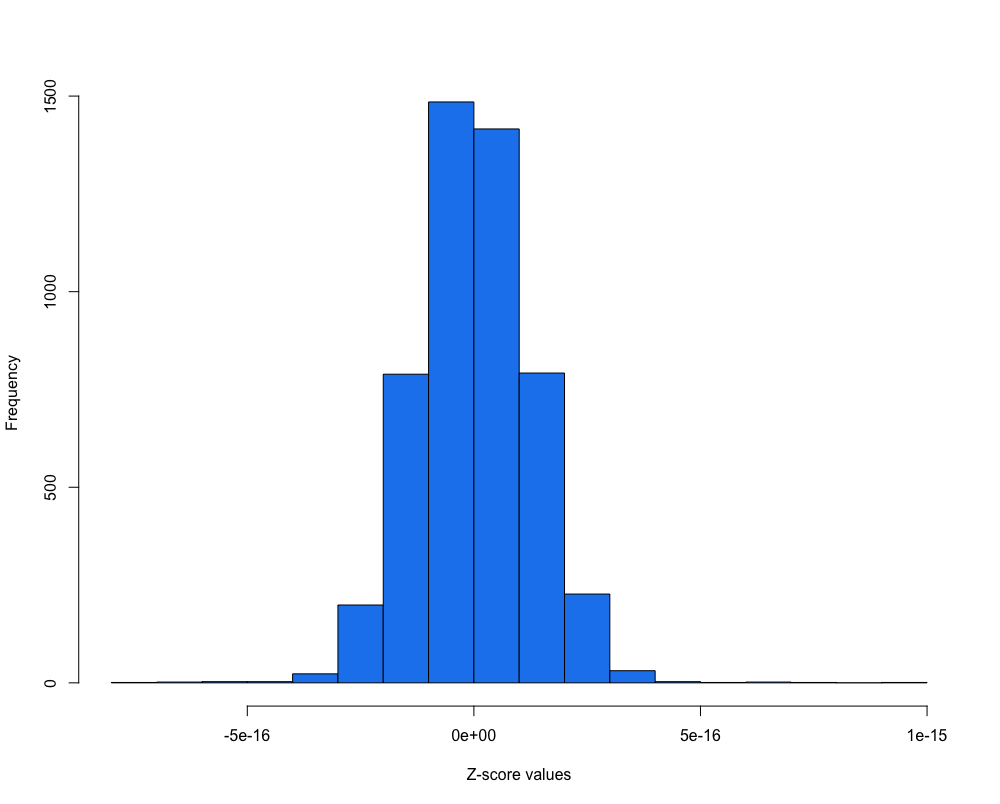
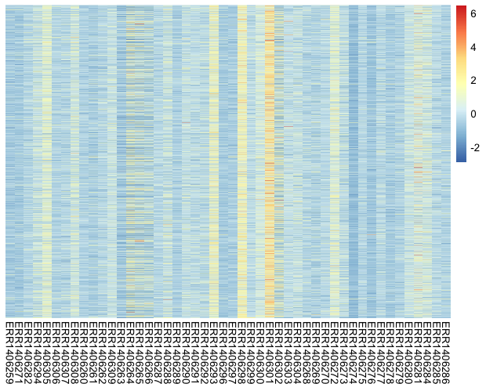
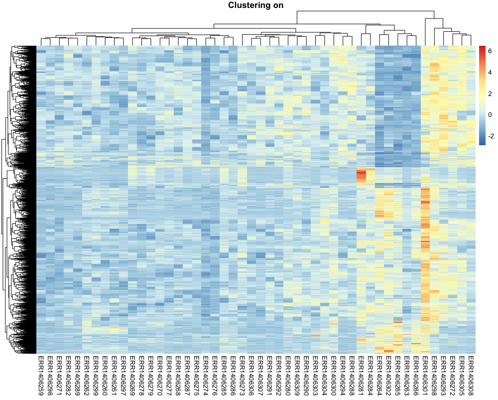
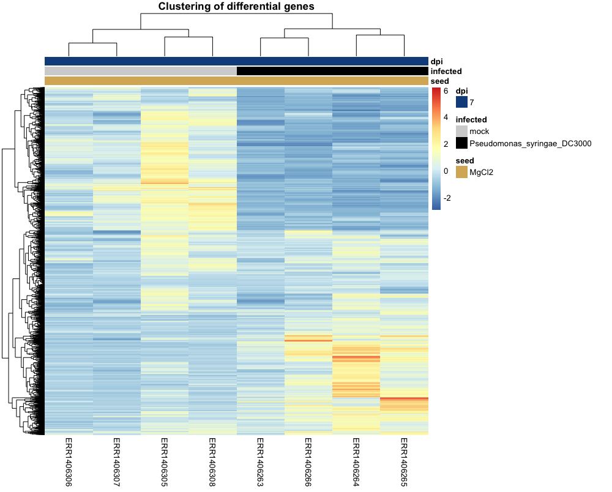
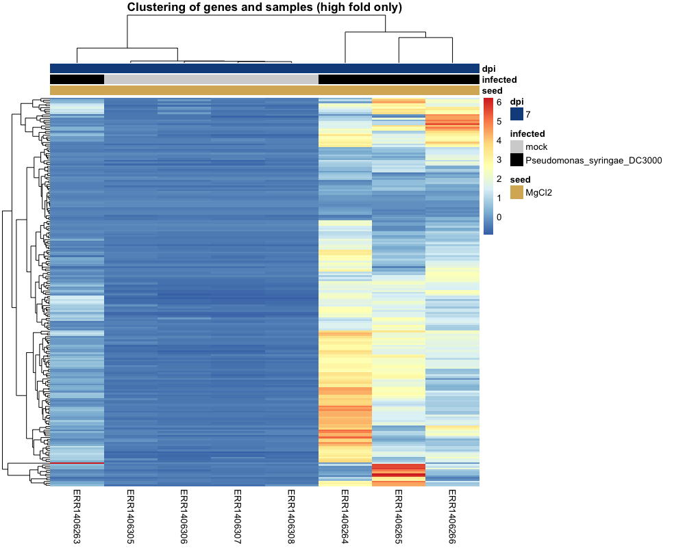

# Table of Contents

<!-- MarkdownTOC autolink="True" levels="1,2,3" -->

- [1. Introduction](#1-introduction)
- [2. Differential expression analysis](#2-differential-expression-analysis)
  - [2.1 Creating the DESeqDataSet object](#21-creating-the-deseqdataset-object)
  - [2.2 Running the DE analysis](#22-running-the-de-analysis)
  - [2.3 Extracting the table of differential genes](#23-extracting-the-table-of-differential-genes)
  - [2.4 False discovery rates](#24-false-discovery-rates)
  - [Extracting the table of differential genes](#extracting-the-table-of-differential-genes)
- [3. Volcano plot](#3-volcano-plot)
- [4. Heatmap](#4-heatmap)
  - [4.1 Function to scale the raw counts](#41-function-to-scale-the-raw-counts)
  - [4.2 First version](#42-first-version)
  - [4.2 Second version with scaling](#42-second-version-with-scaling)
  - [4.3 Third version with genes and samples grouped by profiles](#43-third-version-with-genes-and-samples-grouped-by-profiles)
  - [4.4. Fourth version of our heatmap with the 8 samples being investigated](#44-fourth-version-of-our-heatmap-with-the-8-samples-being-investigated)
- [Bonus: MA plots](#bonus-ma-plots)
- [References](#references)

<!-- /MarkdownTOC -->

# 1. Introduction

Differential expression analysis is the process of determining which of the genes are significantly affected by my experimental design. In the example study that we use, Arabidopsis plants were infected or not by a pathogenic bacteria called _Pseudomonas syringae_ DC3000. One comparison of interest could be to determine which of the Arabidopsis leaf genes are transcriptionally affected by the infection with this pathogenic bacteria.

In this episode, we will see how to perform a simple one-condition experimental comparison with `DESeq2`. We will compare the transcriptome of Arabidopsis in response to infection by the leaf pathogenic bacteria _Pseudomonas syringae_ DC3000 after 7 days (7 dpi). 

This will yield a table containing genes $$log_{2}$$ fold change and their corrected p-values. We will also see how to create a few typical representations classically used to display RNA-seq results such as volcano plots and heatmaps. 

> ## Important note
> For differential expression analysis, you should use the __raw__ counts and __not__ the scaled counts. 
> As the DESeq2 model fit requires raw counts (integers), make sure that you use the `raw_counts.csv` file. 
{: .callout}

# 2. Differential expression analysis

## 2.1 Creating the DESeqDataSet object

Since we do not want to work on all comparisons, we will filter out the samples and conditions that we do not need. Only the mock growth and the _P. syringae_ infected condition will remain.  

~~~
# Import libraries
library("DESeq2")
library("tidyverse")

# import the samples to conditions correspodence
xp_design <- read.csv("tutorial/samples_to_conditions.csv", 
                        header = T, 
                        stringsAsFactors = F, 
                        colClasses = rep("character",4))

# filter design file to keep only "mock" and the "infected P. syringae at 7 dpi" conditions.
xp_design_mock_vs_infected = xp_design %>% 
  filter(growth == "MgCl2" & dpi == "7")
~~~
{: .language-r}

We then import the gene counting values and call it `raw_counts`.   
The gene names have to be changed to the names of the rows of the table for compatibility with `DESeq2`. This is done using the `column_to_rownames()` function from the `tibble` package (contained in `tidyverse` suite of packages).

~~~
# Import the gene raw counts
raw_counts <- read.csv("tutorial/raw_counts.csv", header = T, stringsAsFactors = F) %>% 
  column_to_rownames("Geneid")

# reorder counts columns according to the complete list of samples 
raw_counts <- raw_counts[ , xp_design$sample]
~~~
{: .language-r}

We will now filter both the `raw_counts` and `xp_design` objects to keep a one-factor comparison and investigate the leaf transcriptome
of Arabidopsis plants whose seeds were MgCl2 treated and whose plants were infected or not with Pseudomonas syringae DC3000 at 7 dpi.

The corresponding code is available below.

~~~
# Filter count file accordingly (to keep only samples present in the filtered xp_design file)
raw_counts_filtered = raw_counts[, colnames(raw_counts) %in% xp_design_mock_vs_infected$sample]

## Creation of the DESeqDataSet
dds <- DESeqDataSetFromMatrix(countData = raw_counts_filtered, 
                              colData = xp_design_mock_vs_infected, 
                              design = ~ infected)

~~~
{: .language-r}

You can have a glimpse at the DESeqDataSet `dds` object that you have created. It gives some useful information already. 

~~~
dds
~~~
{: .language-r}

~~~
class: DESeqDataSet 
dim: 33768 8 
metadata(1): version
assays(1): counts
rownames(33768): AT1G01010 AT1G01020 ... ATMG01400 ATMG01410
rowData names(0):
colnames(8): ERR1406305 ERR1406306 ... ERR1406265 ERR1406266
colData names(4): sample growth infected dpi
~~~
{: .output}

 

> ## Important note on factor levels
> It is important to make sure that levels are properly ordered so we are indeed using the _mock_ group as our reference level. A positive gene fold change means that the gene is upregulated in the _P. syringae_ condition relatively to the _mock_ condition.  
{: .callout}

Please consult [the dedicated section of the DESeq2 vignette](http://bioconductor.org/packages/devel/bioc/vignettes/DESeq2/inst/doc/DESeq2.html#factorlevels) on factor levels. 

One way to see how levels are interpreted within the DESeqDataSet object is to display the factor levels. 
~~~
dds$infected
~~~
{: .language-r}

~~~
[1] mock  mock  mock  mock  Pseudomonas_syringae_DC3000
[6] Pseudomonas_syringae_DC3000 Pseudomonas_syringae_DC3000 Pseudomonas_syringae_DC3000
Levels: mock Pseudomonas_syringae_DC3000
~~~
{: .output}

This shows that the _mock_ level comes first before the _Pseudomonas_syringae_DC3000_ level. If this is not correct, you can change it following [the dedicated section of the DESeq2 vignette](http://bioconductor.org/packages/devel/bioc/vignettes/DESeq2/inst/doc/DESeq2.html#factorlevels) on factor levels. 

## 2.2 Running the DE analysis

Differential gene expression analysis will consist of simply two lines of code:
1. The first will call the `DESeq` function on a `DESeqDataSet` object that you've just created under the name `dds`. It will be returned under the same `R` object name `dds`.
2. Then, results are extracted using the `results` function on the `dds` object and results will be extracted as a table under the name `res` (short for results). 

~~~
dds <- DESeq(dds)
~~~
{: .language-r}

~~~
estimating size factors
estimating dispersions
gene-wise dispersion estimates
mean-dispersion relationship
final dispersion estimates
fitting model and testing
~~~
{: .output}

~~~
res <- results(dds2)

# have a peek at the DESeqResults object 
res
~~~
{: .language-r}

The theory beyond DESeq2 differential gene expression analysis is beyond this course but nicely explained [within the DESeq2 vignette](http://bioconductor.org/packages/devel/bioc/vignettes/DESeq2/inst/doc/DESeq2.html#theory). 

> ## Beware of factor levels
> 
> If you do not supply any values to the contrast argument of the `DESeq` function, it will use the first value of the design variable from the design file.
> 
> In our case, we will perform a differential expression analysis between `mock` and `Pseudomonas_syringae_DC3000`. 
> 1. Which of these two is going to be used as the reference level?
> 2. How would you interpret a positive log2 fold change for a given gene?
>
> > ## Solution
> > 1. The `mock` condition is going to be used as the reference level since _m_ from `mock` comes before `P` from `Pseudomonas_syringae_DC3000`.
> > 2. A positive log2 fold change for a gene would mean that this gene is more abundant in `Pseudomonas_syringae_DC3000` than in the `mock` condition.
> {: .solution} 
{: .challenge}

The complete explanation comes from the [DESeq2 vignette](http://bioconductor.org/packages/devel/bioc/vignettes/DESeq2/inst/doc/DESeq2.html#differential-expression-analysis):
> Results tables are generated using the function results, which extracts a results table with log2 fold changes, p values and adjusted p values. With no additional arguments to results, the log2 fold change and Wald test p value will be for the last variable in the design formula, and if this is a factor, the comparison will be the last level of this variable over the reference level (see previous note on factor levels). However, the order of the variables of the design do not matter so long as the user specifies the comparison to build a results table for, using the name or contrast arguments of results.

A possible preferred way is to specify the comparison of interest explicitly. We are going to name this new result object `all_genes_results` and compare it with the previous one called `res`.

~~~
all_genes_results <- results(dds, contrast = c("infected",                      # name of the factor
                                  "Pseudomonas_syringae_DC3000",    # name of the numerator level for fold change
                                  "mock"))                          # name of the denominator level    

~~~
{: .language-r}

If we now compare the `res` and `all_genes_results` DESeqResults objects, they should be exactly the same and return a `TRUE` value.
~~~
all_equal(res, all_genes_results)
~~~
{: .language-r}

If not, that means that you should check your factor ordering. 

## 2.3 Extracting the table of differential genes 

We can now have a look at the result table that contains all information on _all_ genes (p-value, fold changes, etc).  

Let's take a peek at the first lines.
~~~
head(all_genes_results)                
~~~
{: .language-r}

~~~
log2 fold change (MLE): infected Pseudomonas_syringae_DC3000 vs mock 
Wald test p-value: infected Pseudomonas syringae DC3000 vs mock 
DataFrame with 33768 rows and 6 columns
                   baseMean     log2FoldChange             lfcSE              stat               pvalue                 padj
                  <numeric>          <numeric>         <numeric>         <numeric>            <numeric>            <numeric>
AT1G01010  87.4202637575253 -0.367280333820308 0.211701693868572 -1.73489558401135   0.0827593014886041    0.187224259459075
AT1G01020  477.153016520262 -0.266372165020665 0.107897663309171 -2.46874822726606     0.01355865776731   0.0457278114202934
AT1G03987  14.6179093243162  -1.47071320232473 0.462672694746205 -3.17873351729018   0.0014792001454695  0.00740168146185112
AT1G01030  194.095081900871 -0.916622750549647 0.276959201424051 -3.30959486392441 0.000934310992084711   0.0050664498722226
AT1G03993  175.982458997999  0.108469082280126 0.142106475509239 0.763294437438034    0.445287818744395    0.614000180781882
...                     ...                ...               ...               ...                  ...                  ...
ATMG01370  83.9769196075523 -0.825187944843753 0.216251457067068 -3.81587229993937 0.000135702676638565 0.000983812944421723
ATMG01380  57.1084095053476 -0.589800569274135 0.260988059519601 -2.25987568304764   0.0238289675115254   0.0709844754284016
ATMG01390  1085.66028395293  0.429149247175392 0.443108924164171 0.968496059935803    0.332796685814142    0.507053899330804
ATMG01400 0.254714460748876 -0.411354295725567   3.5338115409304 -0.11640527259619    0.907331356876165                   NA
ATMG01410  7.79228297186529 -0.957658947213795 0.619376215569985 -1.54616680967076    0.122064287011553      0.2498275349753
~~~
{: .output}

 

> ## Question
> 1. What is the biological meaning of a $$log2$$ fold change equal to 1 for gene X?
> 2. What is the biological meaning of a $$log2$$ fold change equal to -1?
> 3. In R, compute the $$log2$$ fold change ("treated vs untreated") of a gene that has:
>    - A gene expression equal to 230 in the "untreated" condition.  
>    - A gene expression equal to 750 in the "treated" condition.
> 
> > ## Solution
> > 1. A $$log2$$ equal to 1 means that gene X has a higher expression (x2, two-fold) in the DC3000 infected condition compared to the mock condition. 
> > 2. A $$log2$$ equal to -1 means that gene X has a smaller expression ($$\frac{1}{2}$$) in the DC3000 infected condition.   
> >  
> > ~~~
> > untreated = 230
> > treated = 750
> > log2(treated/untreated) # equals 1.705257
> > ~~~
> > {: .language-r}
> {: .solution}
{: .challenge}

 

Some explanations about this output:
> The results table when printed will provide the information about the comparison, e.g. "log2 fold change (MAP): condition treated vs untreated", meaning that the estimates are of log2(treated / untreated), as would be returned by contrast=c("condition","treated","untreated"). 

So in our case, since we specified `contrast = c("infected", "Pseudomonas_syringae_DC3000", "mock")`, the `log2FoldChange` will return the $$log2(Pseudomonas \space syringae \space DC3000 \space / \space mock)$$.  

Additional information on the DESeqResult columns is available using the `mcols` function. 
~~~
mcols(all_genes_results)
~~~
{: .language-r}

This will indicate a few useful _metadata_ information about our results:

~~~
DataFrame with 6 rows and 2 columns
                       type                                                          description
                <character>                                                          <character>
baseMean       intermediate                            mean of normalized counts for all samples
log2FoldChange      results log2 fold change (MLE): infected Pseudomonas_syringae_DC3000 vs mock
lfcSE               results         standard error: infected Pseudomonas syringae DC3000 vs mock
stat                results         Wald statistic: infected Pseudomonas syringae DC3000 vs mock
pvalue              results      Wald test p-value: infected Pseudomonas syringae DC3000 vs mock
padj                results                                                 BH adjusted p-values

~~~
{: .output}

## 2.4 False discovery rates
The selected $$\alpha$$ threshold controls for type I error rate: rejecting the _null_ hypothesis (H0 no difference) and therefore affirming that there is a gene expression difference between conditions while there aren't any. This $$\alpha$$ value is often set at 
at $$\alpha$$ = 0.01 (1%) or $$\alpha$$ = 0.001 (0.1%) in RNA-seq analyses.

When you perform thousands of statistical tests (one for each gene), you will by chance call genes differentially expressed while they are not (false positives). You can control for this by applying certain statistical procedures called _multiple hypothesis test correction_.   

We can count the number of genes that are differentially regulated at a certain $$\alpha$$ level. 
~~~
library(dplyr)

# threshold of p = 0.01
all_genes_results %>% 
  as.data.frame() %>% 
  filter(padj < 0.01) %>% 
  dim()

# threshold of p = 0.001
all_genes_results %>% 
  as.data.frame() %>% 
  filter(padj < 0.001) %>% 
  dim()
~~~
{: .language-r}

You should obtain __4979__ differentially expressed genes at 0.01 and __3249__ at 0.001 which are quite important numbers: indeed, it corresponds to respectively \~15% and \~10% of the whole number transcriptome (total number of mRNA is 33,768).    

Histogram p-values
This [blog post](http://varianceexplained.org/statistics/interpreting-pvalue-histogram/) explains in detail what you can expect from each p-value distribution profile.
~~~
# distribution of adjusted p-values
hist(all_genes_results$padj, col="lightblue", main = "Adjusted p-value distribution")
~~~
{: .language-r}

~~~
# distribution of non-adjusted p-values
hist(all_genes_results$pvalue, col="grey", main = "Non-adjusted p-value distribution")
~~~
{: .language-r}

As you can see, the distribution of p-values was already quite similar suggesting that a good proportion of the tests have a significant p-value (inferior to $$\alpha$$ = 0.01 for instance). This
suggests that a good proportion of these will be true positives (genes truly differentially regulated). 

## Extracting the table of differential genes
Ok, here's the moment you've been waiting for. How can I extract a nicely filtered final table of differential genes? Here it is!

~~~
diff_genes = all_genes_results %>% 
  as.data.frame() %>% 
  rownames_to_column("genes") %>% 
  filter(padj < 0.01) %>% 
  arrange(desc(log2FoldChange), 
          desc(padj))
head(diff_genes)
~~~
{: .language-r}

> ## Choosing thresholds
> Getting a list of differentially expressed genes means that you need to choose an __absolute__ threshold for the log2 fold change (column `log2FoldChange`) and the adjusted p-value (column `_padj_`). Therefore you can make different list of differential genes based on your selected thresholds. It is common to choose a log2 fold change threshold of |1| or |2| and an adjusted p-value of 0.01 for instance. 
{: .callout}

You could write this file on your disk with `write.csv()` for instance to save a comma-separated text file containing your results. 

 
 

# 3. Volcano plot
For each gene, this plot shows the gene fold change on the x-axis against the p-value plotted on the y-axis. 

Here, we make use of a library called _EnhancedVolcano_ which is available through [Bioconductor](http://bioconductor.org/packages/release/bioc/html/EnhancedVolcano.html) and described extensively on its [own GitHub page](https://github.com/kevinblighe/EnhancedVolcano).

First, we are going to "shrink" the $$\log2$$ fold changes to remove the noise associated with fold changes coming from genes with low count levels. Shrinkage of effect size (LFC estimates) is useful for visualization and ranking of genes. This helps to get more meaningful log2 fold changes for all genes independently of their expression level.

Which 
  
the name or number of the coefficient (LFC) to shrink
~~~
library("apeglm")

resLFC <- lfcShrink(dds = dds, 
                  res = all_genes_results,
                  type = "normal",
                  coef = "infected_Pseudomonas_syringae_DC3000_vs_mock") # name or number of the coefficient (LFC) to shrink
~~~
{: .language-r}

To see what coefficients can be extracted, type: 
~~~
resultsNames(dds)
~~~
{: .language-r}

~~~
[1] "Intercept"                                   
[2] "infected_Pseudomonas_syringae_DC3000_vs_mock"
~~~
{: .output}

We can build the Volcano plot rapidly without much customization. 
~~~
# load the library if not done yet
library("EnhancedVolcano")

# The main function is named after the package
EnhancedVolcano(toptable = resLFC,              # We use the shrunken log2 fold change as noise associated with low count genes is removed 
                x = "log2FoldChange",           # Name of the column in resLFC that contains the log2 fold changes
                y = "padj",                     # Name of the column in resLFC that contains the p-value
                lab = rownames(resLFC)
                )
~~~
{: .language-r}

Alternatively, the plot can be heavily customized to become a publication-grade figure.  
~~~
EnhancedVolcano(toptable = resLFC,
                x = "log2FoldChange",
                y = "padj",
                lab = rownames(resLFC),
                xlim = c(-10, +10),
                ylim = c(0,100),
                pCutoff = 1e-06,
                transcriptPointSize = 2.0,
                FCcutoff = 2, 
                title = "Pseudomonas syringae DC3000 versus mock \n (fold change cutoff = 2, p-value cutoff = 1e-06)",
                legend=c(
                  'Not significant',
                  'Log2 fold-change (but do not pass p-value cutoff)',
                  'Pass p-value cutoff',
                  'Pass both p-value & Log2 fold change')
                )

~~~
{: .language-r}

# 4. Heatmap
Heatmap is a representation where values are represented on a color scale. It is usually one of the classic figures part of a transcriptomic study. 
One can also cluster samples and genes to identify groups of genes that show a coordinated behaviour. Let's build a nice looking heatmap to display our differential genes one step at a time.  

We are going to make use of a library called `pheatmap`. Here is a minimal example (`mtcars` is a dataset that comes included with R).
~~~
library(pheatmap)
df <- scale(mtcars)
pheatmap(df)
~~~
{: .language-r}

> ## Troubleshooting
> If you have issues where your heatmap plot is not being shown, run `dev.off()` and try to plot again. It should solve your issue. 
{: .callout}

## 4.1 Function to scale the raw counts

Let's work on the global `raw_counts` object that contains the _unscaled_ raw counts for our genes. We will first normalize it using a custom function that mimics DESeq2 normalization procedure in one line.

The function is called `mor_normalization` and stands for "median of ratios normalization" method. 
It is explained in details [in the previous episode section 'Bonus: DESeq2 count normalization'](/05-descriptive-plots/index.html#5-bonus-deseq2-count-normalization).

The whole function is available here in the [extra functions page]({{page.root}}) and below.   

~~~
# import custom function
# copy-paste and execute this code in your console to get the mor_normalization() function

mor_normalization = function(data){
  library(dplyr)
  library(tibble)

  # take the log
  log_data = log(data) 
  
  # find the psuedo-references per sample by taking the geometric mean
  log_data = log_data %>% 
               rownames_to_column('gene') %>% 
               mutate (gene_averages = rowMeans(log_data)) %>% 
               filter(gene_averages != "-Inf")
  
  # the last columns is the pseudo-reference column 
  pseudo_column = ncol(log_data)
  
  # where to stop before the pseudo column 
  before_pseduo = pseudo_column - 1
  
  # find the ratio of the log data to the pseudo-reference
  ratios = sweep(log_data[,2:before_pseduo], 1, log_data[,pseudo_column], "-")
  
  # find the median of the ratios
  sample_medians = apply(ratios, 2, median)
  
  # convert the median to a scaling factor
  scaling_factors = exp(sample_medians)
  
  # use scaling factors to scale the original data
  manually_normalized = sweep(data, 2, scaling_factors, "/")
  return(manually_normalized)
}

~~~
{: .language-r}

Let's scale/normalise the _raw unscaled_ counts and display the first lines.

~~~
scaled_counts <- mor_normalization(raw_counts_filtered)
head(scaled_counts)
~~~
{: .language-r}

~~~
          ERR1406305  ERR1406306  ERR1406307 ERR1406308 ERR1406263 ERR1406264 ERR1406265 ERR1406266
AT1G01010   85.83575   90.910197   69.891325   59.41828   74.15774  114.25728  106.48797   98.40356
AT1G01020  452.20786  456.549010  398.076675  426.22715  511.29812  588.94434  454.57769  529.34329
AT1G03987   13.95703    4.995066    5.064589    6.33795   16.91317   20.77405   21.75561   27.14581
AT1G01030  153.52736  168.833223  118.511376   97.44598  183.44284  404.05529  229.00639  197.93820
AT1G03993  174.46291  189.812499  190.428537  176.67036  148.31549  162.03760  158.01441  208.11788
AT1G01040 1811.62285 1800.221699 1874.910751 1689.85596 1592.43995 1698.27864 1745.02871 1883.24056
~~~
{: .output}

This scaling procedure does not fundamentally change our gene count values. You can verify this by executing this code: 
~~~
long_scaled_counts = 
  scaled_counts %>% 
  rownames_to_column("gene") %>% 
  pivot_longer(-gene, names_to = "sample", values_to = "counts") %>% 
  mutate(scaled = "yes")

long_raw_counts = 
  raw_counts %>% 
  rownames_to_column("gene") %>% 
  pivot_longer(-gene, names_to = "sample", values_to = "counts") %>% 
  mutate(scaled = "no")

long_raw_and_scaled_counts = bind_rows(long_raw_counts, long_scaled_counts)

ggplot(long_raw_and_scaled_counts, 
       aes(x = scaled, y = counts + 1, fill = scaled)) +
  geom_violin() +
  scale_y_log10() +
  labs(x = "Gene counts scaled/normalised?", y = "Gene counts (raw or scaled)")
~~~
{: .language-r}

## 4.2 First version

~~~
counts_normalised_only_diff_genes = 
  mor_normalization(raw_counts) %>%             # normalize the counts using our custom function
  rownames_to_column("genes") %>%               
  pivot_longer(- genes,                         
               names_to = "sample", 
               values_to = "counts") %>% 
  filter(genes %in% diff$genes) %>%             
  pivot_wider(names_from = "sample",            
              values_from = "counts")  %>%      
  column_to_rownames("genes")                   # the gene column is converted back to row names to create a matrix usable with pheatmap

dim(counts_normalised_only_diff_genes)          # check that you have the expected number of rows and columns
~~~
{: .language-r}

We indeed find that we have **4979 genes** (rows, p < 0.01) and **48 samples** (columns) which corresponds to the number of differential genes identified previously between Mock and DC3000 infected conditions at 7 dpi and with a MgCl2 seed coating. You can also use `head()` to show the first lines of this table. 

Let's plot our first version of the heatmap. 
~~~
pheatmap(counts_normalised_only_diff_genes, 
         cluster_rows = FALSE, 
         cluster_cols = FALSE, 
         scale = "none",
         show_rownames = FALSE, 
         show_colnames = TRUE)
~~~
{: .language-r}

We have removed the genes names with `show_rownames = FALSE` since they are not readable anymore for such a high number of genes.

Well....not very useful right?

> ## Question
> Do you have an idea of how to improve this heatmap?  
> Hint: run the code below to show the distribution of values in the `counts_normalised_only_diff_genes` table:
> ~~~ 
> counts_normalised_only_diff_genes %>% 
>     rownames_to_column("genes") %>% 
>     pivot_longer(- genes, names_to = "sample", values_to = "counts") %>% 
>     with(., hist(counts, col = "dodgerblue"))
> ~~~
> {: .language-r}
> > ## Solution
> > The scale on which gene counts are represented is the (main) issue here.   
> > There are a lot of genes for which the number of counts are very low. If you $$\log2$$ transform the counts, you get a nice distribution again where all gene frequency become visible again. 
> ~~~ 
> > counts_normalised_only_diff_genes %>% 
> >     rownames_to_column("genes") %>% 
> >     pivot_longer(- genes,names_to = "sample", values_to = "counts") %>% 
> >       with(., hist(log2(counts), col = "dodgerblue"))
> > ~~~
> > {: .language-r}
> > If you re-run the code for the first heatmap with a log2 transformation, you will get a simple way to display different gene count levels. We add `+ 1` to account for genes with count values equal to 0. 
> > ~~~
> > pheatmap(log2(counts_normalised_only_diff_genes + 1), 
         cluster_rows = FALSE, 
         cluster_cols = FALSE, 
         scale = "none",
         show_rownames = FALSE, 
         show_colnames = TRUE)
> > ~~~
> > {: .language-r}
> {: .solution}
{: .challenge}

Although the scaling has been slightly improved it is still not really an optimal heatmap. 

## 4.2 Second version with scaling 

When creating a heatmap, it is vital to control how scaling is performed. A possible solution is to specify `scale = "row"` to the `pheatmap()` function to perform row scaling since gene expression levels will become comparable. Instead, I'd recommend to do it "manually" to understand and control the scaling procedure. 

We can perform a Z-score calculation for each gene so that $$Z = {x - \mu \over \sigma}$$   where $$x$$ is an individual gene count inside a given sample, $$\mu$$ the row mean of for that gene across all samples and $$\sigma$$ its standard deviation.  
Check background and R code instructions [here](https://www.datatechnotes.com/2018/02/z-score-with-r.html).

For each gene, the row-wise mean should be close to 0 while the row-wise standard deviation should be close to 1. We are going to use the R `scale()` function to do this and check that our scaling procedure worked out. 

Here is a simple example to understand how `scale()` works.
~~~
set.seed(1)
x <- runif(7)

# Manually scaling
(x - mean(x)) / sd(x)

# With scale function
scale(x)[,1]
~~~
{: .language-r}

~~~
# (x - mean(x)) / sd(x)
-1.01951259 -0.68940037 -0.06788275  0.97047346 -1.21713898  0.94007371  1.08338753
 
# scale(x)[,1]
-1.01951259 -0.68940037 -0.06788275  0.97047346 -1.21713898  0.94007371  1.08338753
~~~
{: .output}

The two outputs are identical. Let's do it for our dataset. 

~~~
counts_scaled = 
  counts_normalised_only_diff_genes %>% 
  t(.) %>%                              # transpose to have the genes in columns 
  scale() %>%                           # scale(x, center = TRUE, scale = TRUE) 
  t(.)                                  # back in original shape

# sanity check
# the majority of the values should be around zero
apply(counts_scaled, MARGIN = 1, mean) %>%                          # calculate the mean per row
  hist(., main = "", xlab = "Z-score values", col = "dodgerblue2")  
~~~
{: .language-r}

You can verify that it went well. 

Does this scaling improves our heatmap?
~~~
pheatmap(counts_scaled, 
         cluster_rows = FALSE, 
         cluster_cols = FALSE, 
         show_rownames = FALSE, 
         scale = "none",            # already done "manually"
         show_colnames = TRUE)
~~~
{: .language-r}

After applying the scaling procedure, the gene expression levels become more comparable. Still, this heatmap isn't really useful so far. 

> ## Notice
> Have you noticed the two different color scales? 
{: .callout}

## 4.3 Third version with genes and samples grouped by profiles
One interesting feature of the heatmap visualisation is the ability to group genes and samples by their expression profile. 
Similarly to the hierarchical clustering procedure that we have seen in [episode 05](../05-descriptive-plots/index.html#4-sample-clustering).

Let's compare how it looks with both gene and sample clustering.

~~~
pheatmap(counts_scaled, 
         cluster_rows = TRUE,                      
         cluster_cols = TRUE, 
         show_rownames = FALSE, 
         show_colnames = TRUE,
         main = "Clustering on")
~~~
{: .language-r}

This is getting easier to read. Genes with similar profiles that distinguish different samples can be easily visualised. 

> ## Question
> Do you know how this gene and sample clustering was done? How can you find this out?
> > ## Solution
> > Check in the help page related to the `pheatmap` function (type `?pheatmap`) inside R. 
> > By default, the clustering distance is **euclidean** for both rows (genes) and columns (samples). The clustering_method is **complete**.
> {: .solution}
{: .challenge}

You can change this default behavion easily and try other clustering methods (see `?hclust` for supported methods).

> ## Discussion
> The gene clusters do not seem to be pretty clear cut though. Do you have an idea why?   
> **Hint:** we still have 48 samples under investigation but we are working on 4979 genes (differential genes between what?)
{: .discussion}

## 4.4. Fourth version of our heatmap with the 8 samples being investigated

But there's even a better and clearer heatmap that can be generated. 
Since we have "noise" coming from samples that were not under investigation in our comparison (DC3000 vs Mock at 7dpi from seeds treated with MgCl2), we can remove the other samples. 

~~~
counts_scaled_filtered = 
  counts_scaled %>% 
  as.data.frame() %>%
  dplyr::select(xp_design_mock_vs_infected$sample) # keep the 8 samples

head(counts_scaled_filtered)
~~~
{: .language-r}

We have 8 columns corresponding to the 8 samples of the `xp_design_mock_vs_infected`
~~~
          ERR1406305 ERR1406306 ERR1406307 ERR1406308 ERR1406263 ERR1406264 ERR1406265 ERR1406266
AT1G03987  1.0180949 -0.9829355 -1.0528013 -0.8749123 -0.1335497  0.3532129  0.8894350  0.9141185
AT1G01030  0.7162352 -0.3755511 -0.3030387 -0.5679942 -0.2309550  1.9855405  0.1097865 -0.1723323
AT1G01070  1.2165825  0.8911530 -0.7450666  0.4269940 -0.8461231 -1.2118873 -0.5492743 -0.1102044
AT1G01090  1.5878272 -0.1729820  0.1100879 -0.4092894 -1.1956279 -1.0801598 -0.7522270 -1.6680298
AT1G01140  0.8173825 -0.9641882 -1.0527670 -0.5562761 -0.9205368  1.9342977  0.8982700 -0.3926340
AT1G04013  1.3337848 -0.7437722 -0.0368491  1.6373360  0.1065829  1.0947369 -0.3180643 -0.3775848
~~~
{: .output}

~~~
anno_col_info = xp_design_mock_vs_infected %>% column_to_rownames("sample")

anno_info_colors = list(
  seed = c(MgCl2 = "#d8b365"),
  infected = c(mock = "lightgrey", 
               Pseudomonas_syringae_DC3000 = "black"),
  dpi = c("7" = "dodgerblue4")
)

pheatmap(counts_scaled_filtered, 
         cluster_rows = TRUE,                       
         cluster_cols = TRUE, 
         show_rownames = FALSE, 
         show_colnames = TRUE,
         annotation_col = anno_col_info,
         annotation_colors = anno_info_colors,
         main = "Clustering with ward method")
~~~
{: .language-r}

> ## Challenge (if time allows)
> Can you can generate a heatmap from differential genes with a fold change higher than 4 (positive) ?
> > ## Solution
> >
> > For this, we can keep the differentially expressed genes that have a strong $$log_{2}$$ fold change (e.g. > 4)
> >  ~~~
> > genes_differential_fold = 
> >  res %>%
> >  as.data.frame() %>%
> >  rownames_to_column("gene") %>%  
> >  filter(log2FoldChange > 4) %>% 
> >  select(gene) 
> >
> > counts_scaled_filtered_high_fold_change = 
> >  counts_scaled_filtered[row.names(counts_scaled_filtered) %in% genes_differential_fold$gene, ]
> >
> > # cluster genes and samples
> > pheatmap(counts_scaled_filtered_high_fold_change, 
> >         cluster_rows = TRUE, 
> >         cluster_cols = TRUE,
> >         show_rownames = FALSE, 
> >         show_colnames = TRUE, 
> >        annotation_col = anno_col_info,
> >         clustering_method = "average",
> >         annotation_colors = anno_info_colors,
> >         main = "Clustering of genes and samples (high fold only)")
> > ~~~
> > {: .language-r}
> {: .solution}
{: .challenge}

If you managed to do this exercise, here is what you should see. Surprinsingly, one of the "infected" sample is clustered together with the "mock"  samples. If you look closer though, it is rather poorly clustered with the rest of the control samples and more of an intermediate sample between control and infected samples. Perhaps a sample for which the infection process did not work very efficiently?  

# Bonus: MA plots
We don't cover MA plots in this lesson but if you are interested, you can have a look at it here. 

The MA plot originally comes from microarray studies that compared two conditions. From the DESeq2 vignette:
> In DESeq2, the function `plotMA` shows the log2 fold changes attributable to a given variable over the mean of normalized counts for all the samples in the DESeqDataSet. 
> Points will be colored red if the adjusted p value is less than 0.1. Points which fall out of the window are plotted as open triangles pointing either up or down.

~~~
plotMA(dds2, alpha = 0.01)
~~~
{: .language-r}

Shrinkage of effect size (LFC estimates) is useful for visualization and ranking of genes. It is more useful visualize the MA-plot for the shrunken log2 fold changes, which remove the noise associated with log2 fold changes from low count genes without requiring arbitrary filtering thresholds. This helps to get more meaningful log2 fold changes for all genes independently of their expression level. 
~~~
resLFC <- lfcShrink(dds = dds2, 
                  res = res,
                  type = "normal",
                  coef = 2) # corresponds to "infected_Pseudomonas_syringae_DC3000_vs_mock" comparison
~~~
{: .language-r}

~~~
plotMA(resLFC, alpha = 0.01)
~~~
{: .language-r}

You can see that genes with low counts are now shrinked. 

# References
* [Kamil Slowikoski blog post about heatmap](https://slowkow.com/notes/pheatmap-tutorial/)
* Z-score calculations: [link 1](https://www.statisticshowto.datasciencecentral.com/probability-and-statistics/z-score/) and [link 2](https://www.datatechnotes.com/2018/02/z-score-with-r.html).
* [Type I and type II error rates in gene expression studies](https://www.ncbi.nlm.nih.gov/pubmed/28637422)
* [p-value histograms explained](http://varianceexplained.org/statistics/interpreting-pvalue-histogram/)

