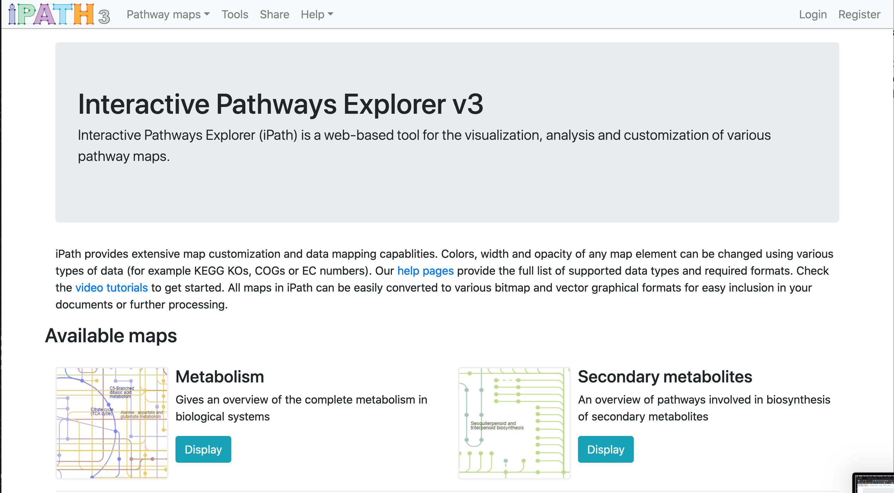
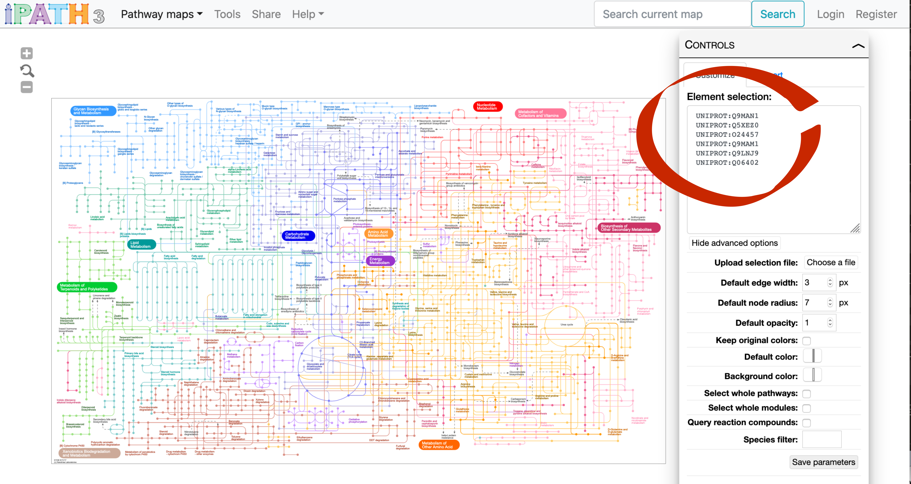
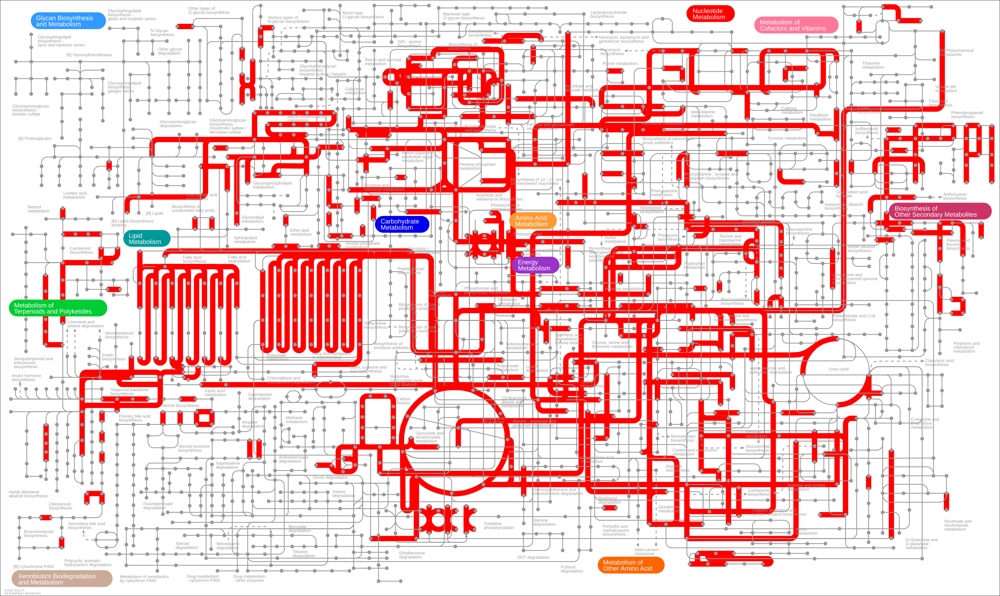
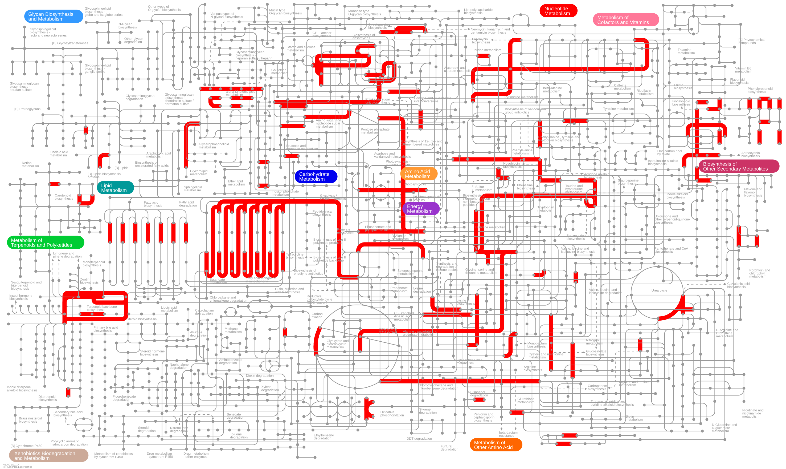
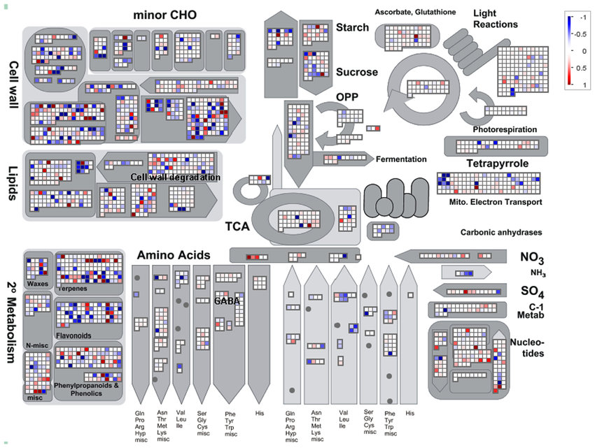

# Table of Contents
<!-- MarkdownTOC autolink="True" levels="1,2" -->

- [1. Introduction](#1-introduction)
- [2. Annotating your DE genes](#2-annotating-your-de-genes)
  - [2.1 Load the table of differential genes](#21-load-the-table-of-differential-genes)
  - [2.2 Ensembl databases](#22-ensembl-databases)
  - [2.3 Querying Ensembl databases using biomartr](#23-querying-ensembl-databases-using-biomartr)
- [3. Gene Ontology Over Representation Analysis \(ORA\)](#3-gene-ontology-over-representation-analysis-ora)
  - [3.1 ClusterProfiler \(R code\)](#31-clusterprofiler-r-code)
  - [3.2 AgriGO v2.0 \(webtool\)](#32-agrigo-v20-webtool)
  - [3.3 Metascape \(webtool\)](#33-metascape-webtool)
  - [3.4 Gene Set Enrichment Analysis \(GSEA\)](#34-gene-set-enrichment-analysis-gsea)
- [4. KEGG Over Representation Analysis \(ORA\)](#4-kegg-over-representation-analysis-ora)
  - [4.1 KEGG ORA](#41-kegg-ora)
  - [4.2 KEGG Modules ORA](#42-kegg-modules-ora)
- [5. Data integration with metabolic pathways](#5-data-integration-with-metabolic-pathways)
  - [5.1 iPath v3](#51-ipath-v3)
  - [5.2 MapMan](#52-mapman)
- [6. Other data mining tools](#6-other-data-mining-tools)
  - [6.1 ThaleMiner](#61-thaleminer)
  - [6.2 Expression atlas](#62-expression-atlas)
  - [6.3 BAR](#63-bar)
  - [6.4 CoExprViz](#64-coexprviz)
- [7. Troubleshooting](#7-troubleshooting)
- [8. Going further](#8-going-further)
  - [8.1 Useful links](#81-useful-links)
  - [8.2. References](#82-references)

<!-- /MarkdownTOC -->

# 1. Introduction
You've finally managed to extract a list of differentially expressed genes from your comparison. Great job! But...now what? :question: :confused:

Why did you do the experiment in the first place? Probably because you had an hypothesis or you were looking to open new leads. 

In this tutorial, we are looking for Arabidopsis leaf genes that are induced or repressed upon inoculation by _Pseudomonas syringae_ DC3000 after 7 days.
One important goal is to gain a higher view and not only deal with individual genes but understand which pathways are involved in the response. 

Once we obtain a list of genes, we have multiple analysis to perform to go beyond a simple list of genes:
- Annotating our list of genes with cross-databases identifiers and descriptions (Entrezid, Uniprot, KEGG, etc.).
- Performing Enrichment and Gene Set Enrichment Analysis (GSEA) analyses using R or webtools.
- Integrate transcriptomic results in the context of metabolic pathways (data integration).

# 2. Annotating your DE genes

We are going to use two fantastic resources: the superb [Ensembl](https://www.ensembl.org) databases and the marvelous [biomartr package](https://docs.ropensci.org/biomartr).
Together, they will automate a lot of tedious and tiring steps when you want to retrieve gene annotations, sequences, etc.

We are going to load the required library first. 
~~~
library(biomartr)
library(clusterProfiler)
library(tidyverse)
suppressPackageStartupMessages(library(org.At.tair.db))
library("biomaRt")  # only use to remove cache bug
~~~
{: .language-r}

## 2.1 Load the table of differential genes

~~~
diff_genes <- read_delim(file = "differential_genes.tsv", delim = "\t")
~~~
{: .language-r}

All what we know about the differential genes are their locus identifier. Not much....
We are missing functional information which we will add. 

## 2.2 Ensembl databases 
Gene information can be automatically queried directly from R to access the [Ensembl](https://www.ensembl.org) databases. 
Ensembl gathers a tremendous amount of genomic information which can be accessed through a web browser or programmatically. 

> The Ensembl (https://www.ensembl.org) is a system for generating and distributing genome annotation such as genes, variation, regulation and comparative genomics across the vertebrate subphylum and key model organisms. The Ensembl annotation pipeline is capable of integrating experimental and reference data from multiple providers into a single integrated resource. Here, we present 94 newly annotated and re-annotated genomes, bringing the total number of genomes offered by Ensembl to 227. 

## 2.3 Querying Ensembl databases using biomartr

What purpose serves `biomartr`? From the documentation:
> The first step, however, of any genome based study is to retrieve genomes and their annotation from databases. To automate the retrieval process of this information on a meta-genomic scale, the biomartr package provides interface functions for genomic sequence retrieval and functional annotation retrieval. The major aim of biomartr is to facilitate computational reproducibility and large-scale handling of genomic data for (meta-)genomic analyses. In addition, biomartr aims to address the genome version crisis. With biomartr users can now control and be informed about the genome versions they retrieve automatically. Many large scale genomics studies lack this information and thus, reproducibility and data interpretation become nearly impossible when documentation of genome version information gets neglected.

What is available for _Arabidopsis thaliana_ in Ensembl?
~~~
library(biomartr)

biomartr::organismBM(organism = "Arabidopsis thaliana")
~~~
{: .language-r}

~~~
organism_name description                                                  mart         dataset       version
  <chr>         <chr>                                                        <chr>        <chr>         <chr>  
1 athaliana     Arabidopsis thaliana genes (TAIR10)                          plants_mart  athaliana_eg… TAIR10 
2 athaliana     Arabidopsis thaliana Short Variants (SNPs and indels exclud… plants_vari… athaliana_eg… TAIR10 
~~~
{: .output}

This indicates that we can get a dataset called `athaliana_eg_gene` of the genome annotation version `TAIR10` from the `plant_mart` mart. 

Let's see how many different information fields we can retrieve from the `arabidopsis_eg_gene` dataset.
~~~
arabido_attributes = 
  biomartr::organismAttributes("Arabidopsis thaliana") %>% 
  filter(dataset == "athaliana_eg_gene")
arabido_attributes
~~~
{: .language-r}

~~~
# A tibble: 2,574 x 4
   name                  description              dataset           mart       
   <chr>                 <chr>                    <chr>             <chr>      
 1 ensembl_gene_id       Gene stable ID           athaliana_eg_gene plants_mart
 2 ensembl_transcript_id Transcript stable ID     athaliana_eg_gene plants_mart
 3 ensembl_peptide_id    Protein stable ID        athaliana_eg_gene plants_mart
 4 ensembl_exon_id       Exon stable ID           athaliana_eg_gene plants_mart
 5 description           Gene description         athaliana_eg_gene plants_mart
 6 chromosome_name       Chromosome/scaffold name athaliana_eg_gene plants_mart
 7 start_position        Gene start (bp)          athaliana_eg_gene plants_mart
 8 end_position          Gene end (bp)            athaliana_eg_gene plants_mart
 9 strand                Strand                   athaliana_eg_gene plants_mart
10 band                  Karyotype band           athaliana_eg_gene plants_mart
# … with 2,564 more rows
~~~
{: .output}

:scream: There is quite some information in there! We should be able to get what we want!

~~~
attributes_to_retrieve = c("tair_symbol", "entrezgene_id")

result_BM <- biomartr::biomart( genes      = diff_genes$genes,                  # genes were retrieved using biomartr::getGenome()
                                mart       = "plants_mart",                     # marts were selected with biomartr::getMarts()
                                dataset    = "athaliana_eg_gene",               # datasets were selected with biomartr::getDatasets()
                                attributes = attributes_to_retrieve,            # attributes were selected with biomartr::getAttributes()
                                filters = 	"ensembl_gene_id" )# query key
head(result_BM)  
~~~
{: .language-r}

 

# 3. Gene Ontology Over Representation Analysis (ORA) 

Over Representation Analysis is searching for biological functions or pathways that are enriched in a list obtained through experimental studies compared to the complete list of functions/pathways.  

Usually, ORA makes use of so-called gene ontologies (abbreviated GO) where each gene receives one or multiple layers of information on their function, cellular localization, etc.

Perhaps the most famous is the [Gene Ontology](http://geneontology.org/) resource which we will use.    

The ORA analysis rely on this mathematical equation to compute a p-value for a given gene set classified under a certain GO. 

$$p = 1 - {\sum_{i=0}^{k-1} {M \choose i}{N - M \choose n - i} \over {N \choose n}}$$  

In this formula: 
- **N** is the total number of genes in the background distribution. Also called the "universe" of our transcriptome.
- **M** is the number of genes within that distribution that are annotated (either directly or indirectly) to the gene set of interest.
- **n** is the size of the list of genes of interest (the size of your "drawing").
- **k** and k is the number of genes within that list which are annotated to the gene set. 

The background distribution by default is by default all genes that have annotation. You can change it to your specific background if you have a good reason for that (only genes with a detectable expression in your expression for instance). Also, p-values should be adjusted for multiple comparison.

Do you remember your math classes from high school? Now's the time to get them to work again!

Binomial coefficient is defined as $${n \choose k}$$ and is equal to $$n! \over {k! (n-k)!}$$

--------- drawing of balls from an urn ------

See this [great chapter](https://yulab-smu.github.io/clusterProfiler-book/chapter2.html) from Prof. Guangchuang Yu (School of Basic Medical Sciences, Southern Medical University, China) for more info.

## 3.1 ClusterProfiler (R code)

To perform the ORA within R, we will use the [clusterProfiler Bioconductor package](https://bioconductor.org/packages/release/bioc/html/clusterProfiler.html) that has an [extensive documentation available here](https://yulab-smu.github.io/clusterProfiler-book/index.html). 

### 3.1.1 Enrichment analysis
First, we need to annotate both genes that make up our "universe" and the genes that were identified as differentially expressed.
~~~
# building the universe!
all_arabidopsis_genes <- read.delim("counts.txt", header = T, stringsAsFactors = F)[,1] # directly selects the gene column

# we want the correspondence of TAIR/Ensembl symbols with NCBI Entrez gene ids
attributes_to_retrieve = c("tair_symbol", "uniprotswissprot","entrezgene_id")

# Query the Ensembl API
all_arabidopsis_genes_annotated <- biomartr::biomart(genes = all_arabidopsis_genes,
                                                     mart       = "plants_mart",                 
                                                     dataset    = "athaliana_eg_gene",           
                                                     attributes = attributes_to_retrieve,        
                                                     filters =  "ensembl_gene_id" )  

# for compatibility with enrichGO universe
# genes in the universe need to be characters and not integers (Entrez gene id)
all_arabidopsis_genes_annotated$entrezgene_id = as.character(
  all_arabidopsis_genes_annotated$entrezgene_id) 

~~~
{: .language-r}

We now have a correspondence for all our genes found in Arabidopsis. 

~~~
# retrieving NCBI Entrez gene id for our genes called differential
diff_arabidopsis_genes_annotated <- biomartr::biomart(genes = diff_genes$genes,
                                                     mart       = "plants_mart",                 
                                                     dataset    = "athaliana_eg_gene",           
                                                     attributes = attributes_to_retrieve,        
                                                     filters =  "ensembl_gene_id" )  
~~~
{: .language-r}

This gave us the second part which is the classification of genes "drawn" from the whole gene universe. The "drawing" is coming from the set of genes identified as differential (see [episode 06](../06-differential-analysis/index.html)).  

~~~
# performing the ORA for Gene Ontology Biological Process class
ora_analysis_bp <- enrichGO(gene = diff_arabidopsis_genes_annotated$entrezgene_id, 
                            universe = all_arabidopsis_genes_annotated$entrezgene_id, 
                            OrgDb = org.At.tair.db,  # contains the TAIR/Ensembl id to GO correspondence for A. thaliana
                            keyType = "ENTREZID",
                            ont = "BP",              # either "BP", "CC" or "MF",
                            pAdjustMethod = "BH",
                            qvalueCutoff = 0.05,
                            readable = TRUE, 
                            pool = FALSE)
~~~
{: .language-r}

Since we have 3 classes for GO terms i.e. Molecular Function (MF), Cellular Component (CC) and Biological Processes (BP), we would have to rerun this 3 times. An alternative is to indicate `ont = "ALL`.

~~~
ora_analysis_all_go <- enrichGO(gene = diff_arabidopsis_genes_annotated$entrezgene_id, 
                                universe = all_arabidopsis_genes_annotated$entrezgene_id, 
                                OrgDb = org.At.tair.db,
                                keyType = "ENTREZID",
                                ont = "ALL",             
                                pAdjustMethod = "BH",
                                qvalueCutoff = 0.05,
                                readable = TRUE, 
                                pool = FALSE)
~~~
{: .language-r}

The `ora_analysis_all_go` is a rich and complex R object. It contains various layers of information (R object from the S4 class). Layers can be accessed through the "@" notation.

You can extract a nice table of results for your next breakthrough publication like this. 
~~~
write_delim(x = as.data.frame(ora_analysis@result), 
            path = "go_results.tsv", 
            delim = "\t")

# have a look at a few columns and rows if you'd like.
ora_analysis_all_go@result[1:5,1:8]
~~~
{: .language-r}

~~~
           ONTOLOGY         ID                         Description GeneRatio   BgRatio       pvalue     p.adjust       qvalue   
GO:0009753       BP GO:0009753           response to jasmonic acid  257/3829 474/20450 1.099409e-68 1.772247e-65 1.160744e-65   
GO:0009611       BP GO:0009611                response to wounding  187/3829 335/20450 1.252868e-52 1.009812e-49 6.613824e-50
GO:0006612       BP GO:0006612       protein targeting to membrane  199/3829 374/20450 1.683735e-51 4.690438e-49 3.072032e-49
GO:0010243       BP GO:0010243 response to organonitrogen compound  222/3829 443/20450 1.707866e-51 4.690438e-49 3.072032e-49
GO:0072657       BP GO:0072657    protein localization to membrane  200/3829 377/20450 1.745821e-51 4.690438e-49 3.072032e-49
~~~
{: .output}

### 3.2.1 Plots
Nice to have all this textual information but an image is worth a thousand words so let's create some visual representations. 

A dotplot can be created very easily. 
~~~
dotplot(ora_analysis_all_go)
~~~
{: .language-r}

You can also create an enrichment map that connects GO terms with edges between overlapping gene sets. 
This makes it easier to identify functional modules. 

~~~
emapplot(ora_analysis_bp, color = "qvalue", size = "Count")
~~~
{: .language-r}

On this plot, we can see that one major module related to cell death, the immune response etc. is to be seen along with two minor modules 
related to metabolism (upper left) and one related to jasmonic acid and wounding (bottom).

> ## Important note
> Remember to perform the analysis for all GO categories: Biological Process (`ont = "BP"`), Cellular Component (`ont = "CC"`) and Molecular Function (`ont = "MF"`).     
{: .callout}

## 3.2 AgriGO v2.0 (webtool)
AgriGO v2.0 is a webtool [accessible here](http://systemsbiology.cau.edu.cn/agriGOv2/index.php) to perform gene ontology analyses. Two papers describe it extensively (see [8.2. References](#82-references)).

From the AgriGO v2.0 home page:  
> AgriGO v2.0 is a web-based tool and database for gene ontology analyses. It specifically focuses on agricultural species and is user-friendly. AgriGO v2.0 is designed to provide deep support to the agricultural community in the realm of ontology analyses. 

You can find an [extensive manual available here](http://systemsbiology.cau.edu.cn/agriGOv2/manual.php) to guide you through the main steps.

> ## Important note
> There are two versions of AgriGO currently online, versions 1.x and version 2.0. Make sure you go to the [latest 2.0 version url](http://systemsbiology.cau.edu.cn/agriGOv2/index.php).
{: .callout} 

### 3.2.1 Single Enrichment Analysis
**We can perform a Single Enrichment Analysis (SEA) which is essentially similar to an ORA.** AgriGO supports species-specific analyses.   
For _Arabidopsis thaliana_ [navigate here](http://systemsbiology.cau.edu.cn/agriGOv2/specises_analysis.php?SpeciseID=1&latin=Arabidopsis_thaliana).

First, write gene identifiers to a text file from which you can copy-paste the identifiers. Here, we use the complete list of the 4979 genes
differentially regulated (DC3000 versus Mock) but you can filter it on some criteria (e.g. fold change). This is what I've done to gather less genes and speed up the SEA analysis.
~~~
diff_genes %>% 
  filter(log2FoldChange > 0) %>% 
  with(.,quantile(log2FoldChange, c(0.5,0.75,0.9)))

diff_genes %>% 
  filter(log2FoldChange > quantile(log2FoldChange, c(0.75))) %>% # keeping fold changes above the 75th percentile
  dplyr::select(genes) %>% 
  write.table(., file = "diff_genes_for_agrigo.tsv", row.names = FALSE, quote = FALSE)
~~~
{: .language-r}

Open this list using a text editor and copy-paste it into the "input a gene list" box. 

You will then have to choose a background (your "universe") to perform the SEA/ORA analysis. For _Arabidopsis thaliana_, you can choose the suggested background (TAIR10). 

I suggest to use the hypergeometric distribution and the Yekutieli False Discovery Rate correction. The significance threshold and the minimum number of entries can be changed depending on the size of your input gene list. 

If you have a long list, you might write your email address to collect your results later (analysis might take a while). You will arrive on a result page from which you can generate graphs, barplots, tables etc. 

This DAG view gives a comprehensive overview of the GO terms and their relationships. 

### 3.2.2 Parametric Analysis of Gene Set Enrichment
This analysis takes expression values also into account and could be an richer alternative to SEA. 

~~~
diff_genes %>% 
  filter(log2FoldChange > quantile(log2FoldChange, c(0.75))) %>% 
  dplyr::select(genes, log2FoldChange) %>% 
  write.table(., file = "diff_genes_for_agrigo_page.tsv", sep = "\t", row.names = FALSE, quote = FALSE)
~~~
{: .language-r}

## 3.3 Metascape (webtool)
Left to the reader. The basic usage is to copy-paste a list of gene identifiers (preferably Entrez id) inside the box.
Visit the [Metascape website here](https://metascape.org/gp/index.html#/main/step1). 

> ## Important note
> Metascape is restricted to 3000 genes so you will have to split our big list first into chuncks less < 3000 genes.
> ~~~
> pos_diff_genes = diff_genes %>% filter(log2FoldChange > 0) 
> ~~~
> {: .language-r}
> Then write the `pos_diff_genes` to a text file and copy-paste the list of genes.
{: .callout}

## 3.4 Gene Set Enrichment Analysis (GSEA)

The Gene Set Enrichment Analysis (GSEA) is another way to investigate functional enrichment of genes and pathways using the Gene Ontology classification. 
Please refer to [the following section](https://yulab-smu.github.io/clusterProfiler-book/chapter2.html) in Prof. Guangchuang Yu book for a clear explanation of GSEA and how to implement it with `clusterProfiler`.

 

# 4. KEGG Over Representation Analysis (ORA) 
KEGG stands for the "Kyoto Encyclopedia of Genes and Genomes". From the [KEGG website home page](https://www.genome.jp/kegg/):
> KEGG is a database resource for understanding high-level functions and utilities of the biological system, such as the cell, the organism and the ecosystem, from molecular-level information, especially large-scale molecular datasets generated by genome sequencing and other high-throughput experimental technologies.

Instead of using the Gene Ontology gene classification, one might be interested to use KEGG classification to view the
transcriptomic response of an organism. KEGG is not restricted to metabolic functions but has a great deal of metabolic maps that can help you. 

To see if your organism is referenced in the KEGG database, you can search this page: https://www.genome.jp/kegg/catalog/org_list.html
In our case, _Arabidopsis thaliana_ is referenced as "ath" in the KEGG database. 
 
You can also do this programmatically using R and the `clusterProfiler` package. 
~~~
search_kegg_organism('ath', by='kegg_code')
search_kegg_organism('Arabidopsis thaliana', by='scientific_name')
~~~
{: .language-r}

## 4.1 KEGG ORA

~~~
ora_analysis_kegg <- enrichKEGG(gene = diff_arabidopsis_genes_annotated$entrezgene_id,
                                universe = all_arabidopsis_genes_annotated$entrezgene_id,
                                organism = "ath",
                                keyType = "ncbi-geneid",
                                minGSSize = 10,
                                maxGSSize = 500,
                                pAdjustMethod = "BH",
                                qvalueCutoff = 0.05,
                                use_internal_data = FALSE) # force to query latest KEGG db
                          

# create a simple dotplot graph
dotplot(ora_analysis_kegg, 
    color = "qvalue", 
    showCategory = 10, 
    size = "Count")
~~~
{: .language-r}

## 4.2 KEGG Modules ORA

[The KEGG MODULE datase](https://www.genome.jp/kegg/module.html) is more dedicated to metabolism and can help you to make sense of transcriptomic data using metabolic maps and modules. 

The complete list of available modules is [available here](https://www.genome.jp/kegg-bin/get_htext).

~~~
ora_analysis_kegg_modules <- enrichMKEGG(gene = diff_arabidopsis_genes_annotated$entrezgene_id,
                                         universe = all_arabidopsis_genes_annotated$entrezgene_id,
                                         organism = "ath",
                                         keyType = "ncbi-geneid",
                                         minGSSize = 10,           # minimal size of genes annotated by Ontology term for testing.
                                         maxGSSize = 500,          # maximal size of genes annotated for testing
                                         pAdjustMethod = "BH",
                                         qvalueCutoff = 0.05)

# create a simple dotplot graph
dotplot(ora_analysis_kegg_modules, 
    color = "qvalue", 
    showCategory = 10, 
    size = "Count")
~~~
{: .language-r}

> ## Discussion
> Compare the two KEGG plots. Can you identify differences? Which metabolic functions have been grouped together?
{: .discussion}

 

# 5. Data integration with metabolic pathways

So far, we have only been mostly looking at our transcriptomic results alone. Yet, KEGG has started to give us some insight into metabolism. Let's dig further with two tools: **iPath** and  **MapMan**.  

## 5.1 iPath v3

From the [Interactive Pathways Explorer v3 home page](https://pathways.embl.de/):
> Interactive Pathways Explorer (iPath) is a web-based tool for the visualization, analysis and customization of various pathway maps.  
iPath provides extensive map customization and data mapping capablities. Colors, width and opacity of any map element can be changed using various types of data (for example KEGG KOs, COGs or EC numbers). 

We will use this webtool to map our genes on metabolic pathways to provide some contextual information. 

We are going to generate a list of Uniprot identifiers usable with iPath3 from our list of differential genes.
~~~
diff_arabidopsis_genes_annotated %>% 
  filter(uniprotswissprot != "") %>%                                       # to remove genes with no matching Uniprot entries
  unique() %>% 
  mutate(id_for_ipath = paste("UNIPROT",uniprotswissprot,sep = ":")) %>%   # to create an ID that iPath can use
  dplyr::select(id_for_ipath) %>%                                          # we keep only the relevant ID for further copy-pasting 
  write.table(., 
    file = "diff_genes_swissprot.tsv", 
    row.names = FALSE, 
    quote = FALSE)
~~~
{: .language-r}

If you open the `diff_genes_swissprot.tsv` file in a text editor, this is what you should see. 
~~~
id_for_ipath
UNIPROT:Q9MAN1
UNIPROT:Q5XEZ0
UNIPROT:O24457
UNIPROT:Q9MAM1
UNIPROT:Q9LNJ9
UNIPROT:Q06402
... more lines ....
~~~
{: .output}

We can copy-paste this list in the box to the right. 

If you then click on the "Submit data" button, you should see the following reactions highlighted.  

Ok, there is a lot of information there and possibly too much. Let's filter out some genes based on their $$\log_{2}$$ fold change. 

We can calculate the median, 75th percentile and the 90th percentile of our fold changes. 
~~~
diff_genes %>% 
  filter(log2FoldChange > 0) %>% 
  with(.,quantile(log2FoldChange, c(0.5,0.75,0.9))
~~~
{: .language-r}

~~~
50%       75%       90% 
0.8695469 1.6819535 3.2561618 
~~~
{: .output}
Since 75% of the genes with a positive $$\log_{2}$$ fold change have a value lower than 1.68, we are going to keep the genes with a higher fold change. 

~~~
diff_genes_filtered = 
  diff_genes %>% 
  filter(log2FoldChange > quantile(log2FoldChange, 0.75)) 

# we query Ensembl again to retrieve the attributes
# attributes_to_retrieve = c("tair_symbol", "uniprotswissprot","entrezgene_id")
diff_arabidopsis_genes_annotated_2 <- biomartr::biomart(genes = diff_genes_filtered$genes,
                                                      mart       = "plants_mart",                 
                                                      dataset    = "athaliana_eg_gene",           
                                                      attributes = attributes_to_retrieve,        
                                                      filters =     "ensembl_gene_id" )  

diff_arabidopsis_genes_annotated_2 %>% 
  filter(uniprotswissprot != "") %>% 
  unique() %>% 
  mutate(id_for_ipath = paste("UNIPROT",uniprotswissprot,sep = ":")) %>% 
  dplyr::select(id_for_ipath) %>% 
  write.table(., file = "diff_genes_swissprot_2.tsv", row.names = FALSE, quote = FALSE)
~~~
{: .language-r}

In your `diff_genes_swissprot_2.tsv` file, you should have less entries now which will make the map slightly clearer. 

## 5.2 MapMan
 
MapMan is a standalone software that you can install on your laptop to create insightful metabolic visualisation of transcriptomic, proteomic and/or metabolic data. 

From [Schwacke et al., 2019](https://doi.org/10.1016/j.molp.2019.01.003):
> The MapMan framework was developed specifically for plants with the design goal to facilitate the visualization of omicsdata on plant pathways (Thimm et al., 2004). 
> MapMan uses a simple hierarchical tree structure of terms referred to as ‘‘bins,’’ which describe biological contexts/concepts.   
> Major biological processes (e.g., photosynthesis) are encompassed in top-level bins, and each child bin represents a more narrowly focused subprocess or component 
> within the context of the parent bin. Assignment of proteins to the lowest-level (i.e., leaf) bins was preferred in order to make the annotation as precise as possible, although assignment to abstract higher-level bins was supported.   
> Proteins were mostly assigned to a single bin, but for some proteins with functions in diverse biological processes it wasnecessary to correspondingly assign to multiple bins.

### 5.2.1 Requirements
You will need to create an account first and download the proper MapMan installation for your OS [here](https://mapman.gabipd.org/mapman-download). I'd recommend to download the latest stable version (not the "release candidate").

You will then have to download the so-called "mapping file" which is an ontology relating genes to functional bins. You can also generate your own classification for your species of interest with the [Mercator webtool](https://www.plabipd.de/portal/mercator4). You'll need to supply a fasta file containing your transcripts or your protein of interest. 

The latest list of available mappings is [here](https://mapman.gabipd.org/mapmanstore?p_p_id=MapManDataDownload_WAR_MapManDataDownloadportlet_INSTANCE_4Yx5&p_p_lifecycle=0&p_p_state=normal&p_p_mode=view&p_p_col_id=column-1&p_p_col_pos=1&p_p_col_count=2). 

### 5.2.2 Pathway visualisation
One of the most used visualisation is the global overview of the metabolism. Up-regulated genes are shown in red and genes down-regulated in blue. 

# 6. Other data mining tools

## 6.1 ThaleMiner
[https://bar.utoronto.ca/thalemine/begin.do](https://bar.utoronto.ca/thalemine/begin.do)

## 6.2 Expression atlas
[https://www.ebi.ac.uk/gxa/home](https://www.ebi.ac.uk/gxa/home)

## 6.3 BAR
[http://www.bar.utoronto.ca/](http://www.bar.utoronto.ca/)

## 6.4 CoExprViz
[http://bioinformatics.psb.ugent.be/webtools/coexpr/](http://bioinformatics.psb.ugent.be/webtools/coexpr/)

# 7. Troubleshooting
If biomart refuses to query Ensembl again, run this command:
~~~
biomaRt::biomartCacheClear() # to solve a known bug https://github.com/BioinformaticsFMRP/TCGAbiolinks/issues/335
~~~
{: .language-r}

This will clean the cache memory and allow to perform the Ensembl query again.  
# 8. Going further 

## 8.1 Useful links
- [BiomartR](https://docs.ropensci.org/biomartr/)
- [Arabidopsis.org (TAIR) list of data mining tools](https://www.arabidopsis.org/portals/expression/microarray/microarrayExpressionV2.jsp)
- [ResearchGate related question](https://www.researchgate.net/post/How_can_I_analyze_a_set_of_DEGs_differentially_expressed_genes_to_obtain_information_from_them)	

## 8.2. References
* [The Cluster Profiler companion boo, a great place to start](https://yulab-smu.github.io/clusterProfiler-book/chapter2.html)
* Zhou et al. (2019). Metascape provides a biologist-oriented resource for the analysis of systems-level datasets. Nat Commun 10, 1523 (2019). [link](https://doi.org/10.1038/s41467-019-09234-6)
* Yates et al. (2020) Ensembl 2020, Nucleic Acids Research, Volume 48, Issue D1, 08 January 2020, Pages D682–D688, [Link](https://doi.org/10.1093/nar/gkz966)
* Tian et al. (2017) agriGO v2.0: a GO analysis toolkit for the agricultural community. _Nucleic Acids Research_, Volume 45, Issue W1, Pages W122–W129.[Link](https://doi.org/10.1093/nar/gkx382) 
* MapMan: [MapMan4: A Refined Protein Classification and Annotation Framework Applicable to Multi-Omics Data Analysis. Schwacke et al. _Molecular Plant_, 12(6):879-892](https://doi.org/10.1016/j.molp.2019.01.003)
* Drost et al. (2017) Biomartr: genomic data retrieval with R. _Bioinformatics_ 33(8): 1216-1217. [doi:10.1093/bioinformatics/btw821](https://academic.oup.com/bioinformatics/article/33/8/1216/2931816).
* Darzi et al. (2018) iPath3.0: interactive pathways explorer v3. _Nucleic Acids Research_, Volume 46, Issue W1, 2 July 2018, Pages W510–W513, [link](https://doi.org/10.1093/nar/gky299)

