# 1. Table of Contents
<!-- TOC -->

- [1. Table of Contents](#1-table-of-contents)
- [2. preparing the data](#2-preparing-the-data)
    - [2.1 Uploading and selecting the data](#21-uploading-and-selecting-the-data)
    - [2.2 Get the differentially expressed genes.](#22-get-the-differentially-expressed-genes)
    - [2.3 Running the function.](#23-running-the-function)
    - [2.4 Scaling the data.](#24-scaling-the-data)
- [3. Visualization of a of the DE genes](#3-visualization-of-a-of-the-de-genes)
    - [3.1. Hierarchical tree of the samples](#31-hierarchical-tree-of-the-samples)
    - [3.2. Hierarchical tree of the genes](#32-hierarchical-tree-of-the-genes)
    - [3.3. Create a heatmap of the data.](#33-create-a-heatmap-of-the-data)
- [4. Hirargical clustering of the data](#4-hirargical-clustering-of-the-data)
    - [4.1. clustering on height of the tree.](#41-clustering-on-height-of-the-tree)
    - [4.2. clustering by selecting a number of clusters.](#42-clustering-by-selecting-a-number-of-clusters)
    - [4.3. Visualize the clustering in a heatmap.](#43-visualize-the-clustering-in-a-heatmap)
- [4. Looking at the individual clusters.](#4-looking-at-the-individual-clusters)
    - [4.1. Vizualizing the cores of the clusters.](#41-vizualizing-the-cores-of-the-clusters)
- [5. How many clusters to choose](#5-how-many-clusters-to-choose)
    - [5.1. SSE:](#51-sse)
    - [5.2. Average silhouette width:](#52-average-silhouette-width)
- [6. Clustering using K-means](#6-clustering-using-k-means)

<!-- /TOC -->

Clustering is extremely useful for generating hypotheses and data exploration in general. The idea is that genes which have similar expression patterns (co-expression genes) are often controlled by the same regulatory mechanisms (co-regulated genes). Often times co-expressed genes share similar functions so by looking at which genes are found in a cluster we can get an idea of what that cluster is doing.

This is all a little abstract so let’s learn by doing. First we need to pull down some data to play with. 

# 2. preparing the data

In the lesson [Differential expression analysis](https://scienceparkstudygroup.github.io/rna-seq-lesson/06-differential-analysis/index.html) we used a subset of the data based on a single condition. For this cluster analysis it is more interresting to use a bigger data set consisting more conditions. This way we can find groups of genes that are not only DE in a single condition but also in multiple.

## 2.1 Uploading and selecting the data

~~~
counts <- read.delim("At_root_hormones_TotRNA.txt", header = T, stringsAsFactors = F)
genes <- counts[,1]
counts <- counts[,-1]
row.names(counts) <- genes

xp_design <- read.delim("root_hormone_experimental_design.txt", header = T, stringsAsFactors = F, colClasses = rep("character",2))

xp_design = xp_design %>% filter(dpi == "7")

counts <- counts[, xp_design$sample]

## Check that sample names match in both files
all(colnames(counts) %in% xp_design$sample)
all(colnames(counts) == xp_design$sample)
~~~
{: .language-r}

## 2.2 Get the differentially expressed genes.

A function is provided that will normalize and select genes that are differentially expressed.
This function will iterate through all possible combinations of conditions and return a list containing all the genes and normalized count values, that are DE in any of these combinations of conditions.

~~~
normalize <- function(countdata, xp_design, f, p){
  col.names = colnames(xp_design)                                                # extract all column names
  columns.to.discard = c("sample","fq1","fq2","fq")                                    # column we don't need to extract all conditions
  colsForConditions = col.names[! col.names %in% columns.to.discard]              # only keeping the column of interest
  # one condition
  if (length(colsForConditions) == 1){
    condition <- factor(xp_design[,colsForConditions])
    # two conditions
  } else if (length(colsForConditions) == 2){
    # two conditions --> make a third column that is the product of the two
    xp_design$conditions = paste(xp_design[,colsForConditions[1]],xp_design[,colsForConditions[2]],sep = ".")
    condition <- factor(x = xp_design[,"conditions"],levels = unique(xp_design[,"conditions"]))
  } else if (length(colsForConditions) == 3){
    xp_design$conditions = paste(xp_design[,colsForConditions[1]],xp_design[,colsForConditions[2]],xp_design[,colsForConditions[3]],sep = ".")
    condition <- factor(x = xp_design[,"conditions"],levels = unique(xp_design[,"conditions"]))
  }
  # Analysis with DESeq2
  # Create a coldata frame and instantiate the DESeqDataSet. See ?DESeqDataSetFromMatrix
  coldata <- data.frame(row.names=colnames(countdata), condition)
  dds <- DESeqDataSetFromMatrix(countData=countdata, colData=coldata, design=~condition)
  # Run the DESeq pipeline
  dds <- DESeq(dds)
  # create dataframe containing normalized counts, to which the differential expression values will be added
  resdata <- as.data.frame(counts(dds, normalized=TRUE))
  # iterate through the list of conditions to create differential expression (DE) values for all possible pairs
  total_selec <- list()
  x <- 1
  for(i in levels(condition)){
    x <- x + 1
    if (x <= length(levels(condition))){
      for(j in x:length(levels(condition))){
        res <- results(dds, contrast=c("condition", i,  levels(condition)[j]))                      # i = first in pair, levels(condition)[j] is the second in pair.
        d <- paste(i, levels(condition)[j], sep="&")                                                # paste the two conditions in one character, to be used as the pair name
        res$genenames <- rownames(res)
        resul <- as.data.frame(res)
        significantDE <- resul %>% filter(padj
f | log2FoldChange<(-1*f)) )
        selec <- as.list(significantDE$genenames)
        total_selec <- append(total_selec, selec)
      }
    }
  }
  total_selec <- c(unique(total_selec))
  total_selec <- t(as.data.frame(total_selec))
  selection <- resdata[total_selec[,1],]

  return(selection)
}
~~~
{: .language-r}

 
 

## 2.3 Running the function.
 
The function requires four input values:
- dataframe containing the raw counts.
- dataframe of the experimental design.
- minimal log2 foldchange.
- maximal p-value.

For this lesson will set the mimimal 2log foldchange at 2 and the maximum p-value at 0.01.
 
~~~
DEgenes <- normalize(counts,xp_design,2,0.01)
~~~
{: .language-r}
 
 
Let's check how many gene were found to be differentially expressed.
~~~
# dim returms the number of rows (number of genes) and the number of columns (number of samples).
dim(DEgenes)
~~~
{: .language-r}
 
output giving the number of samples and DE genes.
~~~
[1]  1354  24
~~~
{: .output}
 

> ## Question
> The output of the function should be normalized counts. Are they normalized? how do you know?
> > ## Solution
> >  `head(DEgenes)` shows the top 6 rows of the data. If the values are doubles they're normalized. The input (raw counts) data consists of integers. 
> {: .solution}
{: .challenge}
 
 
## 2.4 Scaling the data.
 
Since we are comparing gene expression patterns we need to scale the data otherwise all of the highly expressed genes will cluster together even if they have different patterns among the samples.
The function scale scales collumns. So to scale per gene (rows) data needs to be transposed.

 
~~~
DEgenes <- as.matrix(DEgenes)
scaledata <- t(scale(t(DEgenes)))
~~~
{: .language-r}
 
 

# 3. Visualization of a of the DE genes
 
Starting off we will use the scaled data to construct the trees (dendrograms), both for the samples and the genes. For this we need to calculate the distance between the different samples and genes. We have done this earlier but that was on the complete data set and now we are working with a subset containing only differentially expressed genes.
 

## 3.1. Hierarchical tree of the samples
 
The hierarchical tree is needed for the heatmap, and can also give an indication if there are outlayers among the samples.

~~~
hc <- hclust(as.dist(1-cor(scaledata, method="spearman")), method="complete") # Clusters columns by Spearman correlation.
~~~
{: .language-r}
 
 
The distance data is used to plot the dendrogram.
~~~
sampleTree = as.dendrogram(hc, method="average")
plot(sampleTree,
     main = "Sample Clustering",
     ylab = "Height")
~~~
{: .language-r}
 
 
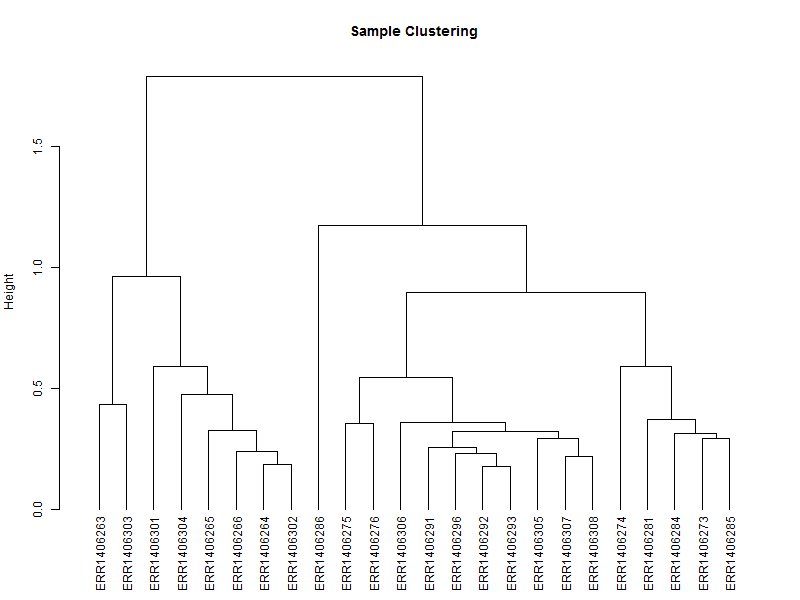
## 3.2. Hierarchical tree of the genes

~~~
hr <- hclust(as.dist(1-cor(t(scaledata), method="pearson")), method="complete") # Cluster rows by Pearson correlation.
~~~
{: .language-r}
 
~~~
geneTree = as.dendrogram(hr, method="average")
plot(geneTree,
     leaflab = "none",             
     main = "Gene Clustering",
     ylab = "Height")
~~~
{: .language-r}
 
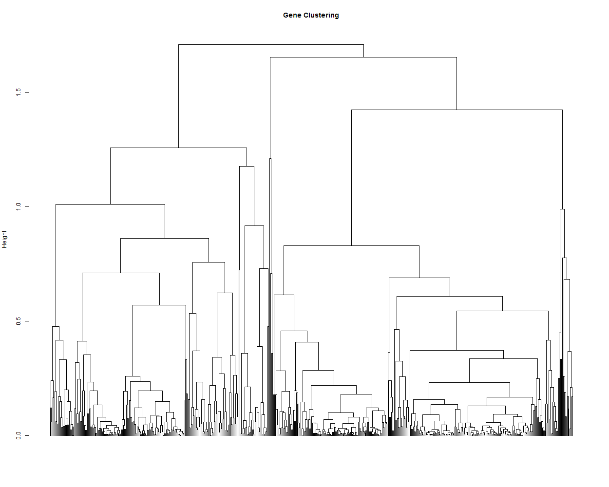
 

## 3.3. Create a heatmap of the data.
In this case we'll be using gplots for the construction of the heatmap. This makes it easier to add some additional features later in this lesson.
 
~~~
heatmap.2(DEgenes,
          Rowv=as.dendrogram(hr), 
          Colv=as.dendrogram(hc),
          col=redgreen(100),
          scale="row",
          margins = c(7, 7),
          cexCol = 0.7,
          labRow = F,
          main = "Heatmap.2",
          trace = "none")
~~~
{: .language-r}
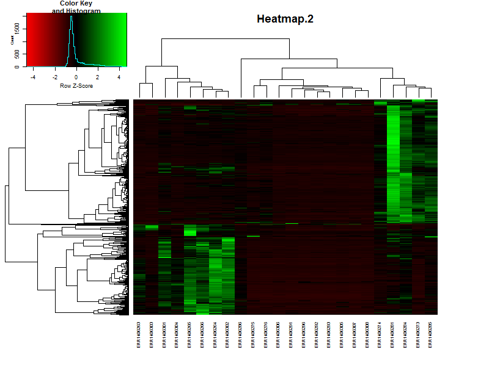
 
If the samples are in a specific order, like in a time series it is possible te remove the dendrogram on the columns (samples) by setting `Colv=F`.
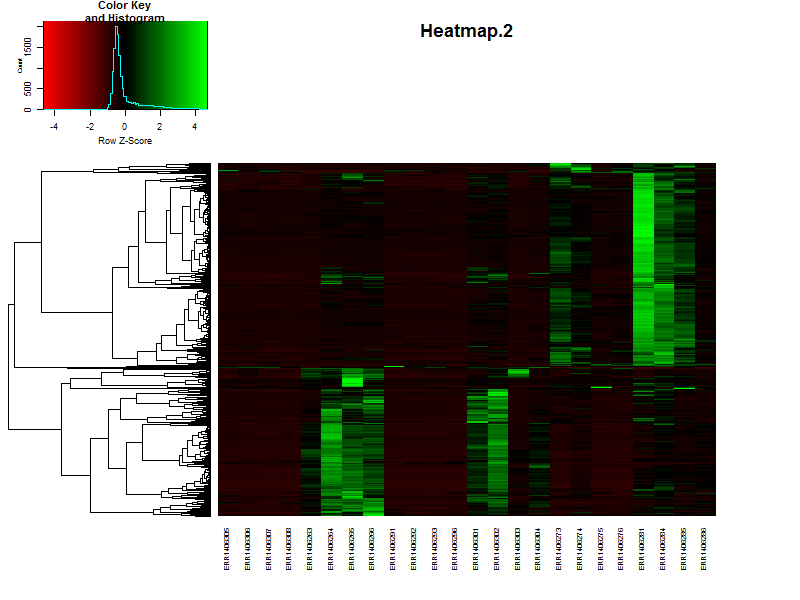
> ## Question
> Based on the heatmap it is already possible to speculate on the number of clusters, groups of genes showing simular paterns of expression. What would be a nice number for this dataset?
> > ## Solution
> >  There are more or less 4-5 distict clusters visable.
> {: .solution}
{: .challenge}

# 4. Hirargical clustering of the data
 
 

## 4.1. clustering on height of the tree.
We can also extract discrete clusters of genes as a means to identify co-expression modules. This is done by cutting the tree at a specified height and the resulting branches will make a cluster. We can cut the tree high to obtain a small number of large clusters or lower to obtain many small clusters. Let’s try a few different cut heights: 1.5, 1.0 and 5.0:
~~~
hclusth1.5 = cutree(hr, h=1.5) #cut tree at height of 1.5
hclusth1.0 = cutree(hr, h=1.0) #cut tree at height of 1.0
hclusth0.5 = cutree(hr, h=0.5) #cut tree at height of 0.5
~~~
{: .language-r}
 
 
~~~
# output of the function cuttree is a vector containing the cluster number for each of the genes.
head(hclusth0.5)
~~~
{: .language-r}
 
~~~
AT1G02930 AT1G02940 AT1G05575 AT1G05700 AT1G07747 AT1G13710 
        1         2         3         4         5         2 
~~~
{: .output}
 
~~~
# number of clusters
length(unique(hclusth0.5))
~~~
{: .language-r}
 
~~~
[1] 26
~~~
{: .output}
 
 

~~~
library(dendextend)
#plot the tree
plot(geneTree,
     leaflab = "none",
     main = "Gene Clustering",
     ylab = "Height")

#add the three cluster vectors
the_bars <- cbind(hclusth0.5, hclusth1.0, hclusth1.5)
#this makes the bar
colored_bars(the_bars, geneTree, sort_by_labels_order = T, y_shift=-0.1, rowLabels = c("h=0.5","h=1.0","h=1.5"),cex.rowLabels=0.7)
#this will add lines showing the cut heights
abline(h=1.5, lty = 2, col="grey")
abline(h=1.0, lty = 2, col="grey")
abline(h=0.5, lty = 2, col="grey")
~~~
{: .language-r}
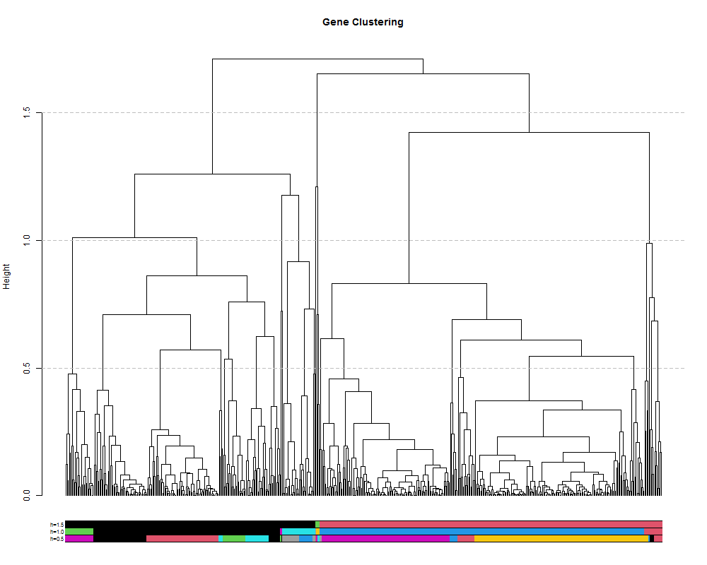
 
 

## 4.2. clustering by selecting a number of clusters.

~~~
# alternatively it is also posible to set the number of cluster you want.
hclustk5 = cutree(hr, k=5)
~~~
{: .language-r}

 
 
~~~
plot(geneTree,
     leaflab = "none",
     main = "Gene Clustering",
     ylab = "Height")
colored_bars(hclustk5, geneTree, sort_by_labels_order = T, y_shift=-0.1, rowLabels = c("k=5"),cex.rowLabels=0.7)
~~~
{: .language-r}
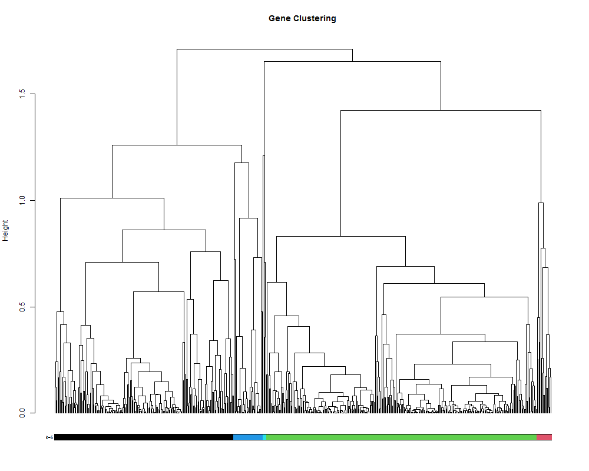
## 4.3. Visualize the clustering in a heatmap.
 
 

~~~
# It is also posible to visualize the bar indicating the clusters in combination with a heatmap.
# This will make it more easy to see if you choose the right number of clusters.
clustColBar <- rainbow(length(unique(hclustk5)), start=0.1, end=0.9)
clustColBar <- clustColBar[as.vector(hclustk5)]

heatmap.2(DEgenes,
          Rowv=as.dendrogram(hr), 
          Colv=as.dendrogram(hc),
          col=redgreen(100),
          scale="row",
          margins = c(7, 7),
          cexCol = 0.7,
          labRow = F,
          main = "Heatmap.2",
          trace = "none",
          RowSideColors=clustColBar,
          key = FALSE)
~~~
{: .language-r}
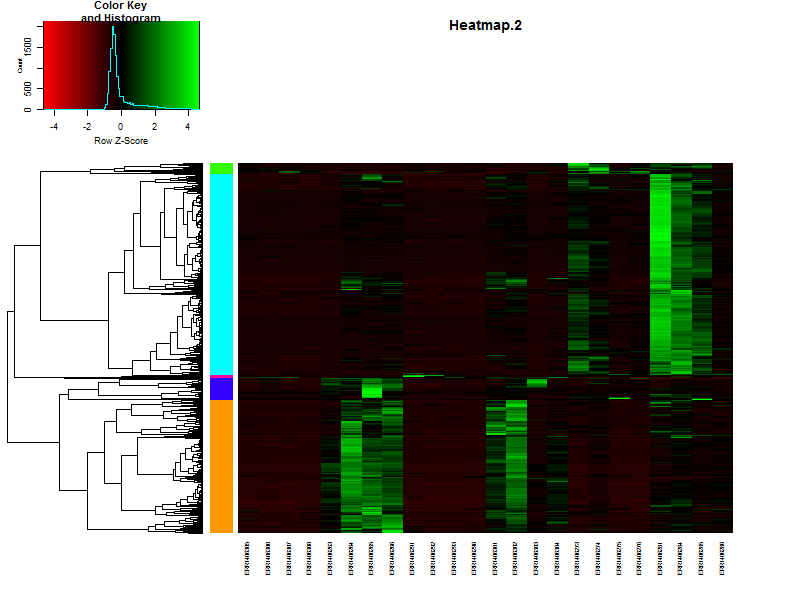
 
 

~~~
counts[1:5,1:5]
~~~
{: .language-r}

# 4. Looking at the individual clusters.
 
 

## 4.1. Vizualizing the cores of the clusters.

~~~
clust.core = function(i, dat, clusters) {
  ind = (clusters == i)
  colMeans(dat[ind,])
}

clusters <- hclustk5
cores <- sapply(unique(clusters), clust.core, scaledata, clusters)
~~~
{: .language-r}
The matrix cores containes the average values 

~~~
library(reshape2)
moltenCores <- melt(cores) ## get the data in a "long" format
colnames(moltenCores) <- c('sample','cluster','value')

ggplot(moltenCores, aes(x=sample,y=value, group=cluster, colour=as.factor(cluster))) + 
  geom_point() + 
  geom_line() +
  xlab("Sample") +
  ylab("Expression") +
  labs(title= "Cluster Expression of the samples",color = "Cluster") +
  theme(axis.text.x = element_text(angle = 45, hjust = 1))
~~~
{: .language-r}
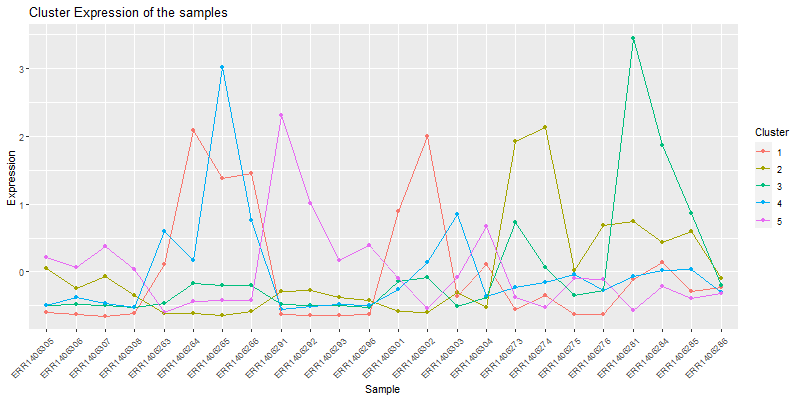
Isolate a cluster of interrest.
~~~
clust4 <- t(scaledata[hclustk4==4,])
~~~
{: .language-r}

~~~
#get the data frame into long format for plotting
clust4Molten <- melt(clust4, id.vars = "Sample")
colnames(clust4Molten) <- c('sample','gene','value')

#Subset the cores molten dataframe so we can plot core4
core <- moltenCores[moltenCores$cluster==4,]

ggplot(clust4Molten, aes(x=sample,y=value)) + 
  geom_line(color="grey", aes(color="grey", group=gene)) +
  #this adds the core 
  geom_line(data=core, aes(sample,value, group=cluster), color="blue",inherit.aes=FALSE) +
  geom_point(data=core, aes(sample,value, group=cluster), color="blue",inherit.aes=FALSE) +
  xlab("Samples") +
  ylab("Expression") +
  labs(title= paste0("Cluster 4 consisting ", nrow(clust4), " genes"),color = "Score") +
  theme(axis.text.x = element_text(angle = 45, hjust = 1))

~~~
{: .language-r}

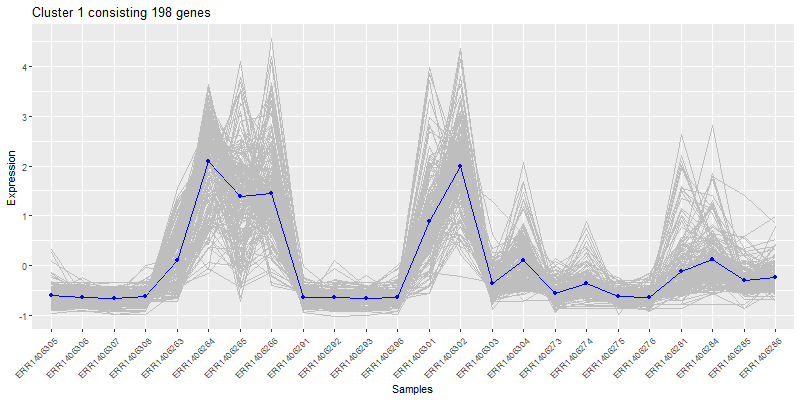

# 5. How many clusters to choose

## 5.1. SSE:

The first measure is using the sum of squared error (SSE). SSE is defined as the sum of the squared distance between each member of a cluster and its cluster centroid. We repeatedly test and increasing number of clusters and evaluate the SSE. As we increase the number of clusters the distance between any point and it’s centroid will be smaller since the cluster itself is smaller. At a certain number of clusters number however, the SSE will not significantly decrease with each new addition of a cluster. This is the elbow and suggests a suitable number of clusters:
~~~
wss <- (nrow(scaledata)-1)*sum(apply(scaledata,2,var))
for (i in 2:20) wss[i] <- sum(kmeans(scaledata,
                                     centers=i)$withinss)
plot(1:20, wss, type="b", xlab="Number of Clusters",
     ylab="Within groups sum of squares")
~~~
{: .language-r}
## 5.2. Average silhouette width:

The next method is by estimating the optimum number using the average silhouette width. The silhouette value describes how similar a gene is to its own cluster (cohesion) compared to other clusters (separation). A high value indicates that the gene is well placed. So if the average of all of these silhouettes is high then the number of clusters is good.
~~~
library(cluster)
sil <- rep(0, 20)
#repeat k-means for 1:20 and extract silhouette:
for(i in 2:20){
  k1to20 <- kmeans(scaledata, centers = i, nstart = 25, iter.max = 20)
  ss <- silhouette(k1to20$cluster, dist(scaledata))
  sil[i] <- mean(ss[, 3])
}

# Plot the  average silhouette width
plot(1:20, sil, type = "b", pch = 19, xlab = "Number of clusters k", ylab="Average silhouette width")
abline(v = which.max(sil), lty = 2)
~~~
{: .language-r}

~~~
cat("Average silhouette width optimal number of clusters:", which.max(sil), "\n")
~~~
{: .language-r}

# 6. Clustering using K-means

K-means clustering is fundamentally different from hierarchical clustering in that it is a form of partitional clustering in which the data are divied into K partitions. This requires a priori knowledge about the optimum number of partitions (clusters), thus the classic question ‘How do i determine the correct number of clusters?’ which we cover below. In K-means the data is seeded with K random datapoints. Then the data closest to those points are assigned to that ‘cluster’, the mean of those data is calculated and that mean becomes the new cluster center. The data are then re-assigned to their nearest point and the whole process repeats until the clusters are stable. Still confused? Check out this awesome gif from [Andrey Shabalin:](http://shabal.in/visuals.html)

~~~
set.seed(20)
kClust <- kmeans(scaledata, centers=4, nstart = 1000, iter.max = 20)
kClusters <- kClust$cluster
~~~
{: .language-r}

Let's visualize the clustering in a heatmap:
~~~
plot(clustering_of_samples)
~~~
{: .language-r}

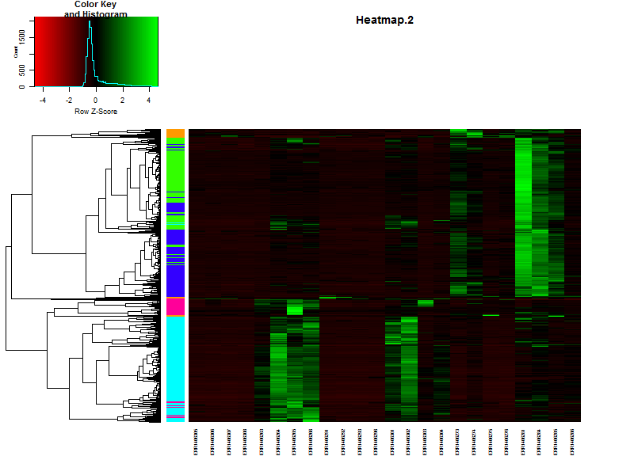

How does this compare to the `cuttree(k=5)`
~~~
plot(geneTree,
     leaflab = "none",
     main = "Gene Clustering",
     ylab = "Height")
the_bars <- cbind(hclustk5, kClusters)
colored_bars(the_bars, geneTree, sort_by_labels_order = T, y_shift=-0.1, rowLabels = c("Treecut",'K-means'),cex.rowLabels=0.7)
~~~
{: .language-r}

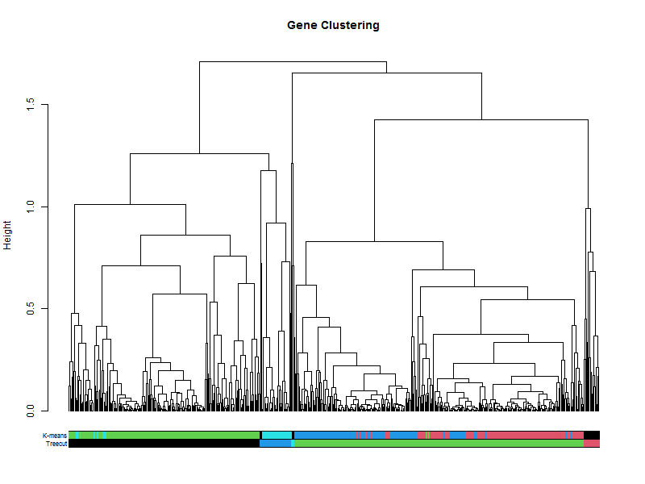
~~~
plot(clustering_of_samples)
~~~
{: .language-r}

~~~
plot(clustering_of_samples)
~~~
{: .language-r}

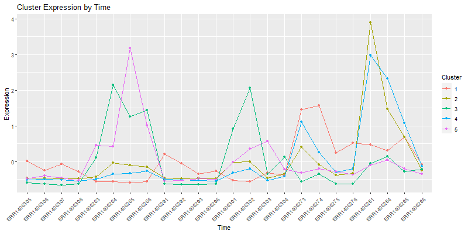
~~~
plot(clustering_of_samples)
~~~
{: .language-r}

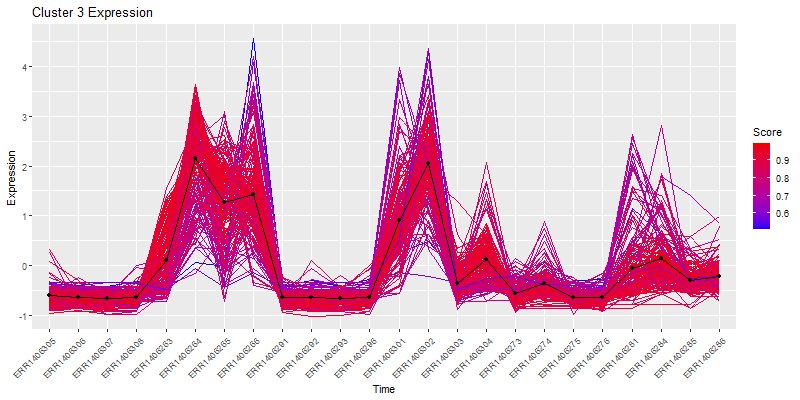
~~~
plot(clustering_of_samples)
~~~
{: .language-r}
