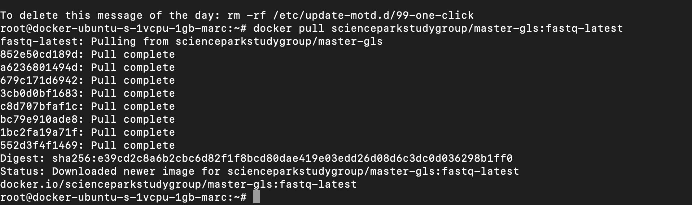
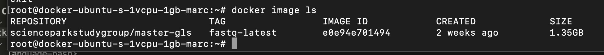
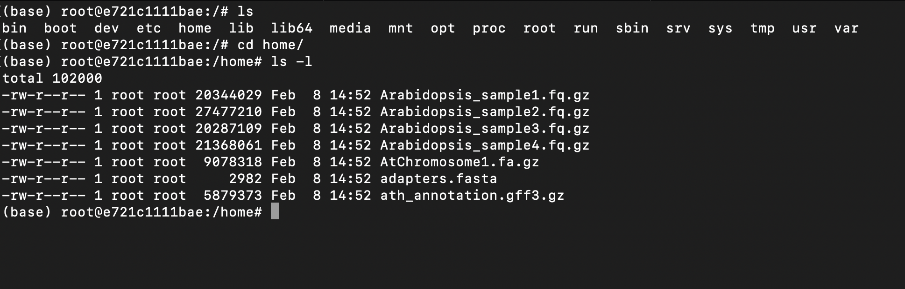
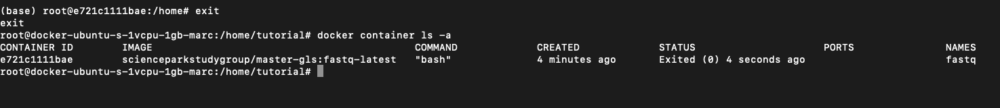

<!-- MarkdownTOC autolink="true" -->

- [1. R scripts](#1-r-scripts)
- [2. Docker cloud setup](#2-docker-cloud-setup)
	- [2.1 Create a Linux virtual machine](#21-create-a-linux-virtual-machine)
	- [2.2 Connect to your Virtual Machine](#22-connect-to-your-virtual-machine)
	- [2.3 Pull the Docker image](#23-pull-the-docker-image)
	- [2.4 Create and run a container interactively](#24-create-and-run-a-container-interactively)
	- [2.6 Create, run a container interactively and bind a local folder](#26-create-run-a-container-interactively-and-bind-a-local-folder)
- [3. Singularity setup](#3-singularity-setup)

<!-- /MarkdownTOC -->

# 1. R scripts

All R scripts used in the tutorials are available [here](../r_analysis/00.tutorials.R)   

- [Episode 05 ("Exploration of counts")](../r_analysis/00.tutorials/episode_05.R)
- [Episode 06 ("Differential expression analysis")](../r_analysis/00.tutorials/episode_06.R) 

 

# 2. Docker cloud setup 

In this lesson, a series of episodes rely on the shell and specific bioinformatic softwares. While it is possible to ask students
to install everything (softwares and data), in practice, it is much easier to dispose of an "out-of-the-box" installation where 
data and softwares are available. 

This is why a Docker image was created. You can think of a Docker image as the "cookie cutter" that is used to create/"cut" multiple 
containers ("cookies") from the same template. 

While teaching Docker is not the purpose of this lesson, instructors might find it useful to follow [this nice Docker tutorial on forehand](https://carpentries-incubator.github.io/docker-introduction/index.html). 

All in all, having students to work in Docker containers ensure that everyone has the same configuration. 

## 2.1 Create a Linux virtual machine

Create a Linux-based virtual machine (VM) where Docker is installed and where you have root priviledges (since Docker requires it).

One option is for instance to use the [Digital Ocean cloud infrastructure](https://www.digitalocean.com/products/droplets/) and create so-called "Droplets". A short and concise guide on how to do this is available here: 

Many cloud providers are out there so keep your eyes open!

## 2.2 Connect to your Virtual Machine

Start a command-line Shell (e.g. Terminal on Mac OS) and `ssh` into your machine. 

~~~
ssh root@[your IP address]
~~~
{: .language-bash}

## 2.3 Pull the Docker image

[Pulling](https://docs.docker.com/engine/reference/commandline/pull/) in Docker terminology means that you can use a pre-built image from the Docker Hub repository. 

The analogy is the "cookie cutter". A Docker image is a cookie cutter that you will use to...make cookies (the containers).

Here, pull means that the required Docker image for the bioinformatic episodes of the lesson will be downloaded and made available in your VM.     

Presently (February 2021), the Docker image used is called "master-gls:fastq-latest". 

~~~
docker pull scienceparkstudygroup/master-gls:fastq-latest
~~~
{: .language-bash}

This command will download the Docker image, verify its completeness and exit once its done. 

You should see something like this:  

You can verify that you have a Docker image named "scienceparkstudygroup/master-gls:fastq-latest" with the following command:  

~~~
docker image ls
~~~
{: .language-bash}

You see that your image has an image ID that is unique. The size of this Docker image is quite big since it amounts to 1.35GB. 

## 2.4 Create and run a container interactively
~~~
docker run --name fastq -it scienceparkstudygroup/master-gls:fastq-latest
~~~
{: .language-bash}

Command explanation:
- `docker run`: creates a container
- `--name`: give a personalised name to your container rather than an arbitrary (super long) number.
- `-it`: start the container allocate an interactive bash in the container. 
- `scienceparkstudygroup/master-gls:fastq-latest`: the super long name our Docker image has. This image has been downloaded previously using `docker pull` and should be available already on your system. If a new image has been pushed to Docker Hub, then it will download the latest tag "fastq-latest" image.  

cd into the `/home` folder and list the files:
~~~
cd home/
ls -l
~~~
{: .language-bash}

You can see that all necessary fastq files and genome references are there! Neat!

To exit your running container, type: `exit`. Ok, now you are back on the VM again. Your container called "fastq" has stopped. 
To verify this, type:
~~~
docker container ls -a
~~~
{: .language-bash}

To enter your running container again, type: 

The issue is that when your container has been exited, it is impossible to restart an interactive session. 
Say you would have been working IN the container then all results are lost....
Not ideal..

Well, actually there is a try to re-enter a stopped container. 

~~~
docker start -a -i fastq
~~~
{: .language-bash}

Explanation: 
- `-a` stands for `--attach` and attach the STDOUT/STDERR to the current shell session.
- `-i` stands for `--interactive` and attach the container STDIN. 

In that way, the container STDIN is linked to the shell STDOUT.  

## 2.6 Create, run a container interactively and bind a local folder

Since our work will not be lost but rather "stuck" into the "fastq" Docker container, we need to bind a local folder (from our VM) with a folder inside of the Docker container.

We will call it "workspace/" and it will be our location in the Docker container where we will do our bioinformatic magic. 

> ## Important note
> Do not call this folder "home/" as our datasets and genome reference is in a folder called home/. This would overwrite it with an empty folder.
{: .callout} 

~~~
docker run -v $PWD:/workspace/ --name fastq -it scienceparkstudygroup/master-gls:fastq-latest
~~~
{: .language-bash}

# 3. Singularity setup

