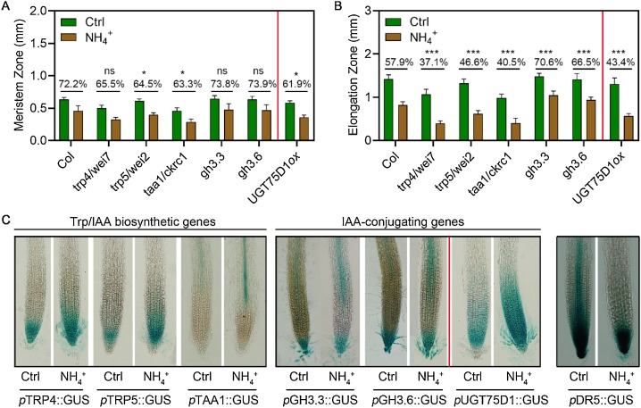
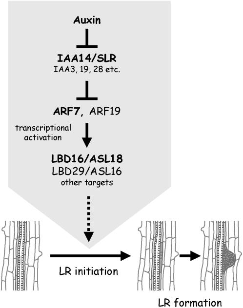

# Instructions 

Welcome to the assignment of the "gene expression / RNA-seq" part of the "Tools in Molecular Biology" Master course. 

This R Markdown file is a template that you will fill with:
- R code, 
- normal text answers in English,
- figures created using R to justify your answer,
- and your conclusions and interpretation of the figures.

Regularly, you will "knit" (compile) your R Markdown into a PDF using the blue knit button. Once you've completed your assignment, you will have to generate a final PDF and upload it on Canvas. One PDF assignment per student is expected. 

Below you will find some R code sections in grey that are sometimes pre-filled for your convenience (for instance to get the data easily). If you delete this template by error, the original R Markdown file is also available on Canvas. 

Some R code sections have code commented with hastags (#). To run the code, delete the hastags and execute the code section using the green arrow. 

# Setup 

## Disabling warnings and messages
This will keep your final PDF report clean from execution alarms, unnecessary text, etc.  
This code chunck sets global options for the execution of each code chunk. You can disable warnings and messages globally this way. 

```{r knit options}
knitr::opts_chunk$set(echo = TRUE, 
                      warning = FALSE, 
                      message = FALSE, 
                      collapse = TRUE)
```

## Library loading

We first load the `tidyverse` package that contains most of the data transformation
functions we will need.  
We will also load the `DESeq2` package to be able to perform the differential gene expression analysis. 
The `patchwork` library to place plots next to one another for example. 
```{r libraries}
suppressPackageStartupMessages(library("tidyverse")) 
suppressPackageStartupMessages(library("DESeq2"))
suppressPackageStartupMessages(library("patchwork"))
```

# Data: import root and shoot gene counts 

We will use gene counts from both root and shoot tissues from plants treated or not with ABA. 

```{r import root gene counts}
root_counts <- read.csv(
  file = "../gene_counts_and_samples2conditions/dataset02_ABA_arabidopsis_root_raw_counts.csv",
  header = TRUE, 
  stringsAsFactors = FALSE) %>% 
  # for DESeq subsequent data import 
  column_to_rownames("gene")

# first five rows
head(root_counts, n = 5)
```

Same for shoot. 

```{r import shoot gene counts}
shoot_counts <- read.csv(
  file = "../gene_counts_and_samples2conditions/dataset06_ABA_arabidopsis_shoot_raw_counts.csv",
  header = TRUE, 
  stringsAsFactors = FALSE) %>% 
  # for DESeq subsequent data import 
  column_to_rownames("gene")

head(shoot_counts)
```

# Exercise 1: Characteristics of gene counts coming from RNA-seq

## Question 1

**Q1:** What fraction (percentage) of the genes are not expressed in the roots? 
Hint: calculate the number of genes that have a sum of 0 (not expressed in any of the samples). You can use the rowSums() function to do so. 

```{r question 1}
n_genes_0 = root_counts %>% mutate(gene_sum_counts = rowSums(.)) %>% filter(gene_sum_counts == 0) %>% nrow()

# fraction of the genes not expressed in roots
n_genes_0 / nrow(root_counts) * 100
```

## Question 2

**Q2:** Select one sample and plot the distribution of gene counts and comment it. Can you think of a transformation to make this distribution more normal?

Answer Q2: the distribution is very skewed with very few highly expressed genes and a lot of little expressed genes.   
A log10 transformation helps to make it more normal. Here, I use a log10 transformation with an offset of 1 (so that genes with 0 counts become log10(0+1)=0).  

```{r}
p1 <- 
  ggplot(root_counts, aes(x = root_control_1)) + 
  geom_histogram(bins = 100)

p2 <-   ggplot(root_counts, aes(x = log10(root_control_1+1))) + 
  geom_histogram(bins = 100)

p1 + p2
```

```{r bonus of question 2}
root_counts %>% 
  rownames_to_column('gene') %>% 
  pivot_longer(- gene, names_to = "sample") %>% 
  ggplot(., aes(x = log10(value+1), fill=sample)) +
  geom_density(alpha=0.2)
```
__Conclusion:__ this means that the samples have comparable count distributions. 

## Exercise 2: performing a differential expression analysis and exploring the results.


# Exercise 2: perform, describe and filter the results of a differential expression analysis 

## Extraction of the root sample to condition correspondence
This is necessary to perform the differential expression analysis later on.
The experimental conditions will be infered from sample names.
(Execute the code below).
```{r}
root_samples_to_conditions <- 
  root_counts_tidy %>% 
  select(- value, - gene) %>% 
  separate(sample, into = c("tissue", "treatment", "rep"), remove = FALSE)
head(root_samples_to_conditions)
```

## Root differential expression analysis 

```{r}
root_dds <- DESeqDataSetFromMatrix(countData = root_counts, 
                              colData = root_samples_to_conditions, 
                              design = ~ treatment)
```

You can have a quick peek at the number of genes, number of samples, etc. by calling
the `dds` object. 
```{r dds peek}
dds
```

## Call differential genes

Q9 (0.5 point): using the root_counts and the samples_to_conditions, create a DESeqDataSet object called dds that will be used for DESeq2 differential analysis. 
Call the differential genes using the DESeq() function and call this object diff_genes. Filter this object to keep only the significantly differentially expressed genes (adjusted p-value < 0.01). 
Hint 1: the gene identifiers have to be assigned to the row names of root_counts. 
Hint 2: convert the diff_genes object to a dataframe with “dds = as.data.frame(dds)”.

```{r call diff genes}
dds <- DESeq(dds)
```

```{r}
diff_genes <- results(dds, contrast = c("condition", "ABA", "control")) %>% 
  as.data.frame() %>% 
  filter(padj < 0.01)
head(diff_genes)
```
## Number of diff genes and max log2FC

Q10 (0.5 point): how many genes are differentially expressed (adjusted p-value < 0.01)? 
How many genes are positively regulated in response to the hormone treatment?   
How many genes are negatively regulated in response to the hormone treatment?   

```{r}
n_diff <- diff_genes %>% nrow()
pos <- diff_genes %>% filter(log2FoldChange > 0) %>% nrow()
neg <- diff_genes %>% filter(log2FoldChange < 0) %>% nrow()
```

- Total number of genes diff. regulated (padj < 0.01) is `r n_diff` genes.  
- Total number of genes _positively_ & diff. regulated (padj < 0.01) is `r pos` genes.  
- Total number of genes _negatively_ & diff. regulated (padj < 0.01) is `r neg` genes.   

Q11 (0.5 point) : display a table of the top 20 positively differentially expressed genes based on their log2 fold change.   
What is the maximum positive log2fold change? Convert this log2 fold change to the untransformed fold change value = revert the log2 transformation.       

```{r}
top20 <- 
  diff_genes %>% 
  arrange(desc(log2FoldChange)) %>% 
  mutate(fold_change = 2^log2FoldChange) %>% 
  relocate(fold_change, .before = lfcSE) %>% 
  head(n = 20)
top20
```

Max log2 fold change is equal to 8.6. This corresponds to a fold change of 2^8.6 = 388. Therefore the AT3G23635 gene is 388 more expressed in auxin-treated seedlings than in control conditions. 

Select genes positively and differentially regulated for downstream analysis (over-representation analysis for instance.)

```{r}
results(dds, contrast = c("condition", "ABA", "control")) %>% 
  as.data.frame() %>% 
  filter(padj < 0.01) %>% 
  filter(log2FoldChange > 0) %>% 
  write.csv(file = "diff_genes_ABA_deforges.csv")
```

\newpage

# Exercise 3: volcano plot

## Shrinkage
Q12 (0.5 point): Shrink the log2 fold changes in order to shrink high log2 fold changes from lowly expressed genes. Use the related DESeq2 function that we have seen in the tutorial: https://scienceparkstudygroup.github.io/rna-seq-lesson/06-differential-analysis/index.html#3-volcano-plot  
- First, extract the results completely with “results(dds, …)”
- Then shrink the log2 fold changes with the “lfcShrink()” function and the “normal” shrinkage estimator. Call this new object res_shrink. 

```{r shrink fold changes coming from low-expressed genes}
all_gene_results <- results(dds, contrast = c("condition", "ABA", "control")) 

resLFC <- lfcShrink(dds = dds, 
                    res = all_gene_results,
                    type = "normal",
                    coef = 2) 
```


## Volcano plot
Q13 (1 point): make a volcano plot, a type of scatterplot that shows, for each gene, the magnitude of the shrinked log2 fold change (x-axis) versus statistical significance (adjusted p-value) as seen in the tutorial. Use the “res_shrink” object that you have built in the previous task. 
Hint: make sure you change the default “FCcutoff” and “pCutoff” values so that they better reflect your min/max log2 fold changes and adjusted p-values. Do not keep the default values for these two parameters.

What are the values to be set for the limits of x and y?
```{r}
min(resLFC$log2FoldChange, na.rm = T)
```

```{r}
max(resLFC$log2FoldChange, na.rm = T)
```

```{r volcano plot, out.height="70%"}
library("EnhancedVolcano")
EnhancedVolcano(toptable = resLFC,
                x = "log2FoldChange",
                y = "padj",
                lab = rownames(resLFC),
                xlim = c(-10, +10),
                ylim = c(0,100),
                pCutoff = 0.01,
                transcriptPointSize = 2.0,
                FCcutoff = 1, 
                title = "Volcano plot",
                legend=c(
                  'Not significant',
                  'Log2 fold-change (but do not pass p-value cutoff)',
                  'Pass p-value cutoff',
                  'Pass both p-value & Log2 fold change')) + 
  guides(legend = NULL)
```

Q14:
- Most up-regulated genes: top right of the volcano plot.  
- Most down-regulated genes: top left of the volcano plot.  
- Most statistically significant genes are the highest on the y-axis.  

\newpage

# Exercise 4: find annotation of the 5 selected candidate genes

Q15 (1 point): for each of your 5 selected genes, make a plot showing their expression in control and hormone-treated seedlings. 

Select based on:  
1. Highest log2 fold change, then  
2. Highest baseMean  

```{r}
diff_genes <- results(dds, contrast = c("condition", "ABA", "control")) 
diff_genes %>% 
  as.data.frame() %>% 
  filter(log2FoldChange > 0) %>% 
  arrange(desc(log2FoldChange)) %>% 
  head(n = 20) %>% 
  arrange(desc(baseMean)) 

```


AT2G23170 = GH3.3  
AT4G37390 = AUR3 Auxin upregulated 3 GH3-2  
AT3G58190 = SYMMETRIC LEAVES 2-LIKE 16  
AT3G10870 = ARABIDOPSIS THALIANA METHYL ESTERASE 17  
AT2G45420 =  LOB DOMAIN-CONTAINING PROTEIN 18  


## AT2G23170
**Names:** Auxin-responsive GRETCHEN HAGEN3.3 (GH3.3) protein 	
Description: conjugates amino acids to auxin and regulates its homeostasis. 

> "The production of amide-linked IAA-amino acid conjugates is catalysed by Group II
> GRETCHEN HAGEN3 (GH3) acyl amido synthetases"

**Papers**:
- Paper 1: Di DW, Li G, Sun L, Wu J, Wang M, Kronzucker HJ, Fang S, Chu J, Shi W. High ammonium inhibits root growth in Arabidopsis thaliana by promoting auxin conjugation rather than inhibiting auxin biosynthesis. J Plant Physiol. 2021 Apr 18;261:153415. doi: 10.1016/j.jplph.2021.153415. Epub ahead of print. PMID: 33894579.
- Paper 2: Staswick PE, Serban B, Rowe M, Tiryaki I, Maldonado MT, Maldonado MC, Suza W. Characterization of an Arabidopsis enzyme family that conjugates amino acids to indole-3-acetic acid. Plant Cell. 2005 Feb;17(2):616-27. doi: 10.1105/tpc.104.026690. Epub 2005 Jan 19. PMID: 15659623; PMCID: PMC548830.

**Images**
```{r figure 7,out.height="30%", echo=FALSE}

```

This figure shows that ammonium (NH4+) induces the expression of GH3.3 in the elongation
zone. This in turn reduces the amount of biologically active auxin. 

## AT3G58190
**Names:**
* ASYMMETRIC LEAVES 2-LIKE 16 
* LATERAL ORGAN BOUNDARIES DOMAIN 29 (LBD29)

**Papers:** 
- Paper 1: Zhang F, Tao W, Sun R, Wang J, Li C, et al. (2020) PRH1 mediates ARF7-LBD dependent auxin signaling to regulate lateral root development in Arabidopsis thaliana. PLOS Genetics 16(2): e1008044. https://doi.org/10.1371/journal.pgen.1008044. 
- Paper 2: Okushima Y, Fukaki H, Onoda M, Theologis A, Tasaka M. ARF7 and ARF19 regulate lateral root formation via direct activation of LBD/ASL genes in Arabidopsis. Plant Cell. 2007;19(1):118-130. doi:10.1105/tpc.106.047761. https://www.ncbi.nlm.nih.gov/pmc/articles/PMC1820965/

Quotes:   

> "The development of lateral roots in Arabidopsis thaliana is strongly dependent 
> on signaling directed by the AUXIN RESPONSE FACTOR7 (ARF7), which in turn activates 
> LATERAL ORGAN BOUNDARIES DOMAIN (LBD) transcription factors (LBD16, LBD18 and LBD29)" 

**Images**

```{r figure 6, out.height="30%", echo=FALSE}

```


