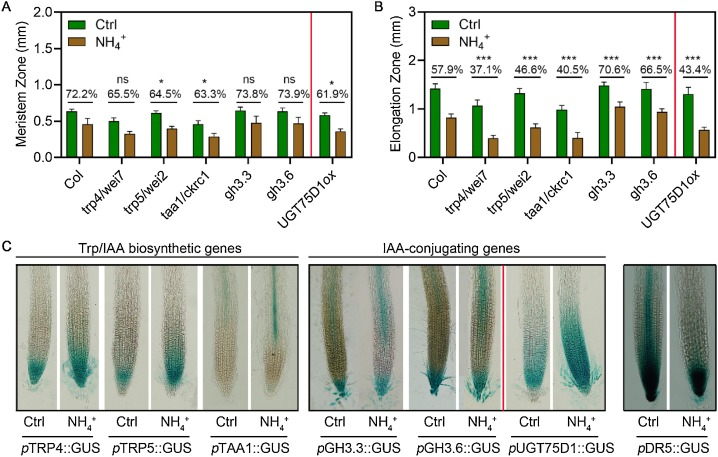
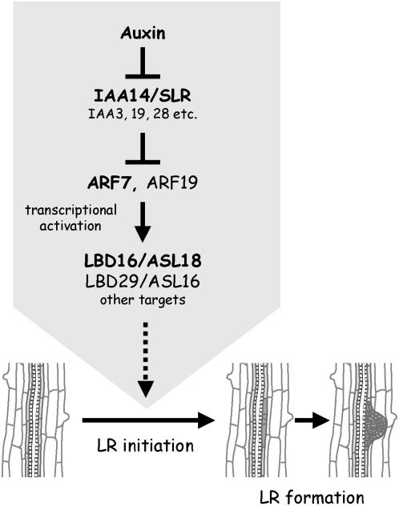

# Setup 

## Add a table of contents

[Link to R Markdown guide (click me)](https://bookdown.org/yihui/rmarkdown/pdf-document.html)

## Disabling warnings and messages
This will keep your final PDF report clean from execution alarms, unnecessary text, etc.  
This code chunck sets global options for the execution of each code chunk. You can disable warnings and messages globally this way. 

```{r setup, include=TRUE}
knitr::opts_chunk$set(echo = TRUE, 
                      warning = FALSE, 
                      message = FALSE, 
                      collapse = TRUE)
```

\newpage

# Introduction

Q1 (0.5 point): In the publication of Deforges et al. 2019, the first paragraph of the “Material and Methods” section describes how plants were sown and treated (see paragraph below). 
What are the full names of each of the 4 hormones used? 
“””
Arabidopsis thaliana seeds were germinated on agar-solidified half-strength MS medium for 10 d, after which the seedlings were flooded with a solution of half-strength MS containing 5 µM IAA, 10 µM ABA, 10 µM MeJA, 10 µM ACC, or no hormone for the untreated control. After 3 h of incubation, roots and shoots were split and harvested separately. For each of the 12 experimental conditions, 3 independent biological replicates were carried out at different times.
“””
Names are: IAA auxin, ABA abscissic acid, ACC 1-amino-1-cyclopropane and MeJA methyljasmonate.  

Q2 (0.5 point): Can you name 3 different types of RNA that can be studied using RNA sequencing?
- Long non-coding RNAs.  
- Messenger RNAs.   
- microRNAs. 

Q3 (0.5 point): What is the sequencing platform used in this experiment? How many reads were obtain on average per sample?   
Illumina HiSeq 2500, about 30 million reads per sample.   
> "The libraries were sequenced on a HiSeq 2500 Illumina sequencer and about 30 million of paired-end reads per sample were obtained."

Q4: (0.5 point): In the article, can you find a good complete one-sentence long definition of cis-NATs?  
>"Cis-Natural Antisense Transcripts (cis-NATs), which overlap protein coding genes and are transcribed from the opposite DNA strand, constitute an important group of noncoding RNAs."

   
# Exercise 1: data import

We first load the `tidyverse` package that contains most of the data transformation
functions we will need. 
```{r import libraries}
suppressPackageStartupMessages(library("tidyverse")) 
suppressPackageStartupMessages(library("apeglm"))
suppressPackageStartupMessages(library("DESeq2"))
```


## Import gene counts 
```{r import raw gene counts, echo=TRUE}
raw_counts <- read.csv(
  file = "../gene_counts_and_samples2conditions/dataset01_IAA_arabidopsis_root_raw_counts.csv",
  header = TRUE, 
  stringsAsFactors = FALSE) %>% 
  # for DESeq subsequent data import 
  column_to_rownames("gene")

# first five rows
knitr::kable(head(raw_counts, n = 5))
```

Q5: Can you determine how many genes are present in the table? 

```{r}
nrow(raw_counts)
```
There are `r nrow(raw_counts)` genes in the "dataset_01_IAA_arabidopsis_root_raw_counts.csv" table. 


Q6: what is the minimum and maximum gene expression in the control and IAA-treated conditions?

```{r}
raw_counts %>% 
  rownames_to_column("gene") %>% 
  pivot_longer(- gene, values_to = "counts", names_to = "sample") %>% 
  separate(sample, into = c("tissue","condition","rep"), sep = "_") %>% 
  group_by(condition) %>% 
  summarise(minimum = min(counts), maximum = max(counts)) %>% 
  knitr::kable()
```
```{r}
# 519267
raw_counts %>% 
  rownames_to_column("gene") %>% 
  pivot_longer(- gene, values_to = "counts", names_to = "sample") %>% 
  separate(sample, into = c("tissue","condition","rep"), sep = "_") %>% 
  filter(counts == "519267")
```

## Distribution of counts

Q7 (1 point):   
A) plot the distribution of the gene counts of one sample using either the base R hist() function or the ggplot2 geom_histogram() function. What can you say about the distribution of the gene counts?  
B) How can you display the distribution of an scale that better represents the distribution? Think about data transformation or the axis. 

```{r, out.height="30%"}
raw_counts %>% 
  rownames_to_column("gene") %>% 
  pivot_longer(- gene, values_to = "counts", names_to = "sample") %>% 
  filter(sample == "root_control_1") %>% 
  ggplot(., aes(x = counts)) +
  geom_histogram()
```

The count distribution is very skewed with a lot of data with counts < 50,000 counts. A few genes have a very high count number with the maximum being 479,700 counts.

We can transform the data before plotting or use a transformed scale. Here, I use a log10 transformation with an offset of 1 (so that genes with 0 counts become log10(0+1)=0).  
```{r, out.height="30%"}
raw_counts %>% 
  rownames_to_column("gene") %>% 
  pivot_longer(- gene, values_to = "counts", names_to = "sample") %>% 
  filter(sample == "root_control_1") %>% 
  ggplot(., aes(x = log10(counts + 1))) + # log10 transform with offset
  geom_histogram()
```

# Exercise 2: differential expression

This `DESeqDataSet` object is used to store both data (gene counts) and metadata 
(sample to experimental condition correspondence) in one unique R object. 
Functions can be directly be applied to this object and corresponding results stored
within the same object. 

## Import samples to condition

Q8 (0.5 point) Upload the “arabidopsis_root_hormones_samples_to_condition.csv” file to your R virtual machine. Then import this file into R and name the object samples_to_conditions. 
- Make a table that shows the number of biological replicates by condition. 
- Filter this table to keep only “control” samples and the samples related to your hormone of interest. You should have 6 samples in total (3 control and 3 hormone-treated). 


```{r}
samples_to_conditions <- read.csv(
  file = "../gene_counts_and_samples2conditions/arabidopsis_root_hormones_sample2conditions.csv",
  stringsAsFactors = F)

table(samples_to_conditions$condition)
```


```{r}
samples_to_conditions_filtered <- filter(
  samples_to_conditions, 
  condition == "IAA" | condition == "control")
```


## Create the DESeqDataSetFromMatrix object

```{r}
dds <- DESeqDataSetFromMatrix(countData = raw_counts, 
                              colData = samples_to_conditions_filtered, 
                              design = ~ condition)
```

You can have a quick peek at the number of genes, number of samples, etc. by calling
the `dds` object. 
```{r dds peek}
dds
```

## Call differential genes

Q9 (0.5 point): using the raw_counts and the samples_to_conditions, create a DESeqDataSet object called dds that will be used for DESeq2 differential analysis. 
Call the differential genes using the DESeq() function and call this object diff_genes. Filter this object to keep only the significantly differentially expressed genes (adjusted p-value < 0.01). 
Hint 1: the gene identifiers have to be assigned to the row names of raw_counts. 
Hint 2: convert the diff_genes object to a dataframe with “dds = as.data.frame(dds)”.

```{r call diff genes}
dds <- DESeq(dds)
```

```{r}
diff_genes <- results(dds, contrast = c("condition", "IAA", "control")) %>% 
  as.data.frame() %>% 
  filter(padj < 0.01)
head(diff_genes)
```
## Number of diff genes and max log2FC

Q10 (0.5 point): how many genes are differentially expressed (adjusted p-value < 0.01)? 
How many genes are positively regulated in response to the hormone treatment?   
How many genes are negatively regulated in response to the hormone treatment?   

```{r}
pos <- diff_genes %>% filter(log2FoldChange > 0) %>% nrow()
neg <- diff_genes %>% filter(log2FoldChange < 0) %>% nrow()
```

- Total number of genes diff. regulated (padj < 0.01) is `r nrow(diff_genes)` genes.  
- Total number of genes _positively_ & diff. regulated (padj < 0.01) is `r nrow(pos)` genes.  
- Total number of genes _negatively_ & diff. regulated (padj < 0.01) is `r nrow(neg)` genes.   

Q11 (0.5 point) : display a table of the top 20 positively differentially expressed genes based on their log2 fold change.   
What is the maximum positive log2fold change? Convert this log2 fold change to the untransformed fold change value = revert the log2 transformation.       

```{r}
top20 <- 
  diff_genes %>% 
  arrange(desc(log2FoldChange)) %>% 
  head(n = 20)
knitr::kable(top20)
```

Max log2 fold change is equal to 8.6. This corresponds to a fold change of 2^8.6 = 388. Therefore the AT3G23635 gene is 388 more expressed in auxin-treated seedlings than in control conditions. 

\newpage

# Exercise 3: volcano plot

## Shrinkage
Q12 (0.5 point): Shrink the log2 fold changes in order to shrink high log2 fold changes from lowly expressed genes. Use the related DESeq2 function that we have seen in the tutorial: https://scienceparkstudygroup.github.io/rna-seq-lesson/06-differential-analysis/index.html#3-volcano-plot  
- First, extract the results completely with “results(dds, …)”
- Then shrink the log2 fold changes with the “lfcShrink()” function and the “normal” shrinkage estimator. Call this new object res_shrink. 

```{r shrink fold changes coming from low-expressed genes}
diff_genes <- results(dds, contrast = c("condition", "IAA", "control")) 

resLFC <- lfcShrink(dds = dds, 
                    res = diff_genes,
                    type = "apeglm",
                    coef = 2) 
```


## Volcano plot
Q13 (1 point): make a volcano plot, a type of scatterplot that shows, for each gene, the magnitude of the shrinked log2 fold change (x-axis) versus statistical significance (adjusted p-value) as seen in the tutorial. Use the “res_shrink” object that you have built in the previous task. 
Hint: make sure you change the default “FCcutoff” and “pCutoff” values so that they better reflect your min/max log2 fold changes and adjusted p-values. Do not keep the default values for these two parameters.

```{r volcano plot, out.height="70%"}
library("EnhancedVolcano")
EnhancedVolcano(toptable = resLFC,
                x = "log2FoldChange",
                y = "padj",
                lab = rownames(resLFC),
                xlim = c(-7, +8),
                ylim = c(0,100),
                pCutoff = 0.01,
                transcriptPointSize = 2.0,
                FCcutoff = 1, 
                title = "Volcano plot",
                legend=c(
                  'Not significant',
                  'Log2 fold-change (but do not pass p-value cutoff)',
                  'Pass p-value cutoff',
                  'Pass both p-value & Log2 fold change')) + 
  guides(legend = NULL)
```

Q14:
- Most up-regulated genes: top right of the volcano plot.  
- Most down-regulated genes: top left of the volcano plot.  
- Most statistically significant genes are the highest on the y-axis.  

\newpage

# Exercise 4: find annotation of the 5 selected candidate genes

Q15 (1 point): for each of your 5 selected genes, make a plot showing their expression in control and hormone-treated seedlings. 

Select based on:  
1. Highest log2 fold change, then  
2. Highest baseMean  

```{r}
diff_genes <- results(dds, contrast = c("condition", "IAA", "control")) 
diff_genes %>% 
  as.data.frame() %>% 
  filter(log2FoldChange > 0) %>% 
  arrange(desc(log2FoldChange)) %>% 
  head(n = 20) %>% 
  arrange(desc(baseMean)) 
```
AT2G23170 = GH3.3  
AT4G37390 = AUR3 Auxin upregulated 3 GH3-2  
AT3G58190 = SYMMETRIC LEAVES 2-LIKE 16  
AT3G10870 = ARABIDOPSIS THALIANA METHYL ESTERASE 17  
AT2G45420 =  LOB DOMAIN-CONTAINING PROTEIN 18  


## AT2G23170
**Names:** Auxin-responsive GRETCHEN HAGEN3.3 (GH3.3) protein 	
Description: conjugates amino acids to auxin and regulates its homeostasis. 

> "The production of amide-linked IAA-amino acid conjugates is catalysed by Group II
> GRETCHEN HAGEN3 (GH3) acyl amido synthetases"

**Papers**:
- Paper 1: Di DW, Li G, Sun L, Wu J, Wang M, Kronzucker HJ, Fang S, Chu J, Shi W. High ammonium inhibits root growth in Arabidopsis thaliana by promoting auxin conjugation rather than inhibiting auxin biosynthesis. J Plant Physiol. 2021 Apr 18;261:153415. doi: 10.1016/j.jplph.2021.153415. Epub ahead of print. PMID: 33894579.
- Paper 2: Staswick PE, Serban B, Rowe M, Tiryaki I, Maldonado MT, Maldonado MC, Suza W. Characterization of an Arabidopsis enzyme family that conjugates amino acids to indole-3-acetic acid. Plant Cell. 2005 Feb;17(2):616-27. doi: 10.1105/tpc.104.026690. Epub 2005 Jan 19. PMID: 15659623; PMCID: PMC548830.

**Images**
```{r figure 7,out.height="30%", echo=FALSE}

```

This figure shows that ammonium (NH4+) induces the expression of GH3.3 in the elongation
zone. This in turn reduces the amount of biologically active auxin. 

## AT3G58190
**Names:**
* ASYMMETRIC LEAVES 2-LIKE 16 
* LATERAL ORGAN BOUNDARIES DOMAIN 29 (LBD29)

**Papers:** 
- Paper 1: Zhang F, Tao W, Sun R, Wang J, Li C, et al. (2020) PRH1 mediates ARF7-LBD dependent auxin signaling to regulate lateral root development in Arabidopsis thaliana. PLOS Genetics 16(2): e1008044. https://doi.org/10.1371/journal.pgen.1008044. 
- Paper 2: Okushima Y, Fukaki H, Onoda M, Theologis A, Tasaka M. ARF7 and ARF19 regulate lateral root formation via direct activation of LBD/ASL genes in Arabidopsis. Plant Cell. 2007;19(1):118-130. doi:10.1105/tpc.106.047761. https://www.ncbi.nlm.nih.gov/pmc/articles/PMC1820965/

Quotes:   

> "The development of lateral roots in Arabidopsis thaliana is strongly dependent 
> on signaling directed by the AUXIN RESPONSE FACTOR7 (ARF7), which in turn activates 
> LATERAL ORGAN BOUNDARIES DOMAIN (LBD) transcription factors (LBD16, LBD18 and LBD29)" 

**Images**

```{r figure 6, out.height="30%", echo=FALSE}

```


